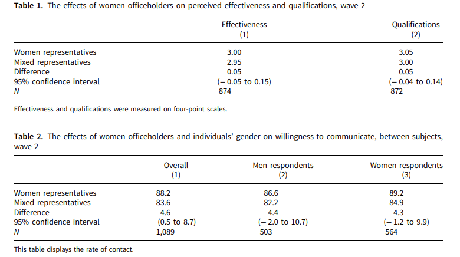
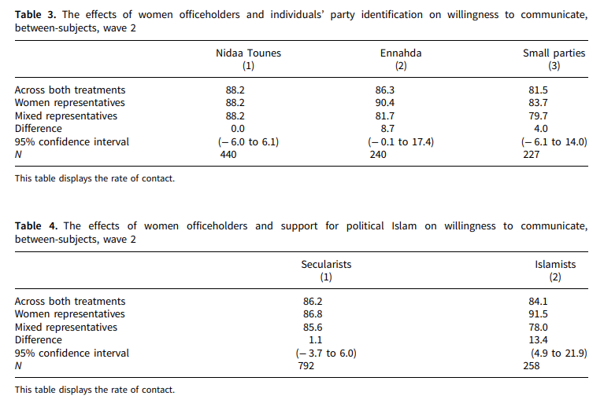
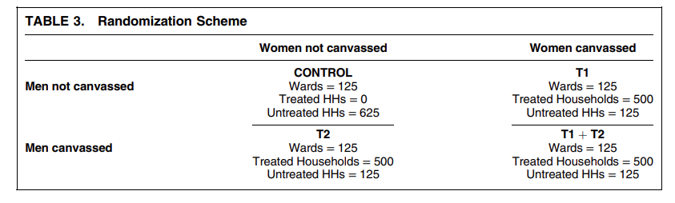
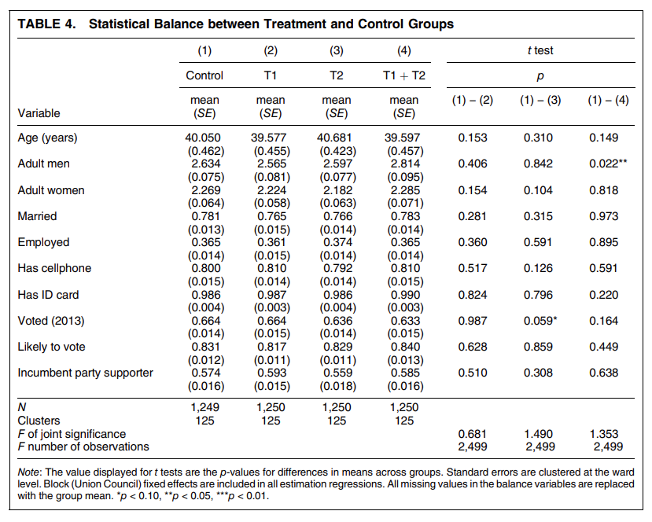
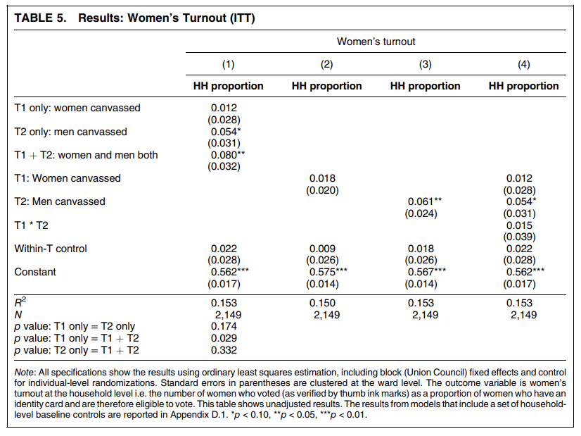

class: center, middle

```{css, echo=FALSE}
pre {
  max-height: 400px;
  overflow-y: auto;
}

pre[class] {
  max-height: 200px;
}
```

```{r, load_refs, include=FALSE, cache=FALSE}
# Initializes the bibliography
library(RefManageR)

library(ggplot2)
library(dplyr)
library(nlme)
library(jtools)

BibOptions(check.entries = FALSE,
           bib.style = "authoryear", # Bibliography style
           max.names = 3, # Max author names displayed in bibliography
           sorting = "nyt", #Name, year, title sorting
           cite.style = "authoryear", # citation style
           style = "markdown",
           hyperlink = FALSE,
           dashed = FALSE)
#myBib <- ReadBib("assets/myBib.bib", check = FALSE)
# Note: don't forget to clear the knitr cache to account for changes in the
# bibliography.

peruemotions <- read.csv("https://raw.githubusercontent.com/jnseawright/PS406/main/data/peruemotions.csv")
```
```{r xaringan-themer, include=FALSE, warning=FALSE}
library(xaringanthemer,MnSymbol)
style_mono_accent(
  base_color = "#1c5253",
  header_font_google = google_font("Josefin Sans"),
  text_font_google   = google_font("Montserrat", "300", "300i"),
  code_font_google   = google_font("Fira Mono"),
  text_font_size = "1.6rem"
)
```
---
### Business

-   Weekly lab assignments

-   Final research design

---
### Online Experiment

---
### Potential Outcomes

-   Let's build a model of one person participating in the experiment.

---
### Potential Outcomes

-   Suppose we name that person $i$.

-   The person we're interested in says 1 when in the control group, and
    0 when in the treatment group.

---
### Potential Outcomes

-   $y_{i,c} = 0$

-   $y_{i,t} = 1$

---
### The Potential Outcomes Framework

-   We are interested in the effects of a dichotomous treatment (i.e.,
    independent variable): whether person got the treatment (t) or the
    control (c).

-   This variable can be written as $W_{i} = (t,c)$.

---
### The Potential Outcomes Framework

-   For a given case, $i$, we either observe $W_{i} = t$ or $W_{i} = c$.
    If $W_{i} = t$, let us denote the value of the dependent variable as
    $y_{i,t}$. If $W_{i} = c$, let us denote the value of the dependent
    variable as $y_{i,c}$

---
### The Potential Outcomes Framework

-   The causal effect of $W$ on $y$ is:

    -   $y_{i,t} - y_{i,c}$

---
### The Average Treatment Effect

-   Sometimes, we are interested in developing an estimate of the effect
    of $W$ on $y$ in some population $\Pi$, from which we have a random
    sample (or even the whole population) split randomly into treatment
    and control cases.

-   Here, interest focuses on the "average treatment effect":

    -   $E(y_{i,t}) - E(y_{i,c})$

---
### Assignment Mechanisms

-   $\mathbb{W}$ has a probability distribution.

<!-- -->

-   $Pr(\mathbb{W} | \mathbb{X}, \mathbb{Y}_{0}, \mathbb{Y}_{1})$

$$p_{i}(\mathbb{X}, \mathbb{Y}_{0}, \mathbb{Y}_{1}) = \sum_{\mathbb{W}: W_{i} = 1} Pr(\mathbb{W} | \mathbb{X}, \mathbb{Y}_{0}, \mathbb{Y}_{1})$$

$\mathbb{W}$, $\mathbb{X}$, $\mathbb{Y}_{0}$, and $\mathbb{Y}_{1}$ take
on joint values that are drawn from some describable set of
possibilities.

---
### Individualistic Assignment

1.  There exists a function $q()$ that is bounded between 0 and 1, such
    that
    $p_{i}(\mathbb{X}, \mathbb{Y}_{0}, \mathbb{Y}_{1}) = q(X_{i}, Y_{0,i}, Y_{1,i})$

2.  $Pr(\mathbb{W} | \mathbb{X}, \mathbb{Y}_{0}, \mathbb{Y}_{1})$ is the
    product of those individual probabilities.

---
### Probabilistic Assignment

1.  For all permissible values of $\mathbb{X}$, $\mathbb{Y}_{0}$, and
    $\mathbb{Y}_{1}$,
    $0 < p_{i}(\mathbb{X}, \mathbb{Y}_{0}, \mathbb{Y}_{1}) < 1$.

---
### Unconfounded Assignment

1.  $Pr(\mathbb{W} | \mathbb{X}, \mathbb{Y}_{0}, \mathbb{Y}_{1}) = Pr(\mathbb{W} | \mathbb{X}, \mathbb{Y}^{'}_{0}, \mathbb{Y}^{'}_{1})$

---
### Experiments and Causal Inference

-   Under probabilistic and unconfounded assignment, the set of cases
    where $W_{i} = t$ produces a random sample from the population of
    $y_{t}$. Likewise, the set of cases where $W_{i} = c$ produces a
    random sample from the population of $y_{c}$. Thus:

    -   $E_{t}(y_{i,t}) = E(y_{i,t})$

    -   $E_{c}(y_{i,c}) = E(y_{i,c})$

    -   $E(y_{i,t}) - E(y_{i,c}) = E_{t}(y_{i,t}) - E_{c}(y_{i,c})$

---

```{r, echo = TRUE, out.width="100%", fig.retina = 1}
mean(peruemotions$outsidervote[peruemotions$simpletreat==1])

mean(peruemotions$outsidervote[peruemotions$simpletreat==0])

mean(peruemotions$outsidervote[peruemotions$simpletreat==1]) - mean(peruemotions$outsidervote[peruemotions$simpletreat==0])
```

---
```{r, echo = TRUE, out.width="100%", fig.retina = 1}
summ(lm(outsidervote ~ simpletreat, data=peruemotions))

```

---
### Randomization Inference

-   It is clearly important to test the null hypothesis that
    $E(y_{i,t}) = E(y_{i,c})$ for all $i$.

-   If this hypothesis is true, then every case's treatment assignment
    is unrelated to its outcome.

-   Thus, under the null hypothesis, it is fine for us to reassign
    treatment at random --- the outcome won't change.

---
### Randomization Inference

-   Randomization inference involves:

    1.  Randomly reordering the treatment condition vector

    2.  Calculating the difference between the treatment and control
        group for the new (artificial) treatment condition vector

    3.  Storing the result somewhere

    4.  Repeating the whole process hundreds or thousands of times.

---
### Randomization Inference

-   If the null hypothesis is true, then the distribution of simulated
    differences in means is the sampling distribution from which the
    real difference in means was drawn.

-   Therefore, a good $P$ value for our observed difference in means is
    the proportion of simulated differences in means that are at least
    as far from 0 as the real number.

---
### Assumptions

When analyzing an experiment using randomization inference, we do *not*
need to assume that:

-   we know and can measure all (or even any!) of the confounding
    variables for the relationship of interest.

-   causal effects are additive or linear.

-   causal effects are constant across cases.

-   errors are normally distributed or heteroskedastic.

---
### Assumptions

When analyzing an experiment using randomization inference, we *do* need
to assume that:

-   SUTVA (stable unit treatment value assumption) holds.

-   Experimental/psychological realism holds.

---
```{r, echo = TRUE, out.width="100%", fig.retina = 1}
library(ri2)

emotions_declaration <- declare_ra(N = 450, m = 151)

emotions_table <- data_frame(Z = peruemotions$simpletreat,
                             Y = peruemotions$outsidervote)

ri2_emotionsresult <- conduct_ri(
  formula = Y ~ Z,
  declaration = emotions_declaration,
  sharp_hypothesis = 0,
  data = emotions_table
)
```

---
```{r, echo = TRUE, out.width="100%", fig.retina = 1}
ri2_emotionsresult
```

---
### Balance Testing

---
```{r, echo = TRUE, out.width="100%", fig.retina = 1}

library(cobalt)
peruemotionscovs <- subset(peruemotions, select = c(Cuzco, age))
bal.tab(peruemotionscovs, treat=peruemotions$simpletreat, 
        thresholds = c(m = .1, v = 2))
```
---
### Encouragement Designs

---
### Regression in Experiments

Recall that $W_{i}$ as an indicator of treatment assignment in an
experiment. Let's change the coding, such that $W_{i}$ equals 1 for
treatment cases and 0 for control cases. Then we can write:

$$Y_{i} = W_{i} Y_{i,t} + (1 - W_{i}) Y_{i,c}$$

$$Y_{i} = Y_{i,c} + W_{i} (Y_{i,t} - Y_{i,c})$$

---
### Regression in Experiments

$$Y_{i} = \bar{Y}_{i,c} + W_{i} (\bar{Y}_{i,t} - \bar{Y}_{i,c}) +$$ 
$$[Y_{i,c} - \bar{Y}_{i,c} + W_{i} (Y_{i,t} - \bar{Y}_{i,t} - Y_{i,c} + \bar{Y}_{i,c})]$$

---
### Regression in Experiments

Suppose we use OLS to estimate:

$$Y_{i} = \beta_{0} + \beta_{1} W_{i} + \epsilon_{i}$$

Will this work?

---
### Regression in Experiments

$$\hat{\beta}_{1} = \frac{cov(W, Y)}{var(W)} = \frac{\sum(W - \bar{W})(Y - \bar{Y})}{\sum(W - \bar{W})^2}$$

Let $\pi$ equal the proportion of cases assigned to the treatment group.

$$\hat{\beta}_{1} = \frac{\sum(W - \pi)(Y - \bar{Y})}{N \pi (1 - \pi)}$$

---
### Regression in Experiments

$$\hat{\beta}_{1} = \frac{\sum_{W: W_{i} = 1}(1 - \pi)(Y - \bar{Y}) - \sum_{W: W_{i} = 0}\pi (Y - \bar{Y})}{N \pi (1 - \pi)}$$

$$\hat{\beta}_{1} = \frac{\Sigma_{W: W_{i} = 1} (Y_{i} - E(Y_{i}))}{N \pi} - \frac{\Sigma_{W: W_{i} = 0}(Y_{i} - E(Y_{i}))}{N (1 - \pi)}$$

---
### Regression in Experiments

$N \pi$ is just the number of cases where $W_{i} = 1$, and $N (1 - \pi)$
is the number of cases where $W_{i} = 0$. So the last expression
simplifies to:

$$\hat{\beta}_{1} = \frac{\Sigma_{W: W_{i} = 1} Y_{i}}{N \pi} - \frac{\Sigma_{W: W_{i} = 0}Y_{i}}{N (1 - \pi)}$$

$$\hat{\beta}_{1} = \bar{Y}_{i, W_{i} = 1} - \bar{Y}_{i, W_{i} = 0}$$

---
### Regression in Experiments

Multivariate regression for experiments is *not* guaranteed to be
unbiased in the way that bivariate regression is. Multivariate
regression can be (even very badly) biased if:

1.  Some control variable included in the model is caused by the
    treatment, or

2.  The causal effect of interest is very heterogeneous across cases and
    the total number of cases is small
    
---
```{r, echo = TRUE, out.width="100%", fig.retina = 1}
summary(lm(outsidervote ~ simpletreat, data=peruemotions))

```

---
```{r, echo = TRUE, out.width="90%", fig.retina = 1}
summary(lm(outsidervote ~ simpletreat + risk, data=peruemotions))

```
---
### Causal Mediation

Suppose we want to know the causal steps by which treatment affects $Y$.

Let $M$ be a hypothesized mediator, i.e., a variable caused by treatment
that causes $Y$. Because $M$ is affected by $W$, $M$ is a sort of
dependent variable. Let us denote two potential outcomes: $M_{i,t}$ and
$M_{i,c}$.

$Y$ depends on $W$ and $M$, so there are now four potential outcomes on
$Y$: $Y_{i}(t,M_{i,t})$, $Y_{i}(t,M_{i,c})$, $Y_{i}(c,M_{i,t})$, and
$Y_{i}(c,M_{i,c})$

---
### Causal Mediation

The two causal mediation effects for each case are:

$$\begin{aligned}
\delta_{i,t} = Y_{i}(t,M_{i,t}) - Y_{i}(t,M_{i,c})\end{aligned}$$

$$\begin{aligned}
\delta_{i,c} = Y_{i}(c,M_{i,t}) - Y_{i}(c,M_{i,c})\end{aligned}$$

---
### Causal Mediation

To make inferences, we need the assumptions:

$$\begin{aligned}
Y_{i}(t,M_{i,t}) \perp\!\!\!\perp W_{i} | X_{i} = x\end{aligned}$$

$$\begin{aligned}
M_{i,t} \perp\!\!\!\perp W_{i} | X_{i} = x\end{aligned}$$

$$\begin{aligned}
Y_{i}(t^{'},m) \perp\!\!\!\perp M_{i,t} | (W_{i} = t, X_{i} = x) \end{aligned}$$

---
```{r, echo = TRUE, out.width="100%", fig.retina = 1}
library(mediation)
```

---
```{r, echo = TRUE, out.width="100%", fig.retina = 1}
peruemotionsmed <- with(peruemotions, na.omit(data.frame(risk=risk,
                                                       outsidervote = outsidervote,
                                                       simpletreat=simpletreat,
                                                       Cuzco=Cuzco,
                                                       age=age)))

perumed.lm1 <- lm(risk ~ simpletreat, data=peruemotionsmed)
perumed.lm2 <- lm(outsidervote ~ risk + simpletreat + Cuzco + age, data=peruemotionsmed)
perumed.out <- mediate(perumed.lm1, perumed.lm2, treat="simpletreat", mediator = "risk")

```

---
```{r, echo = TRUE, out.width="100%", fig.retina = 1}
summary(perumed.out)
```
---
```{r, echo = TRUE, out.width="70%", fig.retina = 1}
plot(perumed.out)
```

---
```{r, echo = TRUE, out.width="65%", fig.retina = 1}
perumedsens.out <- medsens(perumed.out, rho.by = 0.1, effect.type = "indirect", sims = 100)

plot(perumedsens.out)
```

---
### Heterogeneity

---
```{r, echo = TRUE, out.width="50%", fig.retina = 1}
summary(lm(outsidervote ~ simpletreat + Cuzco + simpletreat:Cuzco + age + simpletreat:age, data=peruemotions))

```

---
### Population Inference

-   Unrepresentative samples

-   Let $Z_{i}$ be a dichotomous variable that represents whether a case
    is in the experimental sample

---
### Population Inference

Assume:

$$\begin{aligned}
f(Y_{i,1} - Y_{i,0} | Z_{i}, X_{i}) = f(Y_{i,1} - Y_{i,0} | X_{i})\end{aligned}$$

---
### Population Inference

Assume, for all possible $X^{*}$:

$$\begin{aligned}
P(Z_{i} = 1 | X_{i} = X^{*}) > 0\end{aligned}$$

---
### Population Inference

O'Muircheartaigh and Hedges propose:

1.  Let $\mathbf{x}$ be the collection of all observed combination of
    values $X^{*}$.

2.  Let $T(x)$ be the sample average of $Y_{i,1} - Y_{i,0}$ across all
    $i$ such that $X_{i} = x$.

3.  Let $p(x)$ be the proportion of the population with $X_{i} = x$.

---
### Population Inference

O'Muircheartaigh and Hedges propose:

4.  $PATE \approx \sum_{x \in \mathbf{x}}(p(x) T(x))$

---
```{r, echo = TRUE, out.width="100%", fig.retina = 1}
library(devtools)
#devtools::install_github('benjamin-ackerman/generalize')
library(generalize)
?assess
```

---
```{r, echo = TRUE, out.width="100%", fig.retina = 1}
?generalize
```

---
```{r, echo = FALSE, out.width="90%", fig.retina = 1}
library(knitr)

```

---
```{r, echo = FALSE, out.width="100%", fig.retina = 1}

```

---
```{r, echo = FALSE, out.width="100%", fig.retina = 1}

```

---
```{r, echo = FALSE, out.width="100%", fig.retina = 1}

```

---
```{r, echo = FALSE, out.width="100%", fig.retina = 1}

```

---
```{r, echo = FALSE, out.width="100%", fig.retina = 1}

```

---
```{r, echo = FALSE, out.width="100%", fig.retina = 1}

```