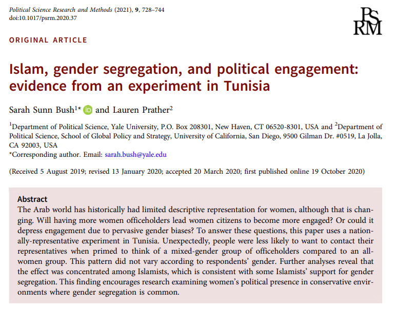
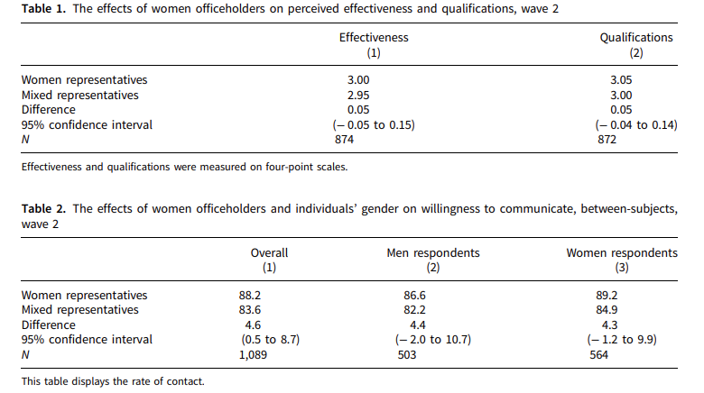
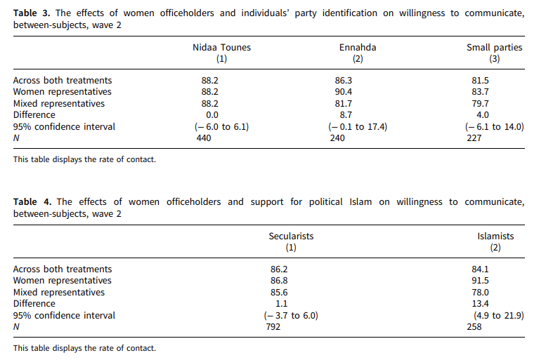
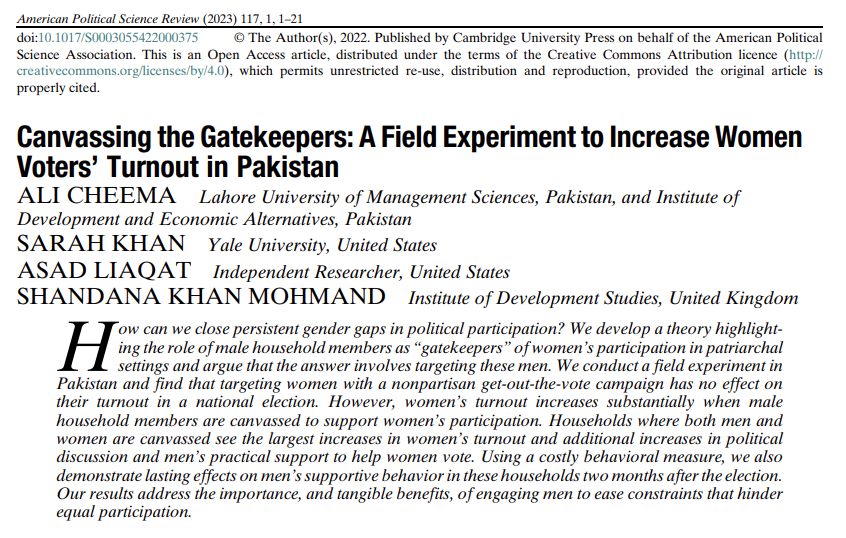
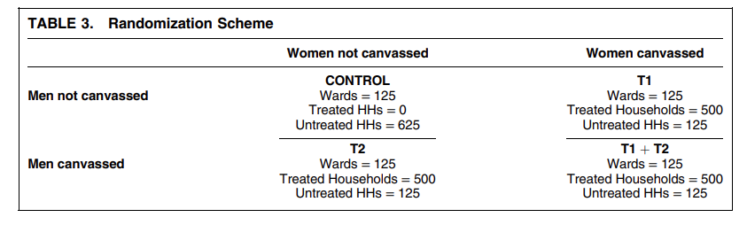
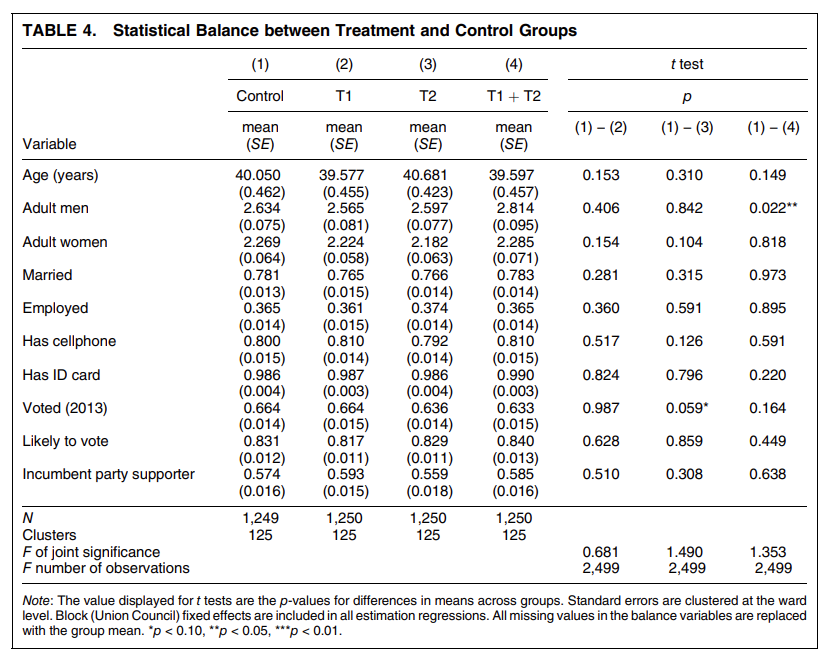
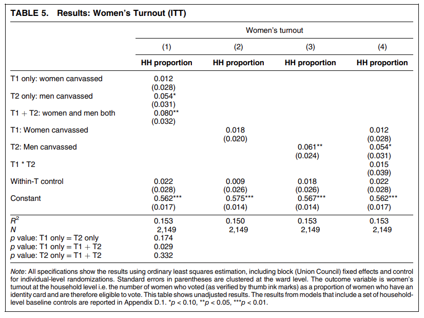

class: center, middle

```{css, echo=FALSE}
pre {
  max-height: 400px;
  overflow-y: auto;
}

pre[class] {
  max-height: 200px;
}
```

```{r, load_refs, include=FALSE, cache=FALSE}
# Initializes the bibliography
library(RefManageR)

library(ggplot2)
library(dplyr)
library(nlme)
library(jtools)

BibOptions(check.entries = FALSE,
           bib.style = "authoryear", # Bibliography style
           max.names = 3, # Max author names displayed in bibliography
           sorting = "nyt", #Name, year, title sorting
           cite.style = "authoryear", # citation style
           style = "markdown",
           hyperlink = FALSE,
           dashed = FALSE)
#myBib <- ReadBib("assets/myBib.bib", check = FALSE)
# Note: don't forget to clear the knitr cache to account for changes in the
# bibliography.

peruemotions <- read.csv("https://raw.githubusercontent.com/jnseawright/PS406/main/data/peruemotions.csv")

knitr::opts_chunk$set(warning = FALSE, message = FALSE)

```
```{r xaringan-themer, include=FALSE, warning=FALSE}
library(xaringanthemer,MnSymbol)
style_mono_accent(
  base_color = "#1c5253",
  header_font_google = google_font("Josefin Sans"),
  text_font_google   = google_font("Montserrat", "300", "300i"),
  code_font_google   = google_font("Fira Mono"),
  text_font_size = "1.6rem"
)
```

---
### Business

-   Presenting an estimator

-   Weekly lab assignments

-   Final grant proposal

---
### What makes an experiment work?

---
### Potential Outcomes

-   Let's build a mathematical model of one person participating in an experiment.

---
### Potential Outcomes

-   Suppose we name that person $i$.

-   The person we're interested in has an outcome of 1 when in the control group, and
    0 when in the treatment group.

---
### Potential Outcomes

-   $y_{i,c} = 0$

-   $y_{i,t} = 1$

---
### The Potential Outcomes Framework

-   We are interested in the effects of a dichotomous treatment (i.e.,
    independent variable): whether person got the treatment (t) or the
    control (c).

-   This variable can be written as $W_{i} = (t,c)$.

---
### The Potential Outcomes Framework

-   For a given case, $i$, we either observe $W_{i} = t$ or $W_{i} = c$.
    If $W_{i} = t$, let us denote the value of the dependent variable as
    $y_{i,t}$. If $W_{i} = c$, let us denote the value of the dependent
    variable as $y_{i,c}$

---
### The Potential Outcomes Framework

-   The causal effect of $W$ on $y$ is:

    -   $y_{i,t} - y_{i,c}$
    
    For hypothetical person $i$ above, this effect is $1 - 0 = 1$.

---
### The Average Treatment Effect

-   Sometimes, we are interested in developing an estimate of the effect
    of $W$ on $y$ in some population $\Pi$, from which we have a random
    sample (or even the whole population) split randomly into treatment
    and control cases.

-   Here, interest focuses on the "average treatment effect":

    -   $E(y_{i,t}) - E(y_{i,c})$

---
### The Average Treatment Effect

What helps us estimate the average treatment effect well?

---
### Assignment Mechanisms

- The **assignment mechanism** is the probability distribution that determines who gets treatment.
- Formally:  
  $$Pr(\mathbf{W} \mid \mathbf{X}, \mathbf{Y}_0, \mathbf{Y}_1)$$
  where  
  - $\mathbf{W}$ = vector of treatment assignments,  
  - $\mathbf{X}$ = covariates,  
  - $\mathbf{Y}_0, \mathbf{Y}_1$ = vectors of potential outcomes.

---

- Three key properties make an assignment mechanism **ideal** for causal inference.

---
### 1. Individualistic Assignment

**Definition**:  
There exists a function $q(\cdot)$ bounded between 0 and 1 such that  
$$p_i(\mathbf{X}, \mathbf{Y}_0, \mathbf{Y}_1) = q(X_i, Y_{0,i}, Y_{1,i})$$  
and the joint probability of $\mathbf{W}$ is the product of these individual probabilities.

---

**In words**:  
Each unit’s chance of treatment depends **only on its own** covariates and potential outcomes, **not** on those of other units. Assignments are independent across units.

---

**Example – coin flip**:  
- For each person $i$, flip a fair coin.  
- $q(X_i, Y_{0,i}, Y_{1,i}) = 0.5$ for everyone (same for all $i$).  
- Assignments are independent because each coin flip ignores everyone else.

---
### 2. Probabilistic Assignment

**Definition**:  
For all permissible values of $\mathbf{X}, \mathbf{Y}_0, \mathbf{Y}_1$,  
$$0 < p_i(\mathbf{X}, \mathbf{Y}_0, \mathbf{Y}_1) < 1$$

---

**In words**:  
Every unit has a **strictly positive but not certain** chance of receiving treatment **and** of receiving control. No one is forced into either condition.

---

**Simple example**:  
- Fair coin: $p_i = 0.5$ (satisfies $0 < 0.5 < 1$).  
- Unfair coin: $p_i = 0.9$ still satisfies $0 < 0.9 < 1$.  
- Deterministic assignment (e.g., all grad students get treatment) would violate this because some units have $p_i = 0$ or $1$.

---
### 3. Unconfounded Assignment

**Definition**:  
$$Pr(\mathbf{W} \mid \mathbf{X}, \mathbf{Y}_0, \mathbf{Y}_1) = Pr(\mathbf{W} \mid \mathbf{X}, \mathbf{Y}'_0, \mathbf{Y}'_1)$$  
for any vectors $\mathbf{Y}'_0, \mathbf{Y}'_1$.

---

**In words**:  
Given the covariates $\mathbf{X}$, the assignment mechanism does **not** depend on the potential outcomes. It is “ignorable” once we condition on $\mathbf{X}$.

---

**Simple example**:  
- Fair coin flip: assignment depends only on the coin, **not** on whether $Y_{i,1} - Y_{i,0}$ is large or small.  
- Confounded assignment: if we somehow gave treatment to those who would benefit most (based on their $Y_1$), then assignment would depend on potential outcomes – **not** allowed.

---
### Putting It All Together: A Tiny Simulation

A simple randomized experiment satisfies all three properties:
- Individualistic (each person’s coin flip is independent).
- Probabilistic (everyone has chance $p$ between 0 and 1).
- Unconfounded (the coin does not look at potential outcomes).

Let’s see this in action with a small R simulation:

---

```{r, echo = TRUE, eval = TRUE}
set.seed(123)
n <- 1000
# Generate potential outcomes (correlated)
Y0 <- rnorm(n, mean = 0, sd = 1)
Y1 <- Y0 + 0.5  # constant treatment effect = 0.5

# Individualistic, probabilistic, unconfounded assignment: fair coin
W <- rbinom(n, 1, 0.5)

# Observed outcome
Y_obs <- ifelse(W == 1, Y1, Y0)

# Difference in means
ATE_hat <- mean(Y_obs[W == 1]) - mean(Y_obs[W == 0])
ATE_hat
# True ATE = 0.5; our estimate should be close (sampling error)
```

---

**Key takeaway**: Because the assignment mechanism has these three properties, the simple difference in means is an unbiased estimator of the average treatment effect.

---
### Why These Properties Matter for Experiments

When assignment is **individualistic**, **probabilistic**, and **unconfounded**:

- The treatment group is a random sample of the $Y_1$ distribution.
- The control group is a random sample of the $Y_0$ distribution.
- Therefore:  
  $$\small E[Y_i \mid W_i = 1] = E[Y_{i,1}], \quad E[Y_i \mid W_i = 0] = E[Y_{i,0}]$$  
  and the difference in sample means estimates the ATE without bias.

In the next slides, we’ll see how these ideas translate into the analysis of real experiments.

---
### Experiments and Causal Inference

-   Under individualistic, probabilistic, and unconfounded assignment, the set of cases
    where $W_{i} = t$ produces a random sample from the population of
    $y_{t}$. Likewise, the set of cases where $W_{i} = c$ produces a
    random sample from the population of $y_{c}$. Thus:

    -   $E_{t}(y_{i,t}) = E(y_{i,t})$

    -   $E_{c}(y_{i,c}) = E(y_{i,c})$

    -   $E(y_{i,t}) - E(y_{i,c}) = E_{t}(y_{i,t}) - E_{c}(y_{i,c})$

---

```{r, echo = TRUE, out.width="100%", fig.retina = 1}
mean(peruemotions$outsidervote[peruemotions$simpletreat==1])

mean(peruemotions$outsidervote[peruemotions$simpletreat==0])

mean(peruemotions$outsidervote[peruemotions$simpletreat==1]) - mean(peruemotions$outsidervote[peruemotions$simpletreat==0])
```

---
```{r, echo = TRUE, out.width="100%", fig.retina = 1}
summ(lm(outsidervote ~ simpletreat, data=peruemotions))

```

---
### Assumptions

What do we need to assume in order to get a causal inference here?

---
### Assumptions

When analyzing an experiment using randomization inference, we do *not*
need to assume that:

-   we know and can measure all (or even any!) of the confounding
    variables for the relationship of interest.

-   causal effects are additive or linear.

-   causal effects are constant across cases.

-   errors are normally distributed or heteroskedastic.

---
### Assumptions

When analyzing an experiment using randomization inference, we *do* need
to assume that:

-   SUTVA (stable unit treatment value assumption) holds.

-   Experimental/psychological realism holds.

---
### SUTVA: Stable Unit Treatment Value Assumption

**Definition**:  
SUTVA consists of two key components:

1. **No interference**: One unit's treatment assignment does not affect another unit's outcomes.
2. **No hidden variations of treatment**: The treatment is the same for all treated units; there are no hidden versions of treatment that might produce different effects.

Formally:
$$Y_i(W_i, \mathbf{W}_{-i}) = Y_i(W_i)$$
where $\mathbf{W}_{-i}$ represents the treatment assignments of all other units.

---
### SUTVA in Plain Language

**No interference** means:
- My outcome depends only on whether *I* got the treatment, not on whether my neighbor, coworker, or friend got it.
- Example violation: In a voter mobilization experiment, if I get a GOTV mailer and my spouse does not, we might discuss it – affecting their turnout even though they were in the control group.

---
### SUTVA in Plain Language

**No hidden variations** means:
- "Treatment" means the same thing for everyone who receives it.
- Example violation: In a job training program, some trainers are excellent and others are terrible – the "treatment" varies in quality across units, potentially causing different effects.

---
### Why SUTVA Matters for Experiments

If SUTVA is violated:

- The potential outcomes framework breaks down – we can no longer define a unique $Y_{i,t}$ and $Y_{i,c}$ for each unit.
- Treatment and control groups may not be comparable even with perfect randomization.
- Estimated effects may be biased or uninterpretable.

---

**In experiments, we typically *design* for SUTVA**:
- Keep units isolated from each other (e.g., no communication between subjects).
- Standardize treatment delivery (same script, same materials, same protocol).

---
### Experimental Realism

**Definition**:  
The extent to which the treatment in an experiment **actually engages the attention and participation of the subjects** it is meant to represent.

Also related to **psychological realism** (which adds the criterion that decisions need to be taken using the same psychological rules and processes as in the relevant real world situations) or **mundane realism** (which adds an idea of the situation generally feeling realistic).

---
### Realism

**Key question**: Does the experience of treatment in the lab correspond to how the theoretically meaningful parts of how the intervention would be experienced in the real world?

---
### Experimental Realism vs. Internal Validity

- A study can have high internal validity (clean randomization, no confounding) but low experimental realism.
- Example: Showing participants a 2‑minute video clip of a political ad to study persuasion effects.
  - **Internal validity**: High – random assignment, controlled setting.
  - **Experimental realism**: Questionable – In the real world, people watch ads while distracted, with friends, during commercial breaks, etc.

---
### Why Realism Matters

If realism is low:

- The treatment may not engage the same psychological processes as the real intervention.
- Effect sizes may be attenuated or inflated compared to real‑world settings.
- Policy recommendations based on lab findings may fail when implemented.

---

**Example**: A lab study on voter mobilization finds that showing people a 5‑minute video about civic duty increases turnout by 10 percentage points. But in the real world, people don't watch such videos – they get mailers, phone calls, or door knocks. The lab treatment lacks realism, so the effect may not generalize.

---
### Assessing Realism in Your Study

Ask these questions:

1\. **Is the treatment delivered in a way that resembles real‑world exposure?**
   - Same medium? Same duration? Same context?

2\. **Do participants perceive the treatment as intended?**
   - Manipulation checks can help assess this.

---
### Assessing Realism in Your Study


3\. **Are there artificial constraints that don't exist in the real world?**
   - Forced attention, no distractions, immediate outcome measurement.

4\. **Would the real‑world version of this treatment include additional components?**
   - In the Peruvian study: Does watching emotion‑inducing videos in a lab capture how emotions from real political events affect voting?

---
### Practical Tips for Enhancing Realism

- Use realistic materials (actual news clips, real campaign mailers).
- Create naturalistic settings (online studies, field experiments).
- Allow for distraction or delay (don't measure outcomes immediately).
- Consider **field experiments** as the gold standard for realism.
- Acknowledge limitations and discuss how they might affect generalizability.

---
### Randomization Inference

-   It is clearly important to test the null hypothesis that
    $E(y_{i,t}) = E(y_{i,c})$ for all $i$.

-   If this hypothesis is true, then every case's treatment assignment
    is unrelated to its outcome.

-   Thus, under the null hypothesis, it is fine for us to reassign
    treatment at random --- the outcome won't change.

---
### Randomization Inference

-   Randomization inference involves:

    1.  Randomly reordering the treatment condition vector

    2.  Calculating the difference between the treatment and control
        group for the new (artificial) treatment condition vector

    3.  Storing the result somewhere

    4.  Repeating the whole process hundreds or thousands of times.

---
### Randomization Inference

-   If the null hypothesis is true, then the distribution of simulated
    differences in means is the sampling distribution from which the
    real difference in means was drawn.

-   Therefore, a good $P$ value for our observed difference in means is
    the proportion of simulated differences in means that are at least
    as far from 0 as the real number.


---
```{r, echo = TRUE, out.width="100%", fig.retina = 1}
library(ri2)

emotions_declaration <- declare_ra(N = 450, m = 151)

emotions_table <- data.frame(Z = peruemotions$simpletreat,
                             Y = peruemotions$outsidervote)
```

---
```{r, echo = TRUE, out.width="100%", fig.retina = 1}
ri2_emotionsresult <- conduct_ri(
  formula = Y ~ Z,
  declaration = emotions_declaration,
  sharp_hypothesis = 0,
  data = emotions_table
)
```

---
```{r, echo = TRUE, out.width="100%", fig.retina = 1}
ri2_emotionsresult
```

---
### Balance Testing

A balance test is an analysis of the degree to which the distribution of side variables across treatment groups is near its expectation. It is a potentially useful test of the hypothesis that randomization has balanced variables across groups.

---
```{r, echo = TRUE, out.width="100%", fig.retina = 1}

library(cobalt)
peruemotionscovs <- subset(peruemotions, select = c(Cuzco, age))
bal.tab(peruemotionscovs, treat=peruemotions$simpletreat, 
        thresholds = c(m = .1, v = 2))
```


---
### Causal Mediation

Suppose we want to know the causal steps by which treatment affects $Y$.

Let $M$ be a hypothesized mediator, i.e., a variable caused by treatment
that causes $Y$. Because $M$ is affected by $W$, $M$ is a sort of
dependent variable. Let us denote two potential outcomes: $M_{i,t}$ and
$M_{i,c}$.

$Y$ depends on $W$ and $M$, so there are now four potential outcomes on
$Y$: $Y_{i}(t,M_{i,t})$, $Y_{i}(t,M_{i,c})$, $Y_{i}(c,M_{i,t})$, and
$Y_{i}(c,M_{i,c})$

---
### Causal Mediation

The two causal mediation effects for each case are:

$$\begin{aligned}
\delta_{i,t} = Y_{i}(t,M_{i,t}) - Y_{i}(t,M_{i,c})\end{aligned}$$

$$\begin{aligned}
\delta_{i,c} = Y_{i}(c,M_{i,t}) - Y_{i}(c,M_{i,c})\end{aligned}$$

---
### Causal Mediation: What Must We Assume?

- In an experiment, the treatment $W$ is randomly assigned, so its effect on the mediator $M$ and outcome $Y$ is unconfounded **given** $W$ alone.
- But the mediator $M$ is **not** randomly assigned – it is chosen by units in response to treatment.
- To interpret the mediation effects $\delta_{i,t}$ and $\delta_{i,c}$ as causal, we need additional assumptions.

These assumptions are often called **sequential ignorability** (Imai et al. 2010).

---
### A Causal Diagram (DAG) for Mediation

```{r, echo = FALSE, fig.width = 6, fig.height = 4, out.width = "70%"}
library(ggdag)
library(ggplot2)

dag <- dagify(
  Y ~ W + M,
  M ~ W,
  coords = list(x = c(W = 1, M = 2, Y = 3),
                y = c(W = 2, M = 1, Y = 2))
)

ggdag(dag) + theme_dag()
```

---

- $W$ (treatment) → $M$ (mediator) → $Y$ (outcome)
- $W$ also has a **direct effect** on $Y$ (the dashed arrow).
- The DAG implicitly assumes **no unmeasured confounders** of the $M \rightarrow Y$ relationship and no $W \leftarrow U \rightarrow M$ or $W \leftarrow U \rightarrow Y$ (already satisfied by randomization).

---
### Assumption 1: No Unmeasured Confounding of Treatment → Outcome

$$\begin{aligned}
Y_{i}(t,M_{i,t}) \perp\!\!\!\perp W_{i} \mid X_{i}
\end{aligned}$$

---

**In words**:  
Given covariates $X_i$, the potential outcome under treatment (with the mediator set to either its treatment or its control value) is independent of actual treatment assignment.

- Because $W$ is randomized (or unconfounded given $X$), this holds automatically if $X$ includes everything needed for unconfoundedness.
- In our example: we assume that `Cuzco` and `age` are sufficient to make treatment unconfounded with `outsidervote` (though randomization already does this).

---
### Assumption 2: No Unmeasured Confounding of Treatment → Mediator

$$\begin{aligned}
M_{i,t} \perp\!\!\!\perp W_{i} \mid X_{i}
\end{aligned}$$

---

**In words**:  
Given covariates, the potential mediator outcomes under treatment or control are independent of actual treatment.

- Again, randomization (or unconfoundedness given $X$) guarantees this.
- In the Peruvian study: `simpletreat` is randomized, so it is independent of `risk` (the mediator) under the null; we only need $X$ if randomization was conditional.

---
### Assumption 3: No Unmeasured Confounding of Mediator → Outcome

$$\begin{aligned}
Y_{i}(t',m) \perp\!\!\!\perp M_{i,t} \mid (W_{i} = t, X_{i} = x)
\end{aligned}$$

---

**In words**:  
Among units that received a particular treatment level $t$, the potential outcome (for any treatment $t'$ and mediator value $m$) is independent of the actual mediator value, **given covariates**.

---

- This is the **strongest** assumption. It says there is no unmeasured variable that affects both the mediator and the outcome **after** treatment is assigned.
- In the DAG, this means no arrow from an unmeasured $U$ into both $M$ and $Y$.
- In the Peruvian example: we must believe that, among those who got the treatment (or control), their `risk` level is not correlated with `outsidervote` due to some omitted variable (e.g., personality, news exposure) – after adjusting for `Cuzco` and `age`.

---
### What Does This Mean in Practice?

- The first two assumptions are usually plausible if treatment is randomized.
- The third assumption is **untestable** from data alone. It requires subject‑matter knowledge.
- The `mediation` package in R performs sensitivity analysis to assess how Violations of Assumption 3 might affect conclusions.
- In the next slides, we’ll run the mediation analysis and then examine sensitivity.

---
### Connecting to the Peruvian Emotions Data

- Treatment $W$ = `simpletreat` (randomized)
- Mediator $M$ = `risk` (attitudes toward risk)
- Outcome $Y$ = `outsidervote` (voting for an outsider party)
- Covariates $X$ = `Cuzco` (region) and `age`

---

We assume:

1. Random assignment ensures $W$ is independent of potential outcomes and potential mediators given $X$.
2. No unmeasured confounders of the mediator–outcome relationship after conditioning on $W$ and $X$ (e.g., no omitted variable like ideology that affects both risk attitudes and outsider voting).

Let’s proceed with the analysis.

---
```{r, echo = TRUE, out.width="100%", fig.retina = 1}
library(mediation)
```

---
```{r, echo = TRUE, out.width="100%", fig.retina = 1}
peruemotionsmed <- with(peruemotions, na.omit(data.frame(risk=risk,
                                                       outsidervote = outsidervote,
                                                       simpletreat=simpletreat,
                                                       Cuzco=Cuzco,
                                                       age=age)))

perumed.lm1 <- lm(risk ~ simpletreat, data=peruemotionsmed)
perumed.lm2 <- lm(outsidervote ~ risk + simpletreat + Cuzco + age, data=peruemotionsmed)
perumed.out <- mediate(perumed.lm1, perumed.lm2, treat="simpletreat", mediator = "risk")

```

---
```{r, echo = TRUE, out.width="100%", fig.retina = 1}
summary(perumed.out)
```
---
```{r, echo = TRUE, out.width="70%", fig.retina = 1}
plot(perumed.out)
```

---
```{r, echo = TRUE, out.width="65%", fig.retina = 1}
perumedsens.out <- medsens(perumed.out, rho.by = 0.1, effect.type = "indirect", sims = 100)
```

---
```{r, echo = TRUE, out.width="65%", fig.retina = 1}
plot(perumedsens.out)
```


---
### Approaches to Exploring Heterogeneity

| Method | Strengths | Weaknesses |
|--------|-----------|------------|
| **Interactions** (linear) | Simple, interpretable | Assumes linearity, limited to a few variables |
| **Subgroup analysis** | Transparent, policy‑relevant | Multiple testing issues, low power |
| **Non‑parametric smoothing** | Flexible, visual | Hard to quantify uncertainty |

---
### Approaches to Exploring Heterogeneity

| Method | Strengths | Weaknesses |
|--------|-----------|------------|
| **Machine learning (CATE)** | Handles many variables, detects complex patterns | "Black box", requires large samples |
| **Generic machine learning (Causal Forests, BART)** | Built‑in inference, variable importance | Computationally intensive |

---
### Revisiting the Linear Interaction Model

```{r, echo = TRUE, out.width = "100%"}
# Original interaction model from the slide
summary(lm(outsidervote ~ simpletreat + Cuzco + simpletreat:Cuzco + 
           age + simpletreat:age, data = peruemotions))
```

---

- This model assumes that treatment effect heterogeneity is **linear** in age and constant within Cuzco strata.
- It's a good **start**, but may miss non‑linearities (e.g., effect only for young *and* old, not middle‑aged).

---
### Visualising Heterogeneity: Scatterplot Smoothing

```{r, echo = TRUE, fig.width = 8, fig.height = 5, out.width = "100%"}
# Create treatment and control subsets
treated <- peruemotions[peruemotions$simpletreat == 1, ]
control <- peruemotions[peruemotions$simpletreat == 0, ]

# Plot smoothed outcomes by age for each group
library(ggplot2)
scattersmooth <- ggplot(peruemotions, aes(x = age, y = outsidervote, color = factor(simpletreat))) +
  geom_smooth(method = "loess", se = TRUE) +
  labs(color = "Treatment", 
       title = "Outcome by Age and Treatment Status",
       x = "Age", y = "Outsider Vote") +
  theme_minimal()
```

---

```{r, echo = FALSE, fig.width = 8, fig.height = 5, out.width = "100%"}
scattersmooth
```

---

- This plot shows how the relationship between age and voting differs between treatment and control.
- The **vertical distance** between the two curves at each age is the estimated treatment effect for that age.

---
### Extracting and Plotting the Treatment Effect by Age

```{r, echo = TRUE, fig.width = 8, fig.height = 5, out.width = "100%"}
# Fit separate loess models and predict at a grid of ages
age_grid <- seq(min(peruemotions$age, na.rm = TRUE), 
                max(peruemotions$age, na.rm = TRUE), length.out = 100)

loess_treated <- loess(outsidervote ~ age, data = treated)
loess_control <- loess(outsidervote ~ age, data = control)

pred_treated <- predict(loess_treated, newdata = data.frame(age = age_grid))
pred_control <- predict(loess_control, newdata = data.frame(age = age_grid))

effect <- pred_treated - pred_control
effect_df <- data.frame(age = age_grid, effect = effect)

ageeffect <- ggplot(effect_df, aes(x = age, y = effect)) +
  geom_line(color = "darkred", linewidth = 1.2) +
  geom_hline(yintercept = 0, linetype = "dashed") +
  labs(title = "Estimated Treatment Effect by Age (Loess)",
       x = "Age", y = "Treatment Effect on Outsider Vote") +
  theme_minimal()
```

---

```{r, echo = FALSE, fig.width = 8, fig.height = 5, out.width = "100%"}
ageeffect
```

---

- This directly visualises how the treatment effect varies continuously with age.
- We can see **where** the effect is largest, smallest, or even changes sign.

---
### Subgroup Analysis: Practical Considerations

**Approach**: Estimate effects within pre‑specified subgroups (e.g., by region, age tertiles, gender).

---

```{r, echo = TRUE}
# Create age groups
peruemotions$age_group <- cut(peruemotions$age, 
                               breaks = quantile(peruemotions$age, 
                                                 c(0, 0.33, 0.67, 1), 
                                                 na.rm = TRUE),
                               include.lowest = TRUE,
                               labels = c("Young", "Middle", "Old"))

# Estimate ATE within each age group
library(dplyr)
subgroup_effects <- peruemotions %>%
  group_by(age_group) %>%
  summarise(
    ATE = mean(outsidervote[simpletreat == 1], na.rm = TRUE) - 
          mean(outsidervote[simpletreat == 0], na.rm = TRUE),
    n_treat = sum(simpletreat == 1, na.rm = TRUE),
    n_control = sum(simpletreat == 0, na.rm = TRUE)
  )

subgroup_effects
```

---

**Caution**: Multiple testing inflates Type I error. Consider adjusting p‑values or pre‑registering subgroups.

---
### Machine Learning for CATE: Causal Forests

- **Causal forests** (Athey, Tibshirani, Wager) estimate **conditional average treatment effects** (CATE):
  $$\tau(x) = E[Y_{i,1} - Y_{i,0} | X_i = x]$$

- They adaptively partition the covariate space to maximise heterogeneity.
- Provide valid confidence intervals via "honest" estimation.

---

```{r, echo = TRUE, eval = TRUE}
library(grf)

# Prepare data
X <- peruemotions[, c("age", "Cuzco")]  # covariates
W <- peruemotions$simpletreat            # treatment
Y <- peruemotions$outsidervote            # outcome

# Drop missing values
complete <- complete.cases(X, W, Y)
X <- X[complete, ]
W <- W[complete]
Y <- Y[complete]

# Fit causal forest
cf <- causal_forest(X = X, Y = Y, W = W)

# Get CATE estimates
cate <- predict(cf, estimate.variance = TRUE)

# Variable importance
variable_importance(cf)
```

---
### Interpreting Causal Forest Output

```{r, echo = TRUE, eval = TRUE}
# Plot distribution of CATE estimates
hist(cate$predictions, breaks = 30, 
     main = "Distribution of Estimated CATEs",
     xlab = "Treatment Effect", col = "lightblue")
```
---

```{r, echo = FALSE, eval = TRUE}
# Plot distribution of CATE estimates
hist(cate$predictions, breaks = 30, 
     main = "Distribution of Estimated CATEs",
     xlab = "Treatment Effect", col = "lightblue")
```

---
### Interpreting Causal Forest Output

```{r, echo = TRUE, eval = TRUE}
# Check for heterogeneity
var_imp <- variable_importance(cf)
barplot(t(var_imp), names.arg = colnames(X), 
        main = "Variable Importance for Heterogeneity",
        ylab = "Importance")
```
---

```{r, echo = FALSE, eval = TRUE}
# Check for heterogeneity
var_imp <- variable_importance(cf)
barplot(t(var_imp), names.arg = colnames(X), 
        main = "Variable Importance for Heterogeneity",
        ylab = "Importance")
```

---

- The histogram shows the spread of estimated treatment effects across individuals.
- Variable importance tells us which covariates drive heterogeneity.

---
### Best Practices for Exploring Heterogeneity

1. **Pre‑specify** hypotheses about heterogeneity when possible (reduces fishing).
2. **Use multiple methods** and look for convergence.
3. **Adjust for multiple comparisons** when testing many subgroups.
4. **Visualise** effects rather than just reporting tables.
5. **Be transparent** about exploratory vs. confirmatory analyses.
6. **Consider power** – detecting heterogeneity requires larger samples than detecting main effects.

---
### Heterogeneity in the Peruvian Emotions Study: What Have We Learned?

- Linear interactions suggested possible moderation by age and region.
- Visual smoothing revealed the effect might be **concentrated among younger voters**.
- Subgroup analysis supports this inference.
- Causal forests confirm the relative importance of age.

**Key takeaway**: The ATE of ~0.12 masks potentially important variation. Understanding this variation could inform theory and targeting.


---
### Encouragement Designs: Motivation

- In many real‑world settings, we **cannot force** units to take the treatment.
  - Example: a get‑out‑the‑vote drive can mail reminders, but cannot compel voting.
- Random assignment of *encouragement* to take the treatment is still possible.
  - Encouragement might be a mailer, a financial incentive, a reminder, etc.
- This creates a situation with **noncompliance**:
  - Some encouraged units will not take treatment (never‑takers).
  - Some not encouraged may take treatment anyway (always‑takers).

---
### Key Quantities in Encouragement Designs

- **Intention‑to‑treat (ITT) effect**  
  $$ \text{ITT} = E[Y_i | Z_i = 1] - E[Y_i | Z_i = 0] $$
  where $Z_i$ is the random encouragement assignment.

---
### Key Quantities in Encouragement Designs

- **Complier Average Causal Effect (CACE)** / **Local Average Treatment Effect (LATE)**  
  The average treatment effect for the subpopulation of *compliers* – those who take treatment if and only if encouraged.

- In ideal situations (exclusion restriction, monotonicity, etc.),  
  $$ \text{CACE} = \frac{\text{ITT}}{\text{ITT on treatment uptake}} $$

---
### Example: GOTV Experiment

- Units: registered voters.
- $Z_i = 1$: received a mailer encouraging them to vote; $Z_i = 0$: no mailer.
- $D_i = 1$: actually voted; $D_i = 0$: did not vote.
- Outcome $Y_i$: some subsequent political behavior (e.g., turnout in next election).

---
### Example: GOTV Experiment

- **ITT** = difference in mean $Y$ between those mailed and those not.
- **First stage** = difference in voting rates between those mailed and those not.
- CACE = ITT / first stage (if no always‑takers and exclusion holds).

---
### Estimation via Instrumental Variables

- The encouragement $Z$ is an **instrument** for the treatment $D$.
- Two‑stage least squares (2SLS) is commonly used:

  1. Regress $D$ on $Z$ (and covariates) → predicted $\hat{D}$.
  2. Regress $Y$ on $\hat{D}$ (and covariates).

- We will talk about these estimators in weeks 3 and 4, but you can implement them in R using the `AER` package or `fixest`.

---

```{r, eval=TRUE}
library(AER)
iv_model <- ivreg(outsidervote ~ enojado + age + Cuzco | simpletreat + age + Cuzco, data = peruemotions)
summary(iv_model)
```

---

- Key identifying assumptions:
  - Relevance: $Z$ predicts $D$.
  - Exclusion restriction: $Z$ affects $Y$ only through $D$.
  - Monotonicity (no defiers).
  - Independence of instrument.

---
### Assumptions in Plain Language

- **Relevance**: The encouragement actually changes behavior.
- **Exclusion**: No direct effect of encouragement on outcome (only via treatment).
- **Monotonicity**: No one does the opposite of their encouragement (no defiers).
- **Independence**: Random assignment ensures $Z$ is as good as randomized.

These assumptions are **untestable** in most cases, so sensitivity analysis is advised.


---
### Heterogeneous Treatment Effects: Why They Matter

- The average treatment effect (ATE) tells us the **average** impact, but hides variation across individuals.
- **Heterogeneous treatment effects** (HTEs) occur when the treatment effect differs across subgroups defined by observable characteristics or by unobserved latent traits.

---
### From ATE to HTE: Key Questions

Instead of asking only *"What is the average effect?"*, we ask:

- Does the effect vary by **baseline characteristics** (age, gender, prior attitudes)?
- Does it vary by **context** (region, time, setting)?
- Can we identify **who responds** and **who does not**?

---

In the Peruvian emotions study:
- Does the emotion induction affect outsider voting differently for younger vs. older voters?
- Are there unobserved types (e.g., emotionally responsive vs. unresponsive) that matter?

---
### APPENDIX: Optional Materials

---
### Next Steps: From Heterogeneity to Population Inference

- If treatment effects are heterogeneous, the **composition** of your sample matters.
- The sample ATE (SATE) may differ from the population ATE (PATE) if your sample over‑ or under‑represents certain subgroups.
- This connects directly to the **population inference** methods we'll discuss next.

---
```{r, echo = TRUE, out.width="50%", fig.retina = 1}
summary(lm(outsidervote ~ simpletreat + Cuzco + simpletreat:Cuzco + age + simpletreat:age, data=peruemotions))

```

---
### Population Inference

-   Unrepresentative samples

-   Let $Z_{i}$ be a dichotomous variable that represents whether a case
    is in the experimental sample

---
### Population Inference

Assume:

$$\begin{aligned}
f(Y_{i,1} - Y_{i,0} | Z_{i}, X_{i}) = f(Y_{i,1} - Y_{i,0} | X_{i})\end{aligned}$$

---
### Population Inference

Assume, for all possible $X^{*}$:

$$\begin{aligned}
P(Z_{i} = 1 | X_{i} = X^{*}) > 0\end{aligned}$$

---
### Population Inference

O'Muircheartaigh and Hedges propose:

1.  Let $\mathbf{x}$ be the collection of all observed combination of
    values $X^{*}$.

2.  Let $T(x)$ be the sample average of $Y_{i,1} - Y_{i,0}$ across all
    $i$ such that $X_{i} = x$.

3.  Let $p(x)$ be the proportion of the population with $X_{i} = x$.

---
### Population Inference

O'Muircheartaigh and Hedges propose:

4.  $PATE \approx \sum_{x \in \mathbf{x}}(p(x) T(x))$

---

- The `generalize` package (Ackerman et al.) provides tools to:
  1. **Assess** how well the sample represents the target population.
  2. **Estimate** the PATE using weighting, post‑stratification, or matching.

---
### Installing and Loading the Package

```{r, eval = TRUE}
# Install from GitHub (if not already installed)
if (!require("generalize")) {
  devtools::install_github("benjamin-ackerman/generalize")
}
library(generalize)
```

- The package requires **covariate data** for the sample and either:
  - Covariate data for a sample from the target population, or
  - Known population totals (e.g., from census).

---
### Setting Up the Peruvian Emotions Example

We'll use the `peruemotions` data as our experimental sample.  
We need a target population. For illustration, we'll create a hypothetical population that is older on average than the sample.

```{r, echo = TRUE, eval = TRUE}
# Create a sample dataframe (complete cases)

smalldata <- data.frame(simpletreat=peruemotions$simpletreat, outsidervote=peruemotions$outsidervote, age=peruemotions$age, Cuzco=peruemotions$Cuzco, inexperiment=1)
sample_data <- na.omit(smalldata)

# Simulate a target population (e.g., from census)
set.seed(2026)
n_pop <- 5000
pop_age <- rnorm(n_pop, mean = 50, sd = 15)  # older population
pop_Cuzco <- rbinom(n_pop, 1, 0.3)            # 30% from Cuzco

#create an empty dataframe with the same structure as the sample data
pop_data <- sample_data[0,]
for (i in 1:n_pop){
  pop_data <- add_row(pop_data, age = pop_age[i], Cuzco = pop_Cuzco[i], inexperiment = 0, simpletreat=NA, outsidervote=NA)
}

combined_data <- rbind(sample_data, pop_data)
```

---
### Assessing Sample Representativeness with `assess()`

- `assess()` compares the distribution of covariates in the sample to the target population.
- It returns **standardized mean differences** (SMD) for each covariate.

```{r, eval = TRUE}
# Assess using stacked data, our covariates, and the variable indicating which sample is which
assess_obj <- assess("inexperiment", c("age","Cuzco"), combined_data)
summary(assess_obj)
```

- SMD > 0.1 or 0.25 indicates potential imbalance.

---
### Interpreting the Assessment

- **Age** is reasonably imbalanced (SMD = 1.64) – the sample is younger than the population.
- **Cuzco** is not really imbalanced.
- This suggests the SATE may not equal the PATE; we need to adjust.

---
### Estimating the PATE with `generalize()`

- `generalize()` estimates the population treatment effect using one of several methods:
  - `method = "weighting"` (inverse probability of sampling weights)
  - `method = "poststratification"`
  - `method = "matching"`

---

- Basic syntax:
  `generalize(Y, Tr, trial, covariates, data, method = "weighting", selection_method = "lr")`

- `method` can be `"weighting"` (default) or `"TMLE"`.

- `selection_method` can be `"lr"` (default), `"rf"` or `"lasso"`.

---

```{r, eval = TRUE}
# Weighting estimator
gen_weight <- generalize("outsidervote", "simpletreat", "inexperiment", 
                         c("age", "Cuzco"), combined_data,
                         method = "weighting", selection_method = "lr")
summary(gen_weight)
```

---
### Key Assumptions for Generalization

1. **Selection on observables**: Sample selection into the experiment is ignorable given covariates.
2. **Overlap**: Every combination of covariates in the population has some representation in the sample.
3. **Correct specification**: The weighting/post‑stratification model is correct.
4. **SUTVA** still holds within the sample.

These assumptions are analogous to those for causal inference, but now applied to sampling.

---
```{r, echo = FALSE, out.width="90%", fig.retina = 1}
library(knitr)

```

---
```{r, echo = FALSE, out.width="100%", fig.retina = 1}

```

---
```{r, echo = FALSE, out.width="100%", fig.retina = 1}

```

---
```{r, echo = FALSE, out.width="100%", fig.retina = 1}

```

---
```{r, echo = FALSE, out.width="100%", fig.retina = 1}

```

---
```{r, echo = FALSE, out.width="100%", fig.retina = 1}

```

---
```{r, echo = FALSE, out.width="100%", fig.retina = 1}

```