class: center, middle

```{r, load_refs, include=FALSE, cache=FALSE}
# Initializes the bibliography
library(RefManageR)

library(ggplot2)
library(dplyr)
library(nlme)
library(jtools)

BibOptions(check.entries = FALSE,
           bib.style = "authoryear", # Bibliography style
           max.names = 3, # Max author names displayed in bibliography
           sorting = "nyt", #Name, year, title sorting
           cite.style = "authoryear", # citation style
           style = "markdown",
           hyperlink = FALSE,
           dashed = FALSE)
#myBib <- ReadBib("assets/myBib.bib", check = FALSE)
# Note: don't forget to clear the knitr cache to account for changes in the
# bibliography.

peruemotions <- read.csv("https://github.com/jnseawright/PS406/raw/main/data/peruemotions.csv")
```
```{r xaringan-themer, include=FALSE, warning=FALSE}
library(xaringanthemer,MnSymbol)
style_mono_accent(
  base_color = "#1c5253",
  header_font_google = google_font("Josefin Sans"),
  text_font_google   = google_font("Montserrat", "300", "300i"),
  code_font_google   = google_font("Fira Mono"),
  text_font_size = "1.6rem"
)
```

---
### Unconfounded Assignment

1.  $Pr(\mathbb{W} | \mathbb{X}, \mathbb{Y}_{0}, \mathbb{Y}_{1}) = Pr(\mathbb{W} | \mathbb{X}, \mathbb{Y}^{'}_{0}, \mathbb{Y}^{'}_{1})$

---
### Regression for Causal Inference

$$\begin{aligned}
Y_{i} & = E(Y_{i,c}) + D_{i} \{E(Y_{i,t}) - E(Y_{i,c})\} + \\
     & [Y_{i,c} - E(Y_{i,c})] + \\
     & D_{i} ([Y_{i,t} - E(Y_{i,t})] - [Y_{i,c} - E(Y_{i,c})]) \\
     & = \mu_{0} + D_{i} (\mu_{1} - \mu_{0}) + \{\nu_{0} + D_{i} (\nu_{1} - \nu_{0})\}\end{aligned}$$

---
### Regression for Causal Inference

Imagine that there is a single confounding variable, $X$, which is
dichotomous.

---
### Regression for Causal Inference

What can we say about a bivariate regression of $Y$ on $D$ only for
cases with $X=0$?

---
### Regression for Causal Inference

$$\begin{aligned}
Y_{i} = \mu_{0} + D_{i} (\mu_{1} - \mu_{0}) + \{\nu_{0} + D_{i} (\nu_{1} - \nu_{0})\}\end{aligned}$$

---
### Regression for Causal Inference

What about this regression?

$$\begin{aligned}
Y_{i} & = \beta_{0} + D_{i} \beta_{1} + X_{i} \beta_{2} + X_{i} D_{i} \beta_{3} + \epsilon_{i}\end{aligned}$$

---
### Regression for Causal Inference

$$\begin{aligned}
        Y_{i: X_{i} = 0} & = \beta_{0} + D_{i: X_{i} = 0} \beta_{1} + \epsilon_{i: X_{i} = 0}
        \end{aligned}$$

---
### Regression for Causal Inference

$$\begin{aligned}
        Y_{i: X_{i} = 1} & = \beta_{2} + D_{i: X_{i} = 1} \beta_{3} + \delta_{i: X_{i} = 1}
        \end{aligned}$$

---
### Regression for Causal Inference

$$\begin{aligned}
        Y_{i} = & (X_{i}) (\beta_{2} + D_{i} \beta_{3} + \delta_{i}) + \\
              & (1 - X_{i})(\beta_{0} + D_{i} \beta_{1} + \epsilon_{i})
        \end{aligned}$$

---
### Regression for Causal Inference

$$\begin{aligned}
        Y_{i} = & \beta_{0} + D_{i} \beta_{1} + (X_{i} \beta_{2} - X_{i} \beta_{0}) + \\
                  & X_{i} (D_{i} \beta_{3} - D_{i} \beta_{1}) + \\
        & \epsilon_{i} + X_{i} (\delta_{i} - \epsilon_{i})
                \end{aligned}$$

---
### Regression for Causal Inference

-   A collection of control variables $\mathbb{X}$ will allow regression
    to produce an unbiased estimate of $(\mu_{1} - \mu_{0})$ when:

    1.  $D$ is uncorrelated with
        $\{\nu_{0} + D_{i} (\nu_{1} - \nu_{0})\}$ within each group
        defined by $\mathbb{X}$, and

    2.  the residual causal effect is not correlated with $\mathbb{X}$,
        and

    3.  a fully flexible parameterization of $\mathbb{X}$ and $D$ is used.

---
### Regression for Causal Inference

-   These conditions imply that:

    1.  No element of $\mathbb{X}$ is on any causal path from
        $\mathbf{D}$ to $\mathbf{y}$, and

    2.  no element of $\mathbb{X}$ is caused by $\mathbf{D}$ or any of
        its unmeasured causes *and* some other unmeasured cause of
        $\mathbf{y}$, and

    3.  all causes of $\mathbf{D}$ that are also causes of $\mathbf{y}$
        have some element of $\mathbb{X}$ somewhere on the causal path
        from the unmeasured initial cause to either $\mathbf{D}$ or
        $\mathbf{y}$.

---
```{r, echo = FALSE, out.width="90%", fig.retina = 1}
library(knitr)
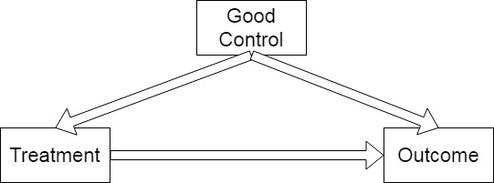
```

---
```{r, echo = FALSE, out.width="90%", fig.retina = 1}
library(knitr)
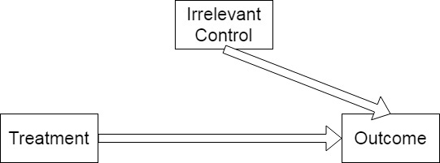
```

---
```{r, echo = FALSE, out.width="90%", fig.retina = 1}
library(knitr)
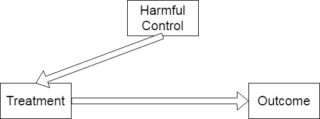
```

---
```{r, echo = FALSE, out.width="90%", fig.retina = 1}
library(knitr)

```

---
```{r, echo = FALSE, out.width="90%", fig.retina = 1}
library(knitr)

```

---
```{r, echo = FALSE, out.width="90%", fig.retina = 1}

```

---
```{r, echo = FALSE, out.width="90%", fig.retina = 1}
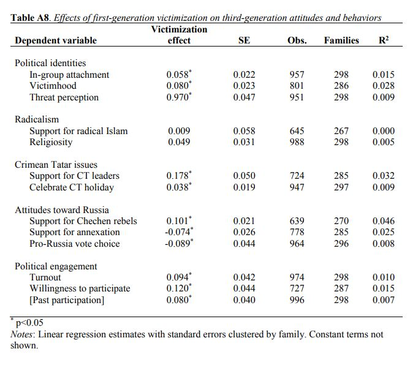
```

---
```{r, echo = FALSE, out.width="90%", fig.retina = 1}
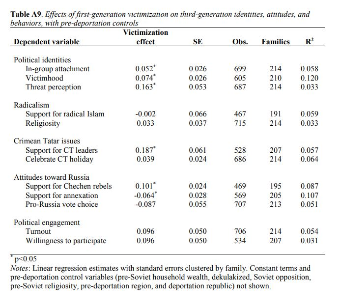
```

---
```{r, echo = FALSE, out.width="90%", fig.retina = 1}
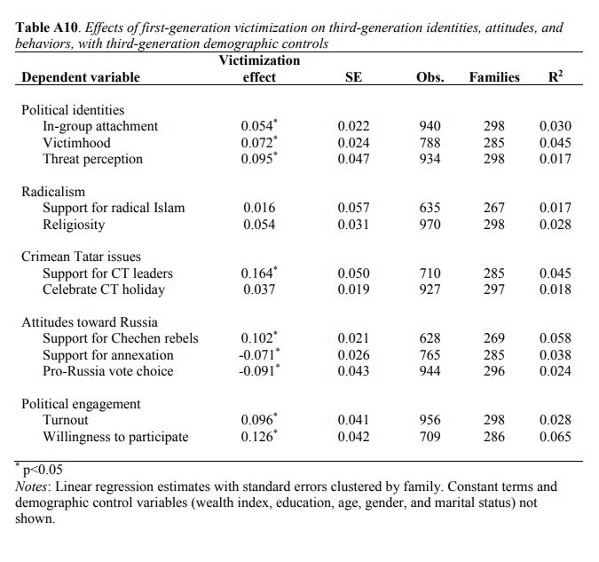
```

---
```{r, echo = FALSE, out.width="70%", fig.retina = 1}
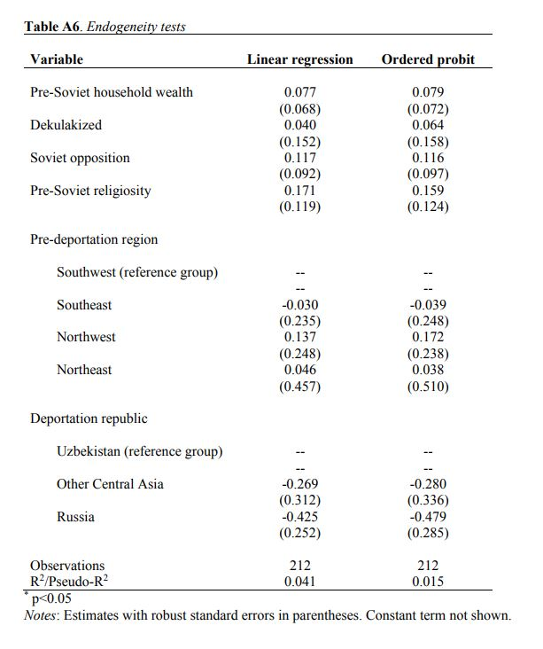
```

---
```{r, echo = TRUE, out.width="70%", fig.retina = 1}
library(dagitty)
```

---
```{r, echo = TRUE, out.width="70%", fig.retina = 1}
LupuPeisahkinDAG1 <- dagitty( "dag {Dekulakized -> Victimization PreSovietWealth -> Victimization SovietOpposition -> Victimization PreSovietReligiosity -> Victimization PriorRegion -> Victimization DeportationRegion -> Victimization DeportationRegion -> Religiosity PriorRegion -> Religiosity PreSovietReligiosity -> Religiosity SovietOpposition -> Religiosity PreSovietWealth -> Religiosity Victimization -> Religiosity Dekulakized -> Religiosity}" )
```

---
```{r, echo = TRUE, out.width="50%", fig.retina = 1}
plot( LupuPeisahkinDAG1 )
```

---
```{r, echo = TRUE, out.width="70%", fig.retina = 1}
LupuPeisahkinDAG2 <- dagitty( "dag {Dekulakized <- Victimization PreSovietWealth -> Victimization SovietOpposition -> Victimization PreSovietReligiosity -> Victimization PriorRegion -> Victimization DeportationRegion <- Victimization DeportationRegion -> Religiosity PriorRegion -> Religiosity PreSovietReligiosity -> Religiosity SovietOpposition <- Religiosity PreSovietWealth -> Religiosity Victimization -> Religiosity Dekulakized -> Religiosity}" )
```

---
```{r, echo = TRUE, out.width="50%", fig.retina = 1}
plot( LupuPeisahkinDAG2 )
```


---
```{r, echo = TRUE, out.width="90%", fig.retina = 1}
library(tidyverse)
```

---
```{r, echo = TRUE, out.width="90%", fig.retina = 1}
qog_std_ts_jan22 <- read_csv("https://github.com/jnseawright/PS406/raw/main/data/qog_std_ts_jan22.csv")

qogdems2000 <- qog_std_ts_jan22 %>% 
  filter(year==2000 & vdem_libdem > 0.5)

qog2000demsin2020 <- qog_std_ts_jan22 %>% 
  filter(year==2020 & cname %in% qogdems2000$cname)

preslm <- lm(vdem_libdem ~ br_pres, data=qog2000demsin2020)
```

---
```{r, echo = TRUE, out.width="90%", fig.retina = 1}
summ(preslm)
```

---
```{r, echo = TRUE, out.width="90%", fig.retina = 1}
preslm2 <- lm(vdem_libdem ~ br_pres + as.factor(ht_colonial) +  ccp_systyear + br_pvote, data=qog2000demsin2020)
```

---
```{r, echo = TRUE, out.width="90%", fig.retina = 1}
summ(preslm2)
```

---
### How Much Does It Hurt to Be Wrong?

Suppose we know we can get a good causal inference from:

$$Y_{i}=\beta_{1}+\beta_{2}D_{i}+\beta_{3}X_{i}+\beta_{4}W_{i}+\epsilon_{i}$$
---

But instead we estimate:

$$Y_{i}=\beta^{*}_{1}+\beta^{*}_{2}D_{i}+\beta^{*}_{3}X_{i}+\epsilon^{*}_{i}$$
---

$$E[\hat{\beta^*}_{2}]=\beta_{2}+\beta_{4} b_{4,2}$$
$$b_{4,2} = \frac{(r_{4,2}−r_{3,2}r_{4,3})}{1-r_{3,2}^2}\sqrt{\frac{V_{4}}{V_{2}}}$$

---

What if we estimate:

$$Y_{i}=\beta^{+}_{1}+\beta^{+}_{2}D_{i}+\epsilon^{+}_{i}$$
---

$$E[\hat{\beta^+}_{2}]=\beta_{2}+\beta_{3} r_{2,3}\sqrt{\frac{V_{4}}{V_{2}}} + \beta_{4} r_{2,4}\sqrt{\frac{V_{4}}{V_{3}}}$$
---

Is $$E[\hat{\beta^+}_{2}]$$ closer to zero or further away than $$E[\hat{\beta^*}_{2}]$$?

---
```{r, echo = FALSE, out.width="90%", fig.retina = 1}

```

---
```{r, echo = FALSE, out.width="90%", fig.retina = 1}
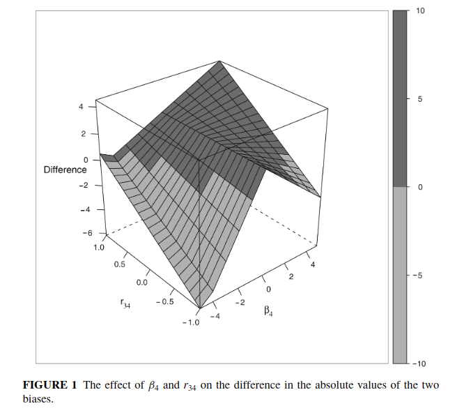
```

---
### Regression for Causal Inference

-   If the causal effect is not constant across all cases, regression
    will not give a consistent estimate of the average treatment effect.

-   Instead, it estimates a covariance-adjusted weighted average of
    cases' treatment effects.

---
### Aronow and Samii 2016

```{r, echo = FALSE, out.width="90%", fig.retina = 1}
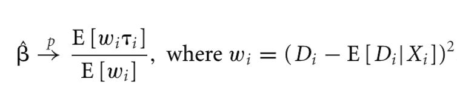
```

---
### Aronow and Samii 2016

```{r, echo = FALSE, out.width="90%", fig.retina = 1}
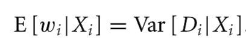
```

---
### Aronow and Samii 2016

```{r, echo = FALSE, out.width="90%", fig.retina = 1}

```

---
### Chattopadhyay and Zubizarreta 2023

```{r, echo = FALSE, out.width="90%", fig.retina = 1}
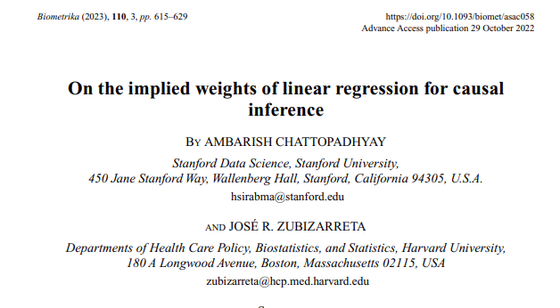
```

---
### Chattopadhyay and Zubizarreta 2023

$$\hat{\tau}_{OLS} = \sum_{i:D_{i}=1} w_{i} Y_{i} - \sum_{i:D_{i}=0} w_{i} Y_{i}$$

---
### Chattopadhyay and Zubizarreta 2023

There is a different set of weights called the ''multi-regression imputation'' or MRI:

$$\hat{\tau}_{MRI} = \sum_{i:D_{i}=1} w^{MRI}_{i}(\bar{X}) Y_{i} - \sum_{i:D_{i}=0} w^{MRI}_{i}(\bar{X}) Y_{i}$$

$$w^{MRI}_{i}(x) = n^{−1}_{T} + (X_{i} − \bar{X}_{T})^{T}S^{−1}_{T}(x − \bar{X}_{T})$$

---
### Chattopadhyay and Zubizarreta 2023

If there is causal heterogeneity, the OLS weights are a biased estimator of ATE, but the MRI weights can be an unbiased estimator.

---
```{r, echo = TRUE, out.width="90%", fig.retina = 1}
library(lmw)

qog2000demsin2020clean <- qog2000demsin2020 %>% filter(!is.na(br_pres) & !is.na(ccp_systyear) & 
                                                         !is.na(ht_colonial) & !is.na(br_pvote))

```

---
```{r, echo = TRUE, out.width="90%", fig.retina = 1}
preslmw.uri <- lmw(~ br_pres + as.factor(ht_colonial) +  ccp_systyear + br_pvote, data = qog2000demsin2020clean,
                estimand = "ATT", method = "URI", treat = "br_pres")

preslmw.urifit <- lmw_est(preslmw.uri, outcome = "vdem_libdem")

summary(preslmw.urifit)
```

---
```{r, echo = TRUE, out.width="90%", fig.retina = 1}
preslmw.mri <- lmw(~ br_pres + as.factor(ht_colonial) +  ccp_systyear + br_pvote, data = qog2000demsin2020clean,
                   estimand = "ATT", method = "MRI", treat = "br_pres")

preslmw.mrifit <- lmw_est(preslmw.mri, outcome = "vdem_libdem")

summary(preslmw.mrifit)
```

---
```{r, echo = TRUE, out.width="60%", fig.retina = 1}
plot(preslmw.mri)
```

---
```{r, echo = TRUE, out.width="60%", fig.retina = 1}
 plot(preslmw.mri, type="extrapolation", variables=~ccp_systyear)
```

---
```{r, echo = TRUE, out.width="60%", fig.retina = 1}
plot(preslmw.mri, type="influence", outcome="vdem_libdem")
```

---
```{r, echo = TRUE, out.width="90%", fig.retina = 1}
qog2000demsin2020clean$cname[11]

qog2000demsin2020clean$br_pres[11]

qog2000demsin2020clean$ht_colonial[11]

qog2000demsin2020clean$ccp_systyear[11]

qog2000demsin2020clean$br_pvote[11]

qog2000demsin2020clean$vdem_libdem[11]
```

---
```{r, echo = TRUE, out.width="90%", fig.retina = 1}
with(qog2000demsin2020clean, table(ht_colonial, br_pres))
```

---
```{r, echo = FALSE, out.width="90%", fig.retina = 1}

```

---
```{r, echo = TRUE, out.width="90%", fig.retina = 1}
qog2000demsin2020nocabo <- qog2000demsin2020clean %>% filter(cname != "Cabo Verde")

preslmw.mrinocabo <- lmw(~ br_pres + as.factor(ht_colonial) +  
                           ccp_systyear + br_pvote, 
                         data = qog2000demsin2020nocabo,
                   estimand = "ATT", method = "MRI", treat = "br_pres")

preslmw.mrifitnocabo <- lmw_est(preslmw.mrinocabo, outcome = "vdem_libdem")

summary(preslmw.mrifitnocabo)

```
