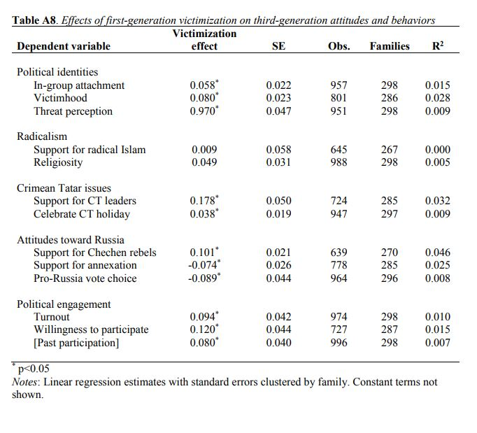
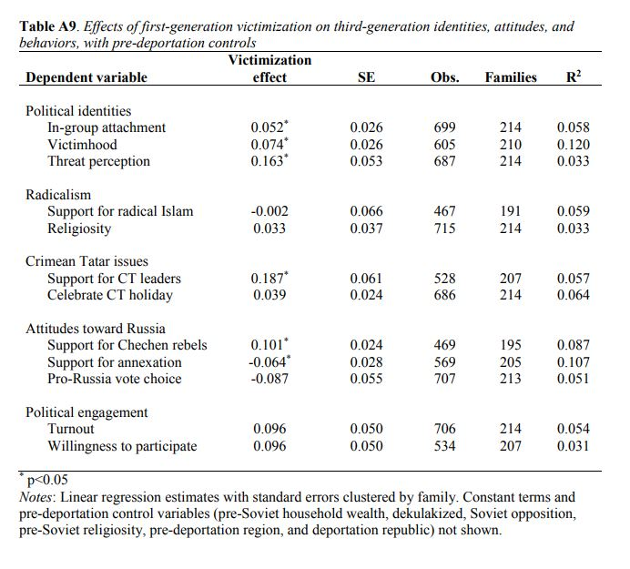
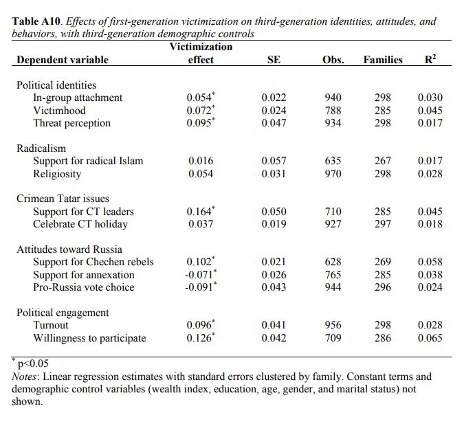
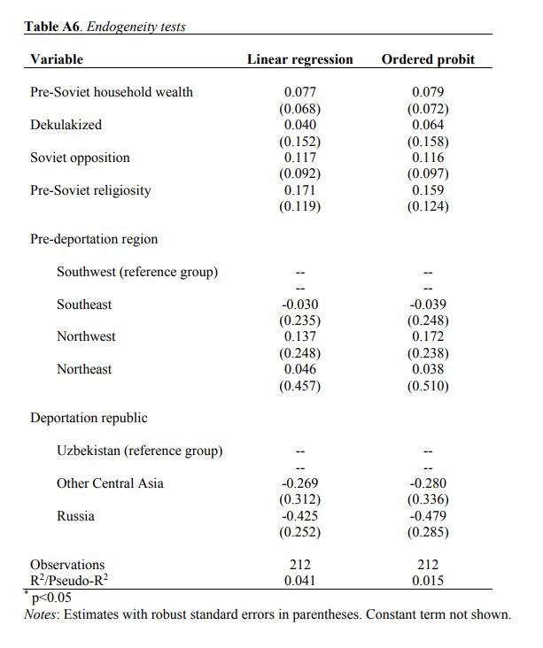
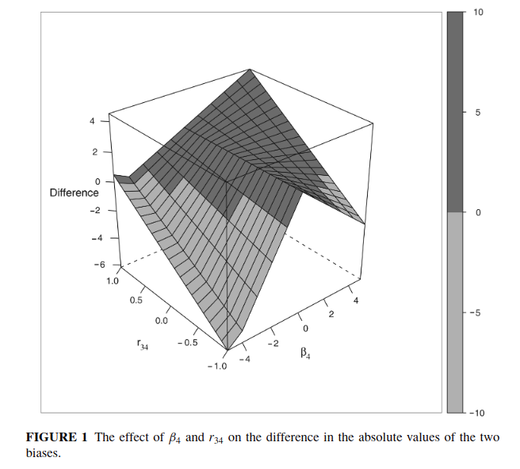
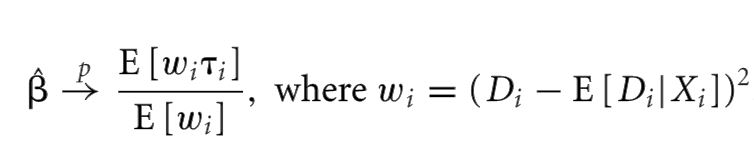
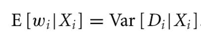

class: center, middle

```{r, load_refs, include=FALSE, cache=FALSE}
# Initializes the bibliography
library(RefManageR)

library(ggplot2)
library(dplyr)
library(nlme)
library(jtools)
library(tidyverse)
library(knitr)

BibOptions(check.entries = FALSE,
           bib.style = "authoryear", # Bibliography style
           max.names = 3, # Max author names displayed in bibliography
           sorting = "nyt", #Name, year, title sorting
           cite.style = "authoryear", # citation style
           style = "markdown",
           hyperlink = FALSE,
           dashed = FALSE)
#myBib <- ReadBib("assets/myBib.bib", check = FALSE)
# Note: don't forget to clear the knitr cache to account for changes in the
# bibliography.

peruemotions <- read.csv("https://github.com/jnseawright/PS406/raw/main/data/peruemotions.csv")
```
```{r xaringan-themer, include=FALSE, warning=FALSE}
library(xaringanthemer,MnSymbol)
style_mono_accent(
  base_color = "#1c5253",
  header_font_google = google_font("Josefin Sans"),
  text_font_google   = google_font("Montserrat", "300", "300i"),
  code_font_google   = google_font("Fira Mono"),
  text_font_size = "1.6rem"
)
library(readr)
usterrorism <- read_csv("https://raw.githubusercontent.com/jnseawright/ps405/refs/heads/main/Data/usterrorism.csv")

election2016 <- read_csv("https://raw.githubusercontent.com/jnseawright/ps405/refs/heads/main/Data/election2016.csv")

stateattacklist <- table(usterrorism$provstate[usterrorism$iyear>2015])

election2016$Stateterrorism <- 0

election2016$Stateterrorism <- ifelse(
  election2016$State %in% names(stateattacklist),
  stateattacklist[ election2016$State ],
  election2016$Stateterrorism
)

election2016$TrumpShare <- as.numeric(str_replace(election2016$TrumpShare, "%", ""))

election2016$D12Margin <- as.numeric(str_replace(election2016$D12Margin, "%", ""))

knitr::opts_chunk$set(warning = FALSE, message = FALSE)

```

### Why Regression? From Experiments to Observational Studies

- In an experiment, random assignment ensures that treatment is independent of potential outcomes.
- In observational data, we worry that treated and control units differ on other characteristics (confounders).
- Regression attempts to **adjust for those differences** by holding confounders constant.

---
### The Intuition: Adjusting for a Confounder

```{r adjust_example, echo = TRUE}
lm_biased <- lm(Stateterrorism ~ TrumpShare, data = election2016)
coef(lm_biased)["TrumpShare"]

# Adjust for past election and Turnout
lm_adjusted <- lm(Stateterrorism ~ TrumpShare + Turnout16 + Turnout12 + D12Margin, data = election2016)
coef(lm_adjusted)["TrumpShare"]
```
---

- The coefficient changes because we are now comparing treated and control units having subtracted off the estimated effects of turnout and electoral history.
- This is the core idea: **control for confounders to mimic randomization**.

---
### When Does This Work? The Key Assumption

**Unconfoundedness (selection on observables)**  

$$D_i \perp\!\!\!\perp (Y_i(0), Y_i(1)) \mid X_i$$


---

- Conditional on observed covariates \(X\), treatment is as good as randomly assigned.
- This means: no unmeasured confounders that affect both treatment and outcome.

---

**Overlap / Common Support**  
For every combination of values of \(X\), there must be both treated and control units.

---
### Visualizing Confounding with DAGs

```{r confounder_dag, echo = FALSE, fig.width = 4, fig.height = 3}
library(dagitty)
g <- dagitty('dag {
  X [pos="0,1"]
  D [pos="1,0"]
  Y [pos="1,2"]
  X -> D
  X -> Y
}')
plot(g)
```

---

- \(X\) is a confounder: it affects both treatment \(D\) and outcome \(Y\).
- Controlling for \(X\) blocks the backdoor path $D \leftarrow X \rightarrow Y$.
- This gives us the causal effect of $D$ on $Y$.


---
### What Does "Controlling For" Mean?

- Intuitively: we are asking what the relationship between treatment and outcome would be if past elections were held constant.
- Mathematically: regression uses the variation in treatment that is **not explained by past elections** to estimate the effect.

**Key idea**: Including a confounder removes its influence from both treatment and outcome, reducing bias.

---
### When Is a Variable a Confounder?

A confounder is a variable that:
1.  Affects the treatment,
2.  Affects the outcome,
3.  Is not itself affected by the treatment.

---
### Good Controls: Block Backdoor Paths

Any variable that lies on a backdoor path from $D$ to $Y$ and is not itself a descendant of $D$ is a **good control**.

Example from the terrorism study: `past turnout` and `voting history` are plausible confounders – they might affect both vote choice in 2016 and subsequent terrorism.

---
### Bad Controls: Mediators

```{r mediator_dag, echo = FALSE, fig.width = 4, fig.height = 3}
g <- dagitty('dag {
  D [pos="0,1"]
  M [pos="1,0"]
  Y [pos="1,2"]
  D -> M
  M -> Y
}')
plot(g)
```

---

- $M$ is a **mediator**: it lies on the causal path from $D$ to $Y$.
- Controlling for $M$ would **block part of the causal effect** we want to estimate.
- This is a form of **overcontrol bias**.

In the Peru study, if `enojado` (anger) is a mediator, we should **not** control for it when estimating the total effect of `simpletreat` on voting.

---
### Bad Controls: Colliders

```{r collider_dag, echo = FALSE, fig.width = 4, fig.height = 3}
g <- dagitty('dag {
  D [pos="0,1"]
  C [pos="1,0"]
  Y [pos="1,2"]
  D -> C
  Y -> C
}')
plot(g)
```

---

- $C$ is a **collider**: it is caused by both $D$ and $Y$.
- Conditioning on a collider **opens a non‑causal path** $D \rightarrow C \leftarrow Y$, creating **selection bias**.

---

- Example: if we control for a variable that is itself affected by treatment and outcome (e.g., turnout in 2020 in the terrorism example), we can introduce bias.

---
### Bad Controls: Post‑Treatment Variables

Any variable that is caused by the treatment is **post‑treatment**.  
Controlling for such a variable can:

- Block part of the causal effect (if it is a mediator),
- Create collider bias (if it is also affected by other factors),
- Generally lead to incorrect estimates.

---

**Rule of thumb**: Only control for variables measured **before** treatment.

---
### Translating DAGs to Regression Practice

When building a regression model for causal inference:

1.  **List all potential confounders** – variables that affect both treatment and outcome.
2.  **Draw a DAG** (even informally) to check for backdoor paths.
3.  **Do not control for mediators or colliders**.
4.  **Do not control for post‑treatment variables**.
5.  **Include interactions if you suspect heterogeneous effects** (more on this later).

---
### The Problem of Unobserved Confounders

We can only control for variables we have measured.  
If an important confounder is unmeasured, our estimate may still be biased.

This is why **sensitivity analysis** is crucial – we need to ask: how strong would an unmeasured confounder have to be to overturn our conclusion?

(We will return to this in later weeks.)

---
### Summary: Regression for Causal Inference

- Regression can reduce bias by adjusting for confounders.
- Use DAGs to decide which variables to control for.
- Avoid bad controls: mediators, colliders, post‑treatment variables.
- Unobserved confounders remain a threat – be humble.
- Heterogeneous effects mean the regression coefficient is a weighted average; explore variation.

---

Let's see how this works in practice in an excellent application.

---
```{r, echo = FALSE, out.width="90%", fig.retina = 1}

```

---
```{r, echo = FALSE, out.width="90%", fig.retina = 1}

```

---
```{r, echo = FALSE, out.width="90%", fig.retina = 1}

```

---
```{r, echo = FALSE, out.width="90%", fig.retina = 1}

```

---
```{r, echo = FALSE, out.width="70%", fig.retina = 1}

```

---
```{r, echo = TRUE, out.width="70%", fig.retina = 1}
library(dagitty)
```

---

Let's assemble a DAG that captures what appears to be the theoretical intuition behind Lupu and Peisahkin's analysis.

---
```{r, echo = TRUE, out.width="70%", fig.retina = 1}
LupuPeisahkinDAG1 <- dagitty( "dag {Dekulakized -> Victimization PreSovietWealth -> Victimization SovietOpposition -> Victimization PreSovietReligiosity -> Victimization PriorRegion -> Victimization DeportationRegion -> Victimization DeportationRegion -> Religiosity PriorRegion -> Religiosity PreSovietReligiosity -> Religiosity SovietOpposition -> Religiosity PreSovietWealth -> Religiosity Victimization -> Religiosity Dekulakized -> Religiosity}" )
```

---
```{r, echo = TRUE, out.width="50%", fig.retina = 1}
plot( LupuPeisahkinDAG1 )
```


---

*   In this initial setup, there are a lot of variables that are confounders for the main relationship of interest, between Victimization and Religiosity. Nothing is post-treatment, etc.

*   Is this the only plausible causal framework? What about...

---
```{r, echo = TRUE, out.width="70%", fig.retina = 1}
LupuPeisahkinDAG2 <- dagitty( "dag {Dekulakized <- Victimization PreSovietWealth -> Victimization SovietOpposition -> Victimization PreSovietReligiosity -> Victimization PriorRegion -> Victimization DeportationRegion <- Victimization DeportationRegion -> Religiosity PriorRegion -> Religiosity PreSovietReligiosity -> Religiosity SovietOpposition -> Religiosity PreSovietWealth -> Religiosity Victimization -> Religiosity Dekulakized -> Religiosity}" )
```

---
```{r, echo = TRUE, out.width="50%", fig.retina = 1}
plot( LupuPeisahkinDAG2 )
```

---

*   Here, Victimization causes DeportationRegion and Dekulakized. How does this change the appropriate set of control variables?

---
```{r, echo = TRUE, out.width="50%", fig.retina = 1}
adjustmentSets(LupuPeisahkinDAG1, exposure = "Victimization", outcome = "Religiosity")

adjustmentSets(LupuPeisahkinDAG2, exposure = "Victimization", outcome = "Religiosity")
```

---
```{r, echo = TRUE, out.width="50%", fig.retina = 1}
impliedConditionalIndependencies(LupuPeisahkinDAG1)
```


---

Are presidential regimes especially vulnerable to democratic backsliding? Let's try to get a regression-based answer as an application of what we've learned.

---

```{r, echo = FALSE, out.width="50%", fig.retina = 1}
library(dagitty)
library(ggdag)

# Define the DAG
backslide_dag <- dagitty('dag {
  "Colonial History" [pos="0,1"]
  "Presidential System" [pos="1,0.5"]
  "Electoral System (PR/Majoritarian)" [pos="1,1.5"]
  "Constitution Age" [pos="2,0"]
  "Democratic Backsliding" [pos="2,1"]

  "Colonial History" -> "Presidential System"
  "Colonial History" -> "Electoral System (PR/Majoritarian)"
  "Colonial History" -> "Constitution Age"
  "Colonial History" -> "Democratic Backsliding"
  "Presidential System" -> "Democratic Backsliding"
  "Electoral System (PR/Majoritarian)" -> "Democratic Backsliding"
  "Constitution Age" -> "Democratic Backsliding"
}')

ggdag(backslide_dag, text_col = "red") + theme_dag()
```

---
```{r, echo = TRUE, out.width="90%", fig.retina = 1}
library(tidyverse)
```

---
```{r, echo = TRUE, out.width="90%", fig.retina = 1}
qog_std_ts_jan22 <- read_csv("https://github.com/jnseawright/PS406/raw/main/data/qog_std_ts_jan22.csv")

qogdems2000 <- qog_std_ts_jan22 %>% 
  filter(year==2000 & vdem_libdem > 0.5)

qog2000demsin2020 <- qog_std_ts_jan22 %>% 
  filter(year==2020 & cname %in% qogdems2000$cname)

preslm <- lm(vdem_libdem ~ br_pres, data=qog2000demsin2020)
```

---
```{r, echo = TRUE, out.width="90%", fig.retina = 1}
summ(preslm)
```

---
```{r, echo = TRUE, out.width="90%", fig.retina = 1}
preslm2 <- lm(vdem_libdem ~ br_pres + as.factor(ht_colonial) +  ccp_systyear + br_pvote, data=qog2000demsin2020)
```

---
```{r, echo = TRUE, out.width="90%", fig.retina = 1}
summ(preslm2)
```

---
### Is it better to include all but one control variable, or have fewer?

It turns out, maybe surprisingly, that there isn't just one answer to this question.

* Sometimes, you will get an estimate with less bias by leaving out valid control variables from an incomplete model.

* Sometimes you will do better by including as many control variables as you can even if you don't know them all.

* We don't know which scenario is which in general.

---
### How Much Does It Hurt to Be Wrong?

Suppose we know we can get a good causal inference from a regression with two control variables and our treatment, but we don't have access to any way of measuring one of those control variables. We have two options:

1.  Estimate a regression including the treatment and one control variable.

2.  Estimate a bivariate regression including only the treatment.

---

Both of these options will have omitted variable bias. 

1.  The first option will have the bias due to leaving out the unmeasurable variable.

2.  The second option will have the bias due to leaving out the unmeasurable variable, and the bias due to leaving out the measured control variable.

---

These two sources of bias can point in the same direction, in which scenario the second option will usually be worse than the first. Or the two sources of bias can point in opposite directions, in which scenario the second option can often be better than the first.

---
```{r, echo = FALSE, out.width="90%", fig.retina = 1}

```

---
```{r, echo = FALSE, out.width="90%", fig.retina = 1}

```

---

As we can see, there are in principle about as many situations where leaving out partial sets of control variables is the right choice as there are situations where including them is the right choice.

---
### Regression for Causal Inference

-   If the causal effect is not constant across all cases, regression
    will not give a consistent estimate of the average treatment effect.

-   Instead, it estimates a covariance-adjusted weighted average of
    cases' treatment effects.

---

Part of our goal in this seminar is to explore advanced techniques. You don't always have to implement each of these, but learning about them can give you good ideas and broaden your skill set!

---
### Aronow and Samii 2016

```{r, echo = FALSE, out.width="90%", fig.retina = 1}

```

---
### Aronow and Samii 2016

```{r, echo = FALSE, out.width="90%", fig.retina = 1}

```

---
### Aronow and Samii 2016

```{r, echo = FALSE, out.width="90%", fig.retina = 1}

```

---
### Chattopadhyay and Zubizarreta 2023

```{r, echo = FALSE, out.width="90%", fig.retina = 1}

```

---
### Chattopadhyay and Zubizarreta 2023

$$\hat{\tau}_{OLS} = \sum_{i:D_{i}=1} w_{i} Y_{i} - \sum_{i:D_{i}=0} w_{i} Y_{i}$$

---
### Chattopadhyay and Zubizarreta 2023

There is a different set of weights called the ''multi-regression imputation'' or MRI:

$$\hat{\tau}_{MRI} = \sum_{i:D_{i}=1} w^{MRI}_{i}(\bar{X}) Y_{i} - \sum_{i:D_{i}=0} w^{MRI}_{i}(\bar{X}) Y_{i}$$

$$w^{MRI}_{i}(x) = n^{−1}_{T} + (X_{i} − \bar{X}_{T})^{T}S^{−1}_{T}(x − \bar{X}_{T})$$

---
### Chattopadhyay and Zubizarreta 2023

If there is causal heterogeneity, the OLS weights are a biased estimator of ATE, but the MRI weights can be an unbiased estimator.

---
```{r, echo = TRUE, out.width="90%", fig.retina = 1}
library(lmw)

qog2000demsin2020clean <- qog2000demsin2020 %>% filter(!is.na(br_pres) & !is.na(ccp_systyear) & 
                                                         !is.na(ht_colonial) & !is.na(br_pvote))

```

---
```{r, echo = TRUE, out.width="90%", fig.retina = 1}
preslmw.uri <- lmw(~ br_pres + as.factor(ht_colonial) + br_pvote, data = qog2000demsin2020clean,
                estimand = "ATT", method = "URI", treat = "br_pres")

preslmw.urifit <- lmw_est(preslmw.uri, outcome = "vdem_libdem")

summary(preslmw.urifit)
```

---
```{r, echo = TRUE, out.width="90%", fig.retina = 1}
preslmw.mri <- lmw(~ br_pres + as.factor(ht_colonial) + br_pvote, data = qog2000demsin2020clean,
                   estimand = "ATT", method = "MRI", treat = "br_pres")

preslmw.mrifit <- lmw_est(preslmw.mri, outcome = "vdem_libdem")

summary(preslmw.mrifit)
```

---
```{r, echo = TRUE, out.width="60%", fig.retina = 1}
plot(preslmw.mri)
```

