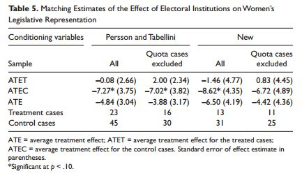

class: center, middle

```{css, echo=FALSE}
pre {
  max-height: 400px;
  overflow-y: auto;
}

pre[class] {
  max-height: 200px;
}
```

```{r, load_refs, include=FALSE, cache=FALSE}
# Initializes the bibliography
library(RefManageR)

library(ggplot2)
library(dplyr)
library(nlme)
library(jtools)

BibOptions(check.entries = FALSE,
           bib.style = "authoryear", # Bibliography style
           max.names = 3, # Max author names displayed in bibliography
           sorting = "nyt", #Name, year, title sorting
           cite.style = "authoryear", # citation style
           style = "markdown",
           hyperlink = FALSE,
           dashed = FALSE)
#myBib <- ReadBib("assets/myBib.bib", check = FALSE)
# Note: don't forget to clear the knitr cache to account for changes in the
# bibliography.

peruemotions <- read.csv("https://github.com/jnseawright/PS406/raw/main/data/peruemotions.csv")
```
```{r xaringan-themer, include=FALSE, warning=FALSE}
library(xaringanthemer,MnSymbol)
style_mono_accent(
  base_color = "#1c5253",
  header_font_google = google_font("Josefin Sans"),
  text_font_google   = google_font("Montserrat", "300", "300i"),
  code_font_google   = google_font("Fira Mono"),
  text_font_size = "1.6rem"
)
```

---
### Matching

---
### The Method of Difference

> If an instance in which the phenomenon under investigation occurs, and
> an instance in which it does not occur, have every circumstance in
> common save one, that one occurring only in the former; the
> circumstance in which alone the two instances differ is the effect, or
> the cause, or an indispensable part of the cause, of the phenomenon.
> (Mill 1843/2002)

---
### The Method of Difference

Debunking the Method of Difference

---
### The Potential Outcomes Framework

Strictly speaking, for the Method of Difference to work based on a
comparison between cases 1 and 2, the condition which must be met is:

$$\begin{aligned}
Y_{1,t} = Y_{2,t}\\
Y_{1,c} = Y_{2,c}\end{aligned}$$

---
### Experiments

In a randomized experiment, it is true by the Law of Large Numbers that:

$$\begin{aligned}
\frac{\displaystyle\sum_{i: D_{i} = T}Y_{i,t}}{\displaystyle\sum_{i: D_{i} = t} i} \approx \frac{\displaystyle\sum_{j: D_{j} = C}Y_{j,c}}{\displaystyle\sum_{j: D_{j} = c} j}\end{aligned}$$

---
### Experiments

In a randomized experiment, it is true by the Law of Large Numbers that:

$$\begin{aligned}
\frac{\displaystyle\sum_{i: D_{i} = T}Y_{i,c}}{\displaystyle\sum_{i: D_{i} = t} i} \approx \frac{\displaystyle\sum_{j: D_{j} = C}Y_{j,c}}{\displaystyle\sum_{j: D_{j} = c} j}\end{aligned}$$

---
### Matching

Suppose, in an observational study, we somehow know that:

$$\begin{aligned}
Y_{i, t} = f(\mathbf{X}_{i}) + \epsilon_{i}\\
Y_{i, c} = g(\mathbf{X}_{i}) + \delta_{i}\\
E(\epsilon | \mathbf{X}) = 0\\
E(\delta | \mathbf{X}) = 0\end{aligned}$$

---
### Matching

$$\begin{aligned}
E(Y_{i,t} | D_{i} = T, \mathbf{X}_{i} = \mathbf{W}) = & f(\mathbf{W}) + E(\epsilon_{i})\\
                                                    = & f(\mathbf{W}) \\
                                                    = & E(Y_{T,i} | D_{i} = C, \\
                                                     & \mathbf{X}_{i} = \mathbf{W})\end{aligned}$$

$$\begin{aligned}
E(Y_{C,i} | D_{i} = T, \mathbf{X}_{i} = \mathbf{W}) = \\
E(Y_{C,i} | D_{i} = C, \mathbf{X}_{i} = \mathbf{W})\end{aligned}$$

---
### Matching

Let:

$$\tau_{\mathbf{W}} = E(Y_{T,i} | D_{i} = T, \mathbf{X}_{i} =  \mathbf{W}) -\\ E(Y_{C,i} | D_{i} = C, \mathbf{X}_{i} = \mathbf{W})$$

Also let $\mathbf{W}$ have probability density function $w()$.

Then the average treatment effect of $D$ on $Y$ for the population is:

$$ATE = \int \tau_{\mathbf{\omega}} w(\mathbf{\omega})\,d\mathbf{\omega}$$

---
### Matching as Second-Best

Matching is second-best to an experiment because:

1.  We need to identify an adequate collection of matching variables, $\mathbf{X}$.

2.  We need stronger modeling assumptions, including assumptions about the existence of and conditional means of $\epsilon$ and $\delta$.

---
### Matching as Second-Best

Matching might be second-best to a fully-specified regression analysis
because:

1.  We lose the efficiency of using all cases to estimate a small number of parameters.

2.  What is the S.E. of $\int \tau_{\mathbf{\omega}} w(\mathbf{\omega})\,d\mathbf{\omega}$?

3.  Does a well-specified regression come closer to replicating
experimental findings than something based on matching?

---
### Dehejia and Wahba 1999


---
### Smith and Todd 2005


---
### Arceneaux, Gerber, and Green 2006


---
### Glazerman, Levy, and Myers 2003


---
### Shadish, Clark and Steiner 2008


---
### Cook and Steiner 2010


---
### So, Why Match?

-   Experiments aren't always available.

-   Sometimes, we don't know $f()$ and $g()$.

-   Sometimes, we suspect that $f()$ and $g()$ vary across cases.

-   Matching evens out weights across (at least matched) cases within
    the sample.

---
### Matching Methods

Nearest-neighbor propensity-score matching

---
### Three Causal Quantities

1.  ATE: $E(Y_{T} - Y_{C})$

2.  ATT: $E(Y_{T} - Y_{C} | D = T)$

3.  ATC: $E(Y_{T} - Y_{C} | D = C)$

---
### Pairwise Matching

1.  Take a sample of $N_{T}$ treatment cases and $N_{C}$ control cases.

2.  For each treatment case, find the control case that "best" matches
    on $\mathbf{X}$. Save the difference on $Y$ between those two cases

3.  Average the resulting paired differences. Use this as an estimate of
    ATT.

---
### Propensity Score

The *propensity score* for case $i$ is the probability that $D_{i} = T$
conditional on $\mathbf{X}_{i}$.

A well-estimated propensity score contains all the information about
$\mathbf{X}_{i}$ that is relevant to causal inference.

---
### Application: Female Legislators

-   It is widely believed that proportional representation electoral
    rules produce more female legislators than do single-member district
    rules (e.g., Kenworthy and Malami 1999, Matland 1998, Norris 2004,
    Paxton and Kunovich 2003, Reynolds 1999, Rule 1987, Siaroff 2000).

-   Several regression analyses have found effects in the neighborhood
    of 7-12%.

---
### Application: Female Legislators

-   These models have assumed that there is a single, constant effect of
    electoral rules on women's legislative inclusion. Is that assumption
    plausible?

-   For example, is the ATT equal to the ATC?

---
### Application: Female Legislators



---
### Application: Female Legislators

---
```{r, echo = TRUE, out.width="90%", fig.retina = 1}
fourelec <- read.csv("https://github.com/jnseawright/PS406/raw/main/data/fourelec.csv")

fourelectrim <- na.omit(data.frame(
         country=fourelec$country,
         maj=fourelec$maj,prop65=fourelec$prop65,
         lyp=fourelec$lyp,gastil=fourelec$gastil,
         col_uka=fourelec$col_uka,
         laam=fourelec$laam,
         federal=fourelec$federal,
         wom_1st=fourelec$wom_1st,
         quota=fourelec$Quota))

fourelectrim <- fourelectrim %>% filter(quota==0)
```

---
```{r, echo = TRUE, out.width="90%", fig.retina = 1}
pscore <- glm(maj ~ prop65 +
         I(log(lyp)) + gastil + federal +
         col_uka + laam,
         family=binomial(link=logit),
         data=fourelectrim)$fitted
```

---
```{r, echo = TRUE, out.width="90%", fig.retina = 1}
library(Matching)
```

---
```{r, echo = TRUE, out.width="90%", fig.retina = 1}
firstmatch <- with(fourelectrim,Match(
   Y=wom_1st,Tr=maj,X=pscore,est="ATT"))

summary(firstmatch)
```

---
```{r, echo = TRUE, out.width="90%", fig.retina = 1}
secondmatch <- with(fourelectrim,Match(
    Y=wom_1st,Tr=maj,X=pscore,est="ATC"))
summary(secondmatch)
```

---
### What are the actual matches?

```{r, echo = TRUE, out.width="90%", fig.retina = 1}
firstmatched.data <- data.frame(treated.country = fourelectrim$country[firstmatch$index.treated],
                                control.country = fourelectrim$country[firstmatch$index.control],
                                treated.wom_1st = fourelectrim$wom_1st[firstmatch$index.treated],
                                control.wom_1st = fourelectrim$wom_1st[firstmatch$index.control],
                                treated.pscore = pscore[firstmatch$index.treated],
                                control.pscore = pscore[firstmatch$index.control])
```

---
```{r, echo = TRUE, out.width="90%", fig.retina = 1}
firstmatched.data 
```

---
```{r, echo = TRUE, out.width="90%", fig.retina = 1}
library(optmatch) 
```

---
```{r, echo = TRUE, out.width="90%", fig.retina = 1}
    elecrulespscore <- glm(maj ~ prop65 +
         I(log(lyp)) + gastil + federal +
         col_uka + laam,
         family=binomial(link=logit),
         data=fourelectrim)
         
    elecrules.pairmatch <- pairmatch(elecrulespscore, data=fourelectrim)
    summary(elecrules.pairmatch)

    anova(lm(fourelectrim$wom_1st ~ elecrules.pairmatch + fourelectrim$maj))
```

---
### Variants of Matching

-   Full matching

-   Caliper matching

-   Coarsened exact matching

---
```{r, echo = TRUE, out.width="90%", fig.retina = 1}
    elecrules.fullmatch <- fullmatch(maj ~ prop65 +
         I(log(lyp)) + gastil + federal +
         col_uka + laam, data=fourelectrim)
    summary(elecrules.fullmatch)

    anova(lm(fourelectrim$wom_1st ~ elecrules.fullmatch + fourelectrim$maj))
```

---
```{r, echo = TRUE, out.width="90%", fig.retina = 1}
    elecrules.distmat <- match_on(maj ~ prop65 +
         I(log(lyp)) + gastil + federal +
         col_uka + laam, data=fourelectrim) +   
         caliper(match_on(elecrulespscore), width = 3)
      (elecrules.caliperfull <- fullmatch(elecrules.distmat,  data=fourelectrim))
  
    summary(elecrules.caliperfull)
```
---
```{r, echo = TRUE, out.width="90%", fig.retina = 1}
    anova(lm(fourelectrim$wom_1st ~ elecrules.caliperfull + fourelectrim$maj))
```

---
```{r, echo = TRUE, out.width="90%", fig.retina = 1}
library(cem)
```

---
```{r, echo = TRUE, out.width="90%", fig.retina = 1}
elecrules.cem <- cem(treatment="maj", data=fourelectrim, drop="wom_1st")

elecrules.att <- att(elecrules.cem, wom_1st ~ maj, data=fourelectrim)
```

---
```{r, echo = TRUE, out.width="90%", fig.retina = 1}
summary(elecrules.att)
```

---
### Balance

-   Recall that matching only helps for causal inference if the
    distribution of $\mathbf{X}$ in the treatment group is essentially
    the same as the distribution of $\mathbf{X}$ in the control group.

-   A necessary (but not sufficient) condition for successful causal
    inference from matching is that the mean of each variable in
    $\mathbf{X}$ be essentially the same in the matched treatment and
    control groups.

---
```{r, echo = TRUE, out.width="90%", fig.retina = 1}
firstmatch.mb <- MatchBalance(maj~prop65 +
         I(log(lyp)) + gastil + federal +
         col_uka + laam, data=fourelectrim, 
         match.out=firstmatch, nboots=500)
```

---
```{r, echo = TRUE, out.width="100%", fig.retina = 1}
library(cobalt)
bal.tab(elecrules.fullmatch, maj ~ prop65 +
            I(log(lyp)) + gastil + federal +
            col_uka + laam, data=fourelectrim,
        thresholds = c(m = .2, v = 2))
```

---
### Sensitivity Analysis

-   Even net of $\mathbf{X}$, it could be the case that some other
    variable causes cases to have differential probabilities of
    treatment.

-   Let $\gamma$ be the odds ratio for the probability that matched
    cases will be assigned to the treatment, conditional on their values
    of the unobserved variable:

    $$\gamma = \frac{P(D_{i} = t | \mathbf{X}_{i}, u_{i})}{P(D_{i} = t | \mathbf{X}_{i}, u_{j})}$$

---
### Sensitivity Analysis

-   How does the range of possible $P$ values on our ATE estimate depend on the value of $\gamma$?

---
```{r, echo = TRUE, out.width="90%", fig.retina = 1}
library(rbounds)

psens(fourelectrim$wom_1st[firstmatch$index.treated],
      fourelectrim$wom_1st[firstmatch$index.control],
      Gamma=2, GammaInc=.1)
```

---
```{r, echo = FALSE, out.width="90%", fig.retina = 1}
library(knitr)

```

---
```{r, echo = FALSE, out.width="50%", fig.retina = 1}

```

---
```{r, echo = FALSE, out.width="60%", fig.retina = 1}

```

---
```{r, echo = FALSE, out.width="70%", fig.retina = 1}

```