class: center, middle

```{css, echo=FALSE}
pre {
  max-height: 400px;
  overflow-y: auto;
}

pre[class] {
  max-height: 200px;
}
```

```{r, load_refs, include=FALSE, cache=FALSE}
# Initializes the bibliography
library(RefManageR)

library(ggplot2)
library(dplyr)
library(readr)
library(nlme)
library(jtools)

BibOptions(check.entries = FALSE,
           bib.style = "authoryear", # Bibliography style
           max.names = 3, # Max author names displayed in bibliography
           sorting = "nyt", #Name, year, title sorting
           cite.style = "authoryear", # citation style
           style = "markdown",
           hyperlink = FALSE,
           dashed = FALSE)
#myBib <- ReadBib("assets/myBib.bib", check = FALSE)
# Note: don't forget to clear the knitr cache to account for changes in the
# bibliography.

peruemotions <- read.csv("https://github.com/jnseawright/PS406/raw/main/data/peruemotions.csv")

knitr::opts_chunk$set(warning = FALSE, message = FALSE)
```
```{r xaringan-themer, include=FALSE, warning=FALSE}
library(xaringanthemer,MnSymbol)
style_mono_accent(
  base_color = "#1c5253",
  header_font_google = google_font("Josefin Sans"),
  text_font_google   = google_font("Montserrat", "300", "300i"),
  code_font_google   = google_font("Fira Mono"),
  text_font_size = "1.6rem"
)
```

### What Is a Natural Experiment?

- A **natural experiment** is an observational study in which the treatment (or exposure) of interest is assigned by **factors outside the researcher’s control**, in a way that mimics random assignment.

- The researcher does **not** manipulate the treatment – it occurs naturally, due to:
  - Policy changes,
  - Geographic or historical circumstances,
  - Random shocks (weather, lotteries, etc.),
  - Institutional rules (e.g., cutoffs).

---
### Natural Experiments vs. True Experiments

| Feature | True Experiment | Natural Experiment |
|--------|-----------------|---------------------|
| Treatment assigned by | Researcher | Nature, policy, accident |
| Randomization | Controlled by researcher | "As‑if random" – must be argued |
| Setting | Often lab or field | Real‑world |
| Internal validity | High (by design) | Requires strong assumptions |
| External validity | May be limited | Often high (real‑world context) |

---

- In a true experiment, randomization ensures that treatment and control groups are comparable **on average**.
- In a natural experiment, we must **defend** the claim that treatment is as‑if randomly assigned.

---
### Key Features of a Natural Experiment

1. **Exogenous variation**: The source of variation in treatment is unrelated to potential outcomes (conditional on observables).

2. **No researcher manipulation**: The treatment arises from real‑world processes – policy discontinuities, weather, lotteries, historical events.

3. **Real‑world context**: Results often generalize better than lab experiments, but assumptions are harder to verify.

---
### Why Are Natural Experiments Valuable?

- **Ethics**: We cannot randomly assign people to war, colonization, or unemployment.
- **Feasibility**: Many interesting treatments (e.g., living in a democracy) are impossible to randomize.
- **External validity**: Natural experiments study real populations in real settings.
- They provide a bridge between observational studies and experiments, using **design** rather than statistical adjustment to identify causal effects.

---
### The Core Assumption: As‑If Random

The central claim of any natural experiment is that treatment assignment is **"as‑if random"** – i.e., independent of potential outcomes, at least after conditioning on observable covariates.

This assumption is **not testable directly**; we can only provide indirect evidence:
- Balance tests (compare covariates across treatment and control).
- Placebo tests (check for effects where none should exist).
- Institutional knowledge (explain why assignment is haphazard).

---
### Five Types of Natural Experiments

We will explore five common designs:

1. **Classic natural experiment**: A single treatment is as‑if randomly assigned (e.g., Snow’s cholera study, draft lottery).
2. **Instrumental‑variables natural experiment**: An as‑if random variable affects treatment, but not outcome directly (e.g., settler mortality as instrument for institutions).
3. **Regression‑discontinuity design**: Treatment is determined by a cutoff on a continuous variable (e.g., Maimonides' rule).
4.  **Difference-in-differences design**: treatment changes at unpredictable or meaningless times in some units but not others (e.g., minimum-wage study)
5.  **Synthetic-control design**: weight control cases to estimate the trajectory over time of the treatment case if it were in the control condition (e.g., Brexit study)

---
### Classic Natural Experiment

1.  "Nature" randomizes the treatment.

    -   No discretion is involved in assigning treatments, or the
        relevant information is unavailable or unused.

2.  Randomized treatment has the same effect as non-randomized treatment
    would have.

---
### Snow: the Most Famous Natural Experiment
```{r, echo = FALSE, out.width="100%", fig.retina = 1, fig.align='center'}
library(knitr)

```

---
### Snow: the Most Famous Natural Experiment
```{r, echo = FALSE, out.width="100%", fig.retina = 1, fig.align='center'}
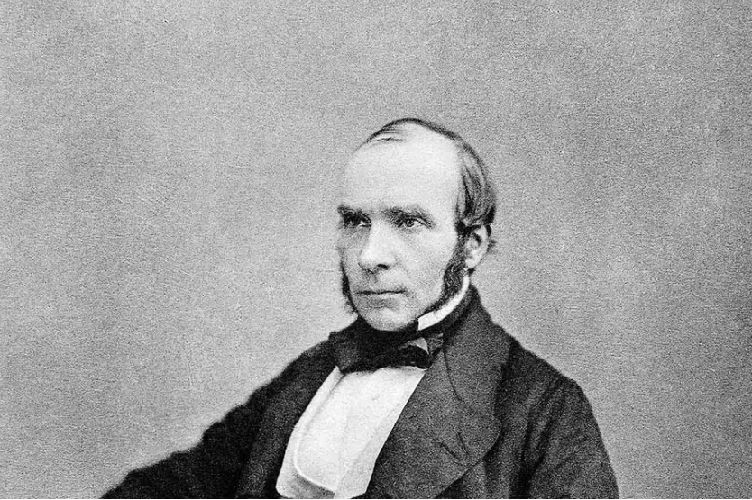
```

---
### Snow: the Most Famous Natural Experiment
```{r, echo = FALSE, out.width="50%", fig.retina = 1, fig.align='center'}

```

---
### Snow on Cholera
```{r, echo = FALSE, out.width="40%", fig.retina = 1, fig.align='center'}
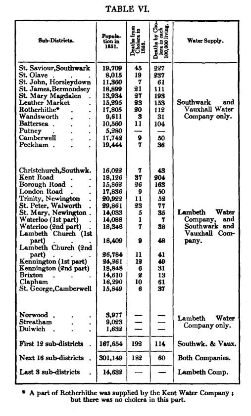
```

---
''Although the facts shown in the above table afford very strong evidence
of the powerful influence which the drinking of water containing the
sewage of a town exerts over the spread of cholera, when that disease is
present, yet the question does not end here; for the intermixing of the
water supply of the Southwark and Vauxhall Company with that of the
Lambeth Company, over an extensive part of London, admitted of the
subject being sifted in such a way as to yield the most incontrovertible
proof on one side or the other.''

---
''In the sub-districts enumerated in the above table as being supplied by
both Companies, the mixing of the supply is of the most intimate kind.
The pipes of each Company go down all the streets, and into nearly all
the courts and alleys. A few houses are supplied by one Company and a
few by the other, according to the decision of the owner or occupier at
that time when the Water Companies were in active competition. In many
cases a single house has a supply different from that on either side.
Each company supplies both rich and poor, both large houses and small;
there is no difference either in the condition or occupation of the
persons receiving the water of the different Companies.''

---

```{r, echo = FALSE, out.width="40%", fig.retina = 1, fig.align='center'}
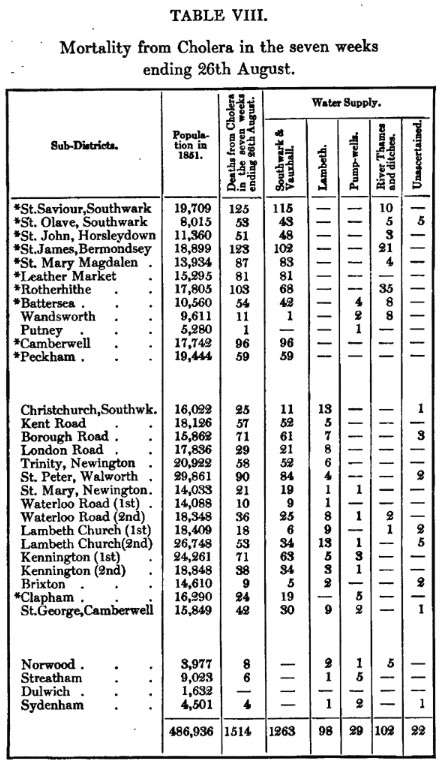
```

---
```{r, echo = TRUE, out.width="40%", fig.retina = 1, fig.align='center'}
snowtable8 <- read_csv("https://github.com/jnseawright/PS406/raw/main/data/snowtable8.csv")
snowlm <- lm(deathsOverall ~ supplier, data=snowtable8)
```
---
```{r, echo = TRUE, out.width="40%", fig.retina = 1, fig.align='center'}
summary(snowlm)
```

---
```{r, echo = TRUE, out.width="40%", fig.retina = 1, fig.align='center'}
snowlm2 <- lm(I(log(pop1851))~ supplier, data=snowtable8)
summary(snowlm2)
```

---
### Vietnam War Draft Lottery

---
```{r, echo = FALSE, out.width="100%", fig.retina = 1, fig.align='center'}
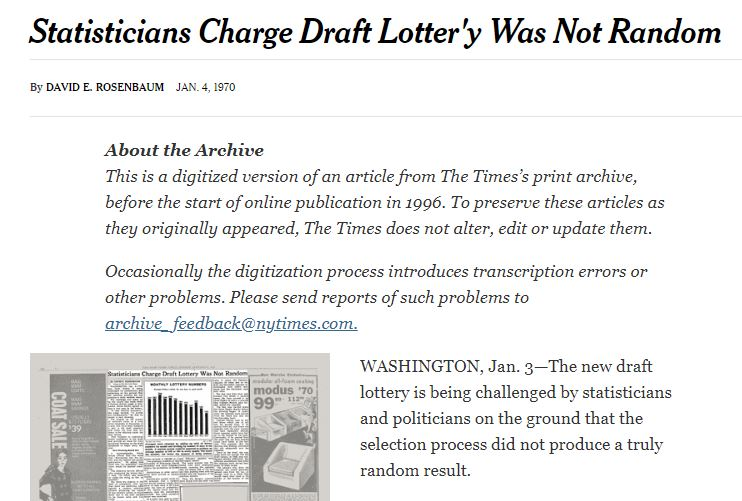
```

---
```{r, echo = TRUE, out.width="100%", fig.retina = 1, fig.align='center'}
draft1970 <- read_csv("https://github.com/jnseawright/PS406/raw/main/data/draft1970.csv")
```
---
```{r, echo = TRUE, out.width="70%", fig.retina = 1, fig.align='center'}
boxplot(rank~month, data=draft1970)
```

---
```{r, echo = TRUE, out.width="100%", fig.retina = 1, fig.align='center'}
draftlm <- lm(rank ~ day, data=draft1970)
```
---
```{r, echo = TRUE, out.width="100%", fig.retina = 1, fig.align='center'}
summ(draftlm)
```

---

What does this tell us about assumptions of randomization?

---
```{r, echo = TRUE, out.width="100%", fig.retina = 1, fig.align='center'}
draft1971 <- read_csv("https://github.com/jnseawright/PS406/raw/main/data/draft1971.csv")
```
---
```{r, echo = TRUE, out.width="70%", fig.retina = 1, fig.align='center'}
boxplot(rank~month, data=draft1971)
```

---
```{r, echo = TRUE, out.width="100%", fig.retina = 1, fig.align='center'}
draft71lm <- lm(rank ~ day, data=draft1971)
```
---
```{r, echo = TRUE, out.width="100%", fig.retina = 1, fig.align='center'}
summ(draft71lm)
```

---

Were randomization issues fixed?

---
```{r, echo = FALSE, out.width="85%", fig.retina = 1, fig.align='center'}
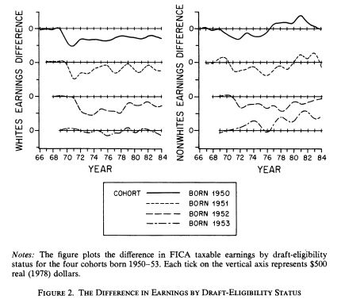
```

---
### Lottery Winners and Political Attitudes

---
```{r, echo = FALSE, out.width="60%", fig.retina = 1, fig.align='center'}
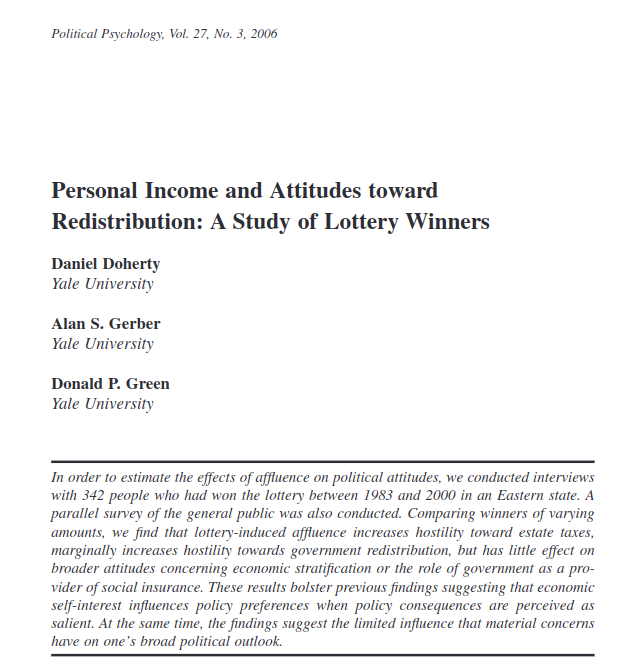
```

---
```{r, echo = FALSE, out.width="80%", fig.retina = 1, fig.align='center'}
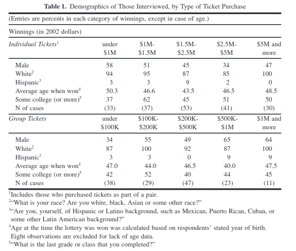
```

---
```{r, echo = FALSE, out.width="100%", fig.retina = 1, fig.align='center'}
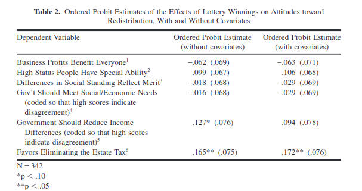
```
---

Do we think that randomized earnings have the same causal effect as nonrandomized earnings?

---
### Classic Natural Experiments: Summary

**The Big Idea**: Treatment is **"as‑if randomly assigned"** by nature, policy, or accident.

**In Potential Outcomes Terms**:

\[
(Y_i(1), Y_i(0)) \perp\!\!\!\perp D_i \mid X_i
\]

- Treatment assignment \(D_i\) is independent of potential outcomes, **conditional on covariates** \(X_i\) (if needed).
- This is exactly the **unconfoundedness (selection on observables)** assumption from Week 2.

---

### What This Means

- If the natural experiment is credible, we don't need to control for many (or any) covariates – the "as‑if random" assignment does the work.
- In practice, we often check balance on pre‑treatment covariates to support the claim.
- The estimand is the **Average Treatment Effect (ATE)** – the same as in a randomized experiment.

---

### Key Conditions for a Valid Classic Natural Experiment

1. **Ignorability / Unconfoundedness**: Treatment is independent of potential outcomes (given covariates, if any).

2. **Overlap**: For every level of covariates, there are both treated and control units.

3. **SUTVA**: No interference, no hidden treatment variations (as in experiments).

---

### Takeaway

When nature randomizes, we can analyze the data **as if it came from an experiment** – using difference in means, regression with few controls, or randomization inference.

The burden of proof is on the researcher to convince us that the assignment really is **as‑if random**.

---
### IV Natural Experiment

1.  "Nature" randomizes a cause of the treatment.

    -   Call the treatment $X$.

    -   Call the randomized cause of the treatment $Z$.

2.  $Z$ only affects $Y$ through its effects on $X$.

3.  Treatment caused by the randomized cause has the same effect as
    treatment with any other cause would have.

---
### IV Natural Experiment: Colonial Origins of Development

- **Causal question**: Do institutions cause economic development?
- **Problem**: Institutions are endogenous – countries with better institutions may differ in unobserved ways (culture, geography, human capital).
- **Proposed solution**: Use **settler mortality** as an instrument for institutions.

---
### The Acemoglu, Johnson & Robinson (2001) IV Setup

```{r ajr_dag, echo = FALSE, fig.width = 6, fig.height = 4}
library(dagitty)
library(ggdag)

dag <- dagitty('dag {
  "Settler Mortality" [pos="0,1"]
  "Institutions Today" [pos="1,0.5"]
  "Development (GDP)" [pos="2,0.5"]
  "Unobserved Factors" [pos="1,1.5"]

  "Settler Mortality" -> "Institutions Today"
  "Institutions Today" -> "Development (GDP)"
  "Unobserved Factors" -> "Institutions Today"
  "Unobserved Factors" -> "Development (GDP)"
}')

ggdag(dag, text_col = "red") + theme_dag()
```

---

- **Instrument** ($Z$): Settler mortality rates among European colonists in the 17th–19th centuries.
- **Treatment** ($D$): Quality of institutions today (e.g., protection against expropriation).
- **Outcome** ($Y$): Log GDP per capita today.
- **Confounder** ($U$): Unobserved factors like culture, geography, human capital.

---
### The Logic: Why Settler Mortality?

AJR's argument:

1. **Where settlers faced high mortality**, they did not settle permanently. Instead, they set up **extractive institutions** (to extract resources) that persisted over time.
2. **Where settlers faced low mortality**, they settled in large numbers and established **institutions protecting property rights** – again, persisting to the present.
3. Settler mortality in the 1600s–1800s might be **exogenous** to modern economic development, except through its effect on institutions.

---
### How the IV Assumptions Are Met (or Argued)

| Assumption | Meaning | In the AJR Setting |
|------------|---------|---------------------|
| **Relevance** | $Z$ predicts $D$ | High settler mortality → extractive institutions → weaker property rights today. First stage is strong. |
| **Exclusion** | $Z$ affects $Y$ only through $D$ | Settler mortality centuries ago has no direct effect on modern GDP, except via the institutions it shaped. (Must defend: no effect through culture, disease environment, etc.) |
| **Independence** | $Z$ is as‑good‑as randomly assigned | Conditional on covariates? Settler mortality is argued to be a historical accident, not correlated with other determinants of development. |
| **Monotonicity** | No defiers | Implicit: Higher mortality doesn't lead to better institutions in some places and worse in others – the effect is consistent in direction. |

---
### The Exclusion Restriction: The Key Challenge

The exclusion restriction is the most debated assumption in AJR:

- Could high settler mortality affect development **through other channels**?
  - **Disease environment**: High mortality areas may still have malaria, etc., affecting health and productivity today.
  - **Culture**: Different settlement patterns may have created different cultural legacies.
  - **Human capital**: Settlers brought skills; extractive colonies did not.

---

AJR address these concerns by:
- Controlling for contemporary malaria risk.
- Using other instruments (e.g., population density in 1500).
- Showing robustness across specifications.

---
### What Does the IV Estimate?

Under the assumptions, the IV estimate identifies the **Local Average Treatment Effect (LATE)** for *compliers* – countries whose institutions were changed by settler mortality conditions.

These are countries that:
- Would have had good institutions if mortality was low.
- Would have had bad institutions if mortality was high.
- (Not countries that would have had the same institutions regardless.)

---

This is exactly the set of countries where colonial settlement patterns mattered – arguably the relevant group for testing the institutional theory.

---

```{r, echo = FALSE, out.height="100%", fig.retina = 1, fig.align='center'}
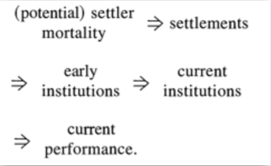
```

---

```{r, echo = FALSE, out.height="100%", fig.retina = 1, fig.align='center'}
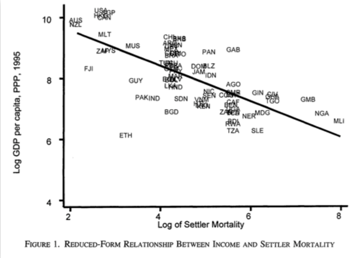
```

---

```{r, echo = FALSE, out.height="100%", fig.retina = 1, fig.align='center'}
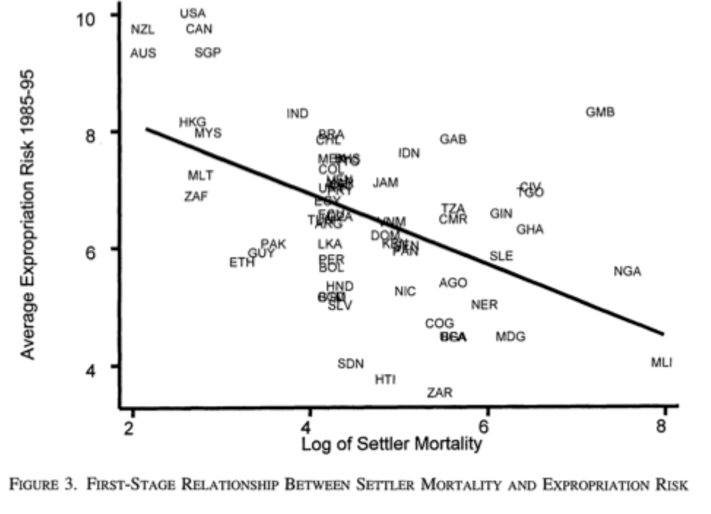
```

---

```{r, echo = FALSE, out.width="80%", fig.retina = 1, fig.align='center'}
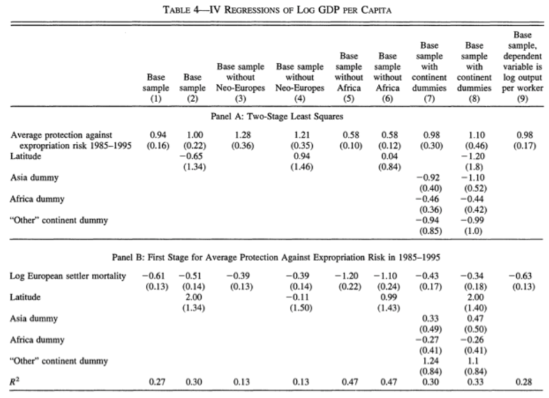
```

---
### Why This Is a Famous IV Natural Experiment

- The instrument is **historical** – clearly pre-dating modern outcomes.
- The logic is **theoretically grounded** in theories of colonialism and institutional persistence.
- The assumptions are **explicitly stated and debated** – a model of transparent causal inference.
- It spawned an entire literature on institutions and development, and remains a standard teaching example for IV.


---
### RDD

1.  There is an assignment variable, $Z$.

2.  Cases are assigned to treatment if and only if $Z$ is greater than a
    predetermined threshold value, $T$.

3.  There are enough cases that lots have scores of $Z$ that are just
    above and just below $T$.

---
### Example: Maimonides' Rule

> "The number of pupils assigned to each teacher is twenty-five. If
> there are fifty, we appoint two teachers. If there are forty, we
> appoint an assistant, at the expense of the town." (Baba Bathra,
> Chapter II, page 21a; translated by Epstein 1976: 214)

---
### Example: Maimonides' Rule

> "Twenty-five children may be put in charge of one teacher. If the
> number in the class exceeds twenty-five but is not more than forty, he
> should have an assistant to help with the instruction. If there are
> more than forty, two teachers must be appointed." (Maimonides, given
> in Hyamson 1937: 58b)

---
### Example: Maimonides' Rule

-   Maimonides' Rule is used to determine class sizes in Israel.

-   Angrist and Lavy (1999) use this to carry out an RDD analysis of the
    effects of class size on educational outcomes.

---
### Example: Maimonides' Rule

```{r, echo = FALSE, out.width="65%", fig.retina = 1, fig.align='center'}
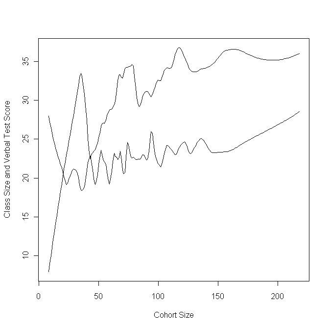
```

---
### Example: Maimonides' Rule

```{r, echo = FALSE, out.width="65%", fig.retina = 1, fig.align='center'}
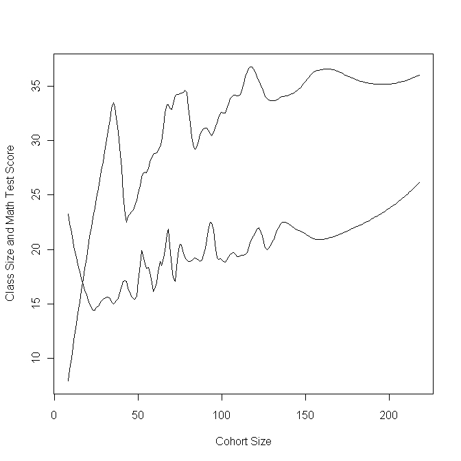
```

---
### Example: Maimonides' Rule

If the RDD is a success, then the groups just above and below the cutpoint on $Z$ should be balanced, both in terms of the number of cases and in terms of any measured background variables.

1. It may be a good idea to do a balance test between treatment and control cases within a bandwidth around the cutpoint.

2. At the very least, look at a histogram of cases to check that there are about the same number of cases just above and just below the threshold.

---

```{r, echo = FALSE, out.width="85%", fig.retina = 1, fig.align='center'}
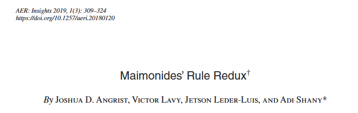
```

---

```{r, echo = FALSE, out.width="85%", fig.retina = 1, fig.align='center'}
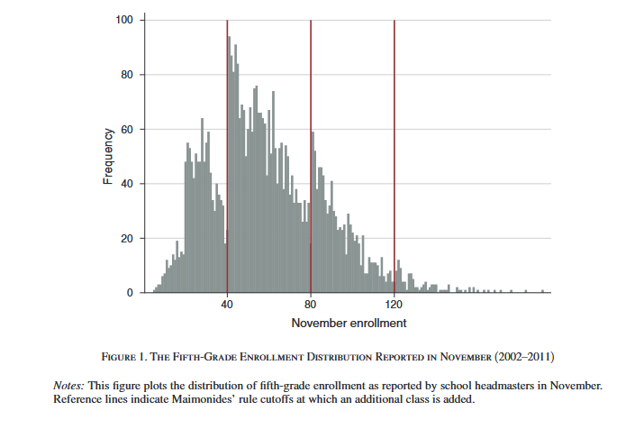
```

---

```{r, echo = FALSE, out.width="85%", fig.retina = 1, fig.align='center'}
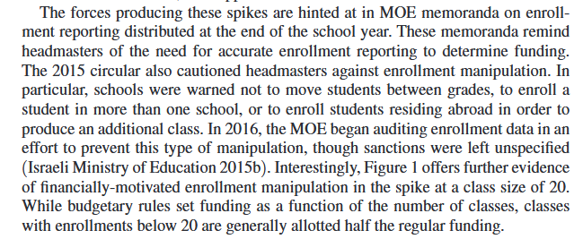
```


---
### Regression Discontinuity Design: Summary

**The Big Idea**: Treatment is assigned by a cutoff on a continuous running variable. Comparing units just above and just below the cutoff mimics randomization.

**In Potential Outcomes Terms**:

\[
\lim_{x \downarrow c} E[Y(0) | X=x] = \lim_{x \uparrow c} E[Y(0) | X=x]
\]

- This is the **continuity assumption**: Potential outcomes are continuous at the cutoff.
- Under continuity, any jump in the observed outcome at \(c\) is the causal effect.

---

### What RDD Estimates

- **Sharp RDD**: The average treatment effect for units at the cutoff:
  \[
  \tau_{SRD} = E[Y(1) - Y(0) | X = c]
  \]

- **Fuzzy RDD**: The LATE for compliers at the cutoff:
  \[
  \tau_{FRD} = \frac{\lim_{x\downarrow c} E[Y|X=x] - \lim_{x\uparrow c} E[Y|X=x]}{\lim_{x\downarrow c} E[D|X=x] - \lim_{x\uparrow c} E[D|X=x]}
  \]

---

### Key Takeaways

| What makes a good RDD? | What threatens validity? |
|------------------------|--------------------------|
| Clear, non-manipulable cutoff | Precise manipulation of running variable |
| Many observations near cutoff | Discontinuities in covariates |
| Graphical evidence of jump | Other treatments changing at cutoff |
| Robustness to bandwidth choice | Discontinuity in density (McCrary test) |
| Balance on pre-treatment covariates | Model dependence (global polynomials) |

---

### The RDD Credibility Checklist

When reading or conducting an RDD study, ask:

☐ **Is there a clear cutoff?** Is treatment assignment deterministic (or fuzzy) at that point?

☐ **Is there evidence of manipulation?** Density test, heaping, sorting?

☐ **Are covariates balanced?** Do pre-treatment variables jump at the cutoff?

---

### The RDD Credibility Checklist

☐ **Is the graphical evidence convincing?** Plot with bins, fits, and confidence bands.

☐ **Are results robust?** Check bandwidth sensitivity, placebo cutoffs, polynomial order.

☐ **Is the interpretation precise?** RDD estimates the effect *at the cutoff* – does that generalize?


---
### Difference-in-Differences: A Natural Experiment Workhorse

- **Research design**: Compare the change in outcomes for a treated group to the change in outcomes for an untreated comparison group.
- **Why it's a natural experiment**: Treatment assignment is "as-if random" conditional on common trends – nature (or policy) determines who gets treated and when.

---

**The canonical setup**:
- Two periods: Pre-treatment (\(t=1\)) and post-treatment (\(t=2\))
- Two groups: Treated (\(D=1\)) and untreated (\(D=0\))
- Treatment occurs between periods for the treated group only.

---
### The DiD Estimand

In potential outcomes notation:

\[
ATT = E[Y_{i,2}(1) - Y_{i,2}(0) | D_i = 1]
\]

But \(Y_{i,2}(0)\) is unobserved for treated units. DiD imputes it using:

\[
\hat{Y}_{i,2}(0) = Y_{i,1} + \underbrace{(E[Y_{j,2}|D=0] - E[Y_{j,1}|D=0])}_{\text{common trend}}
\]

---

**The DiD estimator**:

\[
\hat{\tau}_{DiD} = (\bar{Y}_{T,2} - \bar{Y}_{T,1}) - (\bar{Y}_{C,2} - \bar{Y}_{C,1})
\]

---
### The Parallel Trends Assumption

**Core identifying assumption**: In the absence of treatment, the treated and control groups would have followed the same trend.

Formally:
\[
E[Y_{i,2}(0) - Y_{i,1}(0) | D_i = 1] = E[Y_{i,2}(0) - Y_{i,1}(0) | D_i = 0]
\]

---

**What this means**:
- Levels can differ (that's why we use changes)
- The path of outcomes would have been parallel
- Any violation (e.g., differential economic shocks) biases the estimate

---
### Visualizing Parallel Trends

```{r did_plot, echo = FALSE, fig.width = 6, fig.height = 4}
# Simulate data for visualization
set.seed(2026)
time <- c(1, 2)
control <- c(100, 105) + rnorm(2, 0, 2)
treated <- c(110, 130) + rnorm(2, 0, 2)

plot(time, control, type = "b", col = "blue", ylim = c(90, 140), 
     xlab = "Time", ylab = "Outcome", main = "Difference-in-Differences")
lines(time, treated, type = "b", col = "red")
lines(time, c(treated[1], control[2] + (treated[1] - control[1])), 
      lty = 2, col = "gray")
legend("topleft", legend = c("Control", "Treated", "Counterfactual"), 
       col = c("blue", "red", "gray"), lty = c(1,1,2))
text(1.5, 125, "Treatment effect")
```

---

- The dashed line shows the **counterfactual** trend for treated units (parallel to control)
- The gap between observed and counterfactual in period 2 is the **treatment effect**

---
### The Canonical DiD Example: Card and Krueger (1994)

- **Question**: Does raising the minimum wage reduce employment?
- **Setting**: New Jersey raised minimum wage; Pennsylvania did not.
- **Data**: Fast food restaurants in both states, before and after the policy.

| Group | Pre-treatment | Post-treatment | Change |
|-------|---------------|----------------|--------|
| NJ (treated) | 20.44 | 21.03 | +0.59 |
| PA (control) | 23.33 | 21.17 | -2.16 |
| **DiD estimate** | | | **+2.76** |

- Result: Employment **increased** in NJ relative to PA – contrary to traditional economic theory.
- Sparked decades of debate about the parallel trends assumption.

---
### Threats to Parallel Trends

1. **Differential time shocks**: PA had a recession; NJ boomed.
2. **Composition changes**: Different types of restaurants open/close.
3. **Ashenfelter's dip**: Units select into treatment after a temporary decline.
4. **Anticipation effects**: Units change behavior before treatment.

---

**Solutions**:
- Add unit-specific time trends
- Use multiple pre-treatment periods to test for parallel pre-trends
- Include covariates (conditional parallel trends)

---
### Synthetic Control: When No Single Unit Is a Good Comparison

- **Problem**: In comparative case studies (e.g., California's Proposition 99), no single state provides a perfect counterfactual.
- **Solution**: Construct a **synthetic control** – a weighted average of donor units that matches the treated unit on pre-treatment outcomes and covariates.

**The big idea**: Let the data choose the optimal comparison group.

---
### The Synthetic Control Estimand

For a treated unit \(j=1\) and donor units \(j=2,...,J+1\):

\[
\hat{Y}_{1t}(0) = \sum_{j=2}^{J+1} w_j Y_{jt}
\]

where weights \(w_j \geq 0\) and \(\sum w_j = 1\).

---

We choose weights to minimize:

\[
\sum_{m=1}^{M} v_m (X_{1m} - \sum_{j=2}^{J+1} w_j X_{jm})^2
\]

- \(X\) includes pre-treatment outcomes and covariates
- \(v_m\) are predictor importance weights (chosen to minimize pre-treatment MSPE)

---
### The Canonical Example: California Proposition 99 (Abadie et al. 2010)

- **Intervention**: California passed tobacco tax Proposition 99 in 1988.
- **Question**: Did it reduce cigarette consumption?
- **Donor pool**: 38 states without similar legislation.
- **Predictors**: Pre-treatment cigarette sales, income, beer consumption, age composition.

---

```{r synth_setup, echo = TRUE, eval = FALSE}
library(tidysynth)

smoking_out <- smoking %>%
  synthetic_control(outcome = cigsale,
                    unit = state,
                    time = year,
                    i_unit = "California",
                    i_time = 1988,
                    generate_placebos = TRUE) %>%
  generate_predictor(time_window = 1980:1988,
                     ln_income = mean(lnincome, na.rm = TRUE),
                     ret_price = mean(retprice, na.rm = TRUE),
                     youth = mean(age15to24, na.rm = TRUE)) %>%
  generate_predictor(time_window = 1984:1988,
                     beer_sales = mean(beer, na.rm = TRUE)) %>%
  generate_predictor(time_window = 1975, cigsale_1975 = cigsale) %>%
  generate_predictor(time_window = 1980, cigsale_1980 = cigsale) %>%
  generate_predictor(time_window = 1988, cigsale_1988 = cigsale) %>%
  generate_weights(optimization_window = 1970:1988) %>%
  generate_control()
```

---
### Visualizing the Synthetic Control

```{r synth_plot, echo = TRUE, eval = FALSE}
# Plot the results
smoking_out %>% plot_trends()

# Examine weights
smoking_out %>% plot_weights()

# Check balance
smoking_out %>% grab_balance_table()
```

- **Pre-treatment fit**: Synthetic and observed California should track closely.
- **Post-treatment divergence**: The gap is the estimated treatment effect.
- **Weights**: Which states contribute to the synthetic control? (Often just a few.)

---
### The Synthetic Control Advantage

**Why synthetic control often beats DiD**:

1. **Transparency**: We see exactly which units form the counterfactual.
2. **No extrapolation**: Weights are non-negative and sum to one.
3. **Data-driven**: No researcher discretion in selecting comparison units.
4. **Visual placebo tests**: We can apply the same method to every donor unit.

---
### Synthetic Control: Key Takeaways

| What makes a good SC? | What threatens validity? |
|------------------------|--------------------------|
| Long pre-treatment period | Interpolation bias (donors too different) |
| Good pre-treatment fit | Structural breaks in donors |
| Diverse donor pool | Treatment diffusion to donors |
| Plausible exclusion of treated unit's influencers | Anticipation effects |

---

**In potential outcomes terms**: SC imputes the counterfactual using a weighted average of untreated units, chosen to match pre-treatment characteristics and outcomes.

---
### Natural Experiments: Key Takeaways

| Design | Identification Strategy | Canonical Example |
|--------|------------------------|--------------------|
| **Classic NE** | As-if random treatment | Snow (cholera), Draft lottery |
| **IV-type NE** | As-if random instrument | AJR (settler mortality) |
| **RDD** | Discontinuity at cutoff | Maimonides' Rule |
| **DiD** | Parallel trends | Card & Krueger (min wage) |
| **Synthetic Control** | Weighted donor pool | CA Prop 99 (tobacco tax) |

**Common thread**: Each design uses **design** rather than statistical adjustment to approximate randomization. The credibility of any natural experiment rests on the plausibility of its identifying assumptions.

---

**Next week**: We dive deep into **Instrumental Variables** – the workhorse for IV-type natural experiments and many other settings.
