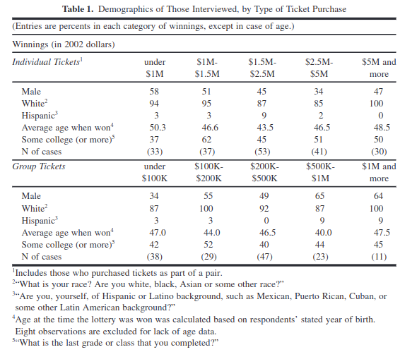

class: center, middle

```{css, echo=FALSE}
pre {
  max-height: 400px;
  overflow-y: auto;
}

pre[class] {
  max-height: 200px;
}
```

```{r, load_refs, include=FALSE, cache=FALSE}
# Initializes the bibliography
library(RefManageR)

library(ggplot2)
library(dplyr)
library(readr)
library(nlme)
library(jtools)

BibOptions(check.entries = FALSE,
           bib.style = "authoryear", # Bibliography style
           max.names = 3, # Max author names displayed in bibliography
           sorting = "nyt", #Name, year, title sorting
           cite.style = "authoryear", # citation style
           style = "markdown",
           hyperlink = FALSE,
           dashed = FALSE)
#myBib <- ReadBib("assets/myBib.bib", check = FALSE)
# Note: don't forget to clear the knitr cache to account for changes in the
# bibliography.

peruemotions <- read.csv("https://github.com/jnseawright/PS406/raw/main/data/peruemotions.csv")
```
```{r xaringan-themer, include=FALSE, warning=FALSE}
library(xaringanthemer,MnSymbol)
style_mono_accent(
  base_color = "#1c5253",
  header_font_google = google_font("Josefin Sans"),
  text_font_google   = google_font("Montserrat", "300", "300i"),
  code_font_google   = google_font("Fira Mono"),
  text_font_size = "1.6rem"
)
```

---
### Typology of Natural Experiments

-   Classic Natural Experiment

-   Instrumental Variables-Type Natural Experiment

-   Regression-Discontinuity Design

---
### Key Ideas for Natural Experiments

The cause of the cause, and the cause of the cause of the cause

---
### Classic Natural Experiment

1.  "Nature" randomizes the treatment.

    -   No discretion is involved in assigning treatments, or the
        relevant information is unavailable or unused.

2.  Randomized treatment has the same effect as non-randomized treatment
    would have.

---
### Snow: the Most Famous Natural Experiment
```{r, echo = FALSE, out.width="100%", fig.retina = 1, fig.align='center'}
library(knitr)

```

---
### Snow: the Most Famous Natural Experiment
```{r, echo = FALSE, out.width="100%", fig.retina = 1, fig.align='center'}

```

---
### Snow: the Most Famous Natural Experiment
```{r, echo = FALSE, out.width="50%", fig.retina = 1, fig.align='center'}

```

---
### Snow on Cholera
```{r, echo = FALSE, out.width="40%", fig.retina = 1, fig.align='center'}
include_graphics("images/snowcrossdistrict.jpg")
```

---
''Although the facts shown in the above table afford very strong evidence
of the powerful influence which the drinking of water containing the
sewage of a town exerts over the spread of cholera, when that disease is
present, yet the question does not end here; for the intermixing of the
water supply of the Southwark and Vauxhall Company with that of the
Lambeth Company, over an extensive part of London, admitted of the
subject being sifted in such a way as to yield the most incontrovertible
proof on one side or the other.''

---
''In the sub-districts enumerated in the above table as being supplied by
both Companies, the mixing of the supply is of the most intimate kind.
The pipes of each Company go down all the streets, and into nearly all
the courts and alleys. A few houses are supplied by one Company and a
few by the other, according to the decision of the owner or occupier at
that time when the Water Companies were in active competition. In many
cases a single house has a supply different from that on either side.
Each company supplies both rich and poor, both large houses and small;
there is no difference either in the condition or occupation of the
persons receiving the water of the different Companies.''

---

```{r, echo = FALSE, out.width="40%", fig.retina = 1, fig.align='center'}

```

---
```{r, echo = TRUE, out.width="40%", fig.retina = 1, fig.align='center'}
snowtable8 <- read_csv("https://github.com/jnseawright/PS406/raw/main/data/snowtable8.csv")
snowlm <- lm(deathsOverall ~ supplier, data=snowtable8)
```
---
```{r, echo = TRUE, out.width="40%", fig.retina = 1, fig.align='center'}
summary(snowlm)
```

---
```{r, echo = TRUE, out.width="40%", fig.retina = 1, fig.align='center'}
snowlm2 <- lm(I(log(pop1851))~ supplier, data=snowtable8)
summary(snowlm2)
```

---
### Brady and McNulty on Costs of Voting

---
```{r, echo = FALSE, out.width="100%", fig.retina = 1, fig.align='center'}

```

---
### Vietnam War Draft Lottery

---
```{r, echo = FALSE, out.width="100%", fig.retina = 1, fig.align='center'}
include_graphics("images/draftrandom.JPG")
```

---
```{r, echo = TRUE, out.width="100%", fig.retina = 1, fig.align='center'}
draft1970 <- read_csv("https://github.com/jnseawright/PS406/raw/main/data/draft1970.csv")
```
---
```{r, echo = TRUE, out.width="70%", fig.retina = 1, fig.align='center'}
boxplot(rank~month, data=draft1970)
```

---
```{r, echo = TRUE, out.width="100%", fig.retina = 1, fig.align='center'}
draftlm <- lm(rank ~ day, data=draft1970)
```
---
```{r, echo = TRUE, out.width="100%", fig.retina = 1, fig.align='center'}
summ(draftlm)
```
---
```{r, echo = TRUE, out.width="100%", fig.retina = 1, fig.align='center'}
draft1971 <- read_csv("https://github.com/jnseawright/PS406/raw/main/data/draft1971.csv")
```
---
```{r, echo = TRUE, out.width="70%", fig.retina = 1, fig.align='center'}
boxplot(rank~month, data=draft1971)
```

---
```{r, echo = TRUE, out.width="100%", fig.retina = 1, fig.align='center'}
draft71lm <- lm(rank ~ day, data=draft1971)
```
---
```{r, echo = TRUE, out.width="100%", fig.retina = 1, fig.align='center'}
summ(draft71lm)
```

---
```{r, echo = FALSE, out.width="85%", fig.retina = 1, fig.align='center'}
include_graphics("images/angrist.JPG")
```

---
### Lottery Winners and Political Attitudes

---
```{r, echo = FALSE, out.width="60%", fig.retina = 1, fig.align='center'}

```

---
```{r, echo = FALSE, out.width="80%", fig.retina = 1, fig.align='center'}

```

---
```{r, echo = FALSE, out.width="100%", fig.retina = 1, fig.align='center'}

```

---
### IV Natural Experiment

1.  "Nature" randomizes a cause of the treatment.

    -   Call the treatment $X$.

    -   Call the randomized cause of the treatment $Z$.

2.  $Z$ only affects $Y$ through its effects on $X$.

3.  Treatment caused by the randomized cause has the same effect as
    treatment with any other cause would have.

---
### Colonialism and Development

```{r, echo = FALSE, out.height="100%", fig.retina = 1, fig.align='center'}

```
---
### Colonialism and Development

```{r, echo = FALSE, out.height="100%", fig.retina = 1, fig.align='center'}

```
---

### Colonialism and Development

```{r, echo = FALSE, out.height="100%", fig.retina = 1, fig.align='center'}

```

---
### Colonialism and Development

```{r, echo = FALSE, out.width="80%", fig.retina = 1, fig.align='center'}
include_graphics("images/settlers4.png")
```

---
### Vietnam Draft Lottery and Returns to Education

```{r, echo = FALSE, out.width="80%", fig.retina = 1, fig.align='center'}

```

---
```{r, echo = FALSE, out.width="50%", fig.retina = 1, fig.align='center'}

```

---
```{r, echo = FALSE, out.height="100%", fig.retina = 1, fig.align='center'}
include_graphics("images/Pierskalla.JPG")
```

---
```{r, echo = FALSE, out.height="100%", fig.retina = 1, fig.align='center'}

```

---
```{r, echo = FALSE, out.height="100%", fig.retina = 1, fig.align='center'}
include_graphics("images/PierskallaInstrumentFootnote.JPG")
```

---
```{r, echo = FALSE, out.height="100%", fig.retina = 1, fig.align='center'}

```

---
### RDD

1.  There is an assignment variable, $Z$.

2.  Cases are assigned to treatment if and only if $Z$ is greater than a
    predetermined threshold value, $T$.

3.  There are enough cases that lots have scores of $Z$ that are just
    above and just below $T$.

---
### Example: Maimonides' Rule

> "The number of pupils assigned to each teacher is twenty-five. If
> there are fifty, we appoint two teachers. If there are forty, we
> appoint an assistant, at the expense of the town." (Baba Bathra,
> Chapter II, page 21a; translated by Epstein 1976: 214)

---
### Example: Maimonides' Rule

> "Twenty-five children may be put in charge of one teacher. If the
> number in the class exceeds twenty-five but is not more than forty, he
> should have an assistant to help with the instruction. If there are
> more than forty, two teachers must be appointed." (Maimonides, given
> in Hyamson 1937: 58b)

---
### Example: Maimonides' Rule

-   Maimonides' Rule is used to determine class sizes in Israel.

-   Angrist and Lavy (1999) use this to carry out an RDD analysis of the
    effects of class size on educational outcomes.

---
### Example: Maimonides' Rule

```{r, echo = FALSE, out.width="65%", fig.retina = 1, fig.align='center'}

```

---
### Example: Maimonides' Rule

```{r, echo = FALSE, out.width="65%", fig.retina = 1, fig.align='center'}
include_graphics("images/maimonmath.jpeg")
```

---
```{r, echo = FALSE, out.width="65%", fig.retina = 1, fig.align='center'}
include_graphics("images/Broockman.JPG")
```

---
```{r, echo = FALSE, out.width="65%", fig.retina = 1, fig.align='center'}
include_graphics("images/BroockmanRDDVisual.JPG")
```

---
```{r, echo = FALSE, out.width="65%", fig.retina = 1, fig.align='center'}
include_graphics("images/BroockmanSuccess.JPG")
```

---
```{r, echo = FALSE, out.width="65%", fig.retina = 1, fig.align='center'}
include_graphics("images/BroockmanFailure.JPG")
```

---
### RDD

RDD isn't a good idea if:

-   Actors are aware of the discontinuity and adjust their behavior
    accordingly.

-   The variable which assigns the discontinuity is so coarsely measured
    or distributed that the cases nearest to the divide are not close to
    each other.
