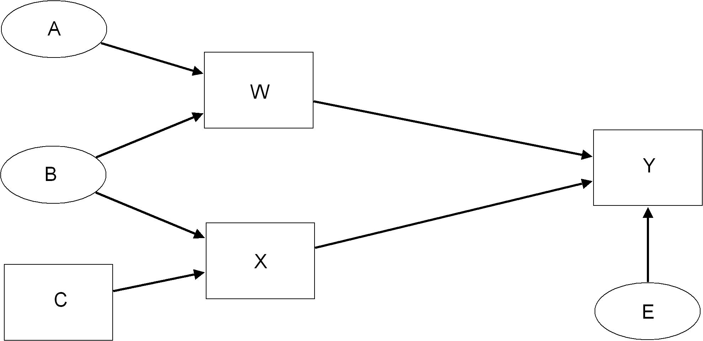
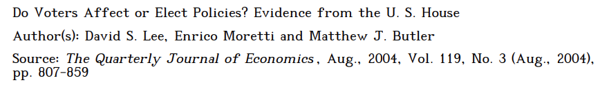
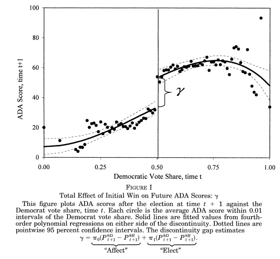

class: center, middle

```{css, echo=FALSE}
pre {
  max-height: 400px;
  overflow-y: auto;
}

pre[class] {
  max-height: 200px;
}
```

```{r, load_refs, include=FALSE, cache=FALSE}
# Initializes the bibliography
library(RefManageR)

library(ggplot2)
library(dplyr)
library(readr)
library(nlme)
library(jtools)

BibOptions(check.entries = FALSE,
           bib.style = "authoryear", # Bibliography style
           max.names = 3, # Max author names displayed in bibliography
           sorting = "nyt", #Name, year, title sorting
           cite.style = "authoryear", # citation style
           style = "markdown",
           hyperlink = FALSE,
           dashed = FALSE)
#myBib <- ReadBib("assets/myBib.bib", check = FALSE)
# Note: don't forget to clear the knitr cache to account for changes in the
# bibliography.

peruemotions <- read.csv("https://github.com/jnseawright/PS406/raw/main/data/peruemotions.csv")
```
```{r xaringan-themer, include=FALSE, warning=FALSE}
library(xaringanthemer,MnSymbol)
style_mono_accent(
  base_color = "#1c5253",
  header_font_google = google_font("Josefin Sans"),
  text_font_google   = google_font("Montserrat", "300", "300i"),
  code_font_google   = google_font("Fira Mono"),
  text_font_size = "1.6rem"
)
```

---
### Endogeneity in OLS

-   $E(\mathbf{u} | \mathbf{X}) = 0$?

-   As you'll recall,
    $E(\hat{\mathbf{\beta}}) = \beta + (\mathbf{X}^{T} \mathbf{X})^{-1} E(\mathbf{X}^{T} \mathbf{u})$.
    So, if $E(\mathbf{X}^{T} \mathbf{u}) = \mathbf{\nu} \neq 0$, then
    $E(\hat{\mathbf{\beta}} - \mathbf{\beta}) = (\mathbf{X}^{T} \mathbf{X})^{-1} \mathbf{\nu} \neq 0$.

---
### Consequences of Endogeneity

-   When $\mathbf{X}$ is endogenous, then our estimates of
    $\hat{\mathbf{\beta}}$ will be a mixture of the desired relationship
    between $\mathbf{X}$ and $\mathbf{y}$ *and* the nuisance
    relationship between $\mathbf{X}$ and $\mathbf{u}$.

---
### How Can Endogeneity Arise?

-   Omitted explanatory variables
-   Measurement error on the right-hand side of the model
-   Simultaneity between the right- and left-hand sides of the model
-   etc.

---
### What to Do When Endogeneity Is a Problem?

1.  Give up.

2.  Try to change the model by including all omitted relevant variables.

3.  Find an instrument.

4.  Find other data.

---
### Instrumental Variables

-   Suppose the model is:
    $\mathbf{y} = \mathbf{W} \mathbf{\gamma} + \mathbf{x} \beta + \mathbf{\epsilon}$.
    The $\mathbf{W}$ variables are exogenous, but the $\mathbf{x}$
    variable is endogenous.

-   Now, assume that there exists a variable $z$ that *doesn't* belong
    in the regression model, with the following two characteristics:

    -   $cov(\mathbf{z}^{T} \mathbf{x}) \neq 0$

    -   $E(\mathbf{z}^{T} \mathbf{\epsilon}) = 0$

---
### Instrumental Variables

If these conditions are met (doesn't belong in the regression, related
linearly with $\mathbf{x}$, no connection with $\mathbf{\epsilon})$,
then $\mathbf{z}$ meets the mathematical definition of an *instrument*.

---
### Instrumental Variables

```{r, echo = FALSE, out.width="100%", fig.retina = 1, fig.align='center'}
library(knitr)

```

---
### Instrumental Variables

-   Let's momentarily consider a bivariate regression,
    $\mathbf{y} = \mathbf{x} \beta + \mathbf{\epsilon}$, with instrument
    $\mathbf{z}$.

-   The OLS estimate of $\beta$ is
    $(\mathbf{x}^{T}\mathbf{x})^{-1} \mathbf{x}^{T}\mathbf{y}$.

-   Consider instead the IV estimate of $\beta$:
    $(\mathbf{z}^{T}\mathbf{x})^{-1} \mathbf{z}^{T}\mathbf{y}$.

-   $E(\hat{\beta}_{IV}) = E((\mathbf{z}^{T}\mathbf{x})^{-1} \mathbf{z}^{T}\mathbf{y}) = E((\mathbf{z}^{T}\mathbf{x})^{-1} \mathbf{z}^{T} [\mathbf{x} \beta + \mathbf{\epsilon}]) = E((\mathbf{z}^{T}\mathbf{x})^{-1} \mathbf{z}^{T} \mathbf{x} \beta) + E((\mathbf{z}^{T}\mathbf{x})^{-1} \mathbf{z}^{T} \mathbf{\epsilon}) = \beta + 0$

---
### Instrumental Variables

-   Now let's consider a multivariate regression,
    $\mathbf{Y} = \mathbf{X} \mathbf{\beta} + \mathbf{\epsilon}$, with
    some $t \leq k$ of the $\mathbf{X}$ variables endogenous, and with
    $t$ instruments $\mathbf{z}_{1} \ldots \mathbf{z}_{t}$.

---
### Instrumental Variables

-   The OLS estimate of $\mathbf{\beta}$ is
    $(\mathbf{X}^{T}\mathbf{X})^{-1} \mathbf{X}^{T}\mathbf{y}$.

-   Form the matrix $\mathbf{Z}$, containing the $t$ instruments, as
    well as the $k - t$ exogenous elements from $\mathbf{X}$.

-   The IV estimate of $\mathbf{\beta}$ is:
    $(\mathbf{Z}^{T}\mathbf{X})^{-1} \mathbf{Z}^{T}\mathbf{y}$.

---
### Instrumental Variables

-   As in the bivariate situation, given the IV assumptions, the IV
    estimator eliminates the problem of endogeneity.

-   This estimator only works if the number of instruments is exactly
    equal to the number of endogenous variables.

---
### Another Way of Thinking About Instrumental Variables

-   Let's partition the independent variables into two matrices,
    $\mathbf{W}$, which has the $k - t$ exogenous variables in the model
    of $\mathbf{y}$, and $\mathbf{X}$, which has the $t$ endogenous
    variables.

-   So the $\mathbf{Z}$ matrix is the $\mathbf{W}$ matrix with $t$ extra
    columns containing the instruments.

---
### Another Way of Thinking About Instrumental Variables

-   Suppose we regress each column of the $\mathbf{X}$ matrix on the
    matrix $\mathbf{Z}$ and form the fitted values.

-   $\hat{\mathbf{X}} = \mathbf{Z} (\mathbf{Z}^{T} \mathbf{Z})^{-1} \mathbf{Z}^{T} \mathbf{X}$

-   Now use $\hat{\mathbf{X}}$ in the place of $\mathbf{X}$ in the OLS
    regression formula.

---
### Another Way of Thinking About Instrumental Variables

$\hat{\mathbf{\beta}}_{IV} = (\mathbf{X}^{T}\mathbf{Z} (\mathbf{Z}^{T} \mathbf{Z})^{-1} \mathbf{Z}^{T} \mathbf{Z} (\mathbf{Z}^{T} \mathbf{Z})^{-1} \mathbf{Z}^{T} \mathbf{X})^{-1} \mathbf{X}^{T}\mathbf{Z} (\mathbf{Z}^{T} \mathbf{Z})^{-1} \mathbf{Z}^{T} \mathbf{y} = (\mathbf{X}^{T}\mathbf{Z} (\mathbf{Z}^{T} \mathbf{Z})^{-1} \mathbf{Z}^{T} \mathbf{X})^{-1} \mathbf{X}^{T}\mathbf{Z} (\mathbf{Z}^{T} \mathbf{Z})^{-1} \mathbf{Z}^{T} \mathbf{y} = (\mathbf{Z}^{T}\mathbf{X})^{-1} \mathbf{Z}^{T}\mathbf{y}$

-   So the instrumental variables estimator gives the same coefficient
    estimates as running an OLS regression using $\hat{\mathbf{X}}$ in
    the place of $\mathbf{X}$.

---
### Variance in Instrumental Variables

-   $\hat{\mathbf{X}}$ is a random variable, so the normal OLS standard
    errors will underestimate uncertainty when using IV.

-   Instead, the correct estimate of the standard errors of the
    coefficient estimates in IV is:

    -   $\hat{V} (\hat{\mathbf{\beta}}_{IV}) = \hat{\sigma}^{2} (\mathbf{Z}^{T} \mathbf{X})^{-1} \mathbf{Z}^{T} \mathbf{Z} (\mathbf{X}^{T} \mathbf{Z})^{-1}$

---
### Examples of Proposed Instruments

-   Suppose we're interested in the relationship between education and
    some political variable.

    -   One proposed instrument for education, due to David Card (1995),
        is residential proximity to a college or university.

    -   A second proposed instrument for education, due to Angrist and
        Krueger (1991) is month of birth.

    -   A third instrument, from Nguyen et al. (2016), involves genetic
        risk score for years of schooling.

---
### Examples of Proposed Instruments

-   Suppose our focus is on the relationship between economic
    performance and civil war in agricultural countries.

    -   Miguel, Satyanath, Sergenti, E. (2004) suggest using rainfall as
        an instrument for economic performance.

---
```{r, echo = TRUE, out.width="40%", fig.retina = 1, fig.align='center'}
library(haven)
mss_repdata_1_ <- read_dta("https://github.com/jnseawright/PS406/raw/main/data/mss_repdata%20(1).dta")
```

---
```{r, echo = TRUE, out.width="40%", fig.retina = 1, fig.align='center'}
library(ivreg)
migueliv <- ivreg(any_prio ~ gdp_g + gdp_g_l + y_0 + polity2l + ethfrac + relfrac + Oil + lpopl1 + lmtnest | GPCP_g + GPCP_g_l+ y_0 + polity2l + ethfrac + relfrac + Oil + lpopl1 + lmtnest, data=mss_repdata_1_)
summary(migueliv)
```

---
```{r, echo = TRUE, out.width="40%", fig.retina = 1, fig.align='center'}
library(lmtest)
library(sandwich)
```

---
```{r, echo = TRUE, out.width="40%", fig.retina = 1, fig.align='center'}
coeftest(migueliv, vcov = vcovCL(migueliv, cluster = ~country_name))
```

---
### What's Wrong with Weak Instruments?

-   For an IV estimate of a regression with only one independent
    variable and only one instrument, the IV estimator is:
    $(\mathbf{z}^{T} \mathbf{x})^{-1} \mathbf{z}^{T} \mathbf{y}$, which
    is the same as
    $cov(\mathbf{z}, \mathbf{y})/cov(\mathbf{z}, \mathbf{x})$.

---
### What's Wrong with Weak Instruments?

-   The $cov(\mathbf{z}, \mathbf{y})$ may be thought of as a combination
    of three components:

    -   the direct effect of $\mathbf{z}$ on $\mathbf{y}$,

    -   the indirect effect of $\mathbf{z}$ on $\mathbf{y}$ via
        $\mathbf{x}$,

    -   and any correlation between $\mathbf{z}$ and $\mathbf{u}$.

---
### What's Wrong with Weak Instruments?

-   If $cov(\mathbf{z}, \mathbf{x})$ is big, then a moderate amount of
    contamination of $cov(\mathbf{z}, \mathbf{y})$ with undesirable
    information will have only a small effect on the estimate.

-   If $cov(\mathbf{z}, \mathbf{x})$ is very small, then even a small
    amount of contamination of $cov(\mathbf{z}, \mathbf{y})$ with
    undesirable information will lead to serious bias in the estimate.

---
```{r, echo = TRUE, fig.retina = 1, fig.align='center'}
summary(migueliv)
```

---
### What's Wrong with Strong Instruments?

-   We know that $\mathbf{x}$ and $\mathbf{u}$ are related, or we
    wouldn't bother with the IV procedure.

-   If $\mathbf{x}$ and $\mathbf{z}$ are very strongly related, and
    $\mathbf{x}$ and $\mathbf{u}$ are also substantially related, then
    $\mathbf{z}$ and $\mathbf{u}$ are almost certainly substantially
    related, as well.

-   So a central assumption of IV regression fails.

---
```{r, echo = TRUE, fig.retina = 1, fig.align='center'}
miguellm2 <- lm(any_prio ~ gdp_g + gdp_g_l +GPCP_g + GPCP_g_l + y_0 + polity2l + ethfrac + relfrac + Oil + lpopl1 + lmtnest + year:country_name, data=mss_repdata_1_)

library(jtools)

summ(miguellm2)
```

---
### Encouragement Designs in Experiments

-   Intent-to-treat analysis

-   Use the treatment assignment as an instrument, the actual treatment
    received as the treatment variable, and the outcome as normal.

---
```{r, echo = TRUE, fig.retina = 1, fig.align='center'}
library(readr)
peruemotions <- read_csv("https://github.com/jnseawright/PS406/raw/main/data/peruemotions.csv")
```

---
```{r, echo = TRUE, fig.retina = 1, fig.align='center'}
summary(lm(outsidervote~simpletreat, data=peruemotions))
```

---
```{r, echo = TRUE, fig.retina = 1, fig.align='center'}
summary(lm(outsidervote~enojado, data=peruemotions))
```

---
```{r, echo = TRUE, fig.retina = 1, fig.align='center'}
summary(ivreg(outsidervote~enojado|simpletreat,data=peruemotions))
```

---
```{r, echo = TRUE, fig.retina = 1, fig.align='center'}
summary(lm(outsidervote~enojado+simpletreat, data=peruemotions))
```

---
### LATE

-   Let's divide our population into four categories:

    1.  Compliers: will have high $\mathbf{x}$ whenever $\mathbf{z}$ is
        high, and low $\mathbf{x}$ whenever $\mathbf{z}$ is low.

    2.  Defiers: will have low $\mathbf{x}$ whenever $\mathbf{z}$ is
        high, and high $\mathbf{x}$ whenever $\mathbf{z}$ is low.

    3.  Always-takers: will have high $\mathbf{x}$ no matter what.

    4.  Never-takers: will have low $\mathbf{x}$ no matter what.

---
### LATE

-   The effect of the instrument on the treatment is
    $\%Compliers - \%Defiers$.

-   The effect of the instrument on the outcome, given the exclusion
    restriction, is (ATE for Compliers)$*\%Compliers -$ (ATE for
    Defiers)$*\%Defiers$.

---
### Beyond LATE

-   Aronow and Carnegie propose estimating ATE by reweighting on the
    *compliance score*.

-   The compliance score is the probability that the received treatment
    is greater, when in the encouragement treatment, than it is in the
    control.

---
```{r, echo = TRUE, fig.retina = 1, fig.align='center'}
peruemotionstrim <- na.omit(data.frame(enojado=peruemotions$enojado, 
       outsidervote=peruemotions$outsidervote, 
       simpletreat=peruemotions$simpletreat, 
       Cuzco=peruemotions$Cuzco,
       age=peruemotions$age))

library(icsw)
```

---
```{r, echo = TRUE, fig.retina = 1, fig.align='center'}
exp.reweight <- with(peruemotionstrim, icsw.tsls(D=enojado, Y=outsidervote, 
       Z=simpletreat, X=cbind(1,Cuzco), W=cbind(Cuzco,age), R=100))
```

---
```{r, echo = TRUE, fig.retina = 1, fig.align='center'}
exp.reweight$coefficients

exp.reweight$coefs.se.boot
```

---
```{r, echo = TRUE, fig.retina = 1, fig.align='center'}
sidelm <- lm(enojado ~ simpletreat+Cuzco+age, data= peruemotionstrim)
summ(sidelm)
```

---
### When Might 2SLS or IV Be a Good Idea?

-   If there's a true randomization in the world that you can take
    advantage of -- but there still might be down-sides.

-   As a Hausmann test, to see if your most important results hold up
    under some alternative assumptions.

-   If a reviewer demands it of you.

---
### RDD

-   Regression-discontinuity designs (Thistlethwaite and Campbell 1960)
    are a systematic way of finding natural experiments.

    1.  Suppose treatment assignment is based on passing a threshold on
        a measured, underlying continuous variable.

    2.  Then, cases just above and just below the threshold should be
        basically identical.

    3.  So comparing borderline cases allows a valid causal inference.

---
### RDD

-   An RDD can be analyzed by comparing simple average scores just above
    and just below the threshold.

-   Alternatively, a (simple or complex) statistical model may be used
    to extrapolate from the data just above and just below the
    threshold.

---

```{r, echo = FALSE, out.width="90%", fig.retina = 1, fig.align='center'}

```

---

```{r, echo = FALSE, out.width="90%", fig.retina = 1, fig.align='center'}

```

```{r, echo = FALSE, out.width="90%", fig.retina = 1, fig.align='center'}
library(tidyverse)
library(haven)
library(estimatr)
library(texreg)
library(latex2exp)
lmb_data <- read_dta("https://github.com/jnseawright/PS406/raw/main/data/lmb-data.dta")
```

---
```{r, echo = TRUE, out.width="90%", fig.retina = 1, fig.align='center'}
#This coding example due to Yuta Toyama.
demmeans <- split(lmb_data$democrat, cut(lmb_data$lagdemvoteshare, 100)) %>%
  lapply(mean) %>%
  unlist()

agg_lmb_data <- data.frame(democrat = demmeans, lagdemvoteshare = seq(0.01,1, by = 0.01))
```

---
```{r, echo = TRUE, out.width="90%", fig.retina = 1, fig.align='center'}
lmb_data <- lmb_data %>%
  mutate(gg_group = if_else(lagdemvoteshare > 0.5, 1,0))

gg_srd = ggplot(data=lmb_data, aes(lagdemvoteshare, democrat)) +
  geom_point(aes(x = lagdemvoteshare, y = democrat), data = agg_lmb_data) +
  xlim(0,1) + ylim(-0.1,1.1) +
  geom_vline(xintercept = 0.5) +
  xlab("Democrat Vote Share, time t") +
  ylab("Probability of Democrat Win, time t+1") +
  scale_y_continuous(breaks=seq(0,1,0.2)) +
  ggtitle(TeX("Effect of Initial Win on Winning Next Election: $\\P^D_{t+1} - P^R_{t+1}$"))

```

---
```{r, echo = TRUE, out.width="90%", fig.retina = 1, fig.align='center'}
gg_srd + stat_smooth(aes(lagdemvoteshare, democrat, group = gg_group),
  method = "lm"
  , formula = y ~ x + I(x^2))
```

---
```{r, echo = TRUE, out.width="90%", fig.retina = 1, fig.align='center'}
gg_srd + stat_smooth(data=lmb_data %>% filter(lagdemvoteshare>.45 & lagdemvoteshare<.55),
  aes(lagdemvoteshare, democrat, group = gg_group),
  method = "lm", formula = y ~ x + I(x^2))
```

---
```{r, echo = TRUE, out.width="90%", fig.retina = 1, fig.align='center'}
lmb_subset <- lmb_data %>%
     filter(lagdemvoteshare>.48 & lagdemvoteshare<.52)

lm_1 <- lm_robust(score ~ lagdemocrat, data = lmb_subset, se_type = "HC1")
summary(lm_1)
```

---
### RDD Windows

-   How wide a window above and below the break point?

---
```{r, echo = TRUE, out.width="90%", fig.retina = 1, fig.align='center'}
lmb_subset <- lmb_data %>%
     filter(lagdemvoteshare>.49 & lagdemvoteshare<.51)

lm_1 <- lm_robust(score ~ lagdemocrat, data = lmb_subset, se_type = "HC1")
summary(lm_1)
```

---
```{r, echo = TRUE, out.width="90%", fig.retina = 1, fig.align='center'}
lmb_subset <- lmb_data %>%
     filter(lagdemvoteshare>.495 & lagdemvoteshare<.505)

lm_1 <- lm_robust(score ~ lagdemocrat, data = lmb_subset, se_type = "HC1")
summary(lm_1)
```

---
### RDD

> Irrespective of the manner in which the bandwidth is chosen, one
> should always investigate the sensitivity of the inferences to this
> choice, for example, by including results for bandwidths twice (or
> four times) and half (or a quarter of) the size of the originally
> chosen bandwidth. Obviously, such bandwidth choices affect both
> estimates and standard errors, but if the results are critically
> dependent on a particular bandwidth choice, they are clearly less
> credible than if they are robust to such variation in bandwidths.
> (Imbens and Lemieux 2008)

---
### RDD

-   Green, Leong, Kern, Gerber, and Larimer find that an estimate of the
    optimal bandwidth proposed by Imbens and Kalyanaraman, in
    conjunction with local linear regression, helps RDD come very close
    to replicating experimental results.

---
```{r, echo = TRUE, out.width="90%", fig.retina = 1, fig.align='center'}
library(rdd)
rddik <- RDestimate(score ~ lagdemvoteshare, cutpoint=0.5, data=lmb_data)
summary(rddik)
```

---
```{r, echo = TRUE, out.width="90%", fig.retina = 1, fig.align='center'}
library(rdrobust)
rdbw2 <- rdbwselect(lmb_data$score, lmb_data$lagdemvoteshare, c=0.5)
summary(rdbw2)
```

---
```{r, echo = TRUE, out.width="90%", fig.retina = 1, fig.align='center'}
lmb_subset <- lmb_data %>%
     filter(lagdemvoteshare>.41 & lagdemvoteshare<.59)

lm_final <- lm_robust(score ~ lagdemocrat, data = lmb_subset, se_type = "HC1")
summary(lm_final)
```
