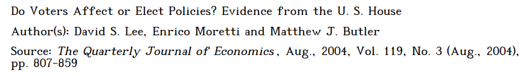
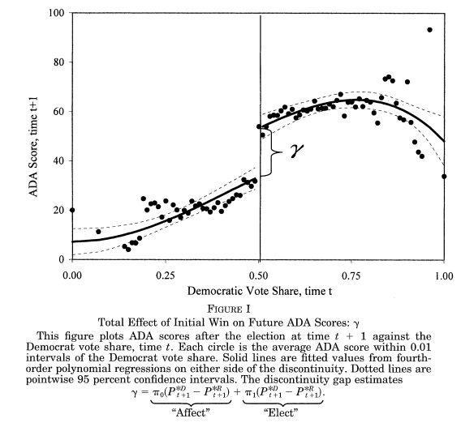
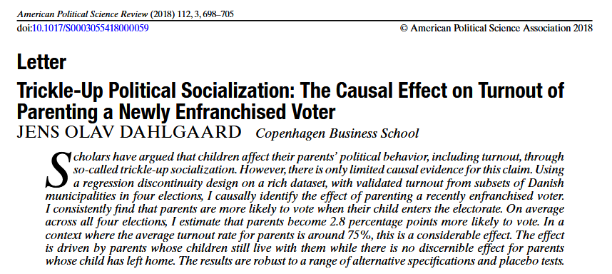
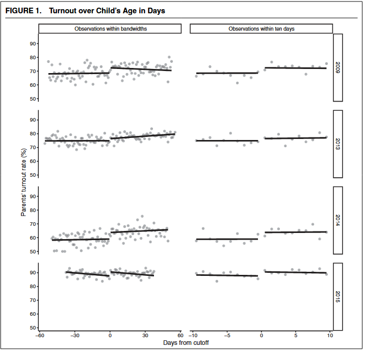
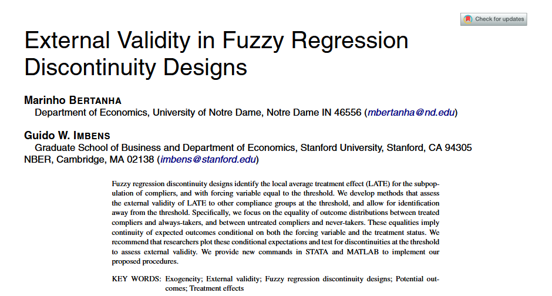
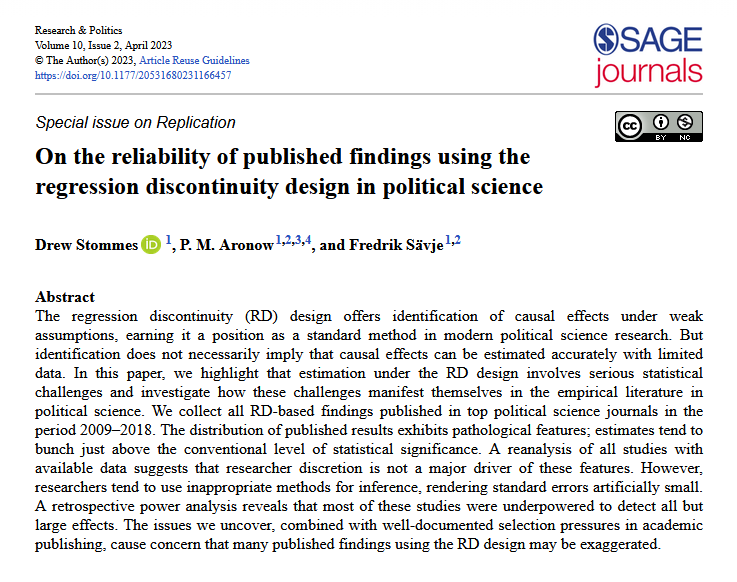
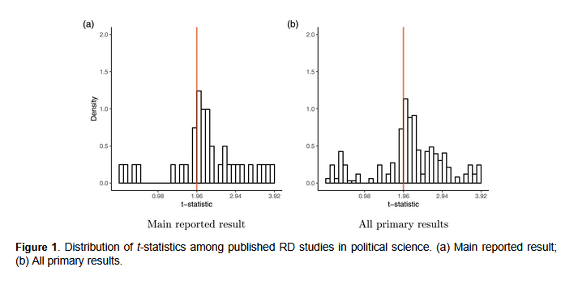
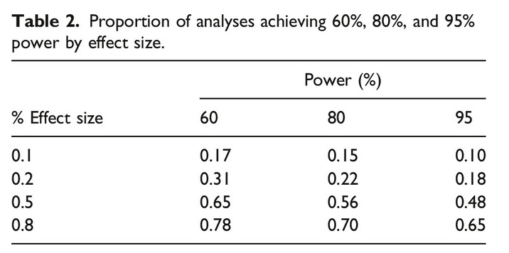

class: center, middle

```{css, echo=FALSE}
pre {
  max-height: 400px;
  overflow-y: auto;
}

pre[class] {
  max-height: 200px;
}
```

```{r setup, include=FALSE} 
knitr::opts_chunk$set(warning = FALSE, message = FALSE) 
```

```{r, load_refs, include=FALSE, cache=FALSE}
# Initializes the bibliography
library(RefManageR)

library(ggplot2)
library(dplyr)
library(readr)
library(nlme)
library(jtools)

BibOptions(check.entries = FALSE,
           bib.style = "authoryear", # Bibliography style
           max.names = 3, # Max author names displayed in bibliography
           sorting = "nyt", #Name, year, title sorting
           cite.style = "authoryear", # citation style
           style = "markdown",
           hyperlink = FALSE,
           dashed = FALSE)
#myBib <- ReadBib("assets/myBib.bib", check = FALSE)
# Note: don't forget to clear the knitr cache to account for changes in the
# bibliography.

peruemotions <- read.csv("https://github.com/jnseawright/PS406/raw/main/data/peruemotions.csv")
```
```{r xaringan-themer, include=FALSE, warning=FALSE}
library(xaringanthemer,MnSymbol)
style_mono_accent(
  base_color = "#1c5253",
  header_font_google = google_font("Josefin Sans"),
  text_font_google   = google_font("Montserrat", "300", "300i"),
  code_font_google   = google_font("Fira Mono"),
  text_font_size = "1.6rem"
)
```

###Today's Plan

1.  Why RDD?
2.  RDD assumptions
3.  Bandwidth selection
4.  Sharp vs. fuzzy RDD
5.  Visualization
6.  Estimation strategies
7.  Diagnostics
8.  Reporting

---
### RDD

-   An RDD can be analyzed by comparing simple average scores just above
    and just below the threshold.

-   Alternatively, a (simple or complex) statistical model may be used
    to extrapolate from the data just above and just below the
    threshold.

---

```{r, echo = FALSE, out.width="90%", fig.retina = 1, fig.align='center'}
library(knitr)

```

---

```{r, echo = FALSE, out.width="90%", fig.retina = 1, fig.align='center'}

```

```{r, echo = FALSE, out.width="90%", fig.retina = 1, fig.align='center'}
library(tidyverse)
library(haven)
library(estimatr)
library(texreg)
library(latex2exp)
lmb_data <- read_dta("https://github.com/jnseawright/PS406/raw/main/data/lmb-data.dta")
```

---
```{r, echo = TRUE, out.width="90%", fig.retina = 1, fig.align='center'}
#This coding example due to Yuta Toyama.
demmeans <- split(lmb_data$democrat, cut(lmb_data$lagdemvoteshare, 100)) %>%
  lapply(mean) %>%
  unlist()

agg_lmb_data <- data.frame(democrat = demmeans, lagdemvoteshare = seq(0.01,1, by = 0.01))
```

---
```{r, echo = TRUE, out.width="90%", fig.retina = 1, fig.align='center'}
lmb_data <- lmb_data %>%
  mutate(gg_group = if_else(lagdemvoteshare > 0.5, 1,0))

gg_srd = ggplot(data=lmb_data, aes(lagdemvoteshare, democrat)) +
  geom_point(aes(x = lagdemvoteshare, y = democrat), data = agg_lmb_data) +
  xlim(0,1) + ylim(-0.1,1.1) +
  geom_vline(xintercept = 0.5) +
  xlab("Democrat Vote Share, time t") +
  ylab("Probability of Democrat Win, time t+1") +
  scale_y_continuous(breaks=seq(0,1,0.2)) +
  ggtitle(TeX("Effect of Initial Win on Winning Next Election: $\\P^D_{t+1} - P^R_{t+1}$"))

```

---
```{r, echo = TRUE, out.width="70%", fig.retina = 1, fig.align='center'}
gg_srd + stat_smooth(aes(lagdemvoteshare, democrat, group = gg_group),
  method = "lm"
  , formula = y ~ x + I(x^2))
```


---
```{r, echo = TRUE, out.width="70%", fig.retina = 1, fig.align='center'}
gg_srd + stat_smooth(data=lmb_data %>% filter(lagdemvoteshare>.45 & lagdemvoteshare<.55),
  aes(lagdemvoteshare, democrat, group = gg_group),
  method = "lm", formula = y ~ x + I(x^2))
```

---
```{r, echo = FALSE, out.width="50%", fig.retina = 1, fig.align='center'}
gg_srd + stat_smooth(data=lmb_data %>% filter(lagdemvoteshare>.45 & lagdemvoteshare<.55),
  aes(lagdemvoteshare, democrat, group = gg_group),
  method = "lm", formula = y ~ x + I(x^2))
```

---
```{r, echo = TRUE, out.width="90%", fig.retina = 1, fig.align='center'}
lmb_subset <- lmb_data %>%
     filter(lagdemvoteshare>.48 & lagdemvoteshare<.52)

lm_1 <- lm_robust(score ~ lagdemocrat, data = lmb_subset, se_type = "HC1")
summary(lm_1)
```

---
```{r, echo = FALSE, out.width="50%", fig.retina = 1, fig.align='center'}
lmb_subset <- lmb_data %>%
     filter(lagdemvoteshare>.48 & lagdemvoteshare<.52)

lm_1 <- lm_robust(score ~ lagdemocrat, data = lmb_subset, se_type = "HC1")
summary(lm_1)
```

---
### A Second Example

```{r, echo = FALSE, out.width="90%", fig.retina = 1, fig.align='center'}

```

---

```{r, echo = FALSE, out.width="70%", fig.retina = 1, fig.align='center'}

```

---
### The Key Assumption

*Continuity Assumption*: The conditional expectations of potential outcomes $\text{E}[Y_C|X]$ and $\text{E}[Y_T|X]$ are continuous in the assignment variable $X$ in the neighborhood of the cutoff $c$.

* Under this assumption, an observed discontinuity at $c$ is going to be a plausible estimator of the local treatment effect.

---
### RDD Windows

-   How wide a window above and below the break point?

---
```{r, echo = TRUE, out.width="90%", fig.retina = 1, fig.align='center'}
lmb_subset <- lmb_data %>%
     filter(lagdemvoteshare>.49 & lagdemvoteshare<.51)

lm_1 <- lm_robust(score ~ lagdemocrat, data = lmb_subset, se_type = "HC1")
summary(lm_1)
```

---
```{r, echo = TRUE, out.width="90%", fig.retina = 1, fig.align='center'}
lmb_subset <- lmb_data %>%
     filter(lagdemvoteshare>.495 & lagdemvoteshare<.505)

lm_1 <- lm_robust(score ~ lagdemocrat, data = lmb_subset, se_type = "HC1")
summary(lm_1)
```

---
### RDD

> Irrespective of the manner in which the bandwidth is chosen, one
> should always investigate the sensitivity of the inferences to this
> choice, for example, by including results for bandwidths twice (or
> four times) and half (or a quarter of) the size of the originally
> chosen bandwidth. Obviously, such bandwidth choices affect both
> estimates and standard errors, but if the results are critically
> dependent on a particular bandwidth choice, they are clearly less
> credible than if they are robust to such variation in bandwidths.
> (Imbens and Lemieux 2008)

---
### RDD

-   Green, Leong, Kern, Gerber, and Larimer find that an estimate of the
    optimal bandwidth proposed by Imbens and Kalyanaraman, in
    conjunction with local linear regression, helps RDD come very close
    to replicating experimental results.

---
```{r, echo = TRUE, out.width="90%", fig.retina = 1, fig.align='center'}
library(rdrobust)
rddik <- with(lmb_data, rdrobust(score, lagdemvoteshare, c=0.5))
summary(rddik)
```

---
```{r, echo = TRUE, out.width="90%", fig.retina = 1, fig.align='center'}
rdbw2 <- rdbwselect(lmb_data$score, lmb_data$lagdemvoteshare, c=0.5)
summary(rdbw2)
```

---
```{r, echo = TRUE, out.width="90%", fig.retina = 1, fig.align='center'}
lmb_subset <- lmb_data %>%
     filter(lagdemvoteshare>.41 & lagdemvoteshare<.59)

lm_final <- lm_robust(score ~ lagdemocrat, data = lmb_subset, se_type = "HC1")
summary(lm_final)
```

---
### Sharp vs. Fuzzy Regression Discontinuity

-   In a **sharp RDD**, treatment status is a deterministic function of the running variable:
    $$D_i = \mathbf{1}(X_i \geq c)$$
    
---
### Sharp vs. Fuzzy Regression Discontinuity

-   In a **fuzzy RDD**, the probability of treatment jumps at the cutoff, but not from 0 to 1:
    $$\lim_{x \downarrow c} P(D=1|X=x) \neq \lim_{x \uparrow c} P(D=1|X=x)$$
    but neither limit is necessarily 0 or 1.

---
### Sharp vs. Fuzzy Regression Discontinuity

-   Fuzzy designs arise naturally:
    - Imperfect compliance with treatment assignment.
    - Multiple treatments or program eligibility vs. take-up.
    - Measurement error in the running variable.

---
### Why Fuzzy RDD?

-   Example: A scholarship program awards aid to students with test scores above 70.  
    *But* some students with scores below 70 appeal and receive aid; some with scores above 70 decline it.  
    * Treatment (receiving aid) is not perfectly determined by the cutoff.

---
### Why Fuzzy RDD?

-   Example: Incumbency advantage (Lee 2008) is sharp if we define treatment as "winning the election."  
    But if we define treatment as "serving as incumbent," and some winners resign or die, it becomes fuzzy.

---
### Why Fuzzy RDD?

-   Fuzzy RDD can still identify a causal effect, but for a specific subpopulation (compliers at the cutoff).

---

```{r, echo = FALSE, out.width="70%", fig.retina = 1, fig.align='center'}

```

---
### Identification in Fuzzy RDD

-   The fuzzy RDD can be viewed as an **instrumental variables** setup:
    - **Instrument** $Z_i = \mathbf{1}(X_i \geq c)$ (the cutoff indicator)
    - **Treatment** $D_i$ (endogenous)
    - **Outcome** $Y_i$
    - **Running variable** $X_i$ (controls, often including polynomials)

---
### Identification in Fuzzy RDD

-   Key assumptions (similar to IV):
    1.  **Relevance**: The cutoff strongly predicts treatment (first stage).
    2.  **Exclusion**: Crossing the cutoff affects $Y$ only through $D$ (no direct effect).
    3.  **Independence**: Potential outcomes are continuous at $c$ (no manipulation).
    4.  **Monotonicity**: No defiers (compliance is one-sided or uniform).

---
### Identification in Fuzzy RDD

-   Under these, the fuzzy RD estimand identifies the **LATE for compliers at the cutoff**:
    $$\tau_{fuzzy} = \frac{\lim_{x\downarrow c} E[Y|X=x] - \lim_{x\uparrow c} E[Y|X=x]}{\lim_{x\downarrow c} E[D|X=x] - \lim_{x\uparrow c} E[D|X=x]}$$

---
### Estimation Approaches for Fuzzy RDD

1\.  **Two-Stage Least Squares (2SLS)**:
    
- First stage: $D_i = \gamma_0 + \gamma_1 Z_i + f(X_i) + \eta_i$
- Second stage: $Y_i = \beta_0 + \beta_1 \hat{D}_i + g(X_i) + \epsilon_i$
- $f(X_i)$ and $g(X_i)$ are flexible functions of $X$ (e.g., polynomials, local linear).

---
### Estimation Approaches for Fuzzy RDD

2\.  **Local Linear Wald Estimator** (preferred in modern RDD packages):

- Estimate numerator and denominator using local linear regression on each side.
- Bandwidth selection can be separate for outcome and treatment.

---
### Estimation Approaches for Fuzzy RDD

3\.  **`rdrobust` with fuzzy option**:

- The `rdrobust` package allows fuzzy estimation by supplying a treatment variable.

---
### Example: Coppock and Green, Voting Habits

```{r fuzzy_graph, echo = TRUE, fig.height = 4}
df_colorado <- read_csv("https://raw.githubusercontent.com/jnseawright/PS406/refs/heads/main/data/df_colorado.csv")

# Visualize
library(ggplot2)
df_colorado %>% ggplot(aes(x = days_04, y = voted08, color = voted04)) +
  geom_point(alpha = 0.2) +
  geom_vline(xintercept = 0, linetype = "dashed") +
  labs(title = "Fuzzy RDD: Birthday in 2004 vs. Turnout in 2008",
       color = "Turnout in 2004")
```

---

```{r fuzzy_result, echo = TRUE, fig.height = 4}
df_colorado$voted08_meandev <- df_colorado$voted08 - mean(df_colorado$voted08)

df_colorado$voted04_meandev <- df_colorado$voted04 - mean(df_colorado$voted04)


with(df_colorado, rdrobust(y = voted08_meandev, x = days_04,
         c = 0, fuzzy = voted04_meandev)) %>%
  summary()
```

---
### Visualizing RDD: Why Graphics Matter

-   Graphical presentation is **essential** in RDD:
    -   Provides easy-to-communicate evidence of a discontinuity.
    -   Reveals the functional form (linear, quadratic, etc.).
    -   Helps detect anomalies (outliers, heaping, manipulation).

---
### Visualizing RDD: Choices

-   Key elements of an RDD plot:
    1.  **Binned averages** of the outcome (to reduce noise).
    2.  **Smoothed fits** (polynomial or local linear) on each side.
    3.  A vertical line at the cutoff.

-   Always show the raw data (or binned means) *and* the fitted lines.

---
### Constructing Bins: Why?

-   Plotting every observation often results in overplotting and obscures the pattern.

-   Solution: group the running variable into bins and plot the **mean outcome** within each bin.

---
### Constructing Bins: Choosing Size

-   How many bins? Too few → miss curvature; too many → noisy.

-   Modern approach: **data-driven bin selection** that mimics the variance of the data (e.g., mimicking variance criterion, IMSE-optimal binning).

-   The `rdrobust` package provides an excellent function: `rdplot()`.

---
```{r rdplot_example, echo = TRUE, fig.height = 5, out.width = "90%"}
library(rdrobust)

# Basic rdplot with default bin selection
rdplot(y = lmb_data$score, 
       x = lmb_data$lagdemvoteshare, 
       c = 0.5,
       title = "RD Plot: Incumbency Advantage",
       x.label = "Lag Democrat Vote Share",
       y.label = "Next Election Score")
```

---
```{r rdplot_example2, echo = FALSE, fig.height = 5, out.width = "90%"}
rdplot(y = lmb_data$score, 
       x = lmb_data$lagdemvoteshare, 
       c = 0.5,
       title = "RD Plot: Incumbency Advantage",
       x.label = "Lag Democrat Vote Share",
       y.label = "Next Election Score")
```


---
### Constructing Bins: Automation

* rdplot automatically chooses bin widths to balance precision and flexibility.

* The plot shows binned means (dots) and a polynomial fit (lines) on each side.

* Look for a clear jump at the cutoff (x = 0.5).

---
### Customizing Bins: Manual Control

* Sometimes you may want to experiment with bin sizes to check sensitivity.

---

```{r customizing_bins_example, echo = TRUE, fig.height = 5, out.width = "90%"}

# Create 50 equal-sized bins
lmb_data <- lmb_data %>%
  mutate(bin = cut(lagdemvoteshare, breaks = 50, labels = FALSE))

bin_means <- lmb_data %>%
  group_by(bin) %>%
  summarise(
    x = mean(lagdemvoteshare, na.rm = TRUE),
    y = mean(score, na.rm = TRUE),
    .groups = "drop"
  )

quadfitplot <- ggplot(bin_means, aes(x = x, y = y)) +
  geom_point() +
  geom_vline(xintercept = 0.5, linetype = "dashed") +
  stat_smooth(data = subset(lmb_data, lagdemvoteshare < 0.5),
              aes(lagdemvoteshare, score), method = "lm", formula = y ~ poly(x, 2)) +
  stat_smooth(data = subset(lmb_data, lagdemvoteshare >= 0.5),
              aes(lagdemvoteshare, score), method = "lm", formula = y ~ poly(x, 2)) +
  labs(x = "Lag Democrat Vote Share", y = "Next Election Score",
       title = "Manual Bins with Quadratic Fits")
```

---
```{r quadfitplot, echo = FALSE, fig.height = 5, out.width = "90%"}
quadfitplot
```

---
### Customizing Bins: Conclusions

* Here we use 50 bins and overlay separate quadratic fits.

* Notice how the bin means are less noisy than raw data.

* The quadratic fits capture curvature but may be sensitive to outliers.

---
### What to Look For in an RDD Plot

* Discontinuity at the cutoff: Is there a visible jump? Is it large relative to the noise?

* Smoothness on each side: Do the binned means follow a smooth trend? If not, maybe the polynomial order is wrong.

* Boundary behavior: Are there outliers or gaps right at the cutoff? (Could indicate manipulation.)

---
### What to Look For in an RDD Plot

* Consistency across bin widths: Does the jump persist if you change bin size?

* Comparison with global fit: Does a global polynomial (e.g., quadratic) match the local pattern?

* Always include a plot in any RDD paper; it's often the most convincing evidence.

---
### Common Pitfalls in RD Graphics

* Too few bins: Hides curvature, may create false discontinuity.

* Too many bins: Noisy, hard to see pattern.

* Ignoring binning: Raw data scatterplots are uninterpretable with large N.

---
### Common Pitfalls in RD Graphics

* Overfitting: Using high-order polynomials that wiggle unrealistically.

* Not showing confidence intervals: Binned means have sampling error; consider adding error bars (though often omitted for clarity).

* The rdplot function can add confidence intervals with the ci option:

```{r rdplotci, echo = TRUE, eval = FALSE, fig.height = 5, out.width = "90%"}
rdplot(..., ci = 95)
```

---
### Estimation Methods in RDD: Three Approaches

1.  **Local Randomization View**: Treatment is "as good as randomly assigned" in a narrow window around the cutoff. *Simple difference in means*.

2.  **Global Polynomials**: Fit a flexible function (e.g., quadratic, cubic) to all data, with a discontinuity indicator. *Flexible but sensitive*.

3.  **Local Linear Regression**: Fit separate linear regressions on each side of the cutoff, weighting observations near the cutoff. *Preferred method (Imbens & Lemieux 2008); reduces boundary bias*.

---
### Estimation Methods in RDD: Three Approaches

We'll illustrate each using the Lee (2008) incumbency data.

---
### 1. Local Randomization View

-   Idea: If we restrict to a very narrow bandwidth around the cutoff, units are nearly identical except for treatment status.

-   This mimics a randomized experiment: for units with $X \in [c-h, c+h]$, treatment is "as good as randomly assigned."

-   Estimator: simple difference in means (or regression with no polynomial).

---
### 1. Local Randomization View

```{r local_rand, echo = TRUE}
library(estimatr)

# Very narrow window: ±0.02 around cutoff (48% to 52%)
lmb_narrow <- lmb_data %>%
  filter(lagdemvoteshare >= 0.48 & lagdemvoteshare <= 0.52)

# Simple difference in means
lm_narrow <- lm_robust(score ~ lagdemocrat, data = lmb_narrow, se_type = "HC1")
summary(lm_narrow)
```

---
### 1. Local Randomization View

-   Estimate: `r round(coef(lm_narrow)["lagdemocrat"], 3)` with SE `r round(lm_narrow$std.error["lagdemocrat"], 3)`.
-   This is intuitive but:
    -   Comparatively small sample (`r nrow(lmb_narrow)` observations).
    -   Sensitive to exact window choice.
    -   May still have bias if the true function has slope within the window.

---
### 2. Global Polynomial Regression

-   Use all data, fit a polynomial in the running variable separately on each side of the cutoff:

    $$\tiny Y_i = \alpha + \tau D_i + \beta_1 X_i + \beta_2 X_i^2 + \cdots + \gamma_1 D_i X_i + \gamma_2 D_i X_i^2 + \cdots + \epsilon_i$$

-   $\tau$ is the treatment effect (discontinuity).

---
### 2. Global Polynomial Regression


-   Advantages: uses all data, simple to implement.
-   Disadvantages:
    -   **Sensitive to polynomial order** (linear, quadratic, cubic?).
    -   Data far from cutoff can influence the estimate at the cutoff.
    -   High-order polynomials can overfit and produce erratic estimates.

---
```{r global_poly, echo = TRUE, fig.height = 4.5, out.width = "90%"}
# Compare different polynomial orders
library(modelsummary)

lmb_data$centeredlagdem <- lmb_data$lagdemvoteshare - 0.5

# Linear (order 1)
rd_linear <- lm(score ~ lagdemocrat * centeredlagdem, data = lmb_data)

# Quadratic (order 2)
rd_quad <- lm(score ~ lagdemocrat * (centeredlagdem + I(centeredlagdem^2)), 
              data = lmb_data)

# Cubic (order 3)
rd_cubic <- lm(score ~ lagdemocrat * (centeredlagdem + I(centeredlagdem^2) + I(centeredlagdem^3)), 
               data = lmb_data)

# Compare coefficients on lagdemocrat (the treatment effect)
models <- list("Linear" = rd_linear, "Quadratic" = rd_quad, "Cubic" = rd_cubic)
```

---
```{r global_poly2, echo = TRUE, fig.height = 4.5, out.width = "90%"}
modelsummary(models, coef_map = c("lagdemocrat" = "Treatment Effect"), 
             gof_map = c("nobs", "r.squared"), output = "kableExtra")
```

---
### 2. Global Polynomial Regression

-   The treatment effect estimate varies: `r round(coef(rd_linear)["lagdemocrat"], 3)` (linear), `r round(coef(rd_quad)["lagdemocrat"], 3)` (quadratic), `r round(coef(rd_cubic)["lagdemocrat"], 3)` (cubic).
-   Which is correct? We don't know—this sensitivity is concerning.

---
### Why Global Polynomials Can Mislead

```{r poly_plot, echo = FALSE, fig.height = 5, out.width = "90%"}
# Visualize the fits near cutoff
lmb_data %>% 
  filter(lagdemvoteshare > 0.3 & lagdemvoteshare < 0.7) %>%
  ggplot(aes(x = lagdemvoteshare, y = score)) +
  geom_point(alpha = 0.1) +
  geom_vline(xintercept = 0.5, linetype = "dashed") +
  geom_smooth(data = . %>% filter(lagdemvoteshare < 0.5), 
              method = "lm", formula = y ~ x, se = FALSE, color = "blue") +
  geom_smooth(data = . %>% filter(lagdemvoteshare >= 0.5), 
              method = "lm", formula = y ~ x, se = FALSE, color = "blue") +
  geom_smooth(data = . %>% filter(lagdemvoteshare < 0.5), 
              method = "lm", formula = y ~ poly(x, 2), se = FALSE, color = "red", linetype = "dashed") +
  geom_smooth(data = . %>% filter(lagdemvoteshare >= 0.5), 
              method = "lm", formula = y ~ poly(x, 2), se = FALSE, color = "red", linetype = "dashed") +
  labs(title = "Linear (blue) vs. Quadratic (red) Fits",
       x = "Lag Democrat Vote Share", y = "Next Election Score")
```

---
### Why Global Polynomials Can Mislead

-   Notice how the quadratic fit curves away from the data near the cutoff? That's because it's influenced by points far away.
-   The linear fit may be too rigid if the true relationship is curved.

---
### 3. Local Linear Regression (Preferred)

-   Idea: Use only data within a bandwidth $h$ of the cutoff, but fit a **linear** regression on each side, weighting observations by their distance from the cutoff (kernel weighting).

-   This reduces **boundary bias**: near the cutoff, a local linear model approximates the true function better than a global polynomial.

---
### What Local Linear Regression Is

-   Estimator (for a given bandwidth $h$):
    1.  For observations with $X_i \in [c-h, c+h]$, fit:
        $$Y_i = \alpha_l + \beta_l (X_i - c) + \epsilon_i \quad \text{for } X_i < c$$
        $$Y_i = \alpha_r + \beta_r (X_i - c) + \epsilon_i \quad \text{for } X_i \ge c$$
    2.  The treatment effect is $\hat{\tau} = \hat{\alpha}_r - \hat{\alpha}_l$.

-   Modern packages (e.g., `rdrobust`) use optimal bandwidth selection and bias correction.

---
### Local Linear with `rdrobust`

```{r rdrobust_local, echo = TRUE}
library(rdrobust)

# Local linear regression with default optimal bandwidth
rd_ll <- rdrobust(y = lmb_data$score, 
                  x = lmb_data$lagdemvoteshare, 
                  c = 0.5,
                  kernel = "triangular")
```

---

```{r rdrobust_local_output, echo = FALSE}
summary(rd_ll)
```

---

-   The output shows:
    -   **Conventional** estimates (uncorrected for bias).
    -   **Bias-corrected** estimates (adjusts for remaining bias within bandwidth).
    -   **Robust** confidence intervals (valid even with bias correction).

---

-   Key numbers:
    -   Optimal bandwidth (left/right): `r round(rd_ll$bws[1,1], 3)` / `r round(rd_ll$bws[1,2], 3)`
    -   Treatment effect (robust): `r round(rd_ll$Estimate[1], 3)` [CI: `r round(rd_ll$ci[3,1], 3)`, `r round(rd_ll$ci[3,2], 3)`]

---
### Why Local Linear is Preferred: Boundary Bias

```{r boundary_bias, echo = FALSE, fig.height = 4, out.width = "80%"}
# Simple illustration of boundary bias
set.seed(123)
x <- runif(500, -1, 1)
y <- 0.5 + 0.5*x + 0.5*x^2 + rnorm(500, 0, 0.2)
plot(x, y, pch = 20, col = gray(0.5, 0.3))
abline(v = 0, lty = 2)
# Local linear at boundary
xx <- seq(-0.5, 0.5, length.out = 100)
yy <- 0.5 + 0.5*xx + 0.5*xx^2
lines(xx, yy, col = "black", lwd = 2)
# Linear fit on left side using all data
abline(lm(y ~ x, subset = x < 0), col = "red", lty = 1, lwd = 2)
abline(lm(y ~ x, subset = x >= 0), col = "red", lty = 1, lwd = 2)
legend("topright", legend = c("True function", "Global linear fit"), 
       col = c("black", "red"), lwd = 2)
```

---
### Why Local Linear is Preferred: Boundary Bias

-   At the boundary (cutoff), a global linear fit (red) can be badly biased if the true function (black) is curved.
-   Local linear (not shown) fits only near the cutoff and adapts to local curvature.

---
### Next Steps: Diagnostics

-   After estimating the discontinuity, we must validate the design:
    -   **Covariate balance**: Are pre-treatment characteristics smooth at the cutoff?
    -   **Manipulation testing**: Is there evidence of sorting around the cutoff?
    -   **Placebo cutoffs**: Do we see effects at other points?
    -   **Bandwidth sensitivity**: Do results hold for different bandwidths?

---
### Next Steps: Diagnostics

Below are RMarkdown slides covering the essential diagnostics for RDD, designed to follow the estimation methods section. They use the Lee (2008) data and modern R packages (`rdrobust`, `rddensity`, `rdd`) to implement each test, with clear interpretation.

---
### RDD Diagnostics: Validating the Design

-   After estimating the discontinuity, we must check whether the identifying assumptions hold.

-   Four key diagnostic families:
    1.  **Covariate balance**: Are predetermined characteristics smooth at the cutoff?
    2.  **Manipulation testing**: Is there evidence of sorting around the cutoff?
    3.  **Placebo cutoffs**: Do we see effects at other (fake) thresholds?
    4.  **Bandwidth sensitivity**: Are results robust to different bandwidth choices?

---
### Next Steps: Diagnostics

-   If the RDD is valid, covariates that were determined **before** the treatment should not jump at the cutoff.

-   Idea: Run the same RD analysis on each covariate as the outcome.

---
### Next Steps: Diagnostics

-   Covariates in the Lee data:
    -   `lagdemocrat`: whether Democrat won previous election (the treatment itself—should jump! Not a balance test.)
    -   `score`: outcome (should jump)
    -   Need other covariates: We have lags of tons of other variables. We will use an arbitrary one ("collegeattend") for this example.

---
```{r cov_balance_setup, echo = TRUE}
#Test if this covariate jumps at the cutoff
library(rdrobust)
rd_cov <- rdrobust(y = lmb_data$collegeattend, 
                   x = lmb_data$lagdemvoteshare, 
                   c = 0.5)
summary(rd_cov)
```
---

-   If the estimate is small and not significant (robust $(p > 0.05)$), then covariate is smooth.
-   In practice, test all available pre-treatment covariates and report a table. Think about multiple comparisons.
-   If any covariate shows a discontinuity, the design is suspect.

---
### 2. Manipulation Testing: McCrary Density Test

-   If units can precisely manipulate the running variable, we may see a pile‑up of observations just above (or below) the cutoff.

-   The **McCrary (2008) density test** checks for a discontinuity in the density of the running variable at the cutoff.

-   Implementation in R: `rddensity` package (Cattaneo, Jansson, Ma).

---
```{r rddensity_example, echo = TRUE}
library(rddensity)
density_test <- rddensity(lmb_data$lagdemvoteshare, c = 0.5)
summary(density_test)

# Plot the density with confidence intervals
rdplotdensity(density_test, lmb_data$lagdemvoteshare)
```

---
```{r rddensity_example2, echo = FALSE}
summary(density_test)
```

---
```{r rddensity_example3, echo = FALSE}
rdplotdensity(density_test, lmb_data$lagdemvoteshare)
```

---

-   The test statistic is `r round(density_test$test$t_jk, 3)` with p-value `r round(density_test$test$p_jk, 4)`.
-   A non-significant p-value (p > 0.05) suggests no evidence of manipulation.

-   **Interpretation**: If significant, units may be sorting around the cutoff, violating continuity.

---
### 3. Placebo Cutoffs

-   Test for discontinuities at points where **no treatment should occur**.

-   Choose fake cutoffs (e.g., 0.4, 0.6) and run the same RD estimation.

-   Ideally, we should see **no significant effects** at these placebo cutoffs.

```{r placebo, echo = TRUE, warning = FALSE}
placebo_0.4 <- rdrobust(lmb_data$score, lmb_data$lagdemvoteshare, c = 0.4)
placebo_0.6 <- rdrobust(lmb_data$score, lmb_data$lagdemvoteshare, c = 0.6)

# Extract robust p-values
p_0.4 <- placebo_0.4$pv[3]
p_0.6 <- placebo_0.6$pv[3]

data.frame(Placebo_Cutoff = c(0.4, 0.6), Robust_p = c(p_0.4, p_0.6))
```

-   If any placebo cutoff shows a significant effect, it suggests the outcome is discontinuous for reasons other than the treatment—perhaps due to model misspecification or other factors.

-   Also test cutoffs on either side, and consider using multiple placebos (e.g., every 0.05 increment) and plotting the results.

---
### 4. Bandwidth Sensitivity

-   The choice of bandwidth affects the estimate and its precision.

-   It is essential to show that results are not driven by a particular bandwidth.

-   Common approach: estimate the treatment effect for a range of bandwidths (e.g., from 0.5× to 2× the optimal bandwidth) and plot the estimates with confidence intervals.

---


```{r bw_sensitivity, echo = TRUE, fig.height = 5, out.width = "90%"}
# Get optimal bandwidth from rdrobust
bw_opt <- rd_ll$bws[1,1]  # use left bandwidth as reference

# Define bandwidth multipliers
mult <- seq(0.5, 2, by = 0.1)
results <- data.frame(mult = mult, est = NA, ci_low = NA, ci_high = NA)

for (i in seq_along(mult)) {
  rd_tmp <- rdrobust(lmb_data$score, lmb_data$lagdemvoteshare, c = 0.5, 
                     h = bw_opt * mult[i])
  results[i, "est"] <- rd_tmp$Estimate[2]   # robust estimate
  results[i, "ci_low"] <- rd_tmp$ci[3, 1]
  results[i, "ci_high"] <- rd_tmp$ci[3, 2]
}

# Plot
bwsensplot <- ggplot(results, aes(x = mult, y = est)) +
  geom_hline(yintercept = 0, linetype = "dotted") +
  geom_ribbon(aes(ymin = ci_low, ymax = ci_high), alpha = 0.2) +
  geom_line() +
  geom_point() +
  labs(x = "Bandwidth Multiplier (× optimal)", 
       y = "Treatment Effect (Robust)",
       title = "Bandwidth Sensitivity Analysis")
```

---

```{r bw_sensplot, echo = FALSE, fig.height = 5, out.width = "90%"}
bwsensplot
```

---

-   The plot shows how the estimate changes with bandwidth.
-   Ideally, the estimate remains relatively stable across a reasonable range, and confidence intervals overlap.
-   If the estimate flips sign or changes dramatically, the results are fragile.

---
### Reporting RDD Results: Tables and Figures

-   A credible RDD paper presents results transparently, allowing readers to assess the design and robustness.

-   Key elements:
    1.  **Main RD plot** (binned means + fits) – already covered.
    2.  **Main results table** – estimates with different specifications.
    3.  **Robustness tables/figures** – bandwidth sensitivity, placebo cutoffs.
    4.  **Diagnostics table** – covariate balance, density test.

---
### 1. The Main RD Plot (Review)

-   Always start with a clear graphical display.

```{r main_plot, echo = TRUE, fig.height = 5, out.width = "90%"}
library(rdrobust)
library(ggplot2)

# rdplot with default options
rdplot(y = lmb_data$score, 
       x = lmb_data$lagdemvoteshare, 
       c = 0.5,
       title = "Incumbency Advantage in U.S. House Elections",
       x.label = "Democratic Vote Share at t",
       y.label = "Probability of Democratic Win at t+1")
```

---

```{r main_plot2, echo = FALSE, fig.height = 5, out.width = "90%"}
# rdplot with default options
rdplot(y = lmb_data$score, 
       x = lmb_data$lagdemvoteshare, 
       c = 0.5,
       title = "Incumbency Advantage in U.S. House Elections",
       x.label = "Democratic Vote Share at t",
       y.label = "Probability of Democratic Win at t+1")
```

---
### 2. Main Results Table: Multiple Specifications

-   Report estimates for:
    - Different bandwidths (e.g., optimal, half, double).
    - Different polynomial orders (local linear vs. local quadratic).
    - With and without covariates.

-   Use `rdrobust` to obtain estimates, then combine into a table.

---

```{r main_results, echo = TRUE}
# Estimate for optimal bandwidth (local linear)
rd_opt <- rdrobust(lmb_data$score, lmb_data$lagdemvoteshare, c = 0.5)

# Half bandwidth
rd_half <- rdrobust(lmb_data$score, lmb_data$lagdemvoteshare, c = 0.5,
                    h = rd_opt$bws[1,1] / 2)

# Double bandwidth
rd_double <- rdrobust(lmb_data$score, lmb_data$lagdemvoteshare, c = 0.5,
                      h = rd_opt$bws[1,1] * 2)

# Local quadratic (order = 2)
rd_quad <- rdrobust(lmb_data$score, lmb_data$lagdemvoteshare, c = 0.5, p = 2)

# Extract key statistics into a data frame
results_df <- data.frame(
  Specification = c("Optimal BW (linear)", "Half BW", "Double BW", "Optimal BW (quadratic)"),
  Estimate = round(c(rd_opt$Estimate[3], rd_half$Estimate[3], rd_double$Estimate[3], rd_quad$Estimate[3]), 3),
  SE = round(c(rd_opt$se[3], rd_half$se[3], rd_double$se[3], rd_quad$se[3]), 3),
  CI_low = round(c(rd_opt$ci[3,1], rd_half$ci[3,1], rd_double$ci[3,1], rd_quad$ci[3,1]), 3),
  CI_high = round(c(rd_opt$ci[3,2], rd_half$ci[3,2], rd_double$ci[3,2], rd_quad$ci[3,2]), 3),
  N_left = c(rd_opt$N[1], rd_half$N[1], rd_double$N[1], rd_quad$N[1]),
  N_right = c(rd_opt$N[2], rd_half$N[2], rd_double$N[2], rd_quad$N[2])
)

```

---
```{r main_results2, echo = TRUE}
knitr::kable(results_df, caption = "RDD Estimates of Incumbency Advantage")
```

---

-   Always report robust (bias-corrected) estimates and confidence intervals.
-   Include effective sample sizes on each side.

---
### 3. Include Diagnostic Results

-   The plots from the diagnostics section should be included in your paper or appendix.

---
### Example: Is US Elite Polarization Symmetric?

Is ideological polarization in the US happening equally on both sides of the party system, or do the parties behave differently in terms of their distance from the ideological middle? Let's try to get an answer to this that cleans up some of the background noise by using a regression-discontinuity design. We'll compare close elections that Republicans just barely win to close elections that Democrats just barely win and look at the absolute value of the resulting ideological distance from the middle of the elected representatives.

Use [this resource sheet](https://jnseawright.github.io/PS312/InClass/Regression_Discontinuity_Designs.html) to find data and for some coding hints.

---
### How Reliable Are RDD Applications?

```{r, echo = FALSE, out.width="70%", fig.retina = 1, fig.align='center'}

```

---

```{r, echo = FALSE, out.width="70%", fig.retina = 1, fig.align='center'}

```

---

```{r, echo = FALSE, out.width="70%", fig.retina = 1, fig.align='center'}

```

---

-   If most RDD applications in political sciene have very low power, what does this mean for the credibility of effect estimates?
-   What does it mean that p values are clustered just above 0.05?
-   What do these findings imply for our potential use of RDD in our own research?