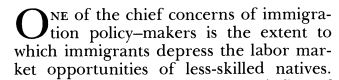
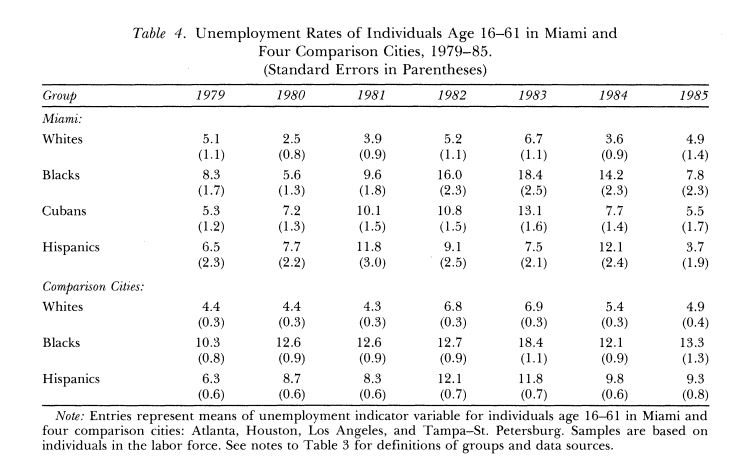
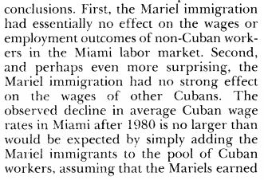
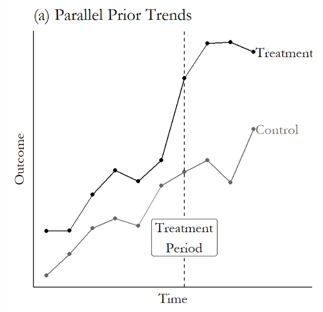
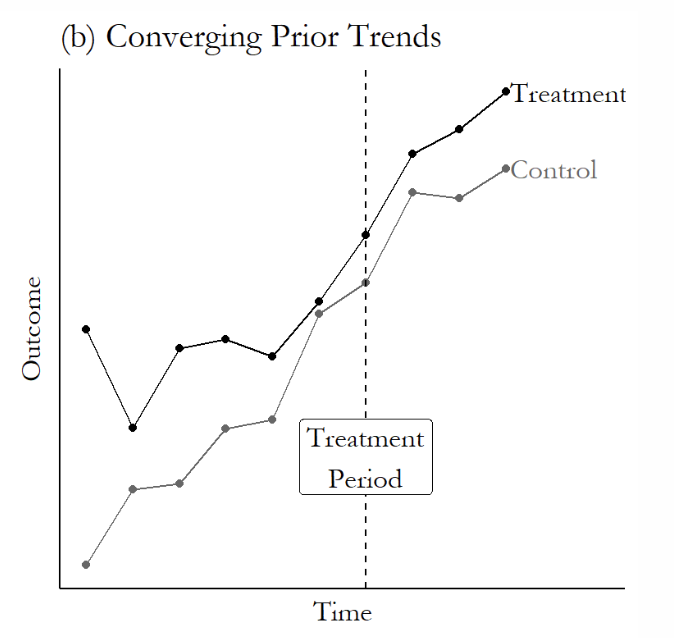
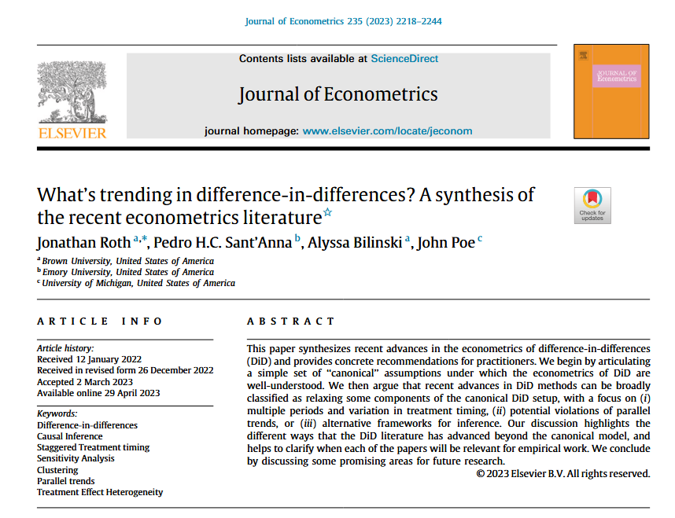
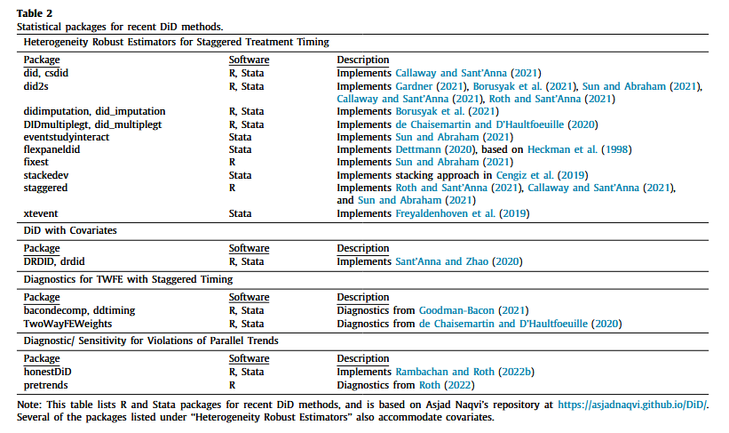

class: center, middle

```{css, echo=FALSE}
pre {
  max-height: 400px;
  overflow-y: auto;
}

pre[class] {
  max-height: 200px;
}
```

```{r, load_refs, include=FALSE, cache=FALSE}
# Initializes the bibliography
library(RefManageR)

library(ggplot2)
library(dplyr)
library(readr)
library(nlme)
library(jtools)

BibOptions(check.entries = FALSE,
           bib.style = "authoryear", # Bibliography style
           max.names = 3, # Max author names displayed in bibliography
           sorting = "nyt", #Name, year, title sorting
           cite.style = "authoryear", # citation style
           style = "markdown",
           hyperlink = FALSE,
           dashed = FALSE)
#myBib <- ReadBib("assets/myBib.bib", check = FALSE)
# Note: don't forget to clear the knitr cache to account for changes in the
# bibliography.

peruemotions <- read.csv("https://github.com/jnseawright/PS406/raw/main/data/peruemotions.csv")

knitr::opts_chunk$set(warning = FALSE, message = FALSE)
```
```{r xaringan-themer, include=FALSE, warning=FALSE}
library(xaringanthemer,MnSymbol)
style_mono_accent(
  base_color = "#1c5253",
  header_font_google = google_font("Josefin Sans"),
  text_font_google   = google_font("Montserrat", "300", "300i"),
  code_font_google   = google_font("Fira Mono"),
  text_font_size = "1.6rem"
)
```


###Today's Plan

1.  Why DiD?
2.  Classic DiD Estimation
3.  Fixed-Effects Models
4.  Parallel Trends
5.  Staggered Treatments and Negative Weights
6.  Modern DiD Estimators
7.  Conclusion

---
### Why DiD? Connecting to What We Know

- In week 3 we saw that DiD compares cases before and after some (hopefully as-if random) event, using comparisons with differences in cases that did not experience the event to remove effects of shared events or trends. Today we get into the details of how that actually works in practice.
- Like RDD, DiD involves structured comparisons around a threshold. However, here, the threshold is a moment in time defined by an event rather than a cutpoint on a selection variable defined by a rule.

---


### Before and After

The structure of DiD comparisons, in which we compare before and after across treatment cases and control cases, eliminates certain categories of confounders:

- those that vary across units but are constant over time
- those that vary over time but are constant across units

---
### The Difference-in-Differences Estimand

In potential outcomes notation:

$$ATT = E[Y_{i,2}(1) - Y_{i,2}(0) | D_i = 1]$$

We observe $Y_{i,2}(1)$ for treated units, but $Y_{i,2}(0)$ is counterfactual.

---
### The Difference-in-Differences Estimand

DiD imputes the counterfactual using:

$$\tiny E[Y_{i,2}(0) | D_i = 1] = E[Y_{i,1} | D_i = 1] + \underbrace{(E[Y_{j,2} | D_j = 0] - E[Y_{j,1} | D_j = 0])}_{\text{common trend}}$$
---
### The Difference-in-Differences Estimand

The estimator:

$$\hat{\tau}_{DiD} = (\bar{Y}_{T,2} - \bar{Y}_{T,1}) - (\bar{Y}_{C,2} - \bar{Y}_{C,1})$$

---
### Parallel Trends

The validity of DiD rests on the **parallel trends assumption**:

> In the absence of the treatment, the average outcome for the treated group would have changed by the same amount as the average outcome for the control group.

Formally:

$$\small E[Y_{i,2}(0) - Y_{i,1}(0) | D_i = 1] = E[Y_{i,2}(0) - Y_{i,1}(0) | D_i = 0]$$

---
```{r, echo = FALSE, out.width="90%", fig.retina = 1, fig.align='center'}
library(knitr)
include_graphics("images/miamiboatlift.JPG")
```

---
```{r, echo = FALSE, out.width="90%", fig.retina = 1, fig.align='center'}

```

---
```{r, echo = FALSE, out.width="90%", fig.retina = 1, fig.align='center'}
include_graphics("images/mariel2.JPG")
```

---
```{r, echo = FALSE, out.width="90%", fig.retina = 1, fig.align='center'}
include_graphics("images/marielcomparison.JPG")
```

---
```{r, echo = FALSE, out.width="90%", fig.retina = 1, fig.align='center'}

```

---
```{r, echo = FALSE, out.width="90%", fig.retina = 1, fig.align='center'}

```

---

What we've just seen is a DiD comparison: Miami before/after vs. comparison cities before/after.

---

```{r, echo = TRUE, out.width="90%", fig.retina = 1, fig.align='center'}
mariel <- read.csv("data/mariel.csv")

did1 <- (mariel$MiamiWhite[mariel$Year==1981] - mariel$MiamiWhite[mariel$Year==1979]) - 
        (mariel$OtherWhite[mariel$Year==1981] - mariel$OtherWhite[mariel$Year==1979])

did1
```

---

```{r, echo = TRUE, out.width="90%", fig.retina = 1, fig.align='center'}
did2 <- (mean(mariel$MiamiWhite[mariel$Year %in% 1981:1985]) - mariel$MiamiWhite[mariel$Year==1979]) - 
        (mean(mariel$OtherWhite[mariel$Year %in% 1981:1985]) - mariel$OtherWhite[mariel$Year==1979])

did2
```

---
### Analysis

Starting simple, if we think *all* the confounding variables are constant either in time or space, then the model we want may be something like:

$$y_{i,t} = \alpha_{i} + \gamma_{t} + \beta_{1}Treatment_{i,t} + \epsilon_{i,t}$$

---

A classic difference-in-differences example involves how to structure asking people to sign up for organ donations.

Kessler and Roth (2014) studied a policy enacted by the state of California in the third quarter of 2011 to adopt an active-choice phrasing for their organ donation sign-up question.

---
```{r, echo = TRUE, out.width="90%", fig.retina = 1, fig.align='center'}
library(causaldata)
od <- causaldata::organ_donations
library(fixest)
```

---
```{r, echo = TRUE, out.width="90%", fig.retina = 1, fig.align='center'}
# Treatment variable
od <- od %>%
    mutate(Treated = State == 'California' & 
              Quarter %in% c('Q32011','Q42011','Q12012'))

clfe <- feols(Rate ~ Treated | State + Quarter,
               data = od)
```

---
```{r, echo = TRUE, out.width="90%", fig.retina = 1, fig.align='center'}
summary(clfe)
```


---
### Interpreting the Organ Donations DiD Results

- The coefficient on `Treated` is about **`r round(coef(clfe)["TreatedTRUE"], 4)`**.
- **Interpretation**: California's policy change may have decreased the organ donation rate by approximately `r -1*round(100*coef(clfe)["TreatedTRUE"], 2)` percentage points relative to what would have happened without the policy, under the parallel trends assumption.
- The p-value is `r round(summary(clfe)$coeftable[4], 4)`. This is above conventional significance levels, suggesting no evidence of an effect.
- The confidence interval can be extracted: `r confint(clfe)["TreatedTRUE",]`.

---

**Substantive significance**: Is a `r round(100*coef(clfe)["TreatedTRUE"], 2)` percentage point change large? It depends on the baseline donation rate. The mean donation rate in California before the policy was about `r mean(od$Rate[od$State=="California" & od$Quarter_Num < 4], na.rm=TRUE)` percent, so the estimated increase represents a relative change of roughly `r round(100*coef(clfe)["TreatedTRUE"] / mean(od$Rate[od$State=="California" & od$Quarter_Num < 4], na.rm=TRUE), 1)`%.

---

### Clustering Standard Errors in DiD

- In most DiD applications, observations within the same unit are correlated over time. Because the same unit appears in time periods before and after the treatment and may have unobserved factors that stay steady over time, model error terms tend to be correlated. 

- OLS standard errors that ignore this within-unit correlation will be wrong.

- The standard fix is to cluster standard errors at the level of the treatment-assignment unit. In the organ donations example, treatment varies at the state level, so we cluster by state.

---
###Clustering Standard Errors in DiD

```{r, clustered_ses_at_state, echo = TRUE, out.width="90%", fig.retina = 1, fig.align='center'}
clfe_clustered <- feols(Rate ~ Treated | State + Quarter,
                        data = od,
                        cluster = ~State)
summary(clfe_clustered)
```

---

The estimates are the same, whether we cluster (**`r round(coef(clfe_clustered)["TreatedTRUE"], 4)`**) or not (**`r round(coef(clfe)["TreatedTRUE"], 4)`**).

However, the standard errors change from (**`r round(se(clfe)["TreatedTRUE"], 4)`**) when not clustering to (**`r round(se(clfe_clustered)["TreatedTRUE"], 4)`**), a very substantial change that might have major implications for how we approach the inference.

---

### Clustering Standard Errors in DiD

- With only 27 states, clustering may itself be unreliable. 

- Cluster-robust inference works best with 50 or more clusters. With few clusters, consider bias-corrected cluster-robust standard errors from the clubSandwich package.

---

```{r, clustered_ses_at_state_2, echo = TRUE, out.width="90%", fig.retina = 1, fig.align='center'}
library(clubSandwich)

coef_test(clfe,
          vcov = "CR2",
          cluster = od$State,
          test = "Satterthwaite")
```

---
### Testing Parallel Trends: Pre-Treatment Analysis

```{r, echo = FALSE, out.width="70%", fig.retina = 1, fig.align='center'}

```

---
### Testing Parallel Trends: Pre-Treatment Analysis

```{r, echo = FALSE, out.width="70%", fig.retina = 1, fig.align='center'}

```


---
```{r interpret_pretrend, echo = TRUE}
od$calind <- 1*(od$State=='California')
odparalleltrends.lm <- lm(Rate~calind+Quarter_Num+Quarter_Num:calind, data=od[od$Quarter_Num<4,])
summary(odparalleltrends.lm)
```

---
- This regression uses only the **pre-treatment period** (quarters 1–3) and models the donation rate as a function of time (`Quarter_Num`) and an interaction between time and being California (`calind`).
- The coefficient on `Quarter_Num` is the time trend for the control group.
- The coefficient on `Quarter_Num:calind` is the **difference in trends** between California and the control group.
- Here, the interaction coefficient is `r round(coef(odparalleltrends.lm)["Quarter_Num:calind"], 4)` with p = `r round(summary(odparalleltrends.lm)$coef["calind:Quarter_Num", "Pr(>|t|)"], 4)`.

---

**Interpretation**: The p-value > 0.05 suggests that we cannot reject the null hypothesis of parallel pre-treatment trends. This provides some support for the parallel trends assumption.

- This linear trend test is a simple diagnostic; event‑study plots provide a more flexible check of parallel trends.

---
### Visualizing Parallel Trends: The Event Study Plot

An event study is the best way to visually assess the parallel trends assumption. It plots the treatment effect in "event time" — years before and after the democratization event.

We can create one by interacting our treatment indicator with dummies for years relative to the event.
---

```{r effect_study, echo = TRUE}
od <- od %>%
  mutate(time_to_treat = Quarter_Num - 4)

library(fixest)

es_model <- feols(Rate ~ i(time_to_treat, calind, ref = -1) | State + Quarter,
                  data = od,
                  cluster = ~State)
```
                  
---

```{r effect_study_2, echo = TRUE}
iplot(es_model,
      xlab = 'Years Relative to Law',
      main = 'Effect of Law on Organ Donation')
```

---

### What If the Pre-Trend Test Fails?

- If (like here) the plot shows significant results in time periods before zero, it indicates that California and the control group were already on different trajectories before the policy.
- In that case, the DiD estimate would be biased because the counterfactual trend for California would not be the control group's trend.

---

- Possible remedies:
  - Include group-specific linear time trends (though this can be sensitive).
  - Use synthetic control methods to construct a more plausible counterfactual.
  - Restrict to a subset of control units that better match California's pre-treatment trend (matching on trends).

---

### Conditional Parallel Trends

The parallel trends assumption we have been working with is unconditional:

$$\small E[Y_{i,2}(0) - Y_{i,1}(0) | D_i = 1] = E[Y_{i,2}(0) - Y_{i,1}(0) | D_i = 0]$$

This requires treated and control units to have had the same trend on average *with no adjustment for any differences in their characteristics*.

---
### Conditional Parallel Trends

- This is often implausible. 

- We can instead invoke conditional parallel trends:

$$\mathbb{E}[Y_{i,t}(0) - Y_{i,t-1}(0) \vert{} X_i, D_i=1] = \mathbb{E}[Y_{i,t}(0) - Y_{i,t-1}(0) \vert{} X_i, D_i=0]$$

---
### Implementing Conditional Parallel Trends

- In the classic TWFE framework, adding time-varying covariates to the regression partly addresses this, but can introduce post-treatment bias if covariates are themselves affected by treatment.

- The cleaner approach is to use pre-treatment covariates interacted with time indicators:

---

```{r conditional_parallel_trends, echo = TRUE, eval=FALSE}
#IF THERE WERE A BASELINE COVARIATE IN OUR DATA
clfe_cond <- feols(Rate ~ Treated + baseline_covariate:Quarter | 
                     State + Quarter,
                   data = od,
                   cluster = ~State)
```

---
### Implementing Conditional Parallel Trends


The Callaway-Sant'Anna estimator handles this more rigorously via its doubly robust approach. 

- It models both the outcome trend and the propensity to be treated, and is consistent if either model is correctly specified.

```{r conditional_parallel_trends_2, echo = TRUE, eval=FALSE}
cs_cond <- att_gt(yname = "y",
                  tname = "time",
                  idname = "id",
                  gname = "first_treat",
                  xformla = ~baseline_covariate,  # covariates here
                  data = df,
                  control_group = "notyettreated")
```

The xformla argument specifies covariates used to adjust for differences in trends — these should be pre-treatment and not affected by treatment.

---
### Failing Conditional Parallel Trends

Conditioning on covariates relaxes the assumption but does not eliminate it. Conditional parallel trends can still fail if:

- Important confounders are unobserved.
- The covariates used are themselves affected by anticipation of treatment.
- The propensity model or outcome model is misspecified.

---
### What Conditional Parallel Trends Means

It also changes the estimand: you are recovering a covariate-adjusted ATT, which may differ from the unconditional ATT if treatment effect heterogeneity is correlated with covariates.

- This is the same weighting issue we discussed with OLS regression.

---
### Anticipation Effects: When the Pre-Period Is Contaminated

What if units change their behavior before treatment begins, in anticipation of the upcoming policy?

---
### Anticipation Effects: When the Pre-Period Is Contaminated

For example:

- Firms begin hiring or laying off workers as soon as a minimum wage increase is announced, before it takes effect.
- Countries seeking EU membership begin democratic reforms in order to qualify for membership.
- Voters change preferences once an electoral reform is passed, before the first election under the new rules.

---
### Anticipation Effects: Formal Statement

If the potential outcomes in the absense of anticipation effects might be represented as:

$$Y_{it}(0) = \alpha_i + \delta_t + \epsilon_{it} \text{ for all } t < g_i$$
the potential outcomes when there is anticipation instead are as:

$$Y_{it}(0) = \alpha_i + \delta_t + \sum_{k=-K}^{M} \tau_k D_{it}^{(k)} + \epsilon_{it}$$

---

On the last slide, $D_{it}^{(k)}=1$ if unit $i$ is $k$ periods away from treatment at time $t$, with negative $k$ indicating periods before treatment.

---
### Diagnosing Anticipation

The event study plot is the key diagnostic. 

- If there are no anticipation effects, leads (pre-treatment coefficients) should be flat and near zero.

- If pre-treatment coefficients are significantly different from zero and trend upward toward the treatment date, anticipation is likely present.

---
### Handling Anticipation in Callaway-Sant'Anna

The did package allows you to specify the number of anticipation periods directly:

```{r anticipation, echo = TRUE, eval=FALSE}
# Allow for 1 period of anticipation
cs_anticipation <- att_gt(yname = "y",
                           tname = "time",
                           idname = "id",
                           gname = "first_treat",
                           anticipation = 1,      # shift "pre" window back by 1
                           data = df,
                           control_group = "notyettreated")
summary(cs_anticipation)
```

---

Setting anticipation = 1 tells the estimator to treat the period immediately before the nominal treatment date as part of the treatment window, using an earlier period as the clean baseline.

---
### Handling Anticipation: Practical Guidance

- Always plot the event study. Significant pre-trends are the primary signal of anticipation, though they can also indicate violations of parallel trends for other reasons.

- Think substantively. Was the policy announced before it took effect? Were units aware of impending treatment? 

- Robustness check: Re-estimate with anticipation = 1 (or 2) and compare results. If estimates change substantially, the findings are sensitive to anticipation assumptions.

- Anticipation and conditional parallel trends can interact: if some units anticipated treatment and others did not, the contamination of the pre-period is itself heterogeneous.

---
### Timing

- In the canonical 2×2 DiD (one treatment group, one control group, one pre/post period), the TWFE estimator gives the ATT under parallel trends.

- With **staggered treatment adoption** (units treated at different times) and **heterogeneous treatment effects** (effects vary over time or across cohorts), TWFE no longer estimates a simple ATT.

---
### The Negative Weights Problem

- Goodman‑Bacon (2021) and de Chaisemartin & d’Haultfoeuille (2020) show that the TWFE estimator is a **weighted average** of all possible 2×2 DiD comparisons, but **some weights can be negative**.

---
### Why Do Negative Weights Arise?

Consider three groups:
- **Early treated**: treated in period 1
- **Late treated**: treated in period 2
- **Never treated**: always untreated

---
### Why Do Negative Weights Arise?

In a TWFE regression with unit and time fixed effects, the estimator implicitly uses:
- Early‑treated vs. never‑treated (valid)
- Late‑treated vs. never‑treated (valid)
- **Early‑treated vs. late‑treated** (problematic)

---
### Why Do Negative Weights Arise?

In the third comparison, **early‑treated units serve as controls for late‑treated units after their own treatment**. If treatment effects change over time, this comparison can have a negative weight.

---
### A Simple Example

```{r neg_weights_sim, echo = TRUE}
# Simulate staggered adoption with heterogeneous effects
set.seed(2026)
n <- 1000
df <- data.frame(
  id = 1:n,
  group = sample(c("early", "late", "never"), n, replace = TRUE,
                 prob = c(0.3, 0.3, 0.4)),
  time = rep(1:3, each = n)
)

# Treatment timing: early treated at time 2, late treated at time 3
df$treat <- ifelse(df$group == "early" & df$time >= 2, 1,
            ifelse(df$group == "late" & df$time >= 3, 1, 0))

# Heterogeneous effects: early effect grows over time, late effect = 1, no effect for never
df$y0 <- rnorm(n * 3, mean = 0, sd = 1)
df$effect <- ifelse(df$group == "early" & df$time == 2, 1,
             ifelse(df$group == "early" & df$time == 3, 3,
             ifelse(df$group == "late" & df$time == 3, 1, 0)))
df$y <- df$y0 + df$effect
```

---
### A Simple Example

```{r neg_weights_sim_part2, echo = TRUE}
# TWFE estimator
library(fixest)
twfe <- feols(y ~ treat | id + time, data = df)
summary(twfe)
```

---
### A Simple Example

The true average treatment effect on the treated (ATT) is about `(0.3*1*1 + 0.3*3*1 + 0.3*1*1)/0.9 = 1.7`, but TWFE gives `r round(coef(twfe), 3)` which is biased downward.

---
### Bacon Decomposition

The Goodman‑Bacon decomposition splits the TWFE estimator into three types of 2×2 comparisons:

1. **Timing groups** (early vs. late) – these can have negative weights.
2. **Treated vs. untreated** – these are fine.
3. **Untreated vs. treated** – symmetrical.

---
### Bacon Decomposition

```{r bacon_example, echo = TRUE, eval = TRUE}
library(bacondecomp)
# Prepare data with id, time, outcome, treatment
bacon_out <- bacon(y ~ treat,
                   data = df,
                   id_var = "id",
                   time_var = "time")
```

---
### Bacon Decomposition
```{r bacon_example_2, echo = TRUE, eval = TRUE}
summary(bacon_out)
```

---
### Bacon Decomposition

The output shows the weight and estimate for each 2×2 comparison, highlighting which groups contribute negatively. Look for comparisons with negative weights; these indicate potential bias.

---
### Intuition for Negative Weights

When treatment effects vary over time, the early‑treated vs. late‑treated comparison can be **contaminated**:

---
### Intuition for Negative Weights

- The early‑treated group is treated in period 2, so their outcome in period 3 reflects the effect of treatment in period 3 (possibly different from period 2).
- The late‑treated group is still untreated in period 2, so the comparison of their period‑3 outcome differences can produce a weight that is **negative** if the early effect is larger than the late effect.

---
### Intuition for Negative Weights

This means the TWFE estimator may even have the **wrong sign** if the heterogeneity is severe.

---
### Diagnosing the Problem

- **Bacon decomposition**: Identifies which comparisons drive the estimate and their weights.
- **Event study plots**: Plot coefficients for leads and lags of treatment. If pre‑trends are flat but post‑trends show patterns that change over time, heterogeneity may be present.
- **Cohort‑specific ATTs**: Estimate treatment effects separately by cohort and time.

---
### Diagnosing the Problem

```{r event_study, echo = TRUE, eval = TRUE}
# Create leads and lags using fixest
df$time_to_treat <- ifelse(df$group == "early", df$time - 2,
                    ifelse(df$group == "late", df$time - 3, NA))
es <- feols(y ~ i(time_to_treat, ref = -1) | id + time, data = df)
```

---
### Diagnosing the Problem
```{r event_study_2, echo = FALSE, eval = TRUE}
iplot(es,
      xlab = 'Time Relative to Treatment',
      main = 'Effect Size')
```

---
### Diagnosing the Problem

If coefficients for later periods differ across cohorts, TWFE is likely biased.

---
### Solutions: Modern DiD Estimators

Several robust estimators have been developed.

These estimators avoid negative weights by **not using already‑treated units as controls** and by explicitly allowing for effect heterogeneity.

---
### Example: Callaway & Sant'Anna

```{r cs_example, echo = TRUE, eval = TRUE}
library(did)

# Prepare data: need a variable for first treatment period (0 = never treated)
df$first_treat <- ifelse(df$group == "early", 2,
                  ifelse(df$group == "late", 3, 0))

cs_out <- att_gt(yname = "y",
                 tname = "time",
                 idname = "id",
                 gname = "first_treat",
                 data = df,
                 control_group = "notyettreated")
```

---
### Example: Callaway & Sant'Anna

```{r cs_example_1_5, echo = TRUE, eval = TRUE}
summary(cs_out)
```

---
### Example: Callaway & Sant'Anna

```{r cs_example_2, echo = TRUE, eval = TRUE}
# Aggregate to overall ATT
agg <- aggte(cs_out, type = "simple", na.rm=TRUE)
summary(agg)
```

---
### Example: Callaway & Sant'Anna

The aggregated ATT has a confidence interval that clearly covers the true value of 1.7.

---
### Summary: Key Takeaways

- TWFE with staggered treatment and heterogeneous effects can produce **negative weights**, leading to bias.
- Always diagnose using **Bacon decomposition** and **event study plots**.
- When heterogeneity is suspected, use **modern DiD estimators** that are robust to these issues.
- Reporting only the TWFE coefficient is no longer sufficient in applied work.

---
### Current Solutions

Statisticians, methodologists, and econometricians have developed a wide range of methods to better estimate when there is staggered treatment timing.

- Roth et al. provide an inventory of many methods for solving problems we discussed today, as well as additional recent innovations.

---
### Current Solutions

```{r, echo = FALSE, out.width="90%", fig.retina = 1, fig.align='center'}

```

---
### Current Solutions

```{r, echo = FALSE, out.width="90%", fig.retina = 1, fig.align='center'}

```

---
### Current Solutions

Clearly, there are many available solutions to the issues with DiD with staggered treatment timing. Choosing among them is an advanced topic

*   The details of the choice involve complex features of estimators.
*   The literature comparing among options is ongoing and not yet final.

---
### You Must Pick a Solution

Nonetheless, the current status quo in applied social-science methods is that you must use one of the available solutions when you have a DiD with staggered timing.

*   The issues with traditional methods are widely known and can be extreme.
*   Choosing virtually any of the contemporary methods will usually be better than the traditional methods when there is staggered timing.
*   Staggered timing and parallel trends failures can occur together, compounding the problem.

---
### For example...

What if, in addition to having staggered timing of treatment adoption and heterogeneous effects, we also have problems with parallel trends because of time-varying unobserved confounders? 

*   The fect package implements interactive fixed effects (IFE) estimators that allow for unobserved time-varying confounders through a factor structure.

*   The IFE model assumes that unobserved confounders follow a factor structure, which is learned from the data and is more flexible than fixed effects.

*   If the true confounding structure has more factors than the model allows, or if the factors are nonlinear, bias remains.

---

In brief, the fect or fixed-effects counterfactual estimator imputes counterfactuals by fitting an outcome model using untreated observations, then estimates the individual treatment effect as the difference between observed and predicted outcomes. Finally, it computes average treatment effects on the treated (ATT) and period-specific ATTs. 

This helps eliminate biases caused by improper weighting of heterogeneous treatment effects.

---

The ife or interactive fixed-effects counterfactual estimator works for staggered treatment effects, and also adds a layer of factor analysis to try to remove time-varying confounders that might be the source of problems for parallel trends.

---
```{r, echo = TRUE, out.width="90%", fig.retina = 1, fig.align='center'}
library(fect)
```

---
```{r vdemeu_dataprep, echo = TRUE, out.width="90%", fig.retina = 1, fig.align='center'}
vdemeu <- read.csv("data/vdemeu.csv")
vdemeu <- vdemeu[vdemeu$year<2013,]
eufect <- fect(v2x_libdem ~ accession, index = c("country_name", "year"), force = "two-way",
               data = vdemeu, method="fe",min.T0=1, se=1)
euife <- fect(v2x_libdem ~ accession, index = c("country_name", "year"), force = "two-way",
               data = vdemeu, method="ife",min.T0=1, se=1)
```

---
```{r fe_results, echo = TRUE, out.width="90%", fig.retina = 1, fig.align='center'}
eufect
```

---
```{r ife_results, echo = TRUE, out.width="90%", fig.retina = 1, fig.align='center'}
euife
```

---
### Why Negative Results?

- Original EU members were established democracies and saw no change (positive or negative) after joining.

- More recent members have frequently experienced democratic backsliding in the period shortly after joining.

- Is this causal evidence that the EU hurts democracy, evidence of a measurement ceiling effect for earlier countries that biases the results, or just a coincidence?

---
### Difference-in-Differences: Key Takeaways

- DiD identifies the ATT under the **parallel trends assumption**.
- Always test pre-treatment trends graphically and statistically.
- With staggered treatment timing and heterogeneous effects, **TWFE can be biased** due to negative weights.
- Modern estimators (CS, SA, dCDH, BJS) provide robust alternatives.
- When parallel trends fails, **interactive fixed effects models** offer a path forward.
- The choice among methods depends on the research design and requires careful justification.

