class: center, middle

```{css, echo=FALSE}
pre {
  max-height: 400px;
  overflow-y: auto;
}

pre[class] {
  max-height: 200px;
}
```

```{r, load_refs, include=FALSE, cache=FALSE}
# Initializes the bibliography
library(RefManageR)

library(ggplot2)
library(dplyr)
library(readr)
library(nlme)
library(jtools)

BibOptions(check.entries = FALSE,
           bib.style = "authoryear", # Bibliography style
           max.names = 3, # Max author names displayed in bibliography
           sorting = "nyt", #Name, year, title sorting
           cite.style = "authoryear", # citation style
           style = "markdown",
           hyperlink = FALSE,
           dashed = FALSE)
#myBib <- ReadBib("assets/myBib.bib", check = FALSE)
# Note: don't forget to clear the knitr cache to account for changes in the
# bibliography.

peruemotions <- read.csv("https://github.com/jnseawright/PS406/raw/main/data/peruemotions.csv")
```
```{r xaringan-themer, include=FALSE, warning=FALSE}
library(xaringanthemer,MnSymbol)
style_mono_accent(
  base_color = "#1c5253",
  header_font_google = google_font("Josefin Sans"),
  text_font_google   = google_font("Montserrat", "300", "300i"),
  code_font_google   = google_font("Fira Mono"),
  text_font_size = "1.6rem"
)
```

---
### Manufacture Perfect Comparisons

Strictly speaking, for the Method of Difference to work based on a
comparison between cases 1 and 2, the condition which must be met is:

$$\begin{aligned}
Y_{1,t} = Y_{2,t}\\
Y_{1,c} = Y_{2,c}\end{aligned}$$

---
### Manufacture Perfect Comparisons

No observable condition can ever guarantee that this assumption is met,
but if we were to find two cases that *exactly* match on a suitably rich
set of background variables $\mathbb{Z}$, perhaps, we would come close to believing the
assumption.

---
### Manufacture Perfect Comparisons

Unfortunately, if $\mathbb{Z}$ is indeed a reasonably deep list of
variables, we are unlikely to find cases that in fact exactly match (or
even come particularly close).

---
### Manufacture Perfect Comparisons

Abadie and collaborators suggest that we create our own "synthetic"
control cases, by averaging together existing control cases to come as
close as possible to exactly matching the treatment case on
$\mathbb{Z}$.

---
### Synthetic Control

The setup is one in which there are $N$ cases, each of which is observed
at multiple time periods labeled from 1 through $T$.

---
### Synthetic Control

Each case has a treatment and control potential outcome for each time
period. The difference between these is:

$\alpha_{i,t} = Y^T_{i,t} - Y^C_{i,t}$

---
### Synthetic Control

Suppose that the treatment of interest happens in *one* case at one time
period. That is, $D_{j,t}=0$ for all $j \neq i$ and for all
$t < t_{treat}$.

---
### Synthetic Control

Let $X_{i} = (\mathbb{Z}_{i}, Y_{i})$

Minimize $X_{i, t} -  \mathbb{X}_{j, t} W$ for $t < t_{treat}$.

---
### Synthetic Control

$\sqrt{(X_{i, t} -  \mathbb{X}_{j, t} W)^{T} V (X_{i, t} -  \mathbb{X}_{j, t} W)}$

---
```{r, echo = FALSE, out.width="90%", fig.retina = 1, fig.align='center'}
library(knitr)
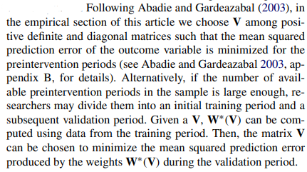
```

---
```{r, echo = FALSE, out.width="90%", fig.retina = 1, fig.align='center'}
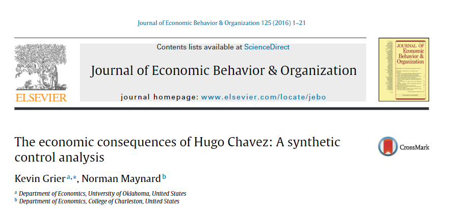
```

---
```{r, echo = FALSE, out.width="90%", fig.retina = 1, fig.align='center'}
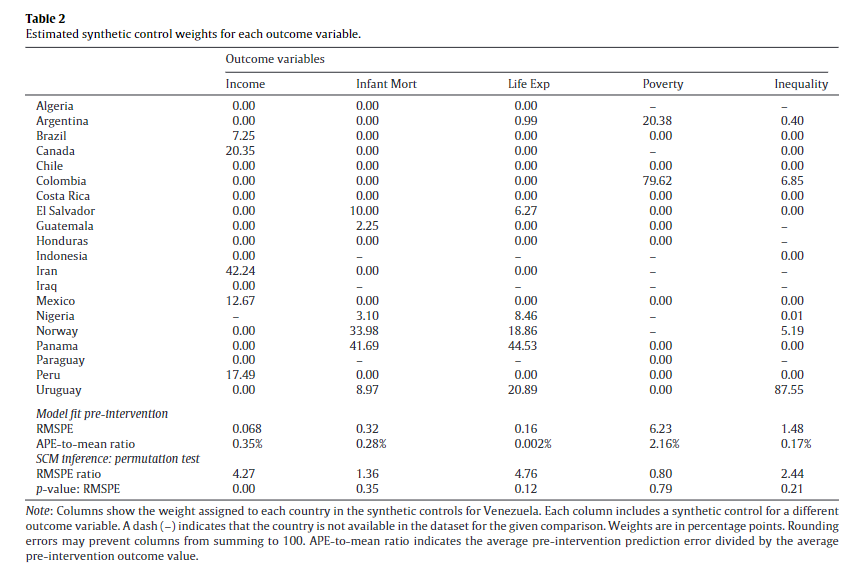
```

---
```{r, echo = FALSE, out.width="90%", fig.retina = 1, fig.align='center'}
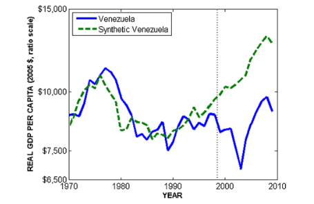
```

---
```{r, echo = FALSE, out.width="90%", fig.retina = 1, fig.align='center'}
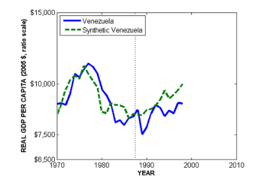
```

---
```{r, echo = FALSE, out.width="90%", fig.retina = 1, fig.align='center'}
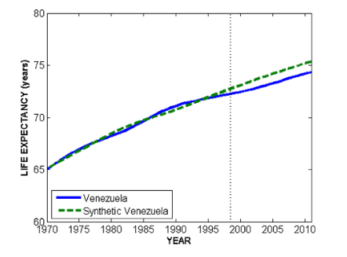
```

---
```{r, echo = FALSE, out.width="90%", fig.retina = 1, fig.align='center'}
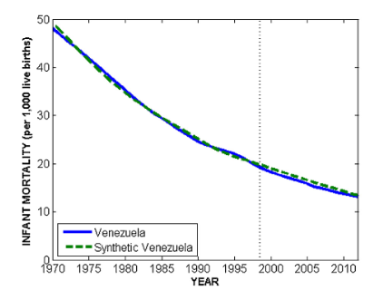
```

---
```{r, echo = FALSE, out.width="90%", fig.retina = 1, fig.align='center'}
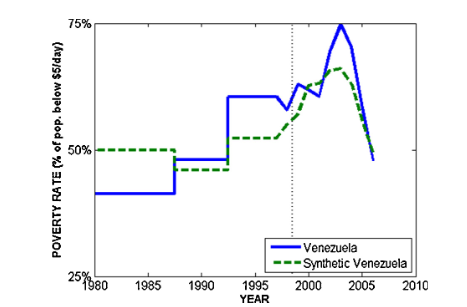
```

---
```{r, echo = FALSE, out.width="90%", fig.retina = 1, fig.align='center'}
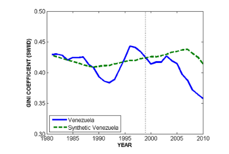
```

---
```{r, echo = FALSE, out.width="90%", fig.retina = 1, fig.align='center'}
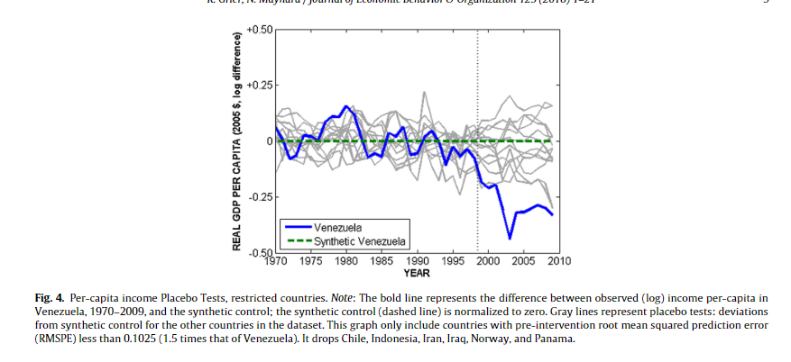
```

---
```{r, echo = FALSE, out.width="90%", fig.retina = 1, fig.align='center'}
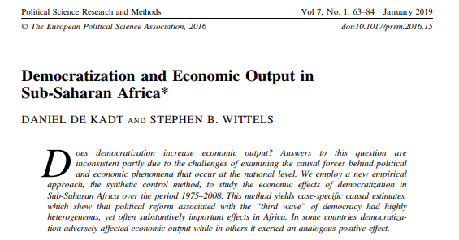
```

---
```{r, echo = FALSE, out.width="90%", fig.retina = 1, fig.align='center'}
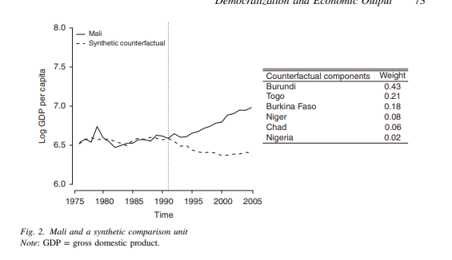
```

---
```{r, echo = FALSE, out.width="90%", fig.retina = 1, fig.align='center'}
include_graphics("images/DeKadt3.png")
```

---
```{r, echo = FALSE, out.width="90%", fig.retina = 1, fig.align='center'}
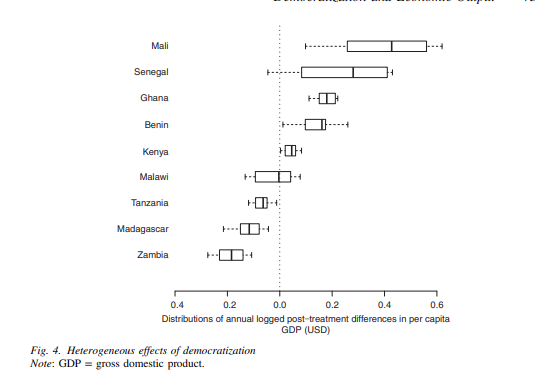
```

---
```{r, echo = TRUE, out.width="90%", fig.retina = 1, fig.align='center'}
library(Synth)
```

---
```{r, echo = TRUE, out.width="90%", fig.retina = 1, fig.align='center'}
afripanel <- read.csv("https://github.com/jnseawright/PS406/raw/main/data/afripanel.csv")

malidata <- afripanel[afripanel$WBCode=="MLI" | afripanel$cont_dem_ind==1,]

malicontrols <- unique(malidata$WBCode[malidata$WBCode!="MLI"&malidata$WBCode!="ETH"&malidata$WBCode!="SDN"])
```

---
```{r, echo = TRUE, out.width="90%", fig.retina = 1, fig.align='center'}
mali.prep <- dataprep(
    foo=malidata, 
    predictors=c(
      "lngdpmadlag",
      "lngdpmadlag2",
      "lngdpmadlag3",
      "lngdpmadlag4",
      "lnpop",
      "ki",
      "openk",
      "civwar",
      "civwarend",
      "pwt_xrate",
      "pwt_xrate_lag1",
      "pwt_xrate_lag2",
      "pwt_xrate_lag3",
      "eximdiff",
      "eximdiff_lag1",
      "eximdiff_lag2",
      "wbank",
      "wbank_lag1",
      "wbank_lag2",
      "imfadj",
      "imfadj_lag1",
      "imfadj_lag2"
    ),
    dependent="lngdpmad",
    unit.variable="wbcode2",
    time.variable="year", 
    treatment.identifier="MLI", 
    controls.identifier=malicontrols,          
    time.predictors.prior=c(1975:1990),
    time.optimize.ssr=c(1975:1991),
    time.plot=c(1975:2008),
    unit.names.variable="WBCode"
)
```

---
```{r, echo = TRUE, out.width="90%", fig.retina = 1, fig.align='center'}
mali.synth <- synth(mali.prep)
```

---
```{r, echo = TRUE, out.width="60%", fig.retina = 1, fig.align='center'}
path.plot(synth.res=mali.synth, dataprep.res=mali.prep,
           Ylab="Log GDP per capita", Legend=NA, tr.intake=1991,
           Ylim=c(6,8) , Main="Mali"
)
```

---
### Sensitivity Analysis

Informal talk: just run a bunch of models.

Advantage: we can see a family of results!

Disadvantages: How systematic was the collection? Was every result actually reported? How is this different from specification searching/p hacking?

---
### Sensitivity Analysis

More formal ideas:

1.  Ensemble models

2.  Rosenbaum bounds

---
### Sensitivity Analysis

One approach to sensitivity analysis is to average all the credible
models. But why a simple average?

---
### Ensemble Model

1.  Fit each credible model

2.  Form fitted values for each case from each model

3.  Run an ensemble model that predicts the outcome based on those
    fitted values, which assigns each model a weight

---
### Ensemble Model

Does this help for causal inference?

---
### Ensemble Model

Athey et al. 2019 propose using an ensemble model to construct synthetic
controls, and show that it can outperform single-model methods.

---
### Ensemble Model

An alternative approach can be to build two ensemble models, one for the
cases in the treatment group and one for cases in the control group.
Then run *all* cases through both models and use differences in fitted
values to estimate causal effects.

---
### Rosenbaum Bounds

Consider a single matched pair of cases in a matching study, or a joined
treatment and control case in a stratified experiment. These individuals
*should* have the same propensity score. If there is confounding, will
they?

---
### Rosenbaum Bounds

Let's use $\Gamma$ to represent the degree to which confounding distorts
random assignment. So if $\Gamma = 2$, then confounding is going to lead
one case to be twice as likely to receive the treatment as the other.
How much would the causal inference shift if $\Gamma$ could be as big as
2?

---
### Rosenbaum Bounds

It turns out that, for most methods, there is an upper and a lower bound
on the possible causal inference for any given level of $\Gamma$ and the
existing data, called the Rosenbaum Bounds. Exploring these tells us how
much confounding there would have to be in order to produce a large
change in our causal inference.

---
```{r, echo = TRUE, out.width="60%", fig.retina = 1, fig.align='center'}
library(sensemakr)
```

---
```{r, echo = TRUE, out.width="60%", fig.retina = 1, fig.align='center'}
perulm <- lm(outsidervote ~ simpletreat, data=peruemotions)
peru.sens1 <- sensemakr(perulm, "simpletreat")
```

---
```{r, echo = TRUE, out.width="60%", fig.retina = 1, fig.align='center'}
peru.sens1
```

---
```{r, echo = TRUE, out.width="60%", fig.retina = 1, fig.align='center'}
plot(peru.sens1)
```

---
```{r, echo = TRUE, out.width="60%", fig.retina = 1, fig.align='center'}
perulm2 <- lm(risk ~ simpletreat + edlevel + classid + leftright + age + I(age^2), data=peruemotions)
peru.sens2 <- sensemakr(perulm2, "simpletreat", benchmark_covariates="age")
```

---
```{r, echo = TRUE, out.width="60%", fig.retina = 1, fig.align='center'}
plot(peru.sens2)
```

---
### Manski Bounds

Consider a situation with a dichotomous treatment and a dichotomous
outcome.

---
### Manski Bounds

Before we do anything else, the possible average treatment effect in such a
scenario is known to be somewhere between -1 and 1, inclusive.

---
### Manski Bounds

Every individual case has one of three specific treatment effects: -1, 0, or 1.

---
### Manski Bounds

Consider:

$Y_{i, t}=0$

$Y_{i, c}=1$

Here, the causal effect is -1. 

(Notice that a case in the treatment group with an outcome of zero either has a causal effect of 0 or -1, but cannot have a causal effect of 1. Likewise, a control case with an outcome of one!)

---
### Manski Bounds

Alternatively:

$Y_{i, t}=1$

$Y_{i, c}=0$

Here, the causal effect is 1.

(Notice that cases with these observed pairs of outcomes could have a causal effect of either 1 or 0, but cannot have -1.)

---
### Manski Bounds

For every case that we observe, we rule out one of the three possible causal effects. This information, *by itself*, puts some modest limits on what the average treatment effect can be.

---
### Manski Bounds

Manski and Nagin look at the average treatment effect:

$$ATE = E(Y_{t}) - E(Y_{c})$$
$$ATE = E(Y_{t} | X=t)P(X=t) + E(Y_{t} | X=c)P(X=c)\\ - E(Y_{c}| X=t)P(X=t) - E(Y_{c}| X=c)P(X=c)$$

---
### Lower Bound

$$ATE = E(Y_{t} | X=t)P(X=t) + 0 \\ - 1 - E(Y_{c}| X=c)P(X=c)$$

---
### Upper Bound

$$ATE = E(Y_{t} | X=t)P(X=t) + 1 \\ - 0 - E(Y_{c}| X=c)P(X=c)$$

---
```{r, echo = TRUE, out.width="60%", fig.retina = 1, fig.align='center'}
library(ATbounds)
```

---
```{r, echo = TRUE, out.width="60%", fig.retina = 1, fig.align='center'}
nswre_treated <- read.table("http://users.nber.org/~rdehejia/data/nswre74_treated.txt")

colnames(nswre_treated) <- c("treat","age","edu","black","hispanic", "married","nodegree","RE74","RE75","RE78")

nswre_control <- read.table("http://users.nber.org/~rdehejia/data/nswre74_control.txt") 

colnames(nswre_control) <- c("treat","age","edu","black","hispanic","married","nodegree","RE74","RE75","RE78")

nswre <- rbind(nswre_treated,nswre_control)

D <- nswre$treat
Y <- (nswre$RE78 > 0)
X <- with(nswre, cbind(age,edu,black,hispanic,married,nodegree,RE74/1000,RE75/1000))

model <- lm(Y ~ D)
```

---
```{r, echo = TRUE, out.width="60%", fig.retina = 1, fig.align='center'}
summary(model)
```

---
```{r, echo = TRUE, out.width="60%", fig.retina = 1, fig.align='center'}
rps <- rep(mean(D),length(D))
bns_nsw <- atebounds(Y, D, X, rps, Q=1)
summary(bns_nsw)
```

---
```{r, echo = TRUE, out.width="60%", fig.retina = 1, fig.align='center'}
bns_nsw2 <- atebounds(Y, D, X, rps, Q=2)
summary(bns_nsw2)
```

---
### Manski Bounds

-   Ecological inference

-   Missing data
