class: center, middle

```{css, echo=FALSE}
pre {
  max-height: 400px;
  overflow-y: auto;
}

pre[class] {
  max-height: 200px;
}
```

```{r, load_refs, include=FALSE, cache=FALSE}
# Initializes the bibliography
library(RefManageR)

library(ggplot2)
library(dplyr)
library(readr)
library(nlme)
library(jtools)

BibOptions(check.entries = FALSE,
           bib.style = "authoryear", # Bibliography style
           max.names = 3, # Max author names displayed in bibliography
           sorting = "nyt", #Name, year, title sorting
           cite.style = "authoryear", # citation style
           style = "markdown",
           hyperlink = FALSE,
           dashed = FALSE)
#myBib <- ReadBib("assets/myBib.bib", check = FALSE)
# Note: don't forget to clear the knitr cache to account for changes in the
# bibliography.

peruemotions <- read.csv("https://github.com/jnseawright/PS406/raw/main/data/peruemotions.csv")
```
```{r xaringan-themer, include=FALSE, warning=FALSE}
library(xaringanthemer,MnSymbol)
style_mono_accent(
  base_color = "#1c5253",
  header_font_google = google_font("Josefin Sans"),
  text_font_google   = google_font("Montserrat", "300", "300i"),
  code_font_google   = google_font("Fira Mono"),
  text_font_size = "1.6rem"
)
```

### Manufacture Perfect Comparisons

Strictly speaking, for the Method of Difference to work based on a
comparison between cases 1 and 2, the condition which must be met is:

$$\begin{aligned}
Y_{1,t} = Y_{2,t}\\
Y_{1,c} = Y_{2,c}\end{aligned}$$

---
### Manufacture Perfect Comparisons

No observable condition can ever guarantee that this assumption is met,
but if we were to find two cases that *exactly* match on a suitably rich
set of background variables $\mathbb{Z}$, perhaps, we would come close to believing the
assumption.

---
### Manufacture Perfect Comparisons

Unfortunately, if $\mathbb{Z}$ is indeed a reasonably deep list of
variables, we are unlikely to find cases that in fact exactly match (or
even come particularly close).

---
### Manufacture Perfect Comparisons

Abadie and collaborators suggest that we create our own "synthetic"
control cases, by averaging together existing control cases to come as
close as possible to exactly matching the treatment case on
$\mathbb{Z}$.

---
### Synthetic Control

The setup is one in which there are $N$ cases, each of which is observed
at multiple time periods labeled from 1 through $T$.

---
### Synthetic Control

Each case has a treatment and control potential outcome for each time
period. The difference between these is:

$\alpha_{i,t} = Y^T_{i,t} - Y^C_{i,t}$

---
### Synthetic Control

Suppose that the treatment of interest happens in *one* case at one time
period. That is, $D_{j,t}=0$ for all $j \neq i$ and for all
$t < t_{treat}$.

---
### Synthetic Control

Let $X_{i} = (\mathbb{Z}_{i}, Y_{i})$

Minimize $X_{i, t} -  \mathbb{X}_{j, t} W$ for $t < t_{treat}$.

---
### Synthetic Control

$\sqrt{(X_{i, t} -  \mathbb{X}_{j, t} W)^{T} V (X_{i, t} -  \mathbb{X}_{j, t} W)}$

---
```{r, echo = FALSE, out.width="90%", fig.retina = 1, fig.align='center'}
library(knitr)
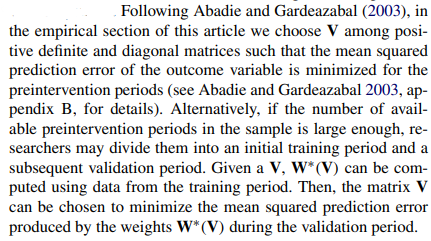
```

---
```{r, echo = FALSE, out.width="90%", fig.retina = 1, fig.align='center'}

```

---
```{r, echo = FALSE, out.width="90%", fig.retina = 1, fig.align='center'}
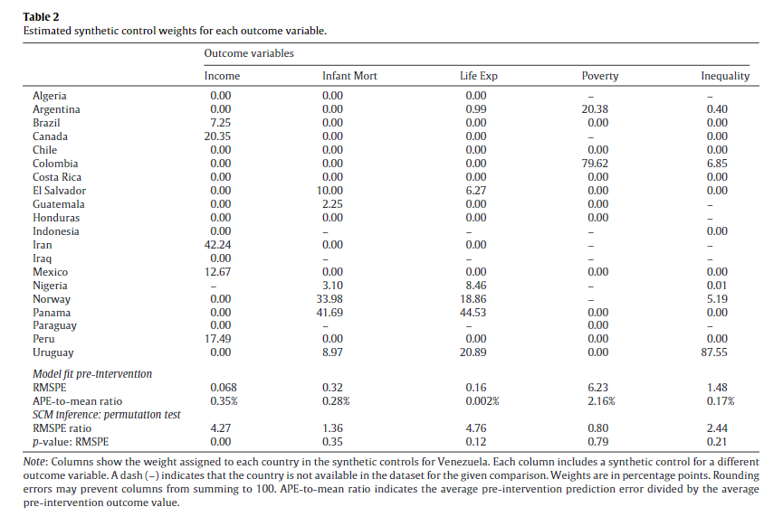
```

---
```{r, echo = FALSE, out.width="90%", fig.retina = 1, fig.align='center'}
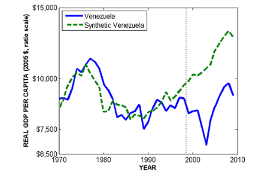
```

---
```{r, echo = FALSE, out.width="90%", fig.retina = 1, fig.align='center'}
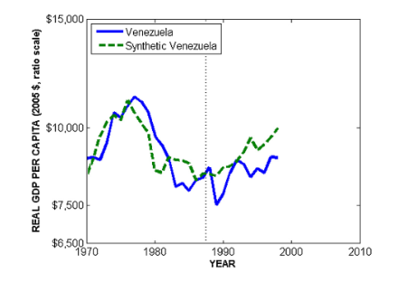
```

---
```{r, echo = FALSE, out.width="90%", fig.retina = 1, fig.align='center'}
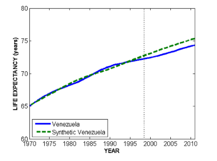
```

---
```{r, echo = FALSE, out.width="90%", fig.retina = 1, fig.align='center'}
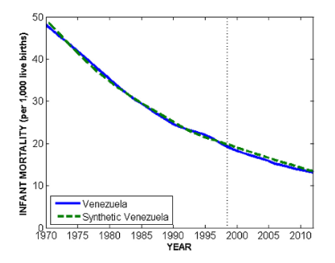
```

---
```{r, echo = FALSE, out.width="90%", fig.retina = 1, fig.align='center'}
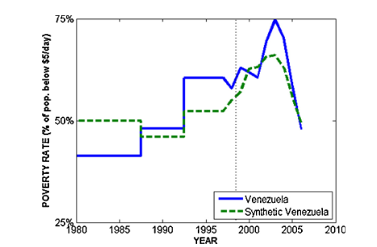
```

---
```{r, echo = FALSE, out.width="90%", fig.retina = 1, fig.align='center'}
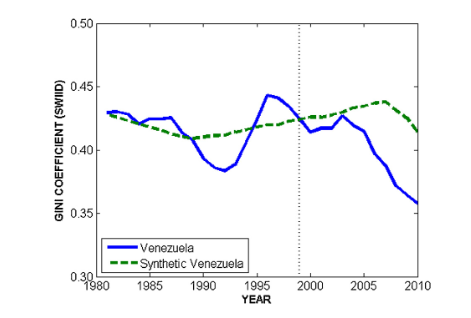
```

---
```{r, echo = FALSE, out.width="90%", fig.retina = 1, fig.align='center'}
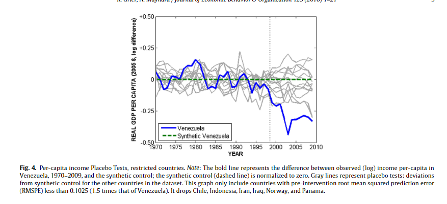
```

---
```{r, echo = FALSE, out.width="90%", fig.retina = 1, fig.align='center'}

```

---
```{r, echo = FALSE, out.width="90%", fig.retina = 1, fig.align='center'}
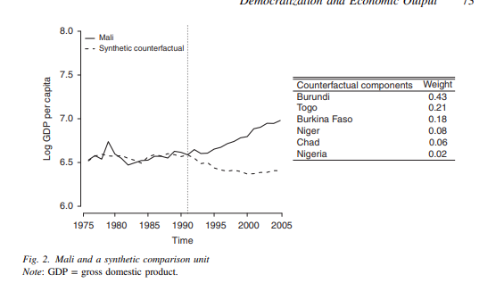
```

---
```{r, echo = FALSE, out.width="90%", fig.retina = 1, fig.align='center'}
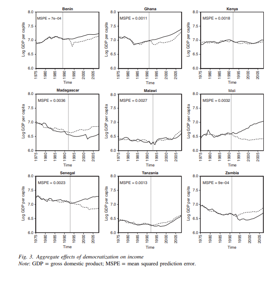
```

---
```{r, echo = FALSE, out.width="90%", fig.retina = 1, fig.align='center'}
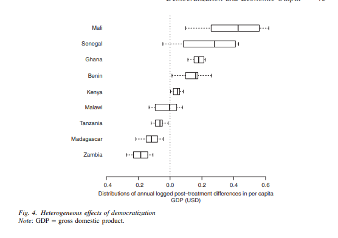
```

---
```{r, echo = TRUE, out.width="90%", fig.retina = 1, fig.align='center'}
library(Synth)
```

---
```{r, echo = TRUE, out.width="90%", fig.retina = 1, fig.align='center'}
afripanel <- read.csv("https://github.com/jnseawright/PS406/raw/main/data/afripanel.csv")

malidata <- afripanel[afripanel$WBCode=="MLI" | afripanel$cont_dem_ind==1,]

malicontrols <- unique(malidata$WBCode[malidata$WBCode!="MLI"&malidata$WBCode!="ETH"&malidata$WBCode!="SDN"])
```

---
```{r, echo = TRUE, out.width="90%", fig.retina = 1, fig.align='center'}
mali.prep <- dataprep(
    foo=malidata, 
    predictors=c(
      "lngdpmadlag",
      "lngdpmadlag2",
      "lngdpmadlag3",
      "lngdpmadlag4",
      "lnpop",
      "ki",
      "openk",
      "civwar",
      "civwarend",
      "pwt_xrate",
      "pwt_xrate_lag1",
      "pwt_xrate_lag2",
      "pwt_xrate_lag3",
      "eximdiff",
      "eximdiff_lag1",
      "eximdiff_lag2",
      "wbank",
      "wbank_lag1",
      "wbank_lag2",
      "imfadj",
      "imfadj_lag1",
      "imfadj_lag2"
    ),
    dependent="lngdpmad",
    unit.variable="wbcode2",
    time.variable="year", 
    treatment.identifier="MLI", 
    controls.identifier=malicontrols,          
    time.predictors.prior=c(1975:1990),
    time.optimize.ssr=c(1975:1991),
    time.plot=c(1975:2008),
    unit.names.variable="WBCode"
)
```

---
```{r, echo = TRUE, out.width="90%", fig.retina = 1, fig.align='center'}
mali.synth <- synth(mali.prep)
```

---
```{r, echo = TRUE, out.width="60%", fig.retina = 1, fig.align='center'}
path.plot(synth.res=mali.synth, dataprep.res=mali.prep,
           Ylab="Log GDP per capita", Legend=NA, tr.intake=1991,
           Ylim=c(6,8) , Main="Mali"
)
```

---
### Why Sensitivity Analysis?

Many causal inference methods rely on **untestable assumptions**:
- Unconfoundedness (selection on observables)
- Parallel trends (DiD)
- Exclusion restriction (IV)
- Continuity (RDD)
- No interference (SUTVA)

---
### Why Sensitivity Analysis?

We can never definitively prove these assumptions hold.  
Sensitivity analysis asks: **How much would the assumptions have to be violated to change our conclusions?**

---
### The Core Question

**If the identifying assumption were false, how different would the results need to be to overturn our inference?**

---
### The Core Question

For example:
- In a DiD study, what if the parallel trends assumption failed by a certain amount?
- In an IV study, what if the instrument had a small direct effect on the outcome?
- In a regression study, what if an unmeasured confounder existed?

Sensitivity analysis quantifies the robustness of findings to such violations.

---
### Two Broad Approaches

| Approach | Description | Example |
|----------|-------------|---------|
| **Informal / Multiverse** | Estimate the same question under many plausible specifications | Specification curve analysis, robustness checks |
| **Formal / Parametric** | Introduce a sensitivity parameter that measures the degree of violation, and derive bounds or adjusted estimates | Rosenbaum bounds, Manski bounds, sensitivity parameters in regression |

---
### Two Broad Approaches

Both approaches help assess whether results are **fragile** (easily overturned) or **robust** (withstand substantial violations).

---
### Informal Sensitivity: The "Multiverse"

Instead of one model, estimate many reasonable models.

---
### Informal Sensitivity: The "Multiverse"


```{r multiverse_example, echo = TRUE, eval = TRUE}
# Example: vary control variables, sample restrictions, etc.
results <- list()
for (controls in list(c("age"), c("age", "Cuzco"), c("age", "Cuzco", "edlevel"))) {
  f <- as.formula(paste("outsidervote ~ simpletreat +", 
                        paste(controls, collapse = " + ")))
  results[[paste(controls, collapse = "_")]] <- lm(f, data = peruemotions)
}
```

---

```{r multiverse_example_plot, echo = FALSE, eval = TRUE}
# Extract estimates and confidence intervals
coef_data <- lapply(names(results), function(nm) {
  model <- results[[nm]]
  coef_sum <- summary(model)$coefficients["simpletreat", ]
  est <- coef_sum["Estimate"]
  se <- coef_sum["Std. Error"]
  ci_low <- est - 1.96 * se
  ci_high <- est + 1.96 * se
  data.frame(
    model = nm,
    estimate = est,
    ci_low = ci_low,
    ci_high = ci_high,
    stringsAsFactors = FALSE
  )
}) %>% bind_rows()

# Order models by estimate (optional)
coef_data$model <- factor(coef_data$model, 
                          levels = c("age", "age_Cuzco", "age_Cuzco_edlevel"))

# Plot
ggplot(coef_data, aes(x = model, y = estimate)) +
  geom_point(size = 3) +
  geom_errorbar(aes(ymin = ci_low, ymax = ci_high), width = 0.2) +
  geom_hline(yintercept = 0, linetype = "dashed", color = "gray50") +
  labs(
    title = "Sensitivity of Treatment Effect to Control Choices",
    x = "Control variables included",
    y = "Coefficient on 'simpletreat'"
  ) +
  theme_minimal(base_size = 14) +
  theme(axis.text.x = element_text(angle = 45, hjust = 1))
```

---
### Informal Sensitivity: The "Multiverse"

- Plot all estimates with confidence intervals.
- If all estimates point in the same direction and are similar in magnitude, confidence increases.
- **Caveat**: Which models are "reasonable"? How do we avoid cherry‑picking?

---
### Formal Sensitivity: A Parameter for Violation

Introduce a parameter that captures the **strength of unmeasured confounding**.

Example (linear regression with omitted variable):
$$Y = \beta D + \gamma U + \epsilon$$
$$D = \pi U + \nu$$

If $U$ is unobserved, the bias in $\hat{\beta}$ is approximately $\gamma \times \pi$.

---
### Formal Sensitivity: A Parameter for Violation

Sensitivity analysis asks: **How large would $\gamma$ and $\pi$ need to be to reduce $\hat{\beta}$ to zero (or to change its sign)?**

---
### The Robustness Value

A useful concept from `sensemakr` (Cinelli & Hazlett 2020):

**Robustness Value (RV)**: The minimum strength of association (partial $R^2$) that an unmeasured confounder would need to have with both treatment and outcome to **fully explain away** the estimated effect.

---
### The Robustness Value

- RV close to 1 → very robust (confounder would need to explain almost all residual variation).
- RV close to 0 → fragile (even a weak confounder could overturn the result).

---
### Preview: Methods We'll Cover

| Method | When to Use | Key Output |
|--------|-------------|------------|
| **Rosenbaum bounds** | Matched pairs / stratified designs | Range of p‑values under increasing hidden bias ($\Gamma$) |
| **Manski bounds** | Binary outcomes, no assumptions | Worst‑case bounds on ATE |
| **Sensitivity parameters (`sensemakr`)** | Linear regression | Robustness value, contour plots |

---
### Rosenbaum Bounds

Consider a single matched pair of cases in a matching study, or a joined
treatment and control case in a stratified experiment. These individuals
*should* have the same propensity score (probability of assignment to the treatment). If there is confounding, will they?

---
### Rosenbaum Bounds: Motivation

In a matched study, we compare treated and control units that are similar on observed covariates. But what if they differ on an **unmeasured confounder**?

Rosenbaum bounds ask: **How much hidden bias would need to be present to alter our conclusions?**

---
### The Sensitivity Parameter Gamma

Let $\pi_i$ be the probability that unit $i$ receives treatment, given observed covariates.  
In a matched pair, the odds ratio of treatment for the two units is:

$$\frac{\pi_{i1}/(1-\pi_{i1})}{\pi_{i2}/(1-\pi_{i2})}$$

If matching on observables removed all bias, this odds ratio = 1 for every pair.

---
### The Sensitivity Parameter Gamma

The sensitivity parameter $\Gamma$ bounds this odds ratio:

$$\frac{1}{\Gamma} \leq \frac{\pi_{i1}/(1-\pi_{i1})}{\pi_{i2}/(1-\pi_{i2})} \leq \Gamma$$

- $\Gamma = 1$: no hidden bias (treatment assignment is effectively random within pairs).
- $\Gamma > 1$: hidden bias may cause one unit to be up to $\Gamma$ times more likely to receive treatment than its matched control.

---
### What Does Gamma Mean?

If $\Gamma = 2$, an unmeasured confounder could make a treated unit **twice as likely** to receive treatment as its matched control, even after matching on observables.

We ask: **At what value of $\Gamma$ would our statistically significant result become non‑significant (p > 0.05)?**  
If that happens at a small $\Gamma$, the result is sensitive; if it requires a large $\Gamma$, the result is robust.

---
### A Simple Numerical Example

Imagine a matched study with 10 pairs. In each pair, one unit is treated, one is control. We observe a binary outcome (success/failure). Suppose we have 5 pairs where treated succeeded and control failed (1,0), 2 pairs where control succeeded and treated failed (0,1), 1 pair where both succeeded, and 2 where both failed.

---
### Test Statistic

A common test is **McNemar's test**, which uses only the discordant pairs (those where outcomes differ: (1,0) and (0,1)). Let:
- $n_{10}$ = number of pairs with (treated=1, control=0) = 5
- $n_{01}$ = number of pairs with (treated=0, control=1) = 2

Under the null of no effect, the treated unit in each discordant pair is equally likely to be the success. The test statistic is binomial with $n = n_{10}+n_{01} = 7$ and $p = 0.5$.

---
### Without Hidden Bias ($\Gamma = 1$)

The probability of observing $n_{10} \geq 5$ under the null is:

$$P(X \geq 5) = \sum_{k=5}^{7} \binom{7}{k} (0.5)^7 \approx 0.227$$

This p-value > 0.05 – the result is **not significant** even without hidden bias. (So in this example, the treatment effect is weak.)

But suppose the result were significant at $\Gamma = 1$. How would hidden bias affect it?

---
### Introducing Hidden Bias

If $\Gamma > 1$, the treated unit in a discordant pair could be up to $\Gamma$ times more likely to be the success even under the null.

The exact distribution becomes more complicated, but we can compute **bounds on the p-value**. For a one-sided test, the upper bound (most conservative) is:

$$p\text{-value}_{\text{upper}} = P\left(\text{observed or more extreme} \mid \text{maximally unfavorable bias}\right)$$

This is calculated using a binomial distribution with a shifted probability $p = \Gamma/(1+\Gamma)$ instead of $0.5$.

---
### Numerical Example: Effect of Γ

Let's recompute the p-value for different $\Gamma$ values, assuming $n_{10}=5, n_{01}=2$:

| $\Gamma$ | Probability under null (upper bound) | P-value (upper bound) |
|----------|--------------------------------------|------------------------|
| 1.0      | 0.5                                  | 0.227                  |
| 1.5      | $1.5/(1+1.5) = 0.6$                 | $P(X \geq 5 \mid p=0.6)$ |
| 2.0      | $2/(1+2) = 0.667$                    | ...                    |
| 3.0      | $3/(1+3) = 0.75$                     | ...                    |

---
### Numerical Example: Effect of Γ

We can compute:

```{r rosenbaum_calc, echo = TRUE}
# Function to compute upper bound p-value for given gamma
rosenbaum_p <- function(gamma, n10, n01) {
  n <- n10 + n01
  p <- gamma / (1 + gamma)
  # one-sided: probability of seeing at least n10 successes
  sum(dbinom(n10:n, size = n, prob = p))
}

gammas <- c(1, 1.5, 2, 2.5, 3)
results <- data.frame(
  Gamma = gammas,
  p_upper = sapply(gammas, rosenbaum_p, n10 = 5, n01 = 2)
)
results
```

---
### Interpreting the Results

As $\Gamma$ increases, the p-value grows. In this example, the result is not significant at any $\Gamma$ (because it wasn't at $\Gamma=1$). 

But if the initial p-value had been 0.03 at $\Gamma=1$, we would look for the $\Gamma$ at which the upper bound crosses 0.05. That $\Gamma$ is a measure of robustness.

---
### Summary: Rosenbaum Bounds

- Rosenbaum bounds assess sensitivity to an unmeasured confounder in matched studies.
- The sensitivity parameter $\Gamma$ quantifies how much hidden bias could affect treatment assignment.
- For each $\Gamma$, we compute the **worst‑case p‑value**.
- If the p‑value remains below 0.05 even at moderate $\Gamma$ (say, $\Gamma = 2$), the result is robust.
- If it crosses 0.05 at a small $\Gamma$, the result is sensitive.

---
### Summary: Rosenbaum Bounds

**Important**: Rosenbaum bounds are conservative – they assume the worst possible pattern of hidden bias. If the result survives, it is robust to any such bias.

---
### Application in R

The `rbounds` package implements Rosenbaum bounds for matched data:

```{r rbounds_example, echo = TRUE, eval = FALSE}
library(rbounds)
# Suppose we have matched data with outcomes
# psens() for binary outcomes, hlsens() for continuous
psens(x=c(38, 23, 41, 18, 37, 36, 23, 62, 31, 34, 24, 14, 21, 17, 16, 20,
         15, 10, 45, 39, 22, 35, 49, 48, 44, 35, 43, 39, 34, 13, 73, 25,
         27), y = c(16, 18, 18, 24, 19, 11, 10, 15, 16, 18, 18, 13, 19, 10, 16,
          16, 24, 13, 9, 14, 21, 19, 7, 18, 19, 12, 11, 22, 25, 16, 13,
          11, 13), Gamma = 10, GammaInc = 0.5)
```

---
```{r, echo = TRUE, out.width="60%", fig.retina = 1, fig.align='center'}
library(sensemakr)
```

---
```{r, echo = TRUE, out.width="60%", fig.retina = 1, fig.align='center'}
perulm <- lm(outsidervote ~ simpletreat, data=peruemotions)
peru.sens1 <- sensemakr(perulm, "simpletreat")
```

---
```{r, echo = TRUE, out.width="60%", fig.retina = 1, fig.align='center'}
peru.sens1
```

---
```{r, echo = TRUE, out.width="60%", fig.retina = 1, fig.align='center'}
plot(peru.sens1)
```

---
```{r, echo = TRUE, out.width="60%", fig.retina = 1, fig.align='center'}
perulm2 <- lm(risk ~ simpletreat + edlevel + classid + leftright + age + I(age^2), data=peruemotions)
peru.sens2 <- sensemakr(perulm2, "simpletreat", benchmark_covariates="age")
```

---
```{r, echo = TRUE, out.width="60%", fig.retina = 1, fig.align='center'}
plot(peru.sens2)
```

---
### Manski Bounds: Setting

We consider a binary outcome $Y \in \{0,1\}$ and binary treatment $D \in \{0,1\}$.  
Potential outcomes: $Y(1)$, $Y(0)$. The average treatment effect is:

$$ATE = E[Y(1)] - E[Y(0)]$$

We observe $Y$ only under the actual treatment received. The challenge: for each unit, we are missing the counterfactual outcome.

---
### Worst-Case Bounds (No Assumptions)

Without any assumptions, what can we say about $ATE$?

We know:
- $E[Y(1)] = P(Y=1 | D=1)P(D=1) + P(Y=1 | D=0)P(D=0)$  
  The first term is observed; the second term is unobserved, but $P(Y=1 | D=0)$ lies between 0 and 1.
- Similarly, $E[Y(0)] = P(Y=1 | D=0)P(D=0) + P(Y=1 | D=1)P(D=1)$.

---
### Lower Bound

To get the smallest possible $ATE$, we make the unobserved counterfactuals as extreme as possible in opposite directions:

- For treated units ($D=1$), their untreated outcome $Y(0)$ could be as high as 1.
- For untreated units ($D=0$), their treated outcome $Y(1)$ could be as low as 0.

This gives:

$$ATE_{lower} = P(Y=1|D=1)P(D=1) + 0\cdot P(D=0) - [1\cdot P(D=1) + P(Y=1|D=0)P(D=0)]$$

Simplify:

$$ATE_{lower} = P(Y=1|D=1)P(D=1) - P(Y=1|D=0)P(D=0) - P(D=1)$$

---
### Upper Bound

For the largest possible $ATE$:

- For treated units, $Y(0)$ could be 0.
- For untreated units, $Y(1)$ could be 1.

Then:

$$ATE_{upper} = P(Y=1|D=1)P(D=1) + 1\cdot P(D=0) - [0\cdot P(D=1) + P(Y=1|D=0)P(D=0)]$$

Simplify:

$$ATE_{upper} = P(Y=1|D=1)P(D=1) - P(Y=1|D=0)P(D=0) + P(D=0)$$

---
### A Concrete Example: NSW Job Training Data

```{r atbounds_loading, echo = TRUE, eval = TRUE}
nswre_treated <- read.table("http://users.nber.org/~rdehejia/data/nswre74_treated.txt")

colnames(nswre_treated) <- c("treat","age","edu","black","hispanic", "married","nodegree","RE74","RE75","RE78")

nswre_control <- read.table("http://users.nber.org/~rdehejia/data/nswre74_control.txt") 

colnames(nswre_control) <- c("treat","age","edu","black","hispanic","married","nodegree","RE74","RE75","RE78")

nswre <- rbind(nswre_treated,nswre_control)

D <- nswre$treat
Y <- (nswre$RE78 > 0)
X <- with(nswre, cbind(age,edu,black,hispanic,married,nodegree,RE74/1000,RE75/1000))
```

---

We have:

- $D=1$ (treatment): 297 treated units.
- $D=0$ (control): 425 control units.
- Outcome $Y$: 1 if earnings in 1978 > 0, 0 otherwise.

Let's compute the observed shares:

```{r nsw_bounds_calc, echo = TRUE}
Y <- nswre$RE78 > 0   # binary outcome
D <- nswre$treat

p1 <- mean(Y[D == 1])   # P(Y=1|D=1)
p0 <- mean(Y[D == 0])   # P(Y=1|D=0)
prop_treat <- mean(D)   # P(D=1)

cat("P(Y=1|D=1) =", round(p1, 3), "\n")
cat("P(Y=1|D=0) =", round(p0, 3), "\n")
cat("P(D=1) =", round(prop_treat, 3), "\n")
```

---
### Compute Manski Bounds

Now plug into the formulas:

```{r nsw_bounds_calc2, echo = TRUE}
lower <- p1 * prop_treat - p0 * (1 - prop_treat) - prop_treat
upper <- p1 * prop_treat - p0 * (1 - prop_treat) + (1 - prop_treat)

cat("Manski bounds without covariates: [", round(lower, 3), ", ", round(upper, 3), "]\n")
```

Interpretation: The ATE on the probability of positive earnings lies somewhere between `r round(lower,3)` and `r round(upper,3)`. These bounds are wide because we made no assumptions.

---
### What Do These Bounds Tell Us?

- The bounds always contain the true ATE.
- They are **worst‑case** bounds; any additional assumptions will narrow them.
- Here, the interval includes zero, so we cannot rule out no effect (or even a negative effect) without further assumptions.

---
### Narrowing Bounds with Covariates

If we condition on covariates $X$, we can compute bounds within each stratum and then average. This often narrows the bounds because within strata, the unobserved outcomes are less extreme.

The `ATbounds` package does this automatically. 

---

```{r atbounds_nsw, echo = TRUE, eval = TRUE}
library(ATbounds)
bns_nsw <- atebounds(Y, D, X, rep(mean(D),length(D)), Q=1)
summary(bns_nsw)
bns_nsw_pool2 <- atebounds(Y, D, X, rep(mean(D),length(D)), Q=2)
summary(bns_nsw_pool2)
```

- `Q=1` means no pooling across observations.
- `Q=2` pools across neighboring observations vis-a-vis the covariates.


---
### Summary: Manski Bounds

- Manski bounds provide **worst‑case** bounds on the ATE using only the data and no assumptions.
- They are often wide, but they are **guaranteed** to contain the truth.
- Adding covariates (or other assumptions) can narrow the bounds.
- They are useful as a benchmark: if the bounds exclude zero, we have evidence of an effect even without any assumptions.

**In practice**, we rarely rely solely on worst‑case bounds; we combine them with plausible assumptions to get tighter intervals. But they remind us that all causal inference rests on assumptions – and show how much those assumptions buy us.

---
### Manski Bounds: Ecological Inference

**Ecological inference problem**: We have aggregate data (e.g., voting totals by precinct) but want to know individual-level behavior (e.g., how individuals voted by race).

- Suppose we know the fraction of Black voters in a precinct, and the fraction who voted for a candidate.
- We want to know the fraction of Black voters who voted for the candidate.

Without individual-level data, the parameter is **partially identified** – Manski bounds give the range consistent with the aggregates.

---
### Ecological Inference: Example

In a precinct:
- 60% of voters are Black, 40% are White.
- 55% voted for Candidate A.

Let $\beta_B$ = fraction of Black voters who voted for A, $\beta_W$ = fraction of White voters who voted for A.  
We have:

$$0.6 \beta_B + 0.4 \beta_W = 0.55$$

$\beta_B$ and $\beta_W$ are unknown, but must lie in $[0,1]$. What are the possible values of $\beta_B$?

---
### Bounding $\beta_B$

Solve for $\beta_W$: $\beta_W = (0.55 - 0.6\beta_B)/0.4$.

Since $0 \le \beta_W \le 1$, we get:

$$0 \le \frac{0.55 - 0.6\beta_B}{0.4} \le 1$$

Multiply by 0.4: $0 \le 0.55 - 0.6\beta_B \le 0.4$

Rearrange for bounds on $\beta_B$:

- Lower bound: $0.55 - 0.6\beta_B \ge 0$ → $\beta_B \le 0.55/0.6 \approx 0.917$
- Upper bound: $0.55 - 0.6\beta_B \le 0.4$ → $\beta_B \ge (0.55-0.4)/0.6 = 0.25$

Also $\beta_B \in [0,1]$, so combined: $\beta_B \in [0.25, 0.917]$.

Thus, even without any further assumptions, we know Black support for A is between 25% and 91.7%.

---
### Ecological Inference with Multiple Precincts

With multiple precincts, the bounds tighten. The `ATbounds` package can compute these bounds for ecological inference problems (though its main focus is treatment effects). The logic is the same: observed aggregates + worst‑case individual outcomes give the range of possible individual-level parameters.

---
### Manski Bounds: Missing Data

**Missing data problem**: Outcomes are missing for some units. We want to estimate the mean of $Y$, $E[Y]$.

- Let $R=1$ if $Y$ observed, $R=0$ if missing.
- Observed data: $(R_i, R_i Y_i)$.
- The challenge: $E[Y] = P(R=1)E[Y|R=1] + P(R=0)E[Y|R=0]$.

$E[Y|R=1]$ is identified from complete cases; $E[Y|R=0]$ is completely unknown. Without assumptions, it could be any value in the support of $Y$.

---
### Worst‑Case Bounds for Missing Data

If $Y$ is bounded, say $Y \in [0,1]$, then:

- Lower bound: $E[Y] \ge P(R=1)E[Y|R=1] + P(R=0)\cdot 0$
- Upper bound: $E[Y] \le P(R=1)E[Y|R=1] + P(R=0)\cdot 1$

Thus:

$$P(R=1)E[Y|R=1] \le E[Y] \le P(R=1)E[Y|R=1] + P(R=0)$$

These are the **Manski bounds for missing data**.

---
### Example: Missing Data in a Survey

Suppose in a survey of 1000 people, 800 respond to a question, and the mean response among respondents is 0.6 (on a 0‑1 scale).  
Then $P(R=1)=0.8$, $E[Y|R=1]=0.6$, $P(R=0)=0.2$.

Lower bound = $0.8 \times 0.6 = 0.48$  
Upper bound = $0.48 + 0.2 = 0.68$

So the true population mean lies between 0.48 and 0.68. Without assumptions on nonrespondents, this is all we can say.

---
### Narrowing Bounds with Covariates

If we have covariates $X$ observed for all units, we can compute bounds conditional on $X$ and then average. This typically narrows the bounds because we can predict $Y$ better.

`ATbounds` can handle missing data by setting the treatment to missingness indicator and the outcome to $Y$. The bounds for the ATE become bounds for the population mean under missingness.

---
### Summary: Manski Bounds for Ecological Inference and Missing Data

- **Ecological inference**: Aggregate data bound individual parameters.
- **Missing data**: Observed data bound the population mean.
- In both cases, worst‑case bounds are **wide** but **assumption‑free**.
- Adding covariates, monotonicity, or other assumptions narrows the bounds.
- The same logic underlies partial identification in many settings.

**Key takeaway**: Even when we cannot point‑identify a parameter, we may still learn something useful from the data under minimal assumptions.

---
### Sensitivity Analysis

One approach to sensitivity analysis is to average all the credible
models. But why a simple average?

---
### Ensemble Models: The Basic Intuition

Instead of choosing **one** model, why not combine **many**?

An **ensemble** combines multiple models to improve prediction:
- Each model might capture different patterns in the data.
- The ensemble averages out individual model errors.
- Often performs better than any single model.

---
### Ensemble Models: The Basic Intuition

**Famous examples**: Random forests (ensemble of decision trees), gradient boosting, Netflix Prize winner.

---
### Ensemble Methods for Causal Inference

Athey et al. (2019) propose using ensembles to construct **better synthetic controls**:

1. Fit many different prediction models to the donor pool data.
2. Use the ensemble to predict the counterfactual outcome for the treated unit.
3. The treatment effect is the difference between observed and ensemble-predicted outcomes.

---
### Ensemble Methods for Causal Inference

**Why?** No single model (e.g., linear regression with fixed predictors) is guaranteed to be correct. The ensemble hedges against model misspecification.

---
### How It Works: Super Learner

The **Super Learner** algorithm (van der Laan et al. 2007) is a popular ensemble method:

1. Define a library of candidate algorithms (linear regression, LASSO, random forest, etc.).
2. Use cross-validation to estimate each algorithm's performance.
3. Find the optimal weighted combination that minimizes cross-validated error.
4. The final prediction is a weighted average of all candidate models.

---
### How It Works: Super Learner

The weights tell you which algorithms are most useful for your data.

---
### Example: Synthetic Control with Ensembles

Recall our Mali example. Instead of choosing one set of predictors and one weighting scheme, we could:

```{r ensemble_example, echo = TRUE, eval = TRUE}
library(SuperLearner)
library(origami)

# Step 1: Subset to pre-treatment period and select relevant columns
pre_data <- malidata[malidata$year < 1991, 
                     c("WBCode", "year", "lngdpmad", "lngdpmadlag", "lnpop", "openk", "civwar")]

# Step 2: Separate Mali and donors
mali_pre <- pre_data[pre_data$WBCode == "MLI", ]
donors_pre <- pre_data[pre_data$WBCode != "MLI", ]

# Step 3: Convert civwar to numeric (it's likely binary)
donors_pre$civwar <- as.numeric(as.character(donors_pre$civwar))
mali_pre$civwar <- as.numeric(as.character(mali_pre$civwar))

# Step 4: Handle missing values (listwise deletion on predictors only)
predictors <- c("lngdpmadlag", "lnpop", "openk", "civwar")
donors_clean <- donors_pre[complete.cases(donors_pre[, predictors]), ]
mali_clean <- mali_pre[complete.cases(mali_pre[, predictors]), ]

# Check if we have data
if (nrow(donors_clean) == 0) stop("No donor observations with complete predictors")
if (nrow(mali_clean) == 0) stop("No Mali pre-treatment observations with complete predictors")

# Step 5: Define algorithm library (install packages if needed)
SL.library <- c("SL.lm", "SL.mean")  # start simple; add others later

# Step 6: Fit Super Learner
set.seed(2026)
sl_fit <- SuperLearner(Y = donors_clean$lngdpmad,
                       X = donors_clean[, predictors],
                       SL.library = SL.library,
                       cvControl = list(V = 5))

# Step 7: Predict for Mali
pred <- predict(sl_fit, newdata = mali_clean[, predictors])

# Step 8: Compare actual vs predicted
plot(mali_clean$year, mali_clean$lngdpmad, type = "l", col = "blue",
     ylim = range(c(mali_clean$lngdpmad, pred$pred)),
     xlab = "Year", ylab = "Log GDP", main = "Mali: Actual vs Ensemble Prediction")
lines(mali_clean$year, pred$pred, col = "red", lty = 2)
legend("topright", legend = c("Actual", "Ensemble"), col = c("blue", "red"), lty = 1:2)
```

---
### Interpreting the Ensemble

```{r ensemble_weights, echo = TRUE, eval = TRUE}
# See the weights assigned to each algorithm
sl_fit$coef
```

- If `SL.lm` gets weight 0.7 and `SL.ranger` gets weight 0.3, the ensemble relies mostly on linear regression but also uses the random forest to capture nonlinearities.
- The cross-validated risk tells you how well the ensemble performs.

---
### Interpreting the Ensemble


**Caveat**: The ensemble is only as good as its candidate algorithms. If all algorithms are misspecified, the ensemble will also be misspecified – but it will usually be better than any single one.

---
### Ensembles vs. Traditional Synthetic Control

| Feature | Traditional SC | Ensemble SC |
|---------|----------------|-------------|
| **Model form** | Linear combination of donor units | Any supervised learning algorithm |
| **Weights** | On donor units | On algorithms (and indirectly on units) |
| **Flexibility** | Limited to linear combinations | Can capture complex relationships |
| **Interpretability** | High (weights on units) | Lower (weights on algorithms) |
| **When to use** | Small donor pool, linearity plausible | Large donor pool, complex relationships |

---
### Ensembles for Sensitivity Analysis

Ensembles can also serve a **sensitivity analysis** role:

1. Fit an ensemble model to the control group.
2. Fit an ensemble model to the treatment group (using pre-treatment data).
3. Predict outcomes for **all** units under both models.
4. The difference in predictions gives an estimate of the treatment effect that is **robust** to model choice.

If the treatment effect estimate is similar across many model specifications, we gain confidence that it's not an artifact of a particular model.

---
### Back to the Peru Example

We could use an ensemble to check whether the effect of `simpletreat` on `outsidervote` is robust to how we model the relationship:

```{r peru_ensemble, echo = TRUE, eval = TRUE}
# Split data by treatment status
peruemotionssmall <- na.omit(data.frame(simpletreat=peruemotions$simpletreat,
                                outsidervote=peruemotions$outsidervote,
                                age=peruemotions$age,
                                Cuzco=peruemotions$Cuzco,
                                edlevel=peruemotions$edlevel))
control_data <- peruemotionssmall[peruemotionssmall$simpletreat == 0, ]
treated_data <- peruemotionssmall[peruemotionssmall$simpletreat == 1, ]

# Fit ensemble to control group (predict outcome from covariates)
sl_control <- SuperLearner(Y = control_data$outsidervote,
                           X = control_data[, c("age", "Cuzco", "edlevel")],
                           SL.library = c("SL.lm", "SL.glmnet", "SL.mean"))

# Predict counterfactual outcomes for treated group
pred_control <- predict(sl_control, newdata = treated_data)$pred

# Estimated treatment effect = observed - counterfactual
mean(treated_data$outsidervote - pred_control)
```

---
### Summary: Ensembles for Causal Inference

- Ensembles combine multiple models to improve prediction and reduce model dependence.
- In synthetic control, they can create more robust counterfactuals.
- In sensitivity analysis, they help assess whether results are sensitive to model choice.
- The **Super Learner** algorithm provides a principled way to weight models.

**Key takeaway**: When you're unsure which model is correct, don't pick one – average over many.
