class: center, middle

```{css, echo=FALSE}
pre {
  max-height: 400px;
  overflow-y: auto;
}

pre[class] {
  max-height: 200px;
}
```

```{r, load_refs, include=FALSE, cache=FALSE}
# Initializes the bibliography
library(RefManageR)

library(ggplot2)
library(dplyr)
library(readr)
library(nlme)
library(jtools)

BibOptions(check.entries = FALSE,
           bib.style = "authoryear", # Bibliography style
           max.names = 3, # Max author names displayed in bibliography
           sorting = "nyt", #Name, year, title sorting
           cite.style = "authoryear", # citation style
           style = "markdown",
           hyperlink = FALSE,
           dashed = FALSE)
#myBib <- ReadBib("assets/myBib.bib", check = FALSE)
# Note: don't forget to clear the knitr cache to account for changes in the
# bibliography.

peruemotions <- read.csv("https://github.com/jnseawright/PS406/raw/main/data/peruemotions.csv")
```
```{r xaringan-themer, include=FALSE, warning=FALSE}
library(xaringanthemer,MnSymbol)
style_mono_accent(
  base_color = "#1c5253",
  header_font_google = google_font("Josefin Sans"),
  text_font_google   = google_font("Montserrat", "300", "300i"),
  code_font_google   = google_font("Fira Mono"),
  text_font_size = "1.6rem"
)
```

---
### Before and After

Do we need over-time comparisons to achieve causal inference? Do they help? How?

### Before and After

Suppose we have a set of confounders that:

1. Varies across cases but is fixed over time, and/or

2. Is completely shared across cases but varies over time.

---
### Difference-In-Differences

$Y_{0,i,t}$ and $Y_{1,i,t}$

---
### Difference-In-Differences

$[Y_{1,i,t+k} - Y_{0,i,t+k}] - [Y_{0,j,t} - Y_{0,j,t}]$

---
```{r, echo = FALSE, out.width="90%", fig.retina = 1, fig.align='center'}
library(knitr)
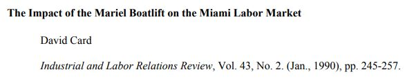
```

---
```{r, echo = FALSE, out.width="90%", fig.retina = 1, fig.align='center'}
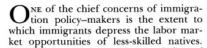
```

---
```{r, echo = FALSE, out.width="90%", fig.retina = 1, fig.align='center'}
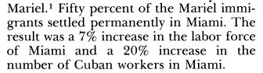
```

---
```{r, echo = FALSE, out.width="90%", fig.retina = 1, fig.align='center'}
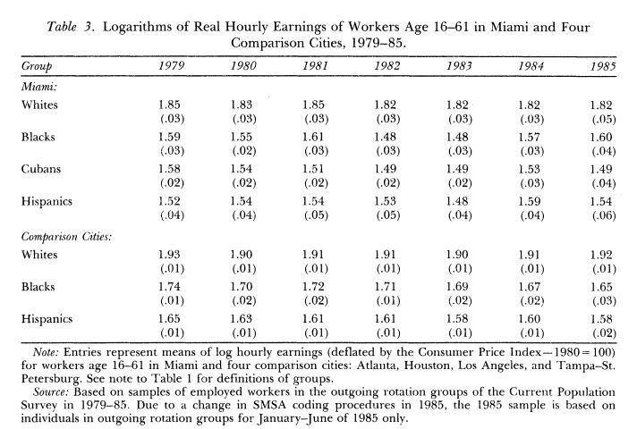
```

---
```{r, echo = FALSE, out.width="90%", fig.retina = 1, fig.align='center'}
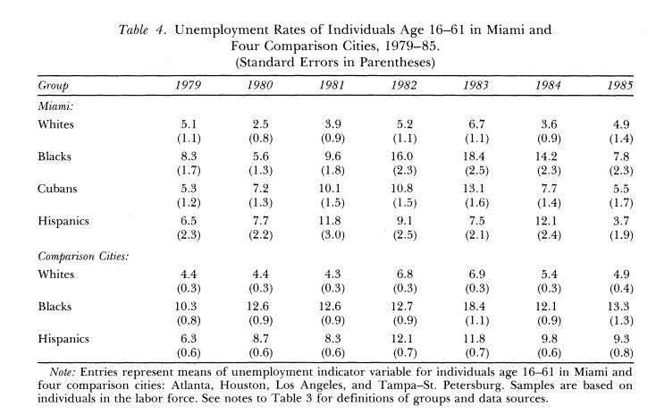
```

---
```{r, echo = FALSE, out.width="90%", fig.retina = 1, fig.align='center'}
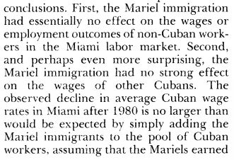
```

---
### Analysis

Starting simple, if we think *all* the confounding variables are constant either in time or space, then the model we want may be something like:

$$y_{i,t} = \alpha_{i} + \gamma_{t} + \beta_{1}Treatment_{i,t} + \epsilon_{i,t}$$

---
```{r, echo = TRUE, out.width="90%", fig.retina = 1, fig.align='center'}
library(causaldata)
od <- causaldata::organ_donations
library(fixest)
```

---
```{r, echo = TRUE, out.width="90%", fig.retina = 1, fig.align='center'}
# Treatment variable
od <- od %>%
    mutate(Treated = State == 'California' & 
              Quarter %in% c('Q32011','Q42011','Q12012'))

clfe <- feols(Rate ~ Treated | State + Quarter,
               data = od)
```

---
```{r, echo = TRUE, out.width="90%", fig.retina = 1, fig.align='center'}
summary(clfe)
```

---
### Parallel Trends

The analysis here assumes that the treatment and control cases have *parallel time trends* on the dependent variable, conditional on any control variables and other adjustments in the model.

---
```{r, echo = FALSE, out.width="90%", fig.retina = 1, fig.align='center'}
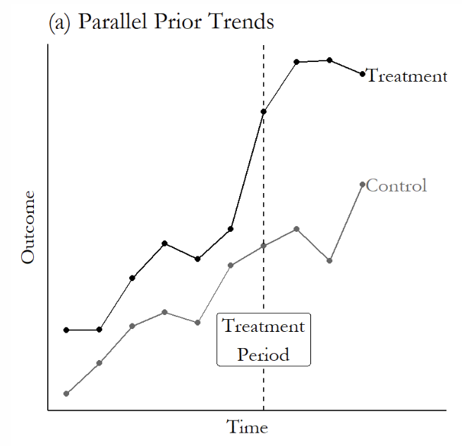
```

---
```{r, echo = FALSE, out.width="90%", fig.retina = 1, fig.align='center'}
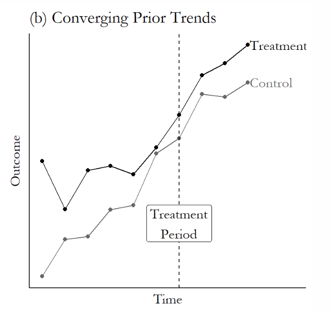
```

---
### Parallel Trends

One useful test is to statistically test whether the treatment and control group had equal time trends during the period before the treatment. If we fit a model that estimates separate time slopes for the two groups, and then we test for equality between those two slopes, that is one way of testing the parallel trends assumption. 

---
```{r, echo = FALSE, out.width="90%", fig.retina = 1, fig.align='center'}
od$calind <- 1*(od$State=='California')
odparalleltrends.lm <- lm(Rate~Quarter_Num+Quarter_Num:calind, data=od[od$Quarter_Num<4,])
summ(odparalleltrends.lm)
```

---
```{r, echo = FALSE, out.width="90%", fig.retina = 1, fig.align='center'}
library(interactions)
```

---
```{r, echo = FALSE, out.width="90%", fig.retina = 1, fig.align='center'}
interact_plot(odparalleltrends.lm, pred="Quarter_Num", modx="calind", interval=TRUE)
```

---
### Parallel Trends

If the parallel trends assumption fails, a difference-in-differences design may not be salvageable. It might be possible to control for time trends, but this can subtract out part of the causal effect and produce bias. At this point, a great deal of care and thought is needed, as well as substantial skill with time-series methods.

---
```{r, echo = FALSE, out.width="90%", fig.retina = 1, fig.align='center'}
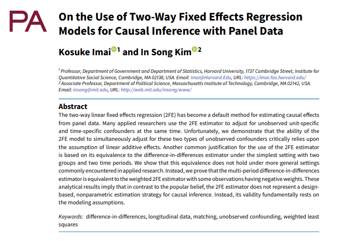
```

---
### Negative Weights

Negative weights can emerge in TWFE for difference-in-differences because treated observations of early treatment adopters end up serving as controls for late treatment adopters (see de Chaisemartin and d'Haultfoeuille 2020 and Goodman-Bacon 2021).

---
### Panel Matching

Imai and coauthors propose panel-based matching as a way of implementing difference-in-differences designs. 

---
```{r, echo = FALSE, out.width="90%", fig.retina = 1, fig.align='center'}

```

---
```{r, echo = FALSE, out.width="90%", fig.retina = 1, fig.align='center'}
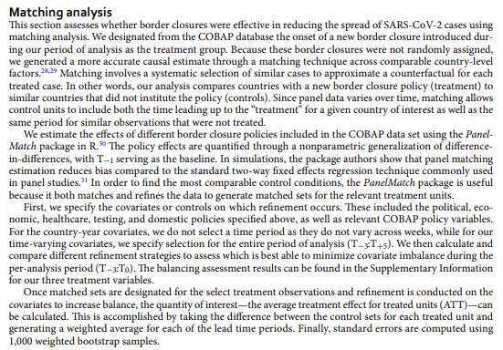
```

---
```{r, echo = FALSE, out.width="90%", fig.retina = 1, fig.align='center'}
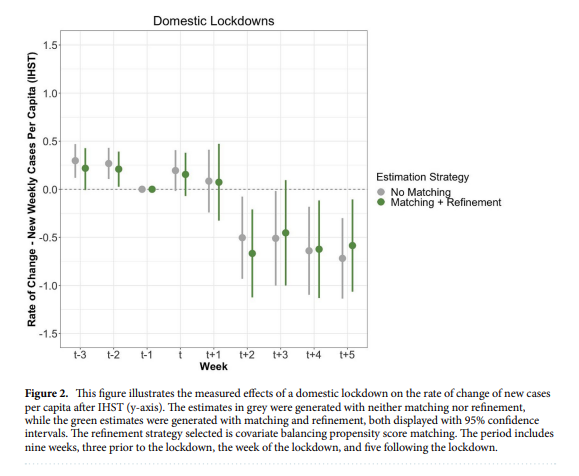
```

---
```{r, echo = FALSE, out.width="90%", fig.retina = 1, fig.align='center'}
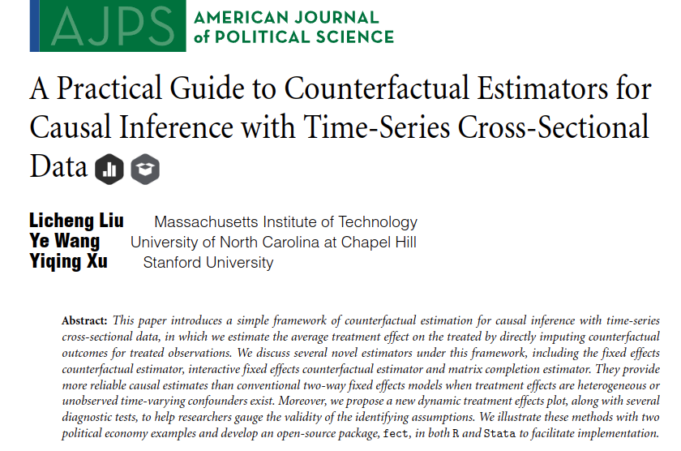
```

---
### Functional Form

$$Y_{0,i,t}=f(X_{i,t})+h(U_{i,t})+\epsilon_{i,t}$$

in which $f(\cdot)$ and $h(\cdot)$ are known, parametric functions.

---
### Strict Exogeneity

$$\epsilon_{i,t} \perp\!\!\!\perp \{D_{j,s},X_{j,s},U_{j,s}\}$$
for all $i,j \in \{1,2,...,N\}$ and $s,t \in \{1,2,...,T\}$.

---
### Low-dimensional Decomposition

There  exists  a  low-dimensional  decomposition  of

$$h(U_{i,t}) : h(U_{i,t}) = L_{i,t}$$
and $rank(L_{N×T}) << min\{N,T\}$.

---
### Estimation

1. Using only untreated observations, model the outcome, based on $X$ and whatever strategy is needed to capture $U$.

2. Using the model from step 1, form fitted values $\hat{Y}_{0,i,t}$ for each *treated* observation.

3. Estimate the treatment effect for each treated observation by: $\hat{\delta}_{i,t} = Y_{i,t} - \hat{Y}_{0,i,t}$.

4. Average the $\hat{\delta}$ values to estimate whatever causal quantity is of interest.

---
### Specific Estimators

FEct: estimate $\hat{Y}_{0,i,t}$ using TWFE.

IFEct: estimate $\hat{Y}_{0,i,t}$ using a version of TWFE augmented with a factor-analysis model to allow for existence of limited categories of time-varying unobserved covariates.

Matrix completion: conceptually similar to factor analysis; somewhat different performance properties.

---
```{r, echo = FALSE, out.width="90%", fig.retina = 1, fig.align='center'}
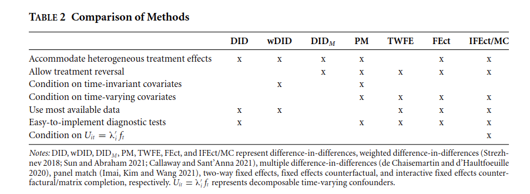
```

---
```{r, echo = FALSE, out.width="90%", fig.retina = 1, fig.align='center'}
library(fect)
```

---
```{r, echo = FALSE, out.width="90%", fig.retina = 1, fig.align='center'}
od$numerictreat <- 1*od$Treated
calfect <- fect(Rate ~ numerictreat, index = c("State", "Quarter_Num"), force = "two-way",
               data = od, se=1)
calfect
```

---
```{r, echo = FALSE, out.width="90%", fig.retina = 1, fig.align='center'}
calife <- fect(Rate ~ numerictreat, index = c("State", "Quarter_Num"), force = "two-way",
               data = od, method="ife",min.T0=1, se=1)
calife
```

