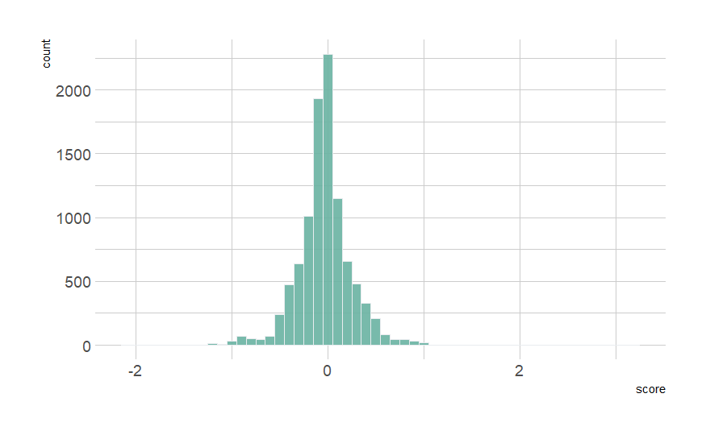
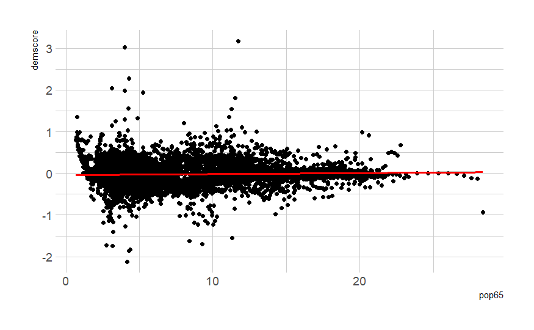

class: center, middle

```{css, echo=FALSE}
pre {
  max-height: 400px;
  overflow-y: auto;
}

pre[class] {
  max-height: 200px;
}
```

```{r, load_refs, include=FALSE, cache=FALSE}
# Initializes the bibliography
library(RefManageR)

library(ggplot2)
library(dplyr)
library(readr)
library(nlme)
library(jtools)
library(mice)

BibOptions(check.entries = FALSE,
           bib.style = "authoryear", # Bibliography style
           max.names = 3, # Max author names displayed in bibliography
           sorting = "nyt", #Name, year, title sorting
           cite.style = "authoryear", # citation style
           style = "markdown",
           hyperlink = FALSE,
           dashed = FALSE)
#myBib <- ReadBib("assets/myBib.bib", check = FALSE)
# Note: don't forget to clear the knitr cache to account for changes in the
# bibliography.

peruemotions <- read.csv("https://github.com/jnseawright/PS406/raw/main/data/peruemotions.csv")

qog_std_ts_jan22 <- read.csv("https://github.com/jnseawright/PS406/raw/main/data/qog_std_ts_jan22.csv")
```
```{r xaringan-themer, include=FALSE, warning=FALSE}
library(xaringanthemer,MnSymbol)
style_mono_accent(
  base_color = "#1c5253",
  header_font_google = google_font("Josefin Sans"),
  text_font_google   = google_font("Montserrat", "300", "300i"),
  code_font_google   = google_font("Fira Mono"),
  text_font_size = "1.6rem"
)
```

---
### Heterogeneity

One of the central themes of the course has been causal heterogeneity. Can newer tools associated with machine learning contribute here?


Below are revised RMarkdown slides that keep the equations but embed them in a clear narrative with motivation and step-by-step explanation. The goal is to show students **why** this derivation matters and how it leads to using machine learning for causal inference.

---
### The Challenge: Estimating Heterogeneous Treatment Effects

We want to estimate the Conditional Average Treatment Effect (CATE):

$$\tau(x) = E[Y(1) - Y(0) | X = x]$$

- If we could directly observe both potential outcomes, this would be easy.
- In practice, we see only one outcome per unit, depending on treatment assignment.
- We need a way to **adjust for confounding** while allowing $\tau(x)$ to vary flexibly with $x$.

---
### A Useful Reformulation

Consider the following identity (Robins 2000; Chernozhukov et al. 2018):

$$Y_i - m(X_i) = \tau(X_i)(W_i - e(X_i)) + \epsilon_i$$

where:
- $e(x) = P(W=1|X=x)$ is the **propensity score**.
- $m(x) = E[Y|X=x] = E[Y(0)|X=x] + \tau(x)e(x)$.

If we knew $e(x)$ and $m(x)$, we could estimate $\tau(x)$ by regressing $Y_i - m(X_i)$ on $W_i - e(X_i)$, perhaps non‑parametrically.

---
### Why Is This Useful?

- The transformation **centers** the outcome by subtracting the conditional mean, and centers the treatment by subtracting the propensity score.
- The error term $\epsilon_i$ has mean zero conditional on $X_i$.
- This representation suggests a **two‑step** approach:
    1. Estimate $e(x)$ and $m(x)$ using flexible methods (machine learning).
    2. Estimate $\tau(x)$ by plugging in these estimates and solving.

---
### From Linear to Flexible Models

Originally, we might have written a linear model:

$$Y_i = \tau D_i + \beta^\top X_i + \epsilon_i$$

This assumes $\tau$ is constant and the effect of $X$ is linear and additive.

We can relax these assumptions:

$$Y_i = \tau(X_i) D_i + f(X_i) + \epsilon_i$$

Now $\tau(X_i)$ can vary with $X$, and $f(X_i)$ can be any function.

---
### The Key Insight

If we can estimate $f(X_i)$ and the propensity score $e(X_i)$ well, then we can construct a **transformed outcome** that isolates the treatment effect:

$$Y_i - \hat{f}(X_i) = \tau(X_i)(D_i - \hat{e}(X_i)) + \text{remainder}$$

This is exactly the equation we started with, with $m(x) = f(x) + \tau(x)e(x)$.

---
### Why Machine Learning?

- $f(X_i)$ and $e(X_i)$ are high‑dimensional, nonlinear functions.
- We don't want to assume their functional form.
- Machine learning methods (random forests, neural nets, etc.) can estimate these **nuisance functions** flexibly.

This leads to **doubly robust** estimators: if either $f$ or $e$ is estimated consistently, the final estimate of $\tau$ is consistent.

---
### What About the Derivation?

The equation

$$Y_i - m(X_i) = \tau(X_i)(W_i - e(X_i)) + \epsilon_i$$

comes from:

- Start with $Y_i = f(X_i) + \tau(X_i)W_i + \nu_i$, where $E[\nu_i|X_i,W_i]=0$.
- Then $m(X_i) = f(X_i) + \tau(X_i)e(X_i)$.
- Subtract $m(X_i)$ from $Y_i$:

$$Y_i - m(X_i) = f(X_i) + \tau(X_i)W_i + \nu_i - [f(X_i) + \tau(X_i)e(X_i)]$$
$$= \tau(X_i)(W_i - e(X_i)) + \nu_i.$$

This is a clean way to isolate the treatment effect.

---
### Causal Forests

- Athey and Imbens (2016) and Wager and Athey (2018) use this insight to build **causal forests**.
- They modify the splitting criterion in a random forest to directly maximize heterogeneity in $\tau(X_i)$.
- The forest partitions the covariate space, and within each leaf, estimates $\tau$ using the transformed outcomes.

The result: a flexible, data‑driven estimate of the CATE, with valid confidence intervals.

---
### Takeaway

The historical journey from linear models to machine learning is not just algebra—it's a principled way to:

1. Separate the estimation of nuisance functions (propensity score, outcome regression) from the estimation of the treatment effect.
2. Use machine learning to handle high‑dimensional, nonlinear confounding.
3. Obtain valid inference about heterogeneity.

This framework underlies many modern methods: causal forests, double/debiased ML, and more.


---
### CART

Getting to the machine-learning tools used in causal inference starts with building blocks. One of these are classificiation and regression trees (CART), a tool for optimally predicting $Y$ based on $\mathbb{X}$, without assumptions of additivity, linearity, etc.

---
### CART

1.  Start with the set of all cases, i.e., the root node.

2.  Search all values of each variable in $\mathbb{X}$ for the binary
    split that maximizes homogeneity of $Y$ for cases on each side of
    the split.

3.  If homogeneity of $Y$ is sufficient or if the remaining sets of
    cases as the new final nodes are too small, stop. Otherwise, repeat
    step 2 for each of the current last-generation nodes.

---
### An Example

```{r, echo = FALSE, out.width="90%", fig.retina = 1, fig.align='center'}
library(knitr)
include_graphics("images/experimentcart.pdf")
```

---
```{r, echo = TRUE, out.width="90%", fig.retina = 1, fig.align='center'}
library(rpart)
```

---
```{r, echo = TRUE, out.width="70%", fig.retina = 1, fig.align='center'}
dem.cart <- rpart(vdem_libdem ~ vdem_gender + vdem_corr + wdi_gdpcapcon2010 + wdi_mobile + wdi_gerp + une_surlgpef + wdi_fertility, data=qog_std_ts_jan22, na.action=na.omit)

plot(dem.cart)
text(dem.cart, use.n=TRUE)
```

---
### Random Forests

1.  Bootstrap the underlying data.

2.  Run CART, selecting a random subset of datapoints and variables at each
    decision node.

3.  Repeat several times, and find a way to average the results
    together.

---
```{r, echo = TRUE, out.width="90%", fig.retina = 1, fig.align='center'}
library(randomForest)
```

---
```{r, echo = TRUE, out.width="70%", fig.retina = 1, fig.align='center'}
dem.rf <- randomForest(vdem_libdem ~ wdi_gendeqr + bci_bci + wdi_gdpcapcon2010 + wdi_mobile + wdi_gerp + une_surlgpef + wdi_fertility, data=qog_std_ts_jan22, na.action=na.omit)

dem.rf
```

---
### Random Forest Variable Importance: Minimal Depth

- In a random forest, each tree is built by recursively partitioning the data.
- The **depth** of a split on a variable is the number of nodes from the root to that split.
- **Minimal depth** for a variable is the depth of the *first* split on that variable in a tree, averaged across all trees.

**Intuition**: Variables that are important for prediction are split on early (closer to the root), so they have **lower minimal depth**.

---
### Why Minimal Depth?

- Traditional importance measures (e.g., increase in MSE when permuting a variable) are useful but can be biased.
- Minimal depth is a complementary measure that reflects how often and how early a variable is used in the forest.
- Lower minimal depth → more important variable.

---
```{r, echo = TRUE, out.width="90%", fig.retina = 1, fig.align='center'}
library(randomForestExplainer)
```

---
```{r, echo = TRUE, out.width="50%", fig.retina = 1, fig.align='center'}
dem.mindepth <- min_depth_distribution(dem.rf)
plot_min_depth_distribution(dem.mindepth)
```

---
### Interpreting the Plot

- The plot shows the distribution of minimal depth for each variable across all trees.
- Variables are ordered by their **mean minimal depth** (lowest at the top).
- The boxplots show the spread: a tight distribution near low depth indicates consistent early use.
- The vertical line at the average minimal depth helps compare.

---
### Interpreting the Plot

**In this example**:
- `wdi_gerp` and `wdi_gdpcapcon2010` have the lowest minimal depth → they are the most important predictors of democracy.
- Variables near the bottom are rarely used early.

---
### Checking Interactions: Minimal Depth for Pairs

```{r min_depth_interactions, echo = TRUE, eval = TRUE}
plot_min_depth_interactions(dem.rf)
```
---
```{r, echo = FALSE, out.width="90%", fig.retina = 1, fig.align='center'}

include_graphics("images/rfinteraction.png")
```

---

- This plot shows the average minimal depth for **pairs of variables**.
- Lower values (darker) indicate that the two variables tend to be split on together early in the trees.
- It can reveal potential interactions.

**Interpretation**: Dark cells between `wdi_gerp` and `wdi_gdpcapcon2010` suggest these two variables often work together in the splits – they might interact in predicting democracy.

---
### Summary

- Minimal depth is a powerful tool for understanding what drives predictions in a random forest.
- It tells you which variables the forest "relies on" most heavily.
- Use it alongside other importance measures to get a complete picture.
- Remember: importance in prediction does not imply causation – but it can guide hypothesis generation about potential confounders or moderators.

---
### Causal Forests

Run a random forest predicting the treatment effect at each node, rather than the average value of the outcome.

Specifically, split groups up to maximize:

$$n_{L} n_{R} (\hat{\tau} L − \hat{\tau} R)^2$$

---
Robins, Rotnitzky & Zhao (1994) proved that the asymptotically optimal estimator for $\tau$ is the Augmented Inverse Probability Weighted (AIPW) estimator.

---
```{r, echo = FALSE, out.width="90%", fig.retina = 1, fig.align='center'}
include_graphics("images/AIPW.png")
```

---

Using the AIPW to combine estimates that derive from causal forests gives us a *doubly robust* estimator.

---
```{r, echo = FALSE, out.width="90%", fig.retina = 1, fig.align='center'}
library(grf)
```

---
```{r, echo = TRUE, out.width="90%", fig.retina = 1, fig.align='center'}
demdata <- qog_std_ts_jan22

demdata <- demdata %>% filter(!is.na(vdem_libdem) & !is.na(br_pres))

demdatasubset <- demdata %>%
  select(vdem_libdem, br_pres, wdi_gendeqr,bci_bci, wdi_gdpcapcon2010, wdi_mobile, wdi_gerp, une_surlgpef, wdi_fertility, ht_colonial, wdi_pop65)

demdatasubset <- na.omit(demdatasubset)

demdata.X <- with(demdatasubset, rbind(wdi_gendeqr,bci_bci, wdi_gdpcapcon2010, wdi_mobile, wdi_gerp, une_surlgpef, wdi_fertility))

dem.cf <- causal_forest(Y=demdatasubset$vdem_libdem, W=demdatasubset$br_pres, X=t(demdata.X))

dem.cf
```

---
```{r, echo = TRUE, out.width="50%", fig.retina = 1, fig.align='center'}
demscores <- data.frame(score=get_scores(dem.cf))

p <- demscores %>%
  ggplot( aes(x=score)) +
  geom_histogram( binwidth=0.1, fill="#69b3a2", color="#e9ecef", alpha=0.9) +
  theme_light() +
  theme(
    plot.title = element_text(size=15)
  )
```
---
```{r, echo = TRUE, out.width="50%", fig.retina = 1, fig.align='center'}
p
```

---
```{r, echo = FALSE, out.width="90%", fig.retina = 1, fig.align='center'}

```

---
### What This Histogram Tells Us

- The x‑axis shows the estimated **Conditional Average Treatment Effect (CATE)** for each unit – here, the effect of having a presidential system (`br_pres`) on democracy (`vdem_libdem`), given its covariates.
- The y‑axis shows how many units fall into each bin.

---
### What This Histogram Tells Us
**Key observations**:
- **Range**: The CATE estimates range from about `r round(min(demscores$score, na.rm=TRUE), 2)` to `r round(max(demscores$score, na.rm=TRUE), 2)`. This is a wide spread.
- **Average**: The ATE for treatment cases (from `average_treatment_effect`) is about `r round(average_treatment_effect(dem.cf, target.sample = "treated")[1], 3)`. The ATE for control vases is about `r round(average_treatment_effect(dem.cf, target.sample = "control")[1], 3)`.
- **Heterogeneity**: Some countries are estimated to have a **positive** effect (presidential system increases democracy), others a **negative** effect. This suggests the impact of presidential systems is not uniform – it depends on other characteristics.

---
### Causal Forest: ATT, ATC, and ATE

```{r target_outputs, echo = TRUE, eval = TRUE}
ate_treated <- average_treatment_effect(dem.cf, target.sample = "treated")
ate_control <- average_treatment_effect(dem.cf, target.sample = "control")
ate_all     <- average_treatment_effect(dem.cf, target.sample = "all")

ate_treated
ate_control
ate_all
```

---
### What Do These Estimates Mean?

- **`target.sample = "treated"`**: Average treatment effect for the **treated** (ATT) – the effect of presidential systems on democracy for countries that actually have a presidential system.
- **`target.sample = "control"`**: Average treatment effect for the **control** (ATC) – the effect for countries that do **not** have a presidential system.
- **`target.sample = "all"`** (or `"overlap"`): Average treatment effect for the population that satisfies overlap (ATE), weighting by propensity scores.

---
### Interpreting the Numbers

- **ATT = -0.099** (se = 0.018)  
  For countries that currently have presidential systems, switching to a non‑presidential system would increase democracy by about 0.1 points on the V‑Dem scale (negative effect of having a president).

- **ATC = -0.178** (se = 0.020)  
  For countries without presidential systems, adopting one would **reduce** democracy by nearly twice as much – about 0.18 points.

- **ATE (all) = NaN**  
  The population‑average effect cannot be estimated reliably, likely because of weak overlap – some countries have propensity scores too close to 0 or 1, making weighting unstable.

---
### Why Do ATT and ATC Differ?

The difference between ATT and ATC is evidence of **treatment effect heterogeneity**:

- Countries that chose presidential systems may have characteristics that make the effect less negative (or even positive for some).
- Countries without presidential systems might, if they adopted one, suffer a larger democratic decline.

This aligns with the wide range of CATEs we saw in the histogram (-0.89 to +0.53). The average for treated units is pulled toward the upper end of that distribution; the average for controls is pulled toward the lower end.

---

Recall the mean of the CATE scores was **-0.130**. This lies between the ATT (-0.099) and the ATC (-0.178).

In fact, the overall ATE can be thought of as a weighted average:

$$ATE = \pi \cdot ATT + (1-\pi) \cdot ATC$$

where $\pi$ is the proportion treated. 

---
### Why Did `target.sample = "all"` Fail?

The `"all"` target uses inverse probability weighting to estimate the population ATE. If propensity scores are too close to 0 or 1 for some units, the weights become extreme and the estimator unstable.

We can diagnose this by looking at the propensity score distribution.

---

```{r prop_hist, echo = TRUE, eval = TRUE}
hist(dem.cf$W.hat, breaks = 30, main = "Propensity Scores", xlab = "Pr(Presidential System)")
```

---

If many values are near 0 or 1, overlap is weak. In such cases, the ATT and ATC are more reliable – they focus on populations where overlap is naturally stronger.

---
### Why This Matters

- If the effect were constant, we would see a tight distribution around the ATE.
- The wide spread and difference between ATT and ATc imply that **context matters**: the same treatment (presidential system) can have very different effects depending on a country's history, institutions, or socio‑economic conditions.

---
### Why This Matters

- This is exactly the kind of heterogeneity we have been discussing throughout the course. Machine learning helps us uncover it without pre‑specifying interactions.

**Next**: We can explore what drives this heterogeneity by plotting CATEs against specific covariates (e.g., colonial history, population age structure).

---
```{r, echo = TRUE, out.width="50%", fig.retina = 1, fig.align='center'}
average_treatment_effect(dem.cf, target.sample = "overlap")
average_treatment_effect(dem.cf, target.sample = "control")
average_treatment_effect(dem.cf, target.sample = "treated")
```

---
```{r, echo = TRUE, out.width="50%", fig.retina = 1, fig.align='center'}
temp.df <- data.frame(demscore = demscores$score, ht_colonial = as.factor(demdatasubset$ht_colonial))

htcolonial_text <- c("Not colonized", "Dutch", "Spanish", "Italian", "US", "British", "French", "Portuguese", "Belgian", "Brit/French", "Austral.")

p2 <- temp.df %>% ggplot( aes(x=ht_colonial, y=demscore)) + 
    geom_violin() +
    xlab("Colonial History") +
    theme(legend.position="none") +
    xlab("") + scale_x_discrete(labels= htcolonial_text)
```

---
```{r, echo = TRUE, out.width="50%", fig.retina = 1, fig.align='center'}
p2
```

---
```{r, echo = TRUE, out.width="50%", fig.retina = 1, fig.align='center'}
temp.df <- data.frame(demscore = demscores$score, pop65 = demdatasubset$wdi_pop65)

p3 <- temp.df %>% ggplot(aes(x=pop65, y=demscore)) +
  geom_point() +
  geom_smooth(method=lm , color="red", fill="#69b3a2", se=TRUE) +
  theme_light()
```

---
```{r, echo = TRUE, out.width="50%", fig.retina = 1, fig.align='center'}
p3
```

---
```{r, echo = FALSE, out.width="90%", fig.retina = 1, fig.align='center'}

```

---
### Picking Control Variables

Throughout this course, we've often assumed we could correctly identify control variables. Can we, though?

---
### Picking Control Variables

Suppose we know enough to rule out post-treatment variables and colliders, but possibly not enough to distinguish a priori between confounders, irrelevant controls, and instruments. Suppose also that the total number of potential controls is very large. What to do?

---
### LASSO

Estimate a regression, as usual (minimizing the sum of squared errors), but subject to the added penalty term:

$$\lambda \sum_{j=1}^{p}|\beta_{j}|$$

---
### Picking Control Variables

If you are pretty sure you don't have any potential instruments in the data, and that there are a reasonable number of causes of the treatment that are not included in the dataset, then there is a double selection LASSO approach to picking variables.

---
```{r, echo = FALSE, out.width="90%", fig.retina = 1, fig.align='center'}
include_graphics("images/Belloni1.png")
```

---
### Double-selection

1. Run a LASSO regression predicting the outcome based on all the possible confounders.

2. Run a second LASSO regression predicting the treatment based on all the possible confounders.

3. Select all variables that have non-zero coefficients in either regression and use them as controls in your actual causal inference.

---
```{r, echo = TRUE, out.width="90%", fig.retina = 1, fig.align='center'}
qogwdi <- qog_std_ts_jan22 %>% filter(year > 1979) %>% select(starts_with("wdi") | starts_with("year") | starts_with("cname"))
qogwdi <- qogwdi[,colSums(is.na(qogwdi))<3000]
qogwdi$vdem_libdem <- qog_std_ts_jan22$vdem_libdem[qog_std_ts_jan22$cname %in% qogwdi$cname & qog_std_ts_jan22$year >1979]
qogwdi.imp <- mice(qogwdi, method = "cart")
```
---
```{r, echo = TRUE, out.width="90%", fig.retina = 1, fig.align='center'}
qogimputed1 <- mice::complete(qogwdi.imp)

summary(lm(wdi_gdpcapgr~vdem_libdem + I(log(wdi_gdpcapcon2010)) + wdi_gerp, data=qogimputed1))
```

---
```{r, echo = TRUE, out.width="90%", fig.retina = 1, fig.align='center'}
library(hdm)
```


---
```{r, echo = TRUE, out.width="90%", fig.retina = 1, fig.align='center'}
demgrow.dualselection <- rlassoEffects(wdi_gdpcapgr ~ . - year - cname - cname_qog - cname_year - wdi_gdpgr - wdi_popgr, data=qogimputed1, I=~vdem_libdem)
demgrow.dualselection
demgrow.dualselection$selection.matrix
```


---
### What Does Double Selection Do?

1. **First LASSO**: Predicts the outcome (`wdi_gdpcapgr`) using all potential controls. Variables with non-zero coefficients are selected for the outcome model.
2. **Second LASSO**: Predicts the treatment (`vdem_libdem`) using all potential controls. Variables with non-zero coefficients are selected for the treatment model.
3. **Union**: The final set of controls is the **union** of variables selected in either step. This ensures that we control for confounders that predict either the outcome or the treatment.

---
### The Selection Matrix

```{r selection_matrix, echo = TRUE, eval = TRUE}
demgrow.dualselection$selection.matrix
```

---
### The Selection Matrix

This matrix shows which variables were selected in each step.

- **Row 1**: Selected for the outcome model (`selected.Y`).
- **Row 2**: Selected for the treatment model (`selected.D`).
- `1` indicates the variable was selected; `0` indicates not selected.

---
### Interpreting the Selection Matrix

```{r interpret_selection, echo = FALSE, eval = TRUE}
# Extract column names where either Y or D selected
selected_vars <- colnames(demgrow.dualselection$selection.matrix)[
  apply(demgrow.dualselection$selection.matrix, 2, sum) > 0
]
```

The variables selected in at least one model are:  
`r paste(selected_vars, collapse = ", ")`.

**Interpretation**:
- These variables are deemed important confounders by the LASSO.
- They will be included as controls in the final regression of `wdi_gdpcapgr` on `vdem_libdem`.
- Variables not selected are assumed to have negligible confounding impact (conditional on the selected set).

---
### Why This Matters

- In high‑dimensional settings, we cannot simply include all controls (overfitting, multicollinearity).
- Double selection provides a principled way to **choose controls** while avoiding omitted variable bias.
- It is **doubly robust** in the sense that if either the outcome model or the treatment model is correctly specified, the final estimate is consistent.

---

**Caution**: This method assumes that all selected variables are **confounders** (not mediators or colliders). Subject‑matter knowledge is still essential.

---
### What About the Treatment Effect Estimate?

```{r ate_estimate, echo = TRUE, eval = TRUE}
demgrow.dualselection
```

- The output shows the estimated effect of `vdem_libdem` on growth, along with standard errors and confidence intervals.
- This estimate is obtained after partialling out the selected controls.

---
### What About the Treatment Effect Estimate?

**Interpretation**: After adjusting for the selected confounders, a one‑unit increase in the democracy index is associated with a `r round(coef(demgrow.dualselection)["vdem_libdem"], 3)` change in GDP per capita growth (p = `r round(summary(demgrow.dualselection)$p.value["vdem_libdem"], 4)`).


---
### Double-selection

One problem with double selection is that you will get instruments as control variables if they're in the data. Another problem is that it's inefficient because you aren't using information about the two relationships of interest jointly.

---
```{r, echo = FALSE, out.width="90%", fig.retina = 1, fig.align='center'}
include_graphics("images/Shortreed1.png")
```

---
### Adaptive LASSO

Adaptive LASSO allows the penalty term to change across coefficients:

$$\lambda \sum_{j=1}^{p}|\hat{w}_{j}\beta_{j}|$$

In a standard adaptive LASSO, $\hat{w} = |\tilde{\beta}_{j}|^{-\gamma}$, where $\tilde{\beta}_{j}$ is a typical parametric estimate of the regression slopes and $\gamma$ is a positive penalty parameter.

---
### Outcome-Adaptive LASSO

1. Run some kind of regression, predicting the outcome of interest with the treatment and all the potential control variables.

2. Run an adaptive lasso predicting the treatment based on the control variables. Set the penalty terms based on the coefficient estimates from step 1.

3. Use the control variables selected in step 2 to estimate a propensity score (or a regression or whatever).


---
```{r, echo = TRUE, out.width="90%", fig.retina = 1, fig.align='center'}
library(glmnet)
```

---
```{r, echo = TRUE, out.width="90%", fig.retina = 1, fig.align='center'}
qogimpcomplete <- qogimputed1[,colSums(is.na(qogimputed1))<1]

demgrow.adaptivelasso.part1 <- lm(wdi_gdpcapgr ~ . - year - cname - cname_qog - cname_year - wdi_gdpgr - wdi_popgr, data=qogimpcomplete)
tildebeta <- demgrow.adaptivelasso.part1$coefficients[2:59]
tildebeta[is.na(tildebeta)] <- .0000000000000000000000000000000000000000000000000000001
gammaval <- 0.5

xmat <- qogimpcomplete[,-c(17,20,49,62:66)]

demgrow.adaptivelasso.part2 <- glmnet(y=qogimputed1$wdi_gdpcapgr, x=xmat, penalty.factor=abs(tildebeta)^(-1*gammaval))
```

---
```{r, echo = TRUE, out.width="90%", fig.retina = 1, fig.align='center'}
coef(demgrow.adaptivelasso.part2, 1)
```
---
```{r, echo = TRUE, out.width="90%", fig.retina = 1, fig.align='center'}
coef(demgrow.adaptivelasso.part2, 2)
```
---
```{r, echo = TRUE, out.width="90%", fig.retina = 1, fig.align='center'}
coef(demgrow.adaptivelasso.part2, 5)
```
---
```{r, echo = TRUE, out.width="90%", fig.retina = 1, fig.align='center'}
coef(demgrow.adaptivelasso.part2, 20)
```
---
```{r, echo = TRUE, out.width="90%", fig.retina = 1, fig.align='center'}
coef(demgrow.adaptivelasso.part2, 100)
```

---
```{r, echo = TRUE, out.width="90%", fig.retina = 1, fig.align='center'}
qogimpcomplete <- qogimputed1[,colSums(is.na(qogimputed1))<1]

demgrow.adaptivelasso.part1 <- lm(wdi_gdpcapgr ~ . - year - cname - cname_qog - cname_year - wdi_gdpgr - wdi_popgr, data=qogimpcomplete)
tildebeta <- demgrow.adaptivelasso.part1$coefficients[2:59]
tildebeta[is.na(tildebeta)] <- .0000000000000000000000000000000000000000000000000000001
gammaval <- 3

xmat <- qogimpcomplete[,-c(17,20,49,62:66)]

demgrow.adaptivelasso.part2 <- glmnet(y=qogimputed1$wdi_gdpcapgr, x=xmat, penalty.factor=abs(tildebeta)^(-1*gammaval))
```

---
```{r, echo = TRUE, out.width="90%", fig.retina = 1, fig.align='center'}
coef(demgrow.adaptivelasso.part2, 1)
```
---
```{r, echo = TRUE, out.width="90%", fig.retina = 1, fig.align='center'}
coef(demgrow.adaptivelasso.part2, 2)
```
---
```{r, echo = TRUE, out.width="90%", fig.retina = 1, fig.align='center'}
coef(demgrow.adaptivelasso.part2, 5)
```
---
```{r, echo = TRUE, out.width="90%", fig.retina = 1, fig.align='center'}
coef(demgrow.adaptivelasso.part2, 20)
```
---
```{r, echo = TRUE, out.width="90%", fig.retina = 1, fig.align='center'}
coef(demgrow.adaptivelasso.part2, 100)
```

---
### Textual Data and Causal Inference

```{r, echo = FALSE, out.width="70%", fig.retina = 1, fig.align='center'}
include_graphics("images/textcausal.JPG")
```
