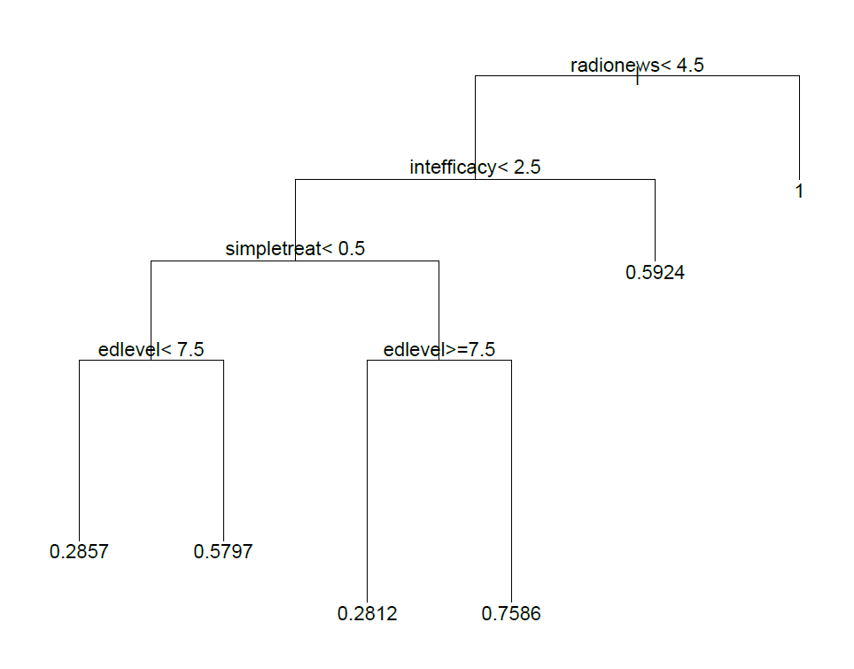
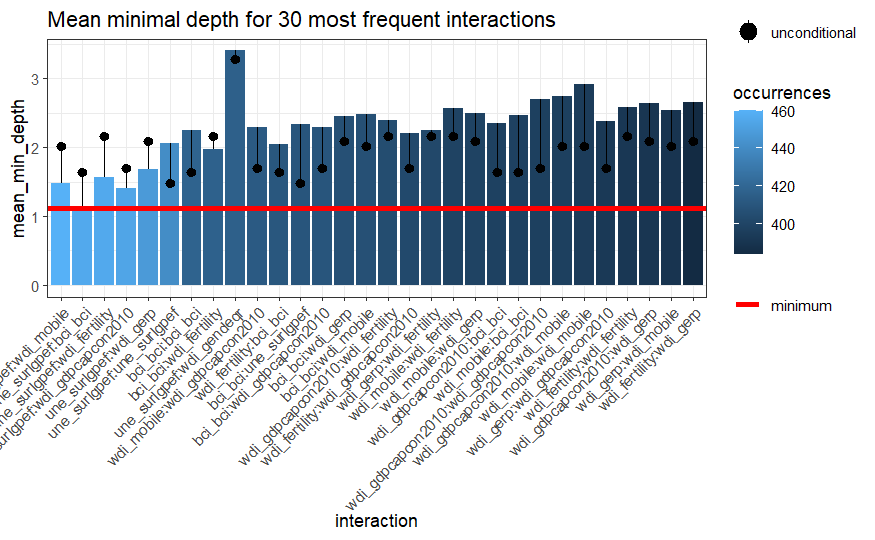
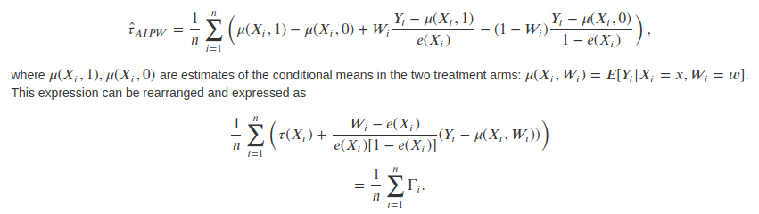
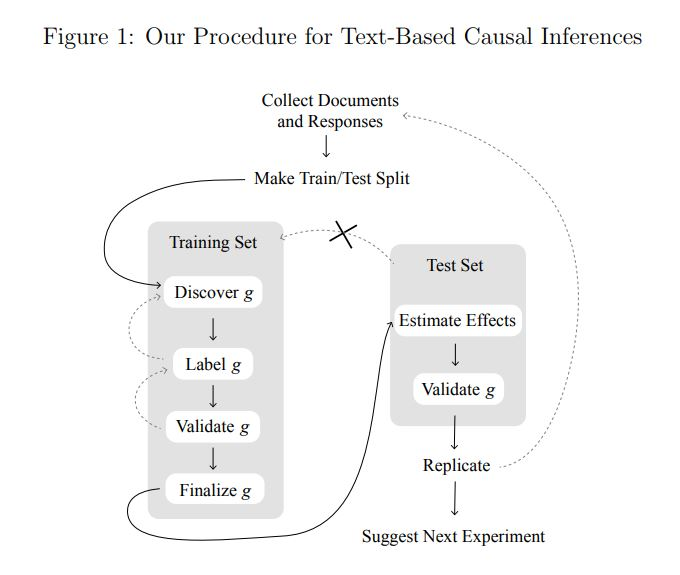
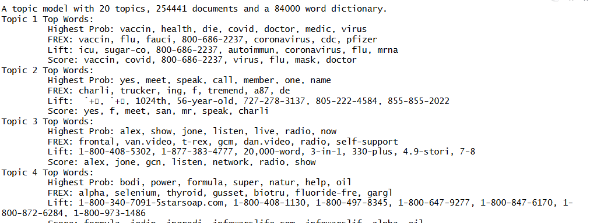
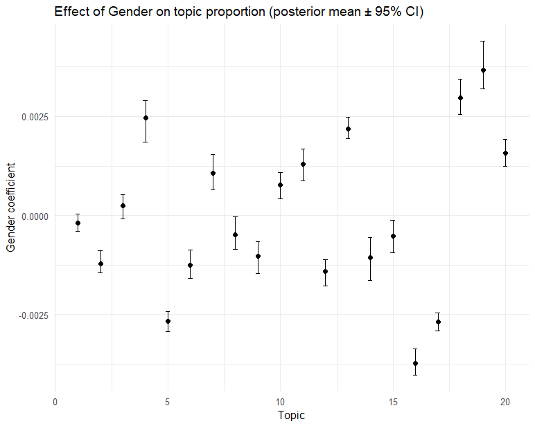
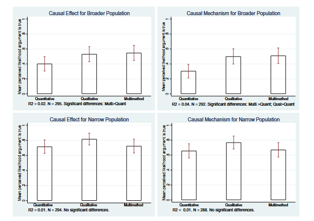
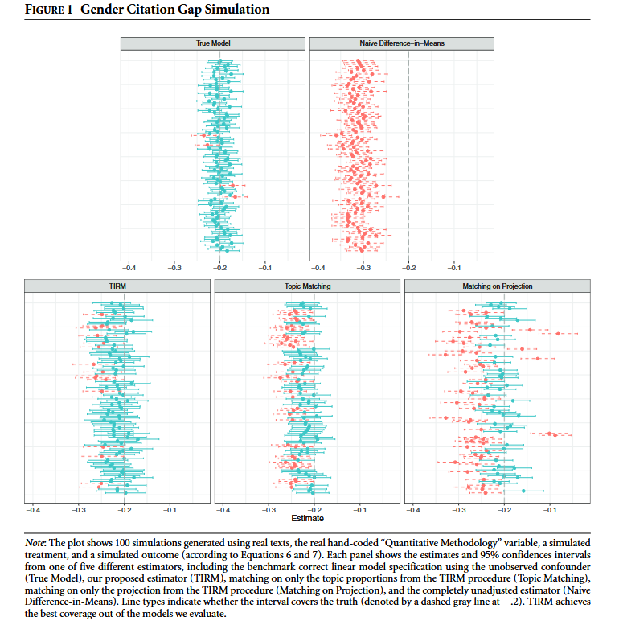

class: center, middle

```{css, echo=FALSE}
pre {
  max-height: 400px;
  overflow-y: auto;
}

pre[class] {
  max-height: 200px;
}
```

```{r, load_refs, include=FALSE, cache=FALSE}
# Initializes the bibliography
library(RefManageR)

library(ggplot2)
library(dplyr)
library(readr)
library(nlme)
library(jtools)
library(mice)
library(grid)
library(gridExtra)
library(knitr)
library(ggdag)
library(ggplot2)

BibOptions(check.entries = FALSE,
           bib.style = "authoryear", # Bibliography style
           max.names = 3, # Max author names displayed in bibliography
           sorting = "nyt", #Name, year, title sorting
           cite.style = "authoryear", # citation style
           style = "markdown",
           hyperlink = FALSE,
           dashed = FALSE)
#myBib <- ReadBib("assets/myBib.bib", check = FALSE)
# Note: don't forget to clear the knitr cache to account for changes in the
# bibliography.

peruemotions <- read.csv("https://github.com/jnseawright/PS406/raw/main/data/peruemotions.csv")

knitr::opts_chunk$set(warning = FALSE, message = FALSE)

qog_std_ts_jan22 <- read.csv("https://github.com/jnseawright/PS406/raw/main/data/qog_std_ts_jan22.csv")
```
```{r xaringan-themer, include=FALSE, warning=FALSE}
library(xaringanthemer,MnSymbol)
style_mono_accent(
  base_color = "#1c5253",
  header_font_google = google_font("Josefin Sans"),
  text_font_google   = google_font("Montserrat", "300", "300i"),
  code_font_google   = google_font("Fira Mono"),
  text_font_size = "1.6rem"
)
```

---
### Heterogeneity

One of the central themes of the course has been causal heterogeneity. Can newer tools associated with machine learning contribute here?


Below are revised RMarkdown slides that keep the equations but embed them in a clear narrative with motivation and step-by-step explanation. The goal is to show students **why** this derivation matters and how it leads to using machine learning for causal inference.

---
### The Challenge: Estimating Heterogeneous Treatment Effects

We want to estimate the Conditional Average Treatment Effect (CATE):

$$\tau(x) = E[Y(1) - Y(0) | X = x]$$

- If we could directly observe both potential outcomes, this would be easy.
- In practice, we see only one outcome per unit, depending on treatment assignment.
- We need a way to **adjust for confounding** while allowing $\tau(x)$ to vary flexibly with $x$.

---
### A Useful Reformulation

Consider the following identity (Robins 2000; Chernozhukov et al. 2018):

$$Y_i - m(X_i) = \tau(X_i)(W_i - e(X_i)) + \epsilon_i$$

where:
- $e(x) = P(W=1|X=x)$ is the **propensity score**.
- $m(x) = E[Y|X=x] = E[Y(0)|X=x] + \tau(x)e(x)$.

---

If we knew $e(x)$ and $m(x)$, we could estimate $\tau(x)$ by regressing $Y_i - m(X_i)$ on $W_i - e(X_i)$, perhaps non‑parametrically.

---
### Why Is This Useful?

- The transformation **centers** the outcome by subtracting the conditional mean, and centers the treatment by subtracting the propensity score.
- The error term $\epsilon_i$ has mean zero conditional on $X_i$.
- This representation suggests a **two‑step** approach:
    1. Estimate $e(x)$ and $m(x)$ using flexible methods (machine learning).
    2. Estimate $\tau(x)$ by plugging in these estimates and solving.

---
### From Linear to Flexible Models

Originally, we might have written a linear model:

$$Y_i = \tau D_i + \beta^\top X_i + \epsilon_i$$

This assumes $\tau$ is constant and the effect of $X$ is linear and additive.

---

We can relax these assumptions:

$$Y_i = \tau(X_i) D_i + f(X_i) + \epsilon_i$$

Now $\tau(X_i)$ can vary with $X$, and $f(X_i)$ can be any function.

---
### The Key Insight

If we can estimate $f(X_i)$ and the propensity score $e(X_i)$ well, then we can construct a **transformed outcome** that isolates the treatment effect:

$$Y_i - \hat{f}(X_i) = \tau(X_i)(D_i - \hat{e}(X_i)) + \text{remainder}$$

This is exactly the equation we started with, with $m(x) = f(x) + \tau(x)e(x)$.

---
### Why Machine Learning?

- $f(X_i)$ and $e(X_i)$ are high‑dimensional, nonlinear functions.
- We don't want to assume their functional form.
- Machine learning methods (random forests, neural nets, etc.) can estimate these **nuisance functions** flexibly.

This leads to **doubly robust** estimators: if either $f$ or $e$ is estimated consistently, the final estimate of $\tau$ is consistent.

---

The equation

$$Y_i - m(X_i) = \tau(X_i)(W_i - e(X_i)) + \epsilon_i$$

comes from:

- Start with $Y_i = f(X_i) + \tau(X_i)W_i + \nu_i$, where $E[\nu_i|X_i,W_i]=0$.
- Then $m(X_i) = f(X_i) + \tau(X_i)e(X_i)$.
- Subtract $m(X_i)$ from $Y_i$:

$$\small Y_i - m(X_i) = f(X_i) + \tau(X_i)W_i + \nu_i - [f(X_i) + \tau(X_i)e(X_i)]$$
$$= \tau(X_i)(W_i - e(X_i)) + \nu_i.$$
---
### Causal Forests

- Athey and Imbens (2016) and Wager and Athey (2018) use this insight to build **causal forests**.
- They modify the splitting criterion in a random forest to directly maximize heterogeneity in $\tau(X_i)$.
- The forest partitions the covariate space, and within each leaf, estimates $\tau$ using the transformed outcomes.

The result: a flexible, data‑driven estimate of the CATE, with valid confidence intervals.

---
### Takeaway

The historical journey from linear models to machine learning is not just algebra—it's a principled way to:

1. Separate the estimation of nuisance functions (propensity score, outcome regression) from the estimation of the treatment effect.
2. Use machine learning to handle high‑dimensional, nonlinear confounding.
3. Obtain valid inference about heterogeneity.

This framework underlies many modern methods: causal forests, double/debiased ML, and more.


---
### CART

Getting to the machine-learning tools used in causal inference starts with building blocks. One of these are classificiation and regression trees (CART), a tool for optimally predicting $Y$ based on $\mathbb{X}$, without assumptions of additivity, linearity, etc.

---
### CART

1.  Start with the set of all cases, i.e., the root node.

2.  Search all values of each variable in $\mathbb{X}$ for the binary
    split that maximizes homogeneity of $Y$ for cases on each side of
    the split.

3.  If homogeneity of $Y$ is sufficient or if the remaining sets of
    cases as the new final nodes are too small, stop. Otherwise, repeat
    step 2 for each of the current last-generation nodes.

---
### An Example

```{r, echo = FALSE, out.width="90%", fig.retina = 1, fig.align='center'}
library(knitr)

```

---
```{r load_rpart, echo = TRUE, out.width="90%", fig.retina = 1, fig.align='center'}
library(rpart)
```

---
```{r rpart_with_vdem, echo = TRUE, out.width="70%", fig.retina = 1, fig.align='center'}
dem.cart <- rpart(vdem_libdem ~ vdem_gender + vdem_corr + wdi_gdpcapcon2010 + wdi_mobile + wdi_gerp + une_surlgpef + wdi_fertility, data=qog_std_ts_jan22, na.action=na.omit)

plot(dem.cart)
text(dem.cart, use.n=TRUE)
```

---
### Random Forests

1.  Bootstrap the underlying data.

2.  Run CART, selecting a random subset of datapoints and variables at each
    decision node.

3.  Repeat several times, and find a way to average the results
    together.

---
```{r load_randomForest, echo = TRUE, out.width="90%", fig.retina = 1, fig.align='center'}
library(randomForest)
```

---
```{r randomForest_with_vdem, echo = TRUE, out.width="70%", fig.retina = 1, fig.align='center'}
dem.rf <- randomForest(vdem_libdem ~ wdi_gendeqr + bci_bci + wdi_gdpcapcon2010 + wdi_mobile + wdi_gerp + une_surlgpef + wdi_fertility, data=qog_std_ts_jan22, na.action=na.omit)

dem.rf
```

---
### Random Forest Variable Importance: Minimal Depth

- In a random forest, each tree is built by recursively partitioning the data.
- The **depth** of a split on a variable is the number of nodes from the root to that split.
- **Minimal depth** for a variable is the depth of the *first* split on that variable in a tree, averaged across all trees.

**Intuition**: Variables that are important for prediction are split on early (closer to the root), so they have **lower minimal depth**.

---
### Why Minimal Depth?

- Traditional importance measures (e.g., increase in MSE when permuting a variable) are useful but can be biased.
- Minimal depth is a complementary measure that reflects how often and how early a variable is used in the forest.
- Lower minimal depth → more important variable.

---
```{r load_randomForestExplainer, echo = TRUE, out.width="90%", fig.retina = 1, fig.align='center'}
library(randomForestExplainer)
```

---
```{r plot_min_depth, echo = TRUE, out.width="50%", fig.retina = 1, fig.align='center'}
dem.mindepth <- min_depth_distribution(dem.rf)
plot_min_depth_distribution(dem.mindepth)
```

---
### Interpreting the Plot

- The plot shows the distribution of minimal depth for each variable across all trees.
- Variables are ordered by their **mean minimal depth** (lowest at the top).
- The boxplots show the spread: a tight distribution near low depth indicates consistent early use.
- The vertical line at the average minimal depth helps compare.

---
### Interpreting the Plot

**In this example**:
- `wdi_gerp` and `wdi_gdpcapcon2010` have the lowest minimal depth → they are the most important predictors of democracy.
- Variables near the bottom are rarely used early.

---
### Checking Interactions: Minimal Depth for Pairs

```{r min_depth_interactions, echo = TRUE, eval = TRUE}
plot_min_depth_interactions(dem.rf)
```
---
```{r, echo = FALSE, out.width="90%", fig.retina = 1, fig.align='center'}


```

---

- This plot shows the average minimal depth for **pairs of variables**.
- Lower values (darker) indicate that the two variables tend to be split on together early in the trees.
- It can reveal potential interactions.

**Interpretation**: Dark cells between `wdi_gerp` and `wdi_gdpcapcon2010` suggest these two variables often work together in the splits – they might interact in predicting democracy.

---
### Summary

- Minimal depth is a powerful tool for understanding what drives predictions in a random forest.
- It tells you which variables the forest "relies on" most heavily.
- Use it alongside other importance measures to get a complete picture.
- Remember: importance in prediction does not imply causation – but it can guide hypothesis generation about potential confounders or moderators.

---
### Causal Forests

Run a random forest predicting the treatment effect at each node, rather than the average value of the outcome.

Specifically, split groups up to maximize:

$$n_{L} n_{R} (\hat{\tau} L − \hat{\tau} R)^2$$


---
### How Causal Forests Find Heterogeneity: The "Honest" Approach

The splitting criterion $\hat{\tau}_L - \hat{\tau}_R$ requires us to estimate the treatment effect *within* the left and right child nodes of a *potential* split. But how do we get $\hat{\tau}$ for a group of observations without using the same data to fit and evaluate the model? This would cause overfitting and bias.

---

The solution is **"honest" estimation** (Athey & Imbens, 2016).

- **Idea:** Use different samples of data within a node for two distinct tasks:
    1.  **Estimating Nuisance Functions:** Estimate the propensity score $\hat{e}(X_i)$ and the expected outcome $\hat{m}(X_i)$.
    2.  **Estimating the Treatment Effect ($\hat{\tau}$):** Use these estimates to construct the transformed outcome and calculate $\hat{\tau}$ for the node.

This separation is what gives us valid inference.

---

```{r honest_split_diagram, echo=FALSE, out.width="100%", fig.align='center'}
# This creates a simple conceptual diagram using grid graphics.
# In practice, you might create this as an image and use include_graphics().
# This code generates the idea directly in the slide.
suppressWarnings({
# Create a viewport
grid.newpage()
pushViewport(viewport(layout = grid.layout(3, 3, 
                                           widths = unit(c(1, 1.5, 1), "null"),
                                           heights = unit(c(0.8, 1.2, 1), "null"))))

# Define a function to draw a rounded rectangle with text
draw_node <- function(text, x, y, col = "#69b3a2") {
  grid.roundrect(x = x, y = y, width = 0.25, height = 0.15, 
                 gp = gpar(fill = col, col = "white", lwd = 2))
  grid.text(text, x = x, y = y, gp = gpar(col = "white", fontsize = 8))
}

# Main Node (Potential Split Point)
draw_node("Parent Node\n(n data points)", 0.5, 0.8, col = "#1c5253")
grid.text("We are evaluating a candidate split on Xj", 0.5, 0.72, 
          gp = gpar(fontsize = 7, col = "gray30"))

# Split the node
grid.segments(0.4, 0.68, 0.3, 0.55, gp = gpar(lty = 2))
grid.segments(0.6, 0.68, 0.7, 0.55, gp = gpar(lty = 2))

# Left Child Node
draw_node("Left Child\nn_L = n_A + n_B", 0.3, 0.5, col = "#4a8f8f")
# Right Child Node
draw_node("Right Child\nn_R = n_A + n_B", 0.7, 0.5, col = "#4a8f8f")

# Within each child, we split the data into two subsamples
grid.text("Sample A\n(Estimate nuisance fns)", 0.2, 0.35, 
          gp = gpar(fontsize = 6, col = "darkblue"))
grid.text("Sample B\n(Estimate τ)", 0.4, 0.35, 
          gp = gpar(fontsize = 6, col = "darkred"))

grid.text("Sample A\n(Estimate nuisance fns)", 0.6, 0.35, 
          gp = gpar(fontsize = 6, col = "darkblue"))
grid.text("Sample B\n(Estimate τ)", 0.8, 0.35, 
          gp = gpar(fontsize = 6, col = "darkred"))

# Arrows showing the flow of information
# From Sample A to B within each node
grid.segments(0.25, 0.38, 0.35, 0.38, 
              arrow = arrow(length = unit(0.05, "inches")), 
              gp = gpar(col = "darkblue", lwd = 1))
grid.segments(0.65, 0.38, 0.75, 0.38, 
              arrow = arrow(length = unit(0.05, "inches")), 
              gp = gpar(col = "darkblue", lwd = 1))

# Title for the diagram
grid.text("Honest Splitting: Separate samples for fitting and estimating", 
          0.5, 0.15, gp = gpar(fontsize = 9, fontface = "bold"))

popViewport()})

```

---
### How It Works, Step-by-Step

For every candidate split, the algorithm does this inside each potential child node:

1\.  **Split the Node's Data:** Randomly divide the observations in the node into two mutually exclusive subsamples, **Sample A** and **Sample B**.

2\.  **Step 1 (using Sample A):** Use the data in Sample A to estimate the **nuisance functions**:
    - The propensity score: $\hat{e}(X_i) = P(W=1|X_i)$
    - The conditional mean outcome: $\hat{m}(X_i) = E[Y_i|X_i]$
    *(This can be done with a regression forest or other non-parametric method within the sample).*

---

3\.  **Step 2 (using Sample B):** Take the estimates $\hat{e}$ and $\hat{m}$ from Sample A and apply them to the data in Sample B to construct the **transformed outcome** we derived earlier:
    $$\tilde{Y}_i = Y_i - \hat{m}(X_i) = \tau(X_i)(W_i - \hat{e}(X_i)) + \epsilon_i$$

---

4\.  **Estimate $\hat{\tau}$ in the Node:** Now, within Sample B, regress $\tilde{Y}_i$ on $(W_i - \hat{e}(X_i))$ *without an intercept*. The coefficient is the estimate of the average treatment effect for the observations in this node, $\hat{\tau}_{\text{node}}$. Because $\tilde{Y}$ and $(W - \hat{e})$ are both centered, this is simply:
    $$\hat{\tau}_{\text{node}} = \frac{\sum_{i \in \text{Sample B}} (W_i - \hat{e}(X_i))(Y_i - \hat{m}(X_i))}{\sum_{i \in \text{Sample B}} (W_i - \hat{e}(X_i))^2}$$

---
### Putting It All Together: The Splitting Criterion

Now that we have a way to get an *honest* estimate of $\tau$ for any node (using the Sample A $\to$ Sample B procedure), we can evaluate the candidate split:

1.  For a potential split on variable $X_j$, we calculate:
    - $\hat{\tau}_L$ = estimated treatment effect for the **left child** node (using its own Sample A/B).
    - $\hat{\tau}_R$ = estimated treatment effect for the **right child** node (using its own Sample A/B).

---

2.  We then compute the criterion:
    $$\text{Gain} = n_L n_R (\hat{\tau}_L - \hat{\tau}_R)^2$$

3.  We choose the split that **maximizes this gain**. Why? Because a large squared difference between $\hat{\tau}_L$ and $\hat{\tau}_R$ means we have successfully found a partition of the covariate space that isolates groups with very different treatment effects—i.e., we have uncovered **heterogeneity**.


---
Robins, Rotnitzky & Zhao (1994) proved that the asymptotically optimal estimator for $\tau$ is the Augmented Inverse Probability Weighted (AIPW) estimator.

---
```{r, echo = FALSE, out.width="90%", fig.retina = 1, fig.align='center'}

```

---

Using the AIPW to combine estimates that derive from causal forests gives us a *doubly robust* estimator.

---
```{r cf_with_vdem, echo = TRUE, out.width="90%", fig.retina = 1, fig.align='center'}
library(grf)

demdata <- qog_std_ts_jan22

demdata <- demdata %>% filter(!is.na(vdem_libdem) & !is.na(br_pres))

demdatasubset <- demdata %>%
  select(vdem_libdem, br_pres, wdi_gendeqr,bci_bci, wdi_gdpcapcon2010, wdi_mobile, wdi_gerp, une_surlgpef, wdi_fertility, ht_colonial, wdi_pop65)

demdatasubset <- na.omit(demdatasubset)

demdata.X <- with(demdatasubset, rbind(wdi_gendeqr,bci_bci, wdi_gdpcapcon2010, wdi_mobile, wdi_gerp, une_surlgpef, wdi_fertility))

dem.cf <- causal_forest(Y=demdatasubset$vdem_libdem, W=demdatasubset$br_pres, X=t(demdata.X))

dem.cf
```

---
```{r hist_of_scores, echo = TRUE, out.width="50%", fig.retina = 1, fig.align='center'}
demscores <- data.frame(score=get_scores(dem.cf))

p <- demscores %>%
  ggplot( aes(x=score)) +
  geom_histogram( binwidth=0.1, fill="#69b3a2", color="#e9ecef", alpha=0.9) +
  theme_light() +
  theme(
    plot.title = element_text(size=15)
  )
```
---
```{r plot_hist, echo = TRUE, out.width="50%", fig.retina = 1, fig.align='center'}
p
```

---
### What This Histogram Tells Us

- The x‑axis shows the estimated **Conditional Average Treatment Effect (CATE)** for each unit – here, the effect of having a presidential system (`br_pres`) on democracy (`vdem_libdem`), given its covariates.
- The y‑axis shows how many units fall into each bin.

---
### What This Histogram Tells Us
**Key observations**:
- **Range**: The CATE estimates range from about `r round(min(demscores$score, na.rm=TRUE), 2)` to `r round(max(demscores$score, na.rm=TRUE), 2)`. This is a wide spread.
- **Average**: The ATE for treatment cases (from `average_treatment_effect`) is about `r round(average_treatment_effect(dem.cf, target.sample = "treated")[1], 3)`. The ATE for control cases is about `r round(average_treatment_effect(dem.cf, target.sample = "control")[1], 3)`.
- **Heterogeneity**: Some countries are estimated to have a **positive** effect (presidential system increases democracy), others a **negative** effect. This suggests the impact of presidential systems is not uniform – it depends on other characteristics.

---
### Causal Forest: ATT, ATC, and ATE

```{r target_outputs, echo = TRUE, eval = TRUE}
ate_treated <- average_treatment_effect(dem.cf, target.sample = "treated")
ate_control <- average_treatment_effect(dem.cf, target.sample = "control")
ate_all     <- average_treatment_effect(dem.cf, target.sample = "all")
```

---

```{r target_outputs_2, echo = TRUE, eval = TRUE}
ate_treated
ate_control
ate_all
```

---
### What Do These Estimates Mean?

- **`target.sample = "treated"`**: Average treatment effect for the **treated** (ATT) – the effect of presidential systems on democracy for countries that actually have a presidential system.
- **`target.sample = "control"`**: Average treatment effect for the **control** (ATC) – the effect for countries that do **not** have a presidential system.
- **`target.sample = "all"`** (or `"overlap"`): Average treatment effect for the population that satisfies overlap (ATE), weighting by propensity scores.

---
### Interpreting the Numbers

- **ATT = -0.099** (se = 0.018)  
  For countries that currently have presidential systems, switching to a non‑presidential system would increase democracy by about 0.1 points on the V‑Dem scale (negative effect of having a president).

- **ATC = -0.178** (se = 0.020)  
  For countries without presidential systems, adopting one would **reduce** democracy by nearly twice as much – about 0.18 points.

---
### Interpreting the Numbers

- **ATE (all) = NaN**  
  The population‑average effect cannot be estimated reliably, likely because of weak overlap – some countries have propensity scores too close to 0 or 1, making weighting unstable.

---
### Why Do ATT and ATC Differ?

The difference between ATT and ATC is evidence of **treatment effect heterogeneity**:

- Countries that chose presidential systems may have characteristics that make the effect less negative (or even positive for some).
- Countries without presidential systems might, if they adopted one, suffer a larger democratic decline.

---
### Why Do ATT and ATC Differ?

This aligns with the wide range of CATEs we saw in the histogram (-0.89 to +0.53). The average for treated units is pulled toward the upper end of that distribution; the average for controls is pulled toward the lower end.

---

Recall the mean of the CATE scores was **-0.130**. This lies between the ATT (-0.099) and the ATC (-0.178).

In fact, the overall ATE can be thought of as a weighted average:

$$ATE = \pi \cdot ATT + (1-\pi) \cdot ATC$$

where $\pi$ is the proportion treated. 

---
### Why Did `target.sample = "all"` Fail?

The `"all"` target uses inverse probability weighting to estimate the population ATE. If propensity scores are too close to 0 or 1 for some units, the weights become extreme and the estimator unstable.

We can diagnose this by looking at the propensity score distribution.

---

```{r prop_hist, echo = TRUE, eval = TRUE}
hist(dem.cf$W.hat, breaks = 30, main = "Propensity Scores", xlab = "Pr(Presidential System)")
```

---

If many values are near 0 or 1, overlap is weak. In such cases, the ATT and ATC are more reliable – they focus on populations where overlap is naturally stronger.

---
### Why This Matters

- If the effect were constant, we would see a tight distribution around the ATE.
- The wide spread and difference between ATT and ATc imply that **context matters**: the same treatment (presidential system) can have very different effects depending on a country's history, institutions, or socio‑economic conditions.

---
### Why This Matters

- This is exactly the kind of heterogeneity we have been discussing throughout the course. Machine learning helps us uncover it without pre‑specifying interactions.

**Next**: We can explore what drives this heterogeneity by plotting CATEs against specific covariates (e.g., colonial history, population age structure).

---
```{r plot_violin, echo = TRUE, out.width="50%", fig.retina = 1, fig.align='center'}
temp.df <- data.frame(demscore = demscores$score, ht_colonial = as.factor(demdatasubset$ht_colonial))

htcolonial_text <- c("Not colonized", "Dutch", "Spanish", "Italian", "US", "British", "French", "Portuguese", "Belgian", "Brit/French", "Austral.")

p2 <- temp.df %>% ggplot( aes(x=ht_colonial, y=demscore)) + 
    geom_violin() +
    xlab("Colonial History") +
    theme(legend.position="none") +
    xlab("") + scale_x_discrete(labels= htcolonial_text)
```

---
```{r show_violin_plot, echo = TRUE, out.width="50%", fig.retina = 1, fig.align='center'}
p2
```

---
```{r create_pop_plot, echo = TRUE, out.width="50%", fig.retina = 1, fig.align='center'}
temp.df <- data.frame(demscore = demscores$score, pop65 = demdatasubset$wdi_pop65)

p3 <- temp.df %>% ggplot(aes(x=pop65, y=demscore)) +
  geom_point() +
  geom_smooth(method=lm , color="red", fill="#69b3a2", se=TRUE) +
  theme_light()
```

---
```{r show_pop_plot, echo = TRUE, out.width="30%", fig.retina = 1, fig.align='center'}
p3
```


---
### Picking Control Variables

- Now that we’ve seen how to discover effect heterogeneity, we turn to the complementary problem of selecting controls from a large set of covariates.

---

Our causal forest analysis assumed our set of controls was correctly chosen. But in many real-world settings, especially with many potential confounders, how do we make that choice in a principled way? This is the problem of high-dimensional confounding, and it leads us to a different set of ML tools designed for variable selection.

---
### Picking Control Variables

Suppose we know enough to rule out post-treatment variables and colliders, but possibly not enough to distinguish a priori between confounders, irrelevant controls, and instruments. Suppose also that the total number of potential controls is very large. What to do?

---
### LASSO

Estimate a regression, as usual (minimizing the sum of squared errors), but subject to the added penalty term:

$$\lambda \sum_{j=1}^{p}|\beta_{j}|$$

---
### Picking Control Variables

If you are pretty sure you don't have any potential instruments in the data, and that there are a reasonable number of causes of the treatment that are not included in the dataset, then there is a double selection LASSO approach to picking variables.

---
```{r, echo = FALSE, out.width="90%", fig.retina = 1, fig.align='center'}

```

---
### Double-selection

1. Run a LASSO regression predicting the outcome based on all the possible confounders.

2. Run a second LASSO regression predicting the treatment based on all the possible confounders.

3. Select all variables that have non-zero coefficients in either regression and use them as controls in your actual causal inference.

---
```{r load_multiple_imputation, echo = TRUE, out.width="90%", fig.retina = 1, fig.align='center'}
# Define the raw file URL
url <- "https://github.com/jnseawright/PS406/raw/main/data/qogwdi_imputed.Rdata"

# Download the file to a temporary location
temp_file <- tempfile(fileext = ".Rdata")
download.file(url, temp_file, mode = "wb")  # mode = "wb" is essential for binary files

# Load the downloaded data
load(temp_file)

# Optionally, remove the temporary file
unlink(temp_file)
```
---
```{r data_completion, echo = TRUE, out.width="90%", fig.retina = 1, fig.align='center'}
qogimputed1 <- mice::complete(qogwdi.imp)

summary(lm(wdi_gdpcapgr~vdem_libdem + I(log(wdi_gdpcapcon2010)) + wdi_gerp, data=qogimputed1))
```

---
```{r load_hdm, echo = TRUE, out.width="90%", fig.retina = 1, fig.align='center'}
library(hdm)
```


---
```{r carry_out_dualselection, echo = TRUE, out.width="90%", fig.retina = 1, fig.align='center'}
demgrow.dualselection <- rlassoEffects(wdi_gdpcapgr ~ . - year - cname - cname_qog - cname_year - wdi_gdpgr - wdi_popgr, data=qogimputed1, I=~vdem_libdem)
demgrow.dualselection
demgrow.dualselection$selection.matrix
```


---
### What Does Double Selection Do?

1. **First LASSO**: Predicts the outcome (`wdi_gdpcapgr`) using all potential controls. Variables with non-zero coefficients are selected for the outcome model.
2. **Second LASSO**: Predicts the treatment (`vdem_libdem`) using all potential controls. Variables with non-zero coefficients are selected for the treatment model.
3. **Union**: The final set of controls is the **union** of variables selected in either step. This ensures that we control for confounders that predict either the outcome or the treatment.

---
### The Selection Matrix

```{r selection_matrix, echo = TRUE, eval = TRUE}
demgrow.dualselection$selection.matrix
```

---
### The Selection Matrix

This matrix shows which variables were selected in each step.

- **Row 1**: Selected for the outcome model (`selected.Y`).
- **Row 2**: Selected for the treatment model (`selected.D`).
- `TRUE` indicates the variable was selected; `FALSE` indicates not selected.

---
### Interpreting the Selection Matrix

```{r interpret_selection, echo = FALSE, eval = TRUE}
# Extract column names where either Y or D selected
selected_vars <- names(na.omit(demgrow.dualselection$selection.matrix[,1]))[na.omit(demgrow.dualselection$selection.matrix[,1])]
```

The variables selected in at least one model are:  
`r paste(selected_vars, collapse = ", ")`.

---

**Interpretation**:
- These variables are deemed important confounders by the LASSO.
- They will be included as controls in the final regression of `wdi_gdpcapgr` on `vdem_libdem`.
- Variables not selected are assumed to have negligible confounding impact (conditional on the selected set).

---
### Why This Matters

- In high‑dimensional settings, we cannot simply include all controls (overfitting, multicollinearity).
- Double selection provides a principled way to **choose controls** while avoiding omitted variable bias.
- It is **doubly robust** in the sense that if either the outcome model or the treatment model is correctly specified, the final estimate is consistent.

---

**Caution**: This method assumes that all selected variables are **confounders** (not mediators or colliders). Subject‑matter knowledge is still essential.

---
### What About the Treatment Effect Estimate?

```{r ate_estimate, echo = TRUE, eval = TRUE}
demgrow.dualselection
```

- The output shows the estimated effect of `vdem_libdem` on growth, along with standard errors and confidence intervals.
- This estimate is obtained after partialling out the selected controls.

---
### What About the Treatment Effect Estimate?

**Interpretation**: After adjusting for the selected confounders, a one‑unit increase in the democracy index is associated with a `r round(coef(demgrow.dualselection)["vdem_libdem"], 3)` change in GDP per capita growth (p = `r round(summary(demgrow.dualselection)$coefficients[4], 4)`).


---
### Double-selection

One problem with double selection is that you will get instruments as control variables if they're in the data. Another problem is that it's inefficient because you aren't using information about the two relationships of interest jointly.

---
```{r, echo = FALSE, out.width="90%", fig.retina = 1, fig.align='center'}

```

---
### Adaptive LASSO

Adaptive LASSO allows the penalty term to change across coefficients:

$$\lambda \sum_{j=1}^{p}|\hat{w}_{j}\beta_{j}|$$

In a standard adaptive LASSO, $\hat{w} = |\tilde{\beta}_{j}|^{-\gamma}$, where $\tilde{\beta}_{j}$ is a typical parametric estimate of the regression slopes and $\gamma$ is a positive penalty parameter.

---
### Outcome-Adaptive LASSO

1. Run some kind of regression, predicting the outcome of interest with the treatment and all the potential control variables.

2. Run an adaptive lasso predicting the treatment based on the control variables. Set the penalty terms based on the coefficient estimates from step 1.

3. Use the control variables selected in step 2 to estimate a propensity score (or a regression or whatever).


---
```{r, echo = TRUE, out.width="90%", fig.retina = 1, fig.align='center'}
library(glmnet)
```

---
```{r, echo = TRUE, out.width="90%", fig.retina = 1, fig.align='center'}
# Step 1: Outcome model (linear regression to get initial coefficients)
# We use the same data preparation as before
library(glmnet)
qogimpcomplete <- qogimputed1[, colSums(is.na(qogimputed1)) < 1]

# Outcome model: regress growth on democracy + all controls
# (We'll extract coefficients for the controls, ignoring treatment and identifiers)
outcome_vars <- setdiff(names(qogimpcomplete), 
                        c("wdi_gdpcapgr", "vdem_libdem", "year", "cname", 
                          "cname_qog", "cname_year", "wdi_gdpgr", "wdi_popgr"))
outcome_formula <- as.formula(paste("wdi_gdpcapgr ~ vdem_libdem +", 
                                     paste(outcome_vars, collapse = " + ")))
outcome_lm <- lm(outcome_formula, data = qogimpcomplete)
```

---
```{r, echo = TRUE, out.width="90%", fig.retina = 1, fig.align='center'}
# Extract coefficients for controls (excluding intercept and treatment)
tildebeta <- coef(outcome_lm)[outcome_vars]
# Replace NA/zero with tiny value to avoid infinite penalty factors
tildebeta[is.na(tildebeta) | tildebeta == 0] <- 1e-10

# Choose a gamma (tuning parameter for adaptive weights)
gamma_val <- 1  # typical choice; can be tuned
penalty_factor <- abs(tildebeta)^(-gamma_val)
```

---
```{r, echo = TRUE, out.width="90%", fig.retina = 1, fig.align='center'}
# Step 2: Adaptive LASSO for treatment (vdem_libdem) using cv.glmnet
# Create a matrix of control variables only
xmat_controls <- model.matrix(~ . - 1, data = qogimpcomplete[, outcome_vars])

# Run cross-validated glmnet with penalty factors
set.seed(406)  # for reproducibility
cv_adapt <- cv.glmnet(x = xmat_controls, 
                      y = qogimpcomplete$vdem_libdem, 
                      penalty.factor = penalty_factor,
                      alpha = 1)  # LASSO

# Optimal lambda: lambda.1se (more parsimonious) or lambda.min
best_lambda <- cv_adapt$lambda.1se

```

---
```{r, echo = TRUE, out.width="90%", fig.retina = 1, fig.align='center'}
# Extract coefficients at lambda.1se
coef_adapt <- coef(cv_adapt, s = "lambda.1se")
# Convert to a matrix and keep only non-zero coefficients (excluding intercept)
coef_mat <- as.matrix(coef_adapt)
selected <- coef_mat[coef_mat[, 1] != 0, , drop = FALSE]
selected <- selected[rownames(selected) != "(Intercept)", , drop = FALSE]

# Create a clean table
library(knitr)
selected_df <- data.frame(
  Variable = rownames(selected),
  Coefficient = round(selected[, 1], 4)
)
```

---
```{r, echo = TRUE, out.width="90%", fig.retina = 1, fig.align='center'}
kable(selected_df, caption = "Variables selected by Outcome‑Adaptive LASSO for the treatment model",
      align = c("l", "c"))
```

---
### Turning to Text

All the methods we’ve discussed assume we have a well‑defined set of numeric covariates; but what if our confounders or treatments are embedded in text? We now explore ML tools for text‑based causal inference.

---
### Textual Data and Causal Inference

```{r, echo = FALSE, out.width="70%", fig.retina = 1, fig.align='center'}

```

---

### The Three Roles of Text in Causal Inference

According to Grimmer, Roberts & Stewart (2022), text can play three distinct roles in causal analysis 

| Role | Description | Example |
|------|-------------|---------|
| **Text as Outcome** | Text is the dependent variable; treatment causes changes in language | Does negative campaigning cause politicians to use more adversarial language? |

---

| Role | Description | Example |
|------|-------------|---------|
| **Text as Treatment** | Text itself is the intervention | Does reading a populist speech affect voting intentions? |
| **Text as Confounder** | Text measures otherwise unobserved variables that confound the treatment-outcome relationship | Media coverage affects both policy decisions and public opinion |

---

### Text as Outcome

When text is the outcome, we're asking: **Does treatment cause changes in what people write or say?**

---

**Research design considerations:**
- Need to define the relevant text corpus (e.g., all tweets by members of Congress)
- Need to measure treatment assignment (e.g., electoral victory)
- Need to account for the high dimensionality of text

---

**Example: Do Right-Wing Men and Women Discuss the Same Topics?**

```{r text_preprocessing, echo = TRUE, eval=FALSE, out.width="90%", fig.retina = 1, fig.align='center'}
# Assume your corpus is built from a character vector 'speeches' and metadata in 'gender_speeches_topics'
library(quanteda)
library(stm)

# Create a corpus and add docvars

corpus <- corpus(gender_speeches_topics$text_contents, docnames = gender_speeches_topics$doc_id)  # use a unique ID
docvars(corpus) <- gender_speeches_topics  # attach all metadata

# Tokenize
toks <- tokens(corpus,
               remove_punct = TRUE,
               remove_numbers = TRUE,
               remove_symbols = TRUE)
toks <- tokens_remove(toks, stopwords("en"))
toks <- tokens_wordstem(toks)

# Create DFM
dfm_all <- dfm(toks)

# Remove empty documents (if any)
empty_docs <- which(ntoken(dfm_all) == 0)
if (length(empty_docs) > 0) {
    dfm_all <- dfm_subset(dfm_all, !(docnames(dfm_all) %in% names(empty_docs)))
}
retained_ids <- docnames(dfm_all)   # these are the document IDs that survived preprocessing

meta_clean <- gender_speeches_topics[paste0("text",gender_speeches_topics$X) %in% retained_ids, ]
# Ensure order matches the DFM
meta_clean <- meta_clean[match(retained_ids, paste0("text",meta_clean$X)), ]

complete_cases <- complete.cases(meta_clean[, c("Gender", "Age")])
meta_final <- meta_clean[complete_cases, ]
dfm_final <- dfm_subset(dfm_all, complete_cases)   # requires same order


```

---

```{r stm_gender_model, echo = TRUE, eval=FALSE, out.width="90%", fig.retina = 1, fig.align='center'}
#This runs the actual model --- it take a long time to run, so I'm not including it in the slides.
#Feel free to copy the syntax if you need to run a model of this kind.
stm_model <- stm(dfm_final,
                 K = 20,
                 prevalence = ~ Gender + Age,
                 data = meta_final)

```

---

```{r stm_gender_model_2, echo = TRUE, eval=FALSE, out.width="90%", fig.retina = 1, fig.align='center'}
summary(stm_model)
```

---
```{r, echo = FALSE, out.width="90%", fig.retina = 1, fig.align='center'}

```

---

```{r stm_gender_model_3, echo = TRUE, eval=FALSE, out.width="90%", fig.retina = 1, fig.align='center'}
prep <- estimateEffect(c(1:20) ~ Gender, stmobj = stm_model, 
                       metadata = meta_final, documents =dfm_final)

library(ggplot2)
library(dplyr)
library(tidyr)

# Number of topics and simulations
n_topics <- length(prep$parameters)                # should be 20
n_sims <- length(prep$parameters[[1]])              # should be 25

# Collect Gender coefficients in a data frame
coef_list <- list()
for (t in 1:n_topics) {
    for (s in 1:n_sims) {
        coef_list[[length(coef_list) + 1]] <- data.frame(
            topic = t,
            sim = s,
            gender_coef = prep$parameters[[t]][[s]]$est["Gender"]
        )
    }
}
coef_df <- bind_rows(coef_list)

# Compute mean and 95% credible intervals per topic
coef_summary <- coef_df %>%
    group_by(topic) %>%
    summarise(
        estimate = mean(gender_coef),
        lower = quantile(gender_coef, 0.025),
        upper = quantile(gender_coef, 0.975),
        .groups = "drop"
    )

p1 <- ggplot(coef_summary, aes(x = topic, y = estimate)) +
    geom_point(size = 2) +
    geom_errorbar(aes(ymin = lower, ymax = upper), width = 0.2) +
    labs(x = "Topic", y = "Gender coefficient",
         title = "Effect of Gender on topic proportion (posterior mean ± 95% CI)") +
    theme_minimal()
```

---
```{r, echo = FALSE, out.width="90%", fig.retina = 1, fig.align='center'}

```

---

We see that women talk substantially more than men in some topics, but less in others. Interpreting this finding is interesting to me (!), but maybe outside our scope. 

---

### Text as Treatment

When text is the treatment, we're asking: **Does exposure to a particular text cause changes in outcomes?**

This is common in experimental designs where subjects are randomly assigned to read different texts.

---
###Example

Avenburg, Gerring, and Seawright (2023) want to know whether qualitative/quantitative/multimethod presentations affect the perceived quality of causal inferences.

They asked grad students at methods conferences to evaluate well-published articles that were originally multimethod. 

---

The treatment was as follows:

*   The Multimethodtreatment consists of the entire article, as published. 
*   The Quantitative treatment omits the qualitative section of the article and any discussion of it elsewhere in the article. 
*   The Qualitative treatment omits the quantitative section and any discussion of it elsewhere in the article.

---
```{r, echo = FALSE, out.width="90%", fig.retina = 1, fig.align='center'}

```

---

**Key challenges:**
- Treatment is high-dimensional (text contains many features)
- Need to isolate which aspects of the text are causally active
- Requires careful experimental design

---

### Text as Confounder

If text can be a treatment and also an outcome, it is perhaps obvious that: **text can measure otherwise unobserved confounders.**

**The intuition:**
- Many confounders are hard to measure directly (e.g., political ideology, media slant, cultural attitudes)
- But these confounders leave traces in text
- We can use text to construct proxies for these confounders and include them in our adjustment set

---
## Applied Example

**Article:** Roberts, M. E., Stewart, B. M., & Nielsen, R. A. (2020). Adjusting for Confounding with Text Matching. *American Journal of Political Science*, 64(4), 887-903. 

**Core Question (Application 1):** Does the perceived gender of an author causally affect the number of citations an academic paper receives? 

---

- **Treatment (T):** Perceived gender of the author (male/female).
- **Outcome (Y):** Downstream citation count.
- **The Confounder:** The *topic* and *approach* of the research. Women and men may tend to write about systematically different subjects. If we don't adjust for this, our estimate of gender's effect will be biased. 

---
## The Confounding Problem

A simple comparison of means is biased.

```{r, echo=FALSE, fig.align='center', out.width="60%"}
# Load necessary libraries
# Define the DAG: Research Topic (C) confounds the relationship between Perceived Gender (T) and Citations (Y)
dag <- dagify(
  Y ~ T,
  Y ~ C,
  T ~ C,
  labels = c("T" = "Perceived Gender", 
             "Y" = "Citations", 
             "C" = "Research Topic"),
  exposure = "T",
  outcome = "Y"
)

# Plot the DAG
ggdag(dag, text = FALSE, use_labels = "label") +
  theme_dag() +
  labs(title = "Causal DAG: Effect of Perceived Gender on Citations",
       caption = "C (Research Topic) is expressed in the text of the paper\nand confounds the relationship.")
```

---

- **The Challenge:** We cannot run an experiment where we randomly assign male/female names to papers. 
- **The Confounder (C):** The specific subject matter and scholarly approach of the paper. This is embedded in the paper's full text.
- **The Goal:** Compare papers written by women to a set of papers written by men that are *nearly identical in terms of their textual content* (i.e., their subject matter and approach). 

---

## Text Matching

Why can't we just match on a few keywords or a simple topic proportion?

- Text is **high-dimensional** (thousands of unique words). Exact matching is impossible.
- Existing matching methods (e.g., propensity scores) struggle with this complexity. 

---

**Roberts, Stewart & Nielsen's Proposal: Topical Inverse Regression Matching (TIRM)** 

A two-step process to create a low-dimensional summary suitable for matching:

1\.  **Estimate a low-dimensional summary** of the text that captures the confounding information. They use a **Structural Topic Model (STM)** with the treatment (author gender) as a covariate. This ensures the topics are estimated in a way that accounts for differences due to gender. 

---

**Roberts, Stewart & Nielsen's Proposal: Topical Inverse Regression Matching (TIRM)** 

2\.  **Condition on this summary via matching.** They match treated units (female-authored papers) to control units (male-authored papers) that have similar topical content and a similar probability of treatment given that content.

---

### Text as Confounder: The Core Challenge

We want to estimate the effect of perceived author gender on citations. The problem: **text itself is a confounder**.

- **Treatment (T):** Perceived gender (male/female)
- **Outcome (Y):** Citation count
- **Confounder (C):** The research topic and approach—which is expressed in the **full text** of the paper.

---

```{r tirn_dag, echo=FALSE, out.width="40%", fig.align='center'}
library(DiagrammeR)
grViz("
digraph text_confounder_dag {
  graph [rankdir = LR, fontname = 'Helvetica']
  node [shape = circle, style = filled, fillcolor = lightgray, fontsize = 12]
  
  T [label = 'Gender', fillcolor = '#1c5253', fontcolor = white]
  Y [label = 'Citations', fillcolor = '#1c5253', fontcolor = white]
  C [label = 'Text', fillcolor = '#e6c3a0']
  
  edge [color = black, arrowhead = normal]
  C -> T
  C -> Y
  T -> Y
  
  { rank = same; T; Y }
}
")
```

---

If men and women write about systematically different topics, and those topics affect citation rates, then a naive comparison of citation counts by gender will be biased. We need to **adjust for the confounder (text)**.

---
### Why Can't We Just Match on Text Directly?

Text is **high-dimensional** (thousands of unique words). Exact matching is impossible, and standard matching on keywords or simple topic proportions is inadequate because:

1.  **Dimensionality:** There are too many features to match on directly.
2.  **The Treatment Affects Text:** The treatment itself (gender) may influence both **what topics** authors choose (topic prevalence) and **how they write about them** (word choice within a topic). This is part of the confounding structure, but it also complicates measurement.

---

We need a low-dimensional summary of text that captures the confounding information *while accounting for the fact that the treatment shapes the text*.

---
### The TIRM Workflow: A Conceptual Diagram

```{r tirm_flow, echo=FALSE, out.width="100%", fig.align='center'}
library(DiagrammeR)
grViz("
digraph tirm_flow {
  graph [rankdir = TB, fontname = 'Helvetica', splines = ortho]
  
  node [shape = box, style = filled, fillcolor = '#1c5253', fontcolor = white, fontsize = 11, width = 2.5]
  
  A [label = 'Full Text\n(High-dimensional)']
  B [label = 'STM with Treatment\n(Prevalence + Content Covariates)']
  C [label = 'Refit Model\nAs if all documents were\nTreated (1) and Control (0)']
  D [label = 'Project onto Treatment\n(Get a scalar matching score)']
  E [label = 'Coarsened Exact Matching\non the Projection Score']
  F [label = 'Estimate Treatment Effect\non Matched Sample']
  
  node [shape = note, fillcolor = '#f0f0f0', fontcolor = black, width = 2]
  G [label = 'Accounts for:\n- Topic prevalence differences\n- Word choice differences']
  H [label = 'Purges the projection\nof treatment effect,\nleaving only confounding variation']
  
  edge [color = black, arrowhead = normal]
  A -> B
  B -> C
  C -> D
  D -> E
  E -> F
  
  B -> G [dir = none, constraint = false, style = dashed]
  C -> H [dir = none, constraint = false, style = dashed]
  
  { rank = same; A }
  { rank = same; B; G }
  { rank = same; C; H }
  { rank = same; D }
  { rank = same; E }
  { rank = same; F }
}
")
```

---
### The "Refit" and "Project" Steps

**Why "Refit"?**
The STM gives us topic proportions *given the actual treatment* (e.g., a paper's actual author gender). But we want to know: what would this paper's topic proportions look like *if it had been written by a man* versus *if it had been written by a woman*? The refitting step uses the STM parameters to predict topic proportions under counterfactual treatment conditions.

- **Refit as Treated (1):** Predict topic proportions for each document as if `gender = female`.
- **Refit as Control (0):** Predict topic proportions for each document as if `gender = male`.

---

**Why "Project"?**
We now have two sets of predicted topic proportions for each document (under treatment and control). The projection step finds the linear combination of these predicted proportions that best predicts the *actual* treatment assignment. This yields a **scalar score** for each document that summarizes its propensity to be treated, based *only* on its textual content.

---

Crucially, because we used the refitted (counterfactual) topic proportions, this score is **purged of the direct effect of treatment on language**. It captures only the confounding variation—the aspects of text that predict treatment but are not themselves caused by treatment.

---
### Matching and Estimation

Now we have a low-dimensional scalar score $s_i$ for each document.

1\.  **Matching:** We use **Coarsened Exact Matching (CEM)** on this score. CEM temporarily coarsens the score into bins, then matches treated and control units that fall into the same bin. This ensures that we are comparing papers that are textually very similar in terms of their confounding propensity.

---

2\.  **Estimation:** After matching, we estimate the average treatment effect on the treated (ATT) by comparing the citation counts of matched female-authored and male-authored papers.

The result is an estimate of the causal effect of perceived gender on citations, adjusted for the high-dimensional confounder (text) in a principled way.

---
### Conceptual Summary

| Step | What it does | Why it matters |
|------|--------------|----------------|
| **STM with treatment** | Models how text is generated, allowing gender to affect both topic choice and word choice | Captures the full relationship between text and treatment |
| **Refit** | Predicts topic proportions under counterfactual treatment conditions | Removes the *direct effect* of treatment on text |

---

### Conceptual Summary

| Step | What it does | Why it matters |
|------|--------------|----------------|
| **Project** | Creates a scalar summary of the text's confounding information | Reduces dimensionality for matching |
| **CEM on projection** | Matches papers with similar confounding profiles | Adjusts for the confounder |
---

### Conceptual Summary

| Step | What it does | Why it matters |
|------|--------------|----------------|
| **Estimate effect** | Compares outcomes within matched pairs | Obtains causal estimate |

---
### Illustrative R Workflow (Conceptual)

```{r tirm_code, eval=FALSE, echo=TRUE}
# 1. Fit a Structural Topic Model with treatment as a covariate
#    (K = number of topics, chosen based on held-out likelihood)
#
# topic_model <- stm(documents, vocab, K = 15,
#                    prevalence = ~ treatment,   # Topic prevalence varies by gender
#                    content = ~ treatment,      # Word choice within topics varies by gender
#                    data = meta)

# 2. Refit the model to get counterfactual topic proportions
#    (Predict topic props as if all documents were treated, then as if all were control)
#
# refit_treated <- refit(topic_model, documents, content_level = "female")
# refit_control <- refit(topic_model, documents, content_level = "male")
```

---

```{r tirm_code_2, eval=FALSE, echo=TRUE}
# 3. Project onto the treatment to get a scalar score
#    (Find the combination of counterfactual topics that best predicts actual treatment)
#
# projection <- project(topic_model, documents, interactions = FALSE)

# 4. Perform Coarsened Exact Matching on the projection score
#
# matched_data <- cem_match(projection = projection,
#                           treatment = meta$treatment,
#                           data = meta,
#                           projection_breaks = 2)  # Coarsen into bins

# 5. Estimate the ATT
#
# att_estimate <- att(matched_data, 
#                     formula = citations ~ treatment, 
#                     data = meta)
# summary(att_estimate)
```

---

## What the Method Achieves

By matching on the text-derived summaries, the authors aim to compare "apples to apples."

- **Matched Comparison:** For a given paper by a female author on "democratic peace theory," the algorithm finds one or more papers by male authors that are topically very similar. 
- **The Result:** The difference in citation counts *within* these matched pairs provides an estimate of the causal effect of perceived gender, purged of the confounding effect of the paper's topic.


---
```{r, echo = FALSE, out.width="90%", fig.retina = 1, fig.align='center'}

```

---

### Modern Developments: Transformers and LLMs

Evans (2022) notes that the field is evolving rapidly :

> "Recent computational techniques like transformers have come to dominate automated language understanding and are just beginning to find their way into careful research designs."

---

**Large Language Models offer new capabilities:**
- Extracting causal relationships from text with higher accuracy
- Measuring variables from texts with speed and low cost, allowing more complex models

---

## The Limitation of Older Text Models

Standard text methods (dictionaries, topic models) ignore *relationships*. They tell us which entities and actions are mentioned, but not **who did what to whom**.

---

```{r, echo=FALSE, fig.align='center', out.width="80%"}
# Simple illustration: a data frame showing the problem
library(knitr)
problem_df <- data.frame(
  Sentence = c("Republicans cut taxes.",
               "Taxes were cut by Republicans.",
               "Democrats praise tax cuts."),
  `Bag-of-Words (unordered)` = c("republicans, cut, taxes", 
                                 "taxes, cut, republicans", 
                                 "democrats, praise, tax, cuts"),
  check.names = FALSE
)
kable(problem_df, caption = "Bag-of-words treats these sentences as nearly identical, missing the crucial relational information.")
```

- **The Consequence:** We cannot distinguish who is the *actor* (causal agent) from who is the *patient* (affected party). This is fatal for studying causal narratives.

---

## Semantic Role Labeling (SRL)

**Relatio (Ash, Gauthier, Widmer 2023)** uses SRL to extract the core components of a causal statement: **Agent → Action → Patient**.

- **Agent:** The entity performing the action (the cause).
- **Action:** The verb (the causal mechanism).
- **Patient:** The entity affected by the action (the outcome).

---

```{r, echo=FALSE, fig.align='center', out.width="90%"}
# Example from the article, presented cleanly
srl_example <- data.frame(
  Sentence = c("Millions of Americans lost their unemployment benefits.",
               "Republicans end Medicare.",
               "Oil companies are making massive profits."),
  Agent = c("Millions of Americans", "Republicans", "Oil companies"),
  Action = c("lost", "end", "making"),
  Patient = c("their unemployment benefits", "Medicare", "massive profits")
)
kable(srl_example, caption = "Examples of Semantic Role Labeling Output (based on Relatio).")
```

---

This structured output directly captures proposed causal relationships in the text: who is causing what outcome for whom.

---

## From High-Dimensional SRL to Usable Narratives

SRL creates a very high-dimensional space. *Relatio* reduces this to interpretable **narrative statements** via two steps:

1.  **Entity Resolution:** Clustering phrases that refer to the same entity (e.g., "the GOP," "Grand Old Party," "Republicans" → `Republicans`).
2.  **Aggregation:** Counting how often specific **Agent-Action-Patient** triples occur in a corpus (e.g., over time, by party).

---

**Application to U.S. Congressional Record (1994-2015):**

The method reveals salient, causally-loaded narratives that shift over time and differ by party.

---

```{r, echo=FALSE}
# Conceptual example of the output
narrative_output <- data.frame(
  Period = c("Post-9/11", "Post-9/11", "Democrats (2000s)", "Republicans (2000s)"),
  Narrative_Statement = c("God bless America", 
                          "God bless the troops",
                          "Budget cuts to Medicare hurt seniors",
                          "Government control of healthcare restricts freedom")
)
kable(narrative_output, caption = "Illustrative Narratives Extracted from Congress by Relatio.")
```

---

This allows researchers to use these extracted relational statements as **variables** in downstream causal models—for example, measuring how the narrative "Government spending causes debt" influences subsequent fiscal policy votes.

---

**But also new challenges:**
- Hallucinations (LLMs inventing causal or other claims not present in text; see Li et al. 2024)
- Reproducibility concerns (Blackwell, Barry, and Cohn 2025)

---

### Practical Guidance 

When incorporating text into causal research:

*   Separate training models from causal inference.
*   Remember that text models do measurement, and your causal inference design is still a separate step.

---

## Summary: Machine Learning for Causal Inference

- **Doubly robust estimation** uses ML to estimate nuisance functions. As long as either the propensity score or the outcome model is correct, the treatment effect estimate s consistent.
- **Causal forests** discover heterogeneous treatment effects without pre‑specifying interactions, using honest splitting and AIPW for valid inference.
- **Variable selection** with double selection or outcome‑adaptive LASSO offers a principled way to choose confounders from many potential controls.
- **Text as data** can play three roles: **outcome**, **treatment**, or **confounder**.
- **Takeaway**: When models or confounders are high‑dimensional, machine learning can be an honest alternative to just picking an arbitrary parametric model.