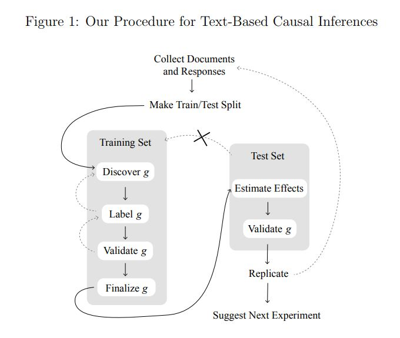

class: center, middle

```{css, echo=FALSE}
pre {
  max-height: 400px;
  overflow-y: auto;
}

pre[class] {
  max-height: 200px;
}
```

```{r, load_refs, include=FALSE, cache=FALSE}
# Initializes the bibliography
library(RefManageR)

library(ggplot2)
library(dplyr)
library(readr)
library(nlme)
library(jtools)
library(hrbrthemes)
library(mice)

BibOptions(check.entries = FALSE,
           bib.style = "authoryear", # Bibliography style
           max.names = 3, # Max author names displayed in bibliography
           sorting = "nyt", #Name, year, title sorting
           cite.style = "authoryear", # citation style
           style = "markdown",
           hyperlink = FALSE,
           dashed = FALSE)
#myBib <- ReadBib("assets/myBib.bib", check = FALSE)
# Note: don't forget to clear the knitr cache to account for changes in the
# bibliography.

peruemotions <- read.csv("https://github.com/jnseawright/PS406/raw/main/data/peruemotions.csv")

qog_std_ts_jan22 <- read.csv("https://github.com/jnseawright/PS406/raw/main/data/qog_std_ts_jan22.csv")
```
```{r xaringan-themer, include=FALSE, warning=FALSE}
library(xaringanthemer,MnSymbol)
style_mono_accent(
  base_color = "#1c5253",
  header_font_google = google_font("Josefin Sans"),
  text_font_google   = google_font("Montserrat", "300", "300i"),
  code_font_google   = google_font("Fira Mono"),
  text_font_size = "1.6rem"
)
```

---
### Heterogeneity

One of the central themes of the course has been causal heterogeneity. Can newer tools associated with machine learning contribute here?

---
### A (Quick) Historical Journey

$$Y_{i} \sim \tau D_{i} + \beta \mathbb{X}_{i}$$
where $\tau = Y_{t} - Y_{c}$.

---

$$Y_{i} \sim \tau D_{i} + \beta f(\mathbb{X})_{i}$$
where $\tau = Y_{t} - Y_{c}$.

---

Define:

$$e(x) = E(W_{i} | \mathbb{X}_{i} = x)$$
$$m(x) = e(Y_{i} | \mathbb{X}_{i} = x) = f(x) + \tau e(x)$$

---

Then we can rewrite our model as:

$$Y_{i} - m(x) = \tau(W_{i} - e(x)) + \epsilon_{i}$$
---

How do we get estimates of $e$ and $m$ that allow us to proceed with nonlinear equations without knowing the functional form?

We can run regressions, or we can just estimate them using nonparametric statistics or machine learning.

---

$$Y_{i} \sim \tau(\mathbb{X}_{i}) D_{i} + \beta f(\mathbb{X})_{i}$$

---

If we do what we were doing before *within neighborhoods* where $\mathbb{X}_{i}$ is similar, then this will work. We will get multiple separate estimates that we can then analyze and pool. 

Can we use random forests for this?

---
### CART

Optimally predicting $Y$ based on $\mathbb{X}$, without assumptions of
additivity, linearity, etc.

---
### CART

1.  Start with the set of all cases, i.e., the root node.

2.  Search all values of each variable in $\mathbb{X}$ for the binary
    split that maximizes homogeneity of $Y$ for cases on each side of
    the split.

3.  If homogeneity of $Y$ is sufficient or if the remaining sets of
    cases as the new final nodes are too small, stop. Otherwise, repeat
    step 2 for each of the current last-generation nodes.

---
### An Example

```{r, echo = FALSE, out.width="90%", fig.retina = 1, fig.align='center'}
library(knitr)
include_graphics("images/experimentcart.pdf")
```

---
```{r, echo = TRUE, out.width="90%", fig.retina = 1, fig.align='center'}
library(rpart)
```

---
```{r, echo = TRUE, out.width="70%", fig.retina = 1, fig.align='center'}
dem.cart <- rpart(vdem_libdem ~ vdem_gender + vdem_corr + wdi_gdpcapcon2010 + wdi_mobile + wdi_gerp + une_surlgpef + wdi_fertility, data=qog_std_ts_jan22, na.action=na.omit)

plot(dem.cart)
text(dem.cart, use.n=TRUE)
```

---
### Random Forests

1.  Bootstrap the underlying data.

2.  Run CART, selecting a random subset of datapoints and variables at each
    decision node.

3.  Repeat several times, and find a way to average the results
    together.

---
```{r, echo = TRUE, out.width="90%", fig.retina = 1, fig.align='center'}
library(randomForest)
```

---
```{r, echo = TRUE, out.width="70%", fig.retina = 1, fig.align='center'}
dem.rf <- randomForest(vdem_libdem ~ wdi_gendeqr + bci_bci + wdi_gdpcapcon2010 + wdi_mobile + wdi_gerp + une_surlgpef + wdi_fertility, data=qog_std_ts_jan22, na.action=na.omit)

dem.rf
```

---
```{r, echo = TRUE, out.width="90%", fig.retina = 1, fig.align='center'}
library(randomForestExplainer)
```

---
```{r, echo = TRUE, out.width="50%", fig.retina = 1, fig.align='center'}
dem.mindepth <- min_depth_distribution(dem.rf)
plot_min_depth_distribution(dem.mindepth)
```

---
```{r, echo = TRUE, out.width="70%", fig.retina = 1, fig.align='center'}
plot_min_depth_interactions(dem.rf)
```

```{r, echo = FALSE, out.width="90%", fig.retina = 1, fig.align='center'}


```

---
### Causal Forests

Run a random forest predicting the treatment effect at each node, rather than the average value of the outcome.

Specifically, split groups up to maximize:

$$n_{L} n_{R} (\hat{\tau} L − \hat{\tau} R)^2$$

---
Robins, Rotnitzky & Zhao (1994) proved that the asymptotically optimal estimator for $\tau$ is the Augmented Inverse Probability Weighted (AIPW) estimator.

---
```{r, echo = FALSE, out.width="90%", fig.retina = 1, fig.align='center'}

```

---

Using the AIPW to combine estimates that derive from causal forests gives us a *doubly robust* estimator.

---
```{r, echo = FALSE, out.width="90%", fig.retina = 1, fig.align='center'}
library(grf)
```

---
```{r, echo = TRUE, out.width="90%", fig.retina = 1, fig.align='center'}
demdata <- qog_std_ts_jan22

demdata <- demdata %>% filter(!is.na(vdem_libdem) & !is.na(br_pres))

demdata.X <- with(demdata, rbind(wdi_gendeqr,bci_bci, wdi_gdpcapcon2010, wdi_mobile, wdi_gerp, une_surlgpef, wdi_fertility))

dem.cf <- causal_forest(Y=demdata$vdem_libdem, W=demdata$br_pres, X=t(demdata.X))

dem.cf
```

---
```{r, echo = TRUE, out.width="50%", fig.retina = 1, fig.align='center'}
demscores <- data.frame(score=get_scores(dem.cf))

p <- demscores %>%
  ggplot( aes(x=score)) +
  geom_histogram( binwidth=0.1, fill="#69b3a2", color="#e9ecef", alpha=0.9) +
  theme_ipsum() +
  theme(
    plot.title = element_text(size=15)
  )
```
---
```{r, echo = TRUE, out.width="50%", fig.retina = 1, fig.align='center'}
p
```

---
```{r, echo = FALSE, out.width="90%", fig.retina = 1, fig.align='center'}

```

---
```{r, echo = TRUE, out.width="50%", fig.retina = 1, fig.align='center'}
average_treatment_effect(dem.cf, target.sample = "overlap")
average_treatment_effect(dem.cf, target.sample = "control")
average_treatment_effect(dem.cf, target.sample = "treated")
```

---
```{r, echo = TRUE, out.width="50%", fig.retina = 1, fig.align='center'}
temp.df <- data.frame(demscore = demscores$score, ht_colonial = as.factor(demdata$ht_colonial))

htcolonial_text <- c("Not colonized", "Dutch", "Spanish", "Italian", "US", "British", "French", "Portuguese", "Belgian", "Brit/French", "Austral.")

p2 <- temp.df %>% ggplot( aes(x=ht_colonial, y=demscore)) + 
    geom_violin() +
    xlab("Colonial History") +
    theme(legend.position="none") +
    xlab("") + scale_x_discrete(labels= htcolonial_text)
```

---
```{r, echo = TRUE, out.width="50%", fig.retina = 1, fig.align='center'}
p2
```

---
```{r, echo = TRUE, out.width="50%", fig.retina = 1, fig.align='center'}
temp.df <- data.frame(demscore = demscores$score, pop65 = demdata$wdi_pop65)

p3 <- temp.df %>% ggplot(aes(x=pop65, y=demscore)) +
  geom_point() +
  geom_smooth(method=lm , color="red", fill="#69b3a2", se=TRUE) +
  theme_ipsum()
```

---
```{r, echo = TRUE, out.width="50%", fig.retina = 1, fig.align='center'}
p3
```

---
```{r, echo = FALSE, out.width="90%", fig.retina = 1, fig.align='center'}

```

---
### Picking Control Variables

Throughout this course, we've often assumed we could correctly identify control variables. Can we, though?

---
### Picking Control Variables

Suppose we know enough to rule out post-treatment variables and colliders, but possibly not enough to distinguish a priori between confounders, irrelevant controls, and instruments. Suppose also that the total number of potential controls is very large. What to do?

---
### LASSO

Estimate a regression, as usual (minimizing the sum of squared errors), but subject to the added penalty term:

$$\lambda \sum_{j=1}^{p}|\beta_{j}|$$

---
### Picking Control Variables

If you are pretty sure you don't have any potential instruments in the data, and that there are a reasonable number of causes of the treatment that are not included in the dataset, then there is a double selection LASSO approach to picking variables.

---
```{r, echo = FALSE, out.width="90%", fig.retina = 1, fig.align='center'}

```

---
### Double-selection

1. Run a LASSO regression predicting the outcome based on all the possible confounders.

2. Run a second LASSO regression predicting the treatment based on all the possible confounders.

3. Select all variables that have non-zero coefficients in either regression and use them as controls in your actual causal inference.

---
```{r, echo = TRUE, out.width="90%", fig.retina = 1, fig.align='center'}
qogwdi <- qog_std_ts_jan22 %>% filter(year > 1979) %>% select(starts_with("wdi") | starts_with("year") | starts_with("cname"))
qogwdi <- qogwdi[,colSums(is.na(qogwdi))<3000]
qogwdi$vdem_libdem <- qog_std_ts_jan22$vdem_libdem[qog_std_ts_jan22$cname %in% qogwdi$cname & qog_std_ts_jan22$year >1979]
qogwdi.imp <- mice(qogwdi, method = "cart")
```
---
```{r, echo = TRUE, out.width="90%", fig.retina = 1, fig.align='center'}
qogimputed1 <- mice::complete(qogwdi.imp)

summary(lm(wdi_gdpcapgr~vdem_libdem + I(log(wdi_gdpcapcon2010)) + wdi_gerp, data=qogimputed1))
```

---
```{r, echo = TRUE, out.width="90%", fig.retina = 1, fig.align='center'}
library(hdm)
```


---
```{r, echo = TRUE, out.width="90%", fig.retina = 1, fig.align='center'}
demgrow.dualselection <- rlassoEffects(wdi_gdpcapgr ~ . - year - cname - cname_qog - cname_year - wdi_gdpgr - wdi_popgr, data=qogimputed1, I=~vdem_libdem)
demgrow.dualselection
demgrow.dualselection$selection.matrix
```

---
### Double-selection

One problem with double selection is that you will get instruments as control variables if they're in the data. Another problem is that it's inefficient because you aren't using information about the two relationships of interest jointly.

---
```{r, echo = FALSE, out.width="90%", fig.retina = 1, fig.align='center'}

```

---
### Adaptive LASSO

Adaptive LASSO allows the penalty term to change across coefficients:

$$\lambda \sum_{j=1}^{p}|\hat{w}_{j}\beta_{j}|$$

In a standard adaptive LASSO, $\hat{w} = |\tilde{\beta}_{j}|^{-\gamma}$, where $\tilde{\beta}_{j}$ is a typical parametric estimate of the regression slopes and $\gamma$ is a positive penalty parameter.

---
### Outcome-Adaptive LASSO

1. Run some kind of regression, predicting the outcome of interest with the treatment and all the potential control variables.

2. Run an adaptive lasso predicting the treatment based on the control variables. Set the penalty terms based on the coefficient estimates from step 1.

3. Use the control variables selected in step 2 to estimate a propensity score (or a regression or whatever).


---
```{r, echo = TRUE, out.width="90%", fig.retina = 1, fig.align='center'}
library(glmnet)
```

---
```{r, echo = TRUE, out.width="90%", fig.retina = 1, fig.align='center'}
qogimpcomplete <- qogimputed1[,colSums(is.na(qogimputed1))<1]

demgrow.adaptivelasso.part1 <- lm(wdi_gdpcapgr ~ . - year - cname - cname_qog - cname_year - wdi_gdpgr - wdi_popgr, data=qogimpcomplete)
tildebeta <- demgrow.adaptivelasso.part1$coefficients[2:59]
tildebeta[is.na(tildebeta)] <- .0000000000000000000000000000000000000000000000000000001
gammaval <- 0.5

xmat <- qogimpcomplete[,-c(17,20,49,62:66)]

demgrow.adaptivelasso.part2 <- glmnet(y=qogimputed1$wdi_gdpcapgr, x=xmat, penalty.factor=abs(tildebeta)^(-1*gammaval))
```

---
```{r, echo = TRUE, out.width="90%", fig.retina = 1, fig.align='center'}
coef(demgrow.adaptivelasso.part2, 1)
```
---
```{r, echo = TRUE, out.width="90%", fig.retina = 1, fig.align='center'}
coef(demgrow.adaptivelasso.part2, 2)
```
---
```{r, echo = TRUE, out.width="90%", fig.retina = 1, fig.align='center'}
coef(demgrow.adaptivelasso.part2, 5)
```
---
```{r, echo = TRUE, out.width="90%", fig.retina = 1, fig.align='center'}
coef(demgrow.adaptivelasso.part2, 20)
```
---
```{r, echo = TRUE, out.width="90%", fig.retina = 1, fig.align='center'}
coef(demgrow.adaptivelasso.part2, 100)
```

---
```{r, echo = TRUE, out.width="90%", fig.retina = 1, fig.align='center'}
qogimpcomplete <- qogimputed1[,colSums(is.na(qogimputed1))<1]

demgrow.adaptivelasso.part1 <- lm(wdi_gdpcapgr ~ . - year - cname - cname_qog - cname_year - wdi_gdpgr - wdi_popgr, data=qogimpcomplete)
tildebeta <- demgrow.adaptivelasso.part1$coefficients[2:59]
tildebeta[is.na(tildebeta)] <- .0000000000000000000000000000000000000000000000000000001
gammaval <- 3

xmat <- qogimpcomplete[,-c(17,20,49,62:66)]

demgrow.adaptivelasso.part2 <- glmnet(y=qogimputed1$wdi_gdpcapgr, x=xmat, penalty.factor=abs(tildebeta)^(-1*gammaval))
```

---
```{r, echo = TRUE, out.width="90%", fig.retina = 1, fig.align='center'}
coef(demgrow.adaptivelasso.part2, 1)
```
---
```{r, echo = TRUE, out.width="90%", fig.retina = 1, fig.align='center'}
coef(demgrow.adaptivelasso.part2, 2)
```
---
```{r, echo = TRUE, out.width="90%", fig.retina = 1, fig.align='center'}
coef(demgrow.adaptivelasso.part2, 5)
```
---
```{r, echo = TRUE, out.width="90%", fig.retina = 1, fig.align='center'}
coef(demgrow.adaptivelasso.part2, 20)
```
---
```{r, echo = TRUE, out.width="90%", fig.retina = 1, fig.align='center'}
coef(demgrow.adaptivelasso.part2, 100)
```

---
### Textual Data and Causal Inference

```{r, echo = FALSE, out.width="70%", fig.retina = 1, fig.align='center'}

```
