class: center, middle

```{css, echo=FALSE}
pre {
  max-height: 400px;
  overflow-y: auto;
}

pre[class] {
  max-height: 200px;
}
```

```{r, load_refs, include=FALSE, cache=FALSE}
# Initializes the bibliography
library(RefManageR)

library(ggplot2)
library(dplyr)
library(readr)
library(nlme)
library(jtools)

BibOptions(check.entries = FALSE,
           bib.style = "authoryear", # Bibliography style
           max.names = 3, # Max author names displayed in bibliography
           sorting = "nyt", #Name, year, title sorting
           cite.style = "authoryear", # citation style
           style = "markdown",
           hyperlink = FALSE,
           dashed = FALSE)
#myBib <- ReadBib("assets/myBib.bib", check = FALSE)
# Note: don't forget to clear the knitr cache to account for changes in the
# bibliography.

peruemotions <- read.csv("https://github.com/jnseawright/PS406/raw/main/data/peruemotions.csv")
```
```{r xaringan-themer, include=FALSE, warning=FALSE}
library(xaringanthemer,MnSymbol)
style_mono_accent(
  base_color = "#1c5253",
  header_font_google = google_font("Josefin Sans"),
  text_font_google   = google_font("Montserrat", "300", "300i"),
  code_font_google   = google_font("Fira Mono"),
  text_font_size = "1.6rem"
)
```

### Missingness!

1. Sometimes, our data aren't complete!

2. Missing data can have different effects on causal inference, depending on which variables are missing (treatment, outcome, controls) and *why* they are missing.


---
### Some Notation

$$\mathbb{Y} = \{\mathbb{Y}_{O}, \mathbb{Y}_{M}\}$$

$$R_{i} = \left\{
     \begin{array}{lr}
       1 & : Y_{i} \text{ is observed}\\
       0 & : Y_{i} \text{ is missing}
     \end{array}
   \right.$$

---
### Some Notation

$$Pr(\mathbb{R} | \mathbb{Y}, \mathbb{X})$$

---
### MCAR

$$Pr(\mathbb{R} | \mathbb{Y}, \mathbb{X}) = Pr(\mathbb{R})$$

---
### MAR

$$Pr(\mathbb{R} | \mathbb{Y}, \mathbb{X}) = Pr(\mathbb{R} | \mathbb{Y}_{O}, \mathbb{X})$$

---
### Non-Ignorable

$$Pr(\mathbb{R} | \mathbb{Y}, \mathbb{X}) \neq Pr(\mathbb{R} | \mathbb{Y}_{O}, \mathbb{X})$$

---


---
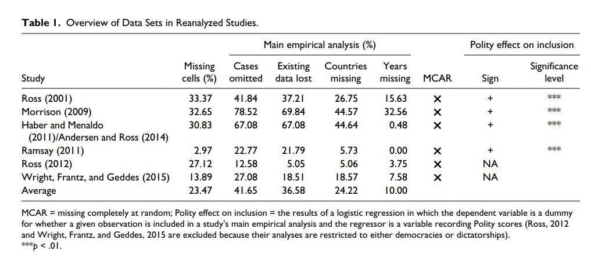

---
### Completely Random Missing Data

1. Equivalent to a random subsample.

2. MCAR missingness reduces effective sample sizes, and therefore increases standard errors, but is otherwise fairly harmless.

---
```{r, echo = TRUE, out.width="90%", fig.retina = 1, fig.align='center'}
summary(lm(outsidervote ~ simpletreat,
  data=peruemotions))
```

---
```{r, echo = TRUE, out.width="90%", fig.retina = 1, fig.align='center'}
perueffects <- 1:100

for (i in 1:100){
  perutemp <- peruemotions[sample(1:nrow(peruemotions),nrow(peruemotions)-100, replace = TRUE),]
  perueffects[i] <- lm(outsidervote ~ simpletreat, data=perutemp)$coef[2]
}

summary(perueffects)
sd(perueffects)
```

---
### Missingness at Random

1. Missingness is correlated with observed variables in some way.

2. MAR missingness reduces effective sample sizes, but can also cause bias.

---
```{r, echo = TRUE, out.width="90%", fig.retina = 1, fig.align='center'}
library(boot)
library(Rlab)
```

---
```{r, echo = TRUE, out.width="90%", fig.retina = 1, fig.align='center'}
perumareffects <- 1:100

missing.prob <- inv.logit(-2.3 + -.5*peruemotions$edlevel + -.2*peruemotions$classid + peruemotions$leftright)
missing.prob[is.na(missing.prob)] <- .3

for (i in 1:100){
  perutemp <- peruemotions
  perutemp$outsidervote[rbern(length(missing.prob),missing.prob)==1] <- NA
  perumareffects[i] <- lm(outsidervote ~ simpletreat, data=perutemp)$coef[2]
}

summary(perumareffects)
sd(perumareffects)
```

---
### Nonignorable Missingness 

1. Missingness is correlated with the missing values themselves.

2. Nonignorable missingness reduces effective sample sizes, and often causes bias that is hard to solve.

---
```{r, echo = TRUE, out.width="90%", fig.retina = 1, fig.align='center'}
perunonigeffects <- 1:100

missing.threshold <- -2.3 + 4*peruemotions$outsidervote
missing.threshold[is.na(missing.threshold)] <- .3

for (i in 1:100){
  perutemp <- peruemotions
  perutemp$outsidervote[rbern(length(missing.threshold),1-inv.logit(missing.threshold))==1] <- NA
  perunonigeffects[i] <- lm(outsidervote ~ simpletreat, data=perutemp)$coef[2]
}

summary(perunonigeffects)
sd(perunonigeffects)
```

---

Based on what we just saw, when is it a good idea to just delete missing data, and when will that cause trouble?

---
### Fixing Missingness

1. Delete the data and move on.

2. Fill in the data with some kind of best guess.

3. Repair the missingness with a statistical model.

---
### Listwise Deletion

Deleting the entire case when one or more value is missing is called ''listwise deletion.'' It works for MCAR data, or in general (more or less) in a model when the causes of missingness are included as covariates.

---
```{r, echo = FALSE, out.width="90%", fig.retina = 1, fig.align='center'}
library(knitr)
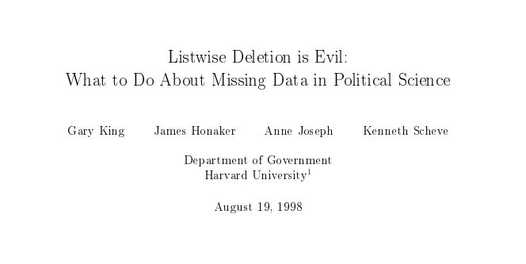
```

---
```{r, echo = FALSE, out.width="90%", fig.retina = 1, fig.align='center'}
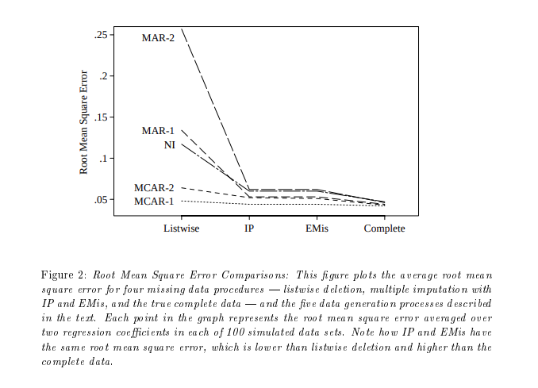
```

---
```{r, echo = FALSE, out.width="90%", fig.retina = 1, fig.align='center'}
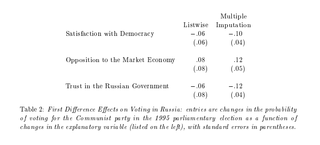
```

---
```{r, echo = FALSE, out.width="90%", fig.retina = 1, fig.align='center'}
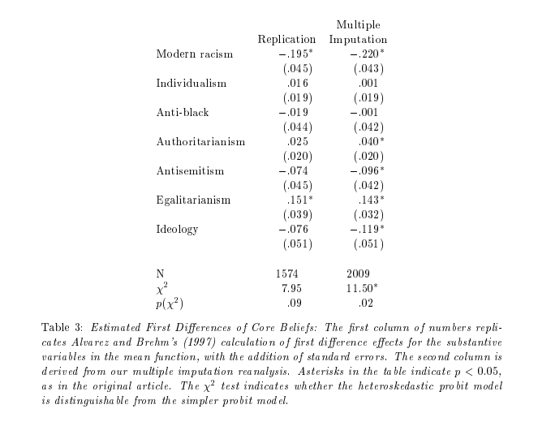
```

---
```{r mar_effects, echo = TRUE, out.width="90%", fig.retina = 1, fig.align='center'}
perumareffects2 <- 1:100

missing.prob <- inv.logit(-2.3 + -.5*peruemotions$edlevel + -.2*peruemotions$classid + peruemotions$leftright)
missing.prob[is.na(missing.prob)] <- .3

for (i in 1:100){
  perutemp <- peruemotions
  perutemp$outsidervote[rbern(length(missing.prob),missing.prob)==1] <- NA
  perumareffects2[i] <- lm(outsidervote ~ simpletreat + edlevel + classid + leftright, data=perutemp)$coef[2]
}

summary(perumareffects2)
sd(perumareffects2)
```


---
### Imputation

We can use the known values of variables within a case to come up with a best guess for the missing values within that case, given the joint distributions across the rest of the data. The most common family of ways to do this is multiple imputation.

---
### Multiple Imputation

1. Come up with an initial guess for all the missing values.

2. Choose one variable ($Y_{i}$) to work on. Use the initial guesses, as well as the observed values, for all the other variables to run a regression with $YX_{i}$ as the outcome and $Y_{-i}$ as well as $X$ as the predictors. Draw fitted values from that regression for the missing values on $Y_{i}$.

---
### Multiple Imputation

3. Move on to the next variable with missing values, and repeat step 2. Continue until all the variables have had their turn.

4. Use the predicted values from these regressions as the new initial guesses and repeat steps 2 and 3. Keep this up until repeating the process produces regression distributions that don't change much across iterations.

---
### Multiple Imputation

The resulting guesses are better than nothing, but they aren't real data --- they are draws from a distribution. To capture the uncertainty, we should take multiple draws from that distribution for each data point. This will create multiple copies of the data set.

We then run our model of interest on each copy of the data set, and combine the results together to get a final answer.

---
### Multiple Imputation

For $M$ imputations:

$$\hat{\beta} = \frac{1}{m} \displaystyle\sum_{m=1}^{M} \hat{\beta}_{m}$$

---
### Multiple Imputation

For $M$ imputations:

$$V_{\beta} = W + (1 + \frac{1}{M}) B$$

$$W = \frac{1}{m} \displaystyle\sum_{m=1}^{M} s^{2}_{m}$$

$$B = \frac{1}{m - 1} \displaystyle\sum_{m=1}^{M} (\hat{\beta}_{m} - \hat{\beta})^{2}$$

---
```{r, echo = TRUE, out.width="90%", fig.retina = 1, fig.align='center'}
library(mice)
```

---
```{r, echo = TRUE, eval=FALSE, out.width="90%", fig.retina = 1, fig.align='center'}
perumieffects <- 1:100

missing.prob <- inv.logit(-2.3 + -.5*peruemotions$edlevel + -.2*peruemotions$classid + peruemotions$leftright)
missing.prob[is.na(missing.prob)] <- .3

for (i in 1:100){
  perutemp <- peruemotions
  perutemp$outsidervote[rbern(length(missing.prob),missing.prob)==1] <- NA
  perumice <- mice(perutemp)
  perumieffects[i] <- summary(pool(with(perumice, summary(lm(outsidervote ~ simpletreat)))))[2,2]
}
```

---
```{r, echo = TRUE, eval=FALSE, out.width="90%", fig.retina = 1, fig.align='center'}
summary(perumieffects)
sd(perumieffects)
```

---
```{r, echo = FALSE, out.width="90%", fig.retina = 1, fig.align='center'}
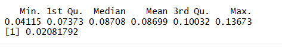
```

---

What is the difference between multiple imputation and making up fake data?

---
### How Many Imputations?

mice defaults to 5, because of the older received wisdom of the literature.

> In many applications, just 3–5 imputations are sufficient to obtain excellent results. ... Many are surprised by the claim that only 3–5 imputations may be needed. Rubin (1987: 114) shows that the efficiency of an estimate based on $m$ imputations is approximately $(1 + \frac{\gamma}{m})^{-1}$...

---
### How Many Imputations?

>...where $\gamma$ is the fraction of missing information for the quantity being estimated.... gains rapidly diminish after the first few imputations. ... In most situations there is simply little advantage to producing and analyzing more than a few imputed datasets (Schafer and Olsen 1998: 548–549).

---
```{r, echo = FALSE, out.width="90%", fig.retina = 1, fig.align='center'}
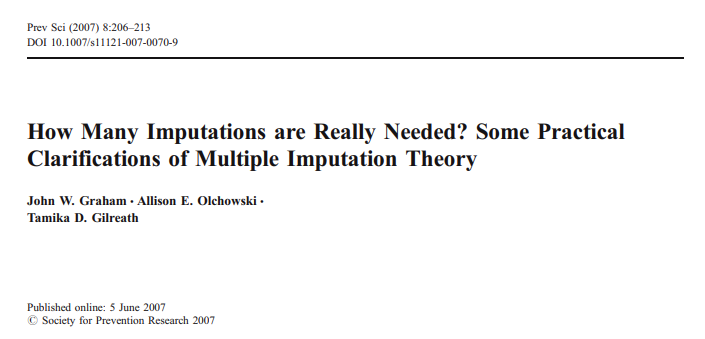
```

---
```{r, echo = FALSE, out.width="90%", fig.retina = 1, fig.align='center'}
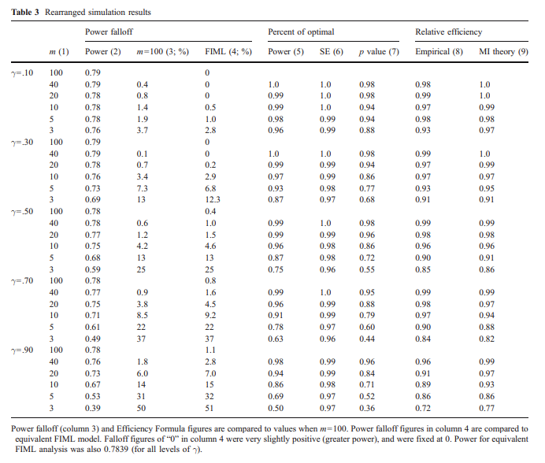
```

---
```{r, echo = FALSE, out.width="90%", fig.retina = 1, fig.align='center'}
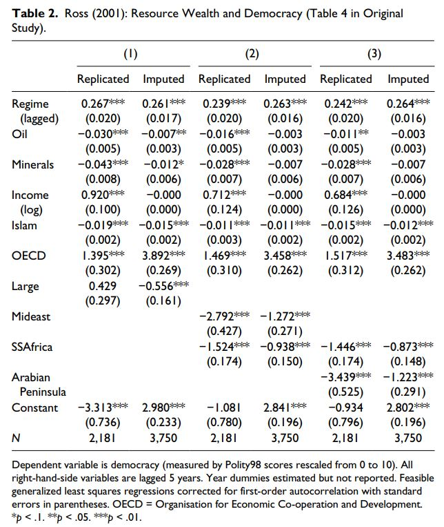
```

---
```{r, echo = FALSE, out.width="90%", fig.retina = 1, fig.align='center'}

```

---
```{r, echo = FALSE, out.width="90%", fig.retina = 1, fig.align='center'}
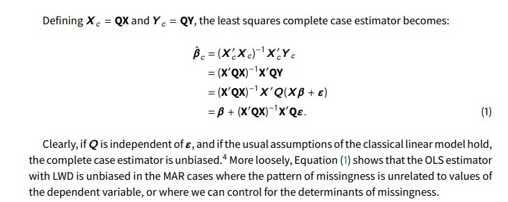
```

---
```{r, echo = FALSE, out.width="90%", fig.retina = 1, fig.align='center'}

```

---
```{r, echo = FALSE, out.width="90%", fig.retina = 1, fig.align='center'}
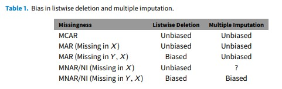
```

---
```{r, echo = FALSE, out.width="90%", fig.retina = 1, fig.align='center'}

```

---
```{r, echo = FALSE, out.width="90%", fig.retina = 1, fig.align='center'}
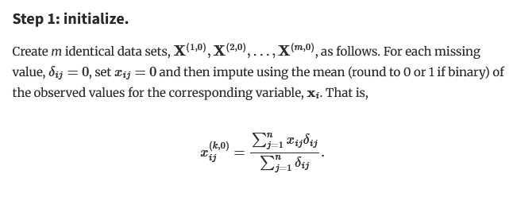
```

---
```{r, echo = FALSE, out.width="90%", fig.retina = 1, fig.align='center'}
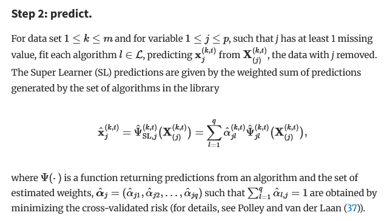
```

---
```{r, echo = FALSE, out.width="90%", fig.retina = 1, fig.align='center'}
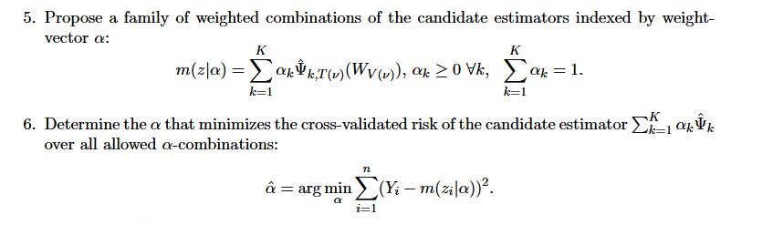
```

---
```{r, echo = FALSE, out.width="90%", fig.retina = 1, fig.align='center'}
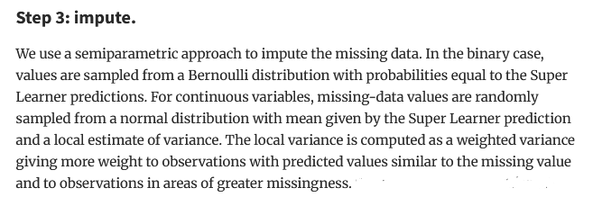
```

---
```{r, echo = TRUE, eval=FALSE, out.width="90%", fig.retina = 1, fig.align='center'}
#Code to install superMICE, which is available but not currently updated.
#library(remotes)
#install_version("superMICE", version = "1.1.1")
library(superMICE)

perusupermieffects <- 1:10

missing.prob <- inv.logit(-2.3 + -.5*peruemotions$edlevel + -.2*peruemotions$classid + peruemotions$leftright)
missing.prob[is.na(missing.prob)] <- .3
SL.lib <- c("SL.mean", "SL.biglasso", "SL.randomForest")

for (i in 1:10){
  perutemp <- peruemotions
  perutemp$outsidervote[rbern(length(missing.prob),missing.prob)==1] <- NA
  perumice <- mice::mice(perutemp,
                method = "SuperLearner",
                SL.library = SL.lib,
                kernel = "gaussian",
                bw = c(0.25, 1, 5))
  perusupermieffects[i] <- summary(pool(with(perumice, summary(lm(outsidervote ~ simpletreat)))))[2,2]
}
```

---
```{r, echo = FALSE, out.width="90%", fig.retina = 1, fig.align='center'}
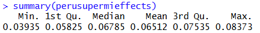
```

---

What do we get by adding a machine-learning perspective to multiple imputation?

---
### Non-Ignorable Missingness

Censoring: data above/below a certain threshold on a variable (or variables) have missing values in the dataset

Truncation: cases data above/below a certain threshold on a variable (or variables) are not included in the dataset

General Selection Problems: other forms of correlation between missingness and values of the data

---
### Non-Ignorable Missingness

For non-ignorable missingness, the two main solutions are:

1. Statistical models, usually using maximum-likelihood techniques.

2. Nonparametric bounds, an idea to be discussed next week.

---
### Tobit

$$y^{*} = \mathbf{x} \beta + \epsilon$$

$$\epsilon \sim N(0, \sigma^{2})$$
---
### Tobit

$$y = \left\{
     \begin{array}{lr}
        y^{*} & : y^{*} > 0\\
       - & : y^{*} \leq 0
     \end{array}
   \right.$$


---
### Tobit (Censored Regression) Likelihood

For observation $i$, the contribution to the likelihood depends on whether $y_i$ is uncensored, left‑censored, or right‑censored.

Assume a latent variable $y_i^* = \mathbf{x}_i\beta + \epsilon_i$, with $\epsilon_i \sim N(0,\sigma^2)$.  
We observe $y_i = y_i^*$ if $L < y_i^* < U$, otherwise we know only that $y_i^* \leq L$ or $y_i^* \geq U$.

---

$$
\mathcal{L}_i = 
\begin{cases}
\dfrac{1}{\sigma}\phi\!\left(\dfrac{y_i - \mathbf{x}_i\beta}{\sigma}\right) 
& \text{if } y_i^* \text{ is uncensored (i.e., } L < y_i < U \text{)} \\[2em]
\Phi\!\left(\dfrac{L - \mathbf{x}_i\beta}{\sigma}\right) 
& \text{if } y_i^* \text{ is left‑censored (i.e., } y_i = L \text{)} \\[2em]
1 - \Phi\!\left(\dfrac{U - \mathbf{x}_i\beta}{\sigma}\right) 
& \text{if } y_i^* \text{ is right‑censored (i.e., } y_i = U \text{)}
\end{cases}
$$


---

Consider the situation in which we have a measure of academic aptitude
(scaled 200-800) which we want to model using reading and math test
scores, as well as, the type of program the student is enrolled in
(academic, general, or vocational). The problem here is that students
who answer all questions on the academic aptitude test correctly receive
a score of 800, even though it is likely that these students are not
"truly" equal in aptitude.

---

Here, there is an upper censoring point $U = 800$ (and no lower censoring), so the likelihood becomes  

$$
\mathcal{L}_i = 
\begin{cases}
\dfrac{1}{\sigma}\phi\!\left(\dfrac{y_i - \mathbf{x}_i\beta}{\sigma}\right) & \text{if } y_i < 800 \\[1.5em]
1 - \Phi\!\left(\dfrac{800 - \mathbf{x}_i\beta}{\sigma}\right) & \text{if } y_i = 800
\end{cases}
$$

---

The model is estimated by maximizing the sum of the log‑likelihoods:  
$\displaystyle \max_{\beta,\sigma} \sum_i \log \mathcal{L}_i$.

---
```{r, echo = TRUE, out.width="90%", fig.retina = 1, fig.align='center'}
dat <- read.csv(
     "https://stats.idre.ucla.edu/stat/data/tobit.csv")

library(VGAM)
```

---
```{r, echo = TRUE, out.width="90%", fig.retina = 1, fig.align='center'}
summary(lm(apt ~ read + math +
          prog,  
          data = dat))
```

---
```{r, echo = TRUE, out.width="90%", fig.retina = 1, fig.align='center'}
summary(m <- vglm(apt ~ read + math +
          prog, tobit(Upper = 800), 
          data = dat))
```

---
### Heckman Selection Model: Two Latent Equations

**Selection equation** (who is observed?):  

$$
y_{i}^{S*} = \mathbf{x}_{i}^{S} \beta^{S} + \epsilon_{i}^{S}
$$

We observe the binary indicator $y_i^S = 1$ if $y_i^{S*} > 0$, and $y_i^S = 0$ otherwise.

---
### Heckman Selection Model: Two Latent Equations

**Outcome equation** (the quantity of interest):  

$$
y_{i}^{O*} = \mathbf{x}_{i}^{O} \beta^{O} + \epsilon_{i}^{O}
$$

We observe $y_i^O = y_i^{O*}$ only when $y_i^S = 1$; otherwise $y_i^O$ is missing.

---

The error terms are assumed to be bivariate normal:

$$
\begin{pmatrix}
\epsilon^{S} \\ \epsilon^{O}
\end{pmatrix}
\sim N\!\left(
\begin{pmatrix} 0 \\ 0 \end{pmatrix},
\begin{pmatrix}
1 & \rho\sigma \\
\rho\sigma & \sigma^2
\end{pmatrix}
\right)
$$

(Here $\rho$ is the correlation, and the variance of $\epsilon^{S}$ is normalized to 1 for identification.)


---
### The Selection Problem

We are interested in $E[y_i^O \mid \mathbf{x}^O]$, but we only observe $y_i^O$ for the selected subsample ($y_i^S = 1$).  

The conditional expectation for the observed cases is:

$$
E[y_i^O \mid \mathbf{x}^O, \mathbf{x}^S, y_i^S = 1] 
= \mathbf{x}_i^O \beta^O + E[\epsilon_i^O \mid \mathbf{x}^O, \mathbf{x}^S, y_i^S = 1]
$$

---
### The Selection Problem

Because $y_i^S = 1$ implies $\epsilon_i^S > -\mathbf{x}_i^S \beta^S$, the second term is not zero if $\epsilon_i^O$ and $\epsilon_i^S$ are correlated:

$$
E[\epsilon_i^O \mid \epsilon_i^S > -\mathbf{x}_i^S \beta^S] = \rho\sigma \,
\underbrace{\frac{\phi(-\mathbf{x}_i^S \beta^S)}{1 - \Phi(-\mathbf{x}_i^S \beta^S)}}_{\text{Inverse Mills Ratio } \lambda(\mathbf{x}_i^S \beta^S)}
$$

(Here $\phi$ and $\Phi$ are the standard normal pdf and cdf.)

---
### The Inverse Mills Ratio (IMR)

Using symmetry of the normal distribution, $\phi(-z) = \phi(z)$ and $1 - \Phi(-z) = \Phi(z)$, we can write:

$$
\lambda(\mathbf{x}_i^S \beta^S) = \frac{\phi(\mathbf{x}_i^S \beta^S)}{\Phi(\mathbf{x}_i^S \beta^S)}
$$

Thus the conditional expectation for the observed outcomes becomes:

$$
E[y_i^O \mid \mathbf{x}^O, \mathbf{x}^S, y_i^S = 1] 
= \mathbf{x}_i^O \beta^O + \underbrace{\rho\sigma}_{\equiv \beta_\lambda} \, \lambda(\mathbf{x}_i^S \beta^S)
$$

---

This shows that selection bias is like an **omitted variable problem**: if we could include $\lambda(\mathbf{x}_i^S \beta^S)$ in the regression, we would get consistent estimates of $\beta^O$.

---
### Heckman’s Two‑Step Procedure

1. **First step:** Estimate the selection equation using a probit model ($y_i^S$ on $\mathbf{x}^S$) to obtain $\hat{\beta}^S$.

2. **Second step:** For the selected subsample ($y_i^S = 1$), compute the estimated IMR  
   $\hat{\lambda}_i = \dfrac{\phi(\mathbf{x}_i^S \hat{\beta}^S)}{\Phi(\mathbf{x}_i^S \hat{\beta}^S)}$  
   and run an OLS regression of $y_i^O$ on $\mathbf{x}^O$ and $\hat{\lambda}_i$:

   $$
   y_i^O = \mathbf{x}_i^O \beta^O + \beta_\lambda \hat{\lambda}_i + \eta_i
   $$

   The coefficient on $\hat{\lambda}_i$ estimates $\rho\sigma$, and its significance tests for selection bias.

---

Maximum likelihood (the `selection()` function in **sampleSelection**) estimates both equations simultaneously and is generally more efficient.

---
```{r, echo = TRUE, out.width="90%", fig.retina = 1, fig.align='center'}
library(sampleSelection)
```

---
```{r, echo = TRUE, out.width="90%", fig.retina = 1, fig.align='center'}
data("Mroz87")
ols1 = lm(log(wage) ~ educ + exper + I( exper^2 ) + city, data=subset(Mroz87, lfp==1))
summary(ols1)
```

---
```{r, echo = TRUE, out.width="90%", fig.retina = 1, fig.align='center'}
mroz.tobit = selection( lfp ~ age + I( age^2 ) + kids5 + huswage + educ,
                 log(wage) ~ educ + exper + I( exper^2 ) + city, data=Mroz87 )
summary(mroz.tobit)
```

---
```{r, echo = TRUE, out.width="90%", fig.retina = 1, fig.align='center'}
mroz.heckit = heckit( lfp ~ age + I( age^2 ) + kids5 + huswage + educ,
                 log(wage) ~ educ + exper + I( exper^2 ) + city, data=Mroz87 )
summary(mroz.heckit)
```

---

What are we trying to fix with the Heckman process? What do we need in order to make it work? What parts of the model do we care about when we are done?


---
```{r, echo = FALSE, out.width="90%", fig.retina = 1, fig.align='center'}

```

---
```{r, echo = FALSE, out.width="90%", fig.retina = 1, fig.align='center'}
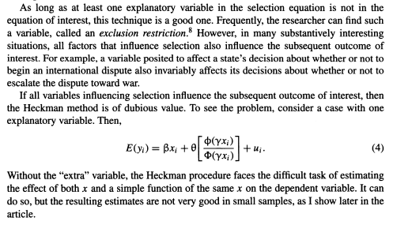
```