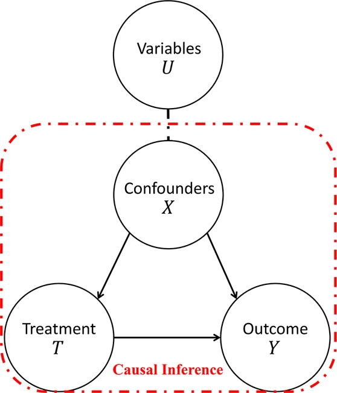

## PS 406 Quantitative Causal Inference

[Syllabus](https://jnseawright.github.io/PS406/causalinferencesyllabus2024.pdf)

### Slides and Code from Seminar

* [Week 1: Experiments](https://jnseawright.github.io/PS406/1experiments.html#1)
* [Week 2: Regression and Causal Inference](https://jnseawright.github.io/PS406/2regression.html#1) 
* [Week 3: Matching](https://jnseawright.github.io/PS406/3matching.html#1)
* [Week 4: Natural Experiments Part 1](https://jnseawright.github.io/PS406/4naturalexperiments.html#1)
* [Week 5: Natural Experiments Part 2](https://jnseawright.github.io/PS406/5naturalexperiments2.html#1) 
* [Week 6: Missing Data](https://jnseawright.github.io/PS406/6missingdata.html#1) 
* [Week 7: Synthetic Controls, Sensitivity, Bounds](https://jnseawright.github.io/PS406/7synthetic.html#1) 
* [Week 8: Difference-in-Differences Designs](https://jnseawright.github.io/PS406/8diffindiff.html#1) 
* [Week 9: Machine Learning and Causal Inference](https://jnseawright.github.io/PS406/9machinelearning.html#1) 

### Lab Assignments

* [Week 1: Experiments](https://jnseawright.github.io/PS406/Lab1Experiments.pdf)
* [Week 2: Regression and Causal Inference](https://jnseawright.github.io/PS406/Lab2Regression.pdf) 
* [Week 3: Matching](https://jnseawright.github.io/PS406/Lab3Matching.pdf)
* [Week 4: Natural Experiments Part 1](https://jnseawright.github.io/PS406/Lab4NaturalExperiments.pdf)
* [Week 5: Natural Experiments Part 2 ](https://jnseawright.github.io/PS406/Lab5NaturalExperimentsPart2.pdf) 
* [Week 6: Missing Data](https://jnseawright.github.io/PS406/Lab6MissingData.pdf)
* [Week 7: Synthetic Control, Sensitivity, and Bounds](https://jnseawright.github.io/PS406/Lab7BoundsandSyntheticControl.pdf)
* [Week 8: Difference-in-Differences Designs](https://jnseawright.github.io/PS406/Lab8DiffinDiff.pdf)
* [Week 9: Machine Learning and Causal Inference](https://jnseawright.github.io/PS406/Lab9MachineLearning.pdf)

