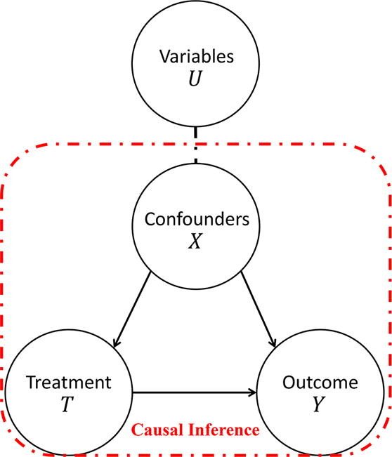

## PS 406 Quantitative Causal Inference

[Syllabus](https://jnseawright.github.io/PS406/syllabus.html)

### Slides and Code from Seminar

* [Week 1: Experiments](https://jnseawright.github.io/PS406/1experiments.html#1)
* [Week 2: Regression and Causal Inference](https://jnseawright.github.io/PS406/2regression.html#1) 
* [Week 3: Natural Experiments](https://jnseawright.github.io/PS406/3naturalexperiments.html#1)
* [Week 4: Instrumental Variables](https://jnseawright.github.io/PS406/4instrumentalvariables.html#1)
* [Week 5: Regression-Discontinunity Designs](https://jnseawright.github.io/PS406/5regressiondiscontinuitydesigns.html#1) 
* [Week 6: Difference-in-Differences Designs](https://jnseawright.github.io/PS406/6diffindiff.html#1) 
* [Week 7: Synthetic Control](https://jnseawright.github.io/PS406/7synthetic.html#1) 
* [Week 8: Machine Learning and Causal Inference](https://jnseawright.github.io/PS406/8machinelearning.html#1) 
* [Week 9: Missing Data](https://jnseawright.github.io/PS406/9missingdata.html#1) 

### Lab Assignments

* [Week 1: Experiments](https://jnseawright.github.io/PS406/labs/Lab1Experiments.html)
* [Week 2: Regression and Causal Inference](https://jnseawright.github.io/PS406/labs/Lab2Regression.html) 
* [Week 3: Natural Experiments](https://jnseawright.github.io/PS406/labs/Lab3NaturalExperiments.html)
* [Week 4: Instrumental Variables](https://jnseawright.github.io/PS406/labs/Lab4InstrumentalVariables.html)
* [Week 5: Regression-Discontinunity Designs](https://jnseawright.github.io/PS406/labs/Lab5RDD.html) 
* [Week 6: Difference-in-Differences Designs](https://jnseawright.github.io/PS406/labs/Lab6DiffinDiff.html)
* [Week 7: Synthetic Control](https://jnseawright.github.io/PS406/labs/Lab7SyntheticControl.html)
* [Week 8: Machine Learning and Causal Inference](https://jnseawright.github.io/PS406/labs/Lab8MachineLearning.html)
* [Week 9: Missing Data (Optional/Extra Credit)](https://jnseawright.github.io/PS406/labs/Lab9MissingData.html)

### Final Grant Proposal

* [Grant Proposal](https://jnseawright.github.io/PS406/labs/FinalPaper.html)

### Presenting an Estimator In Class

* [Presentation Materials Submission](https://canvas.northwestern.edu/courses/251621/assignments/1730769)
* [Presentation Signups](https://jnseawright.github.io/PS406/presentation_signups.html)

### Gradebook

* [Gradebook](https://canvas.northwestern.edu/courses/251621/gradebook)
